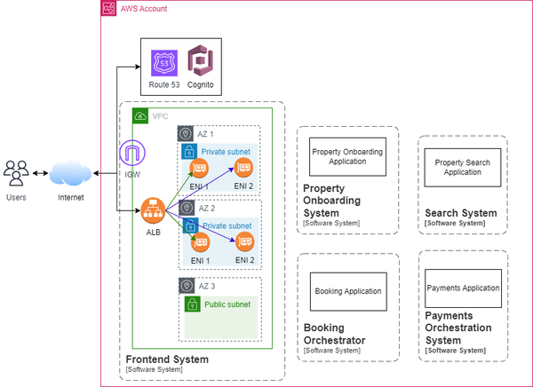

## AWS

### Non-relational Stores
- `Key Value Databases`
  - `Key-value databases` are a type of non-relational database that offer a simple yet powerful data model, enabling efficient storage and retrieval of data based on unique keys using distributed hash tables. This design principle, which revolves around mapping keys to their corresponding values, provides a highly scalable and flexible approach to data management. In this section, we will delve into the architecture and design considerations of key-value stores, uncovering the inner workings of these streamlined databases.
  - Open-source key-value databases provide developers with flexible and scalable solutions for managing data in a distributed and highly available manner. One popular open-source key-value store, Dynamo, has gained significant attention and adoption.
  `Dynamo` is a highly available and scalable key-value store developed by Amazon. It was designed to handle the demanding requirements of Amazon’s shopping cart service. While Dynamo itself is not open-source, its principles have influenced the development of various open-source implementations such as Riak, Voldemort, and Dynomite.
- `Document Databases`
  - `Document databases` are a type of non-relational database that are specifically designed for storing, retrieving, and managing semi-structured data in the form of documents. They provide a flexible and schema-less approach to data storage, making them ideal for applications with dynamic and evolving data structures. In this section, we will explore the architecture and design considerations of document stores, shedding light on their key features and benefits.
  - `MongoDB` is a widely adopted open-source document database known for its scalability, performance, and developer-friendly features. It uses a flexible JSON-like document model, allowing developers to store and retrieve data in a schema-less manner. MongoDB supports dynamic schemas, which means that each document in a collection can have its own unique structure.
- `Columnar Databases`
  - `Columnar databases` or column-family databases, also known as Wide column stores, are a type of non-relational database that offer a unique architecture optimized for handling vast amounts of structured and semi-structured data. These databases excel at managing large-scale distributed systems, analytics, and use cases requiring fast read and write performance. In this section, we will explore the architecture and design considerations of wide column stores, unveiling their key features and advantages.
  - `Apache Cassandra` is a highly scalable and distributed open-source columnar database known for its ability to handle massive amounts of structured and semi-structured data across multiple commodity servers. It offers a robust architecture and a range of features that make it suitable for high-performance and fault-tolerant applications. Let’s delve into Apache Cassandra and explore its key features.
- `Graph Databases`
  - `Graph databases` are a specialized type of non-relational database designed to handle highly interconnected data and complex relationships. They excel at storing, querying, and traversing graph-like structures, making them ideal for scenarios involving social networks, recommendation systems, fraud detection, and knowledge graphs. In this section, we will explore the architecture and design considerations of graph stores, uncovering their key features and advantages.
  - `Neo4j` is a leading open-source graph database known for its powerful graph processing capabilities and intuitive query language. Neo4j is designed to efficiently store, manage, and traverse highly connected data, making it ideal for applications that heavily rely on complex relationships and interconnections.

### Communication Networks and Protocols
`Communication Types`
- `Pull Mechanism: HTTP Polling`
- `Push Mechanism: WebSockets`
WebSockets represent a bi-directional persistent connection (full-duplex communication on a single TCP connection) over HTTP where clients and servers communicate with each other.
- `Push Mechanism: Server Sent Events`
The SSE can be a feasible approach in this case as the server is responsible for updating the order status and there is no as such input required from the client’s end.
The SSE is implemented over a long lived HTTP connection to consume any updates or notifications from the server in text format.
We mentioned that responses in case of async architectures can be delivered via websockets or SSE.

### AWS Network Services
AWS networking services such as Amazon VPC, Amazon Route 53, Amazon Elastic Load Balancer (ELB), Amazon API Gateway.
- Complete separation of applications, meaning every application is launched in a new AWS account.
- Separation of AWS accounts based on business type. All applications related to a single business will operate in a single account.
- Separation of AWS accounts based on software domains—for example, having separate accounts for networking, monitoring, storage, and security and auditing.

Further, there are some global services such as Amazon S3 or AWS Identity and Access Management (AWS IAM) service where region selection is not a requirement.
- `AWS Availability Zones`
You can think of a single region as a cluster of data centers and each individual (or combination of) data center is an availability zone.
AZ are classified with suffix to region names—for example, us-east-1a or us-east-1b are AZs within the us-east-1 region.
- `AWS Edge Locations`
Edge Locations help improve the performance of content delivery by acting as caching and content delivery endpoints for Amazon Cloudfront, thus reducing latency and improving data transfer speeds.
You can think of AWS Edge locations as data centers which are connected with AWS regions to support fast upload and download of data.
- `Amazon VPC`
We can think of Amazon VPC as your personal data center located inside AWS Cloud.
Amazon VPC enables you to securely launch resources like Amazon EC2 instances, Amazon RDS, and Amazon Elastic Load Balancers within a logically isolated section of the AWS cloud.
- `Subnets`
Each subnet is associated with an availability zone (AZ) within an AWS region.
The subnet can be a public subnet or private subnet depending on its connectivity to the internet.
The key point is that the direct route to the internet gateway is the only differentiating factor between public and private subnets. A subnet with resources having a public IPv4 address but no direct route to the internet gateway is referred to as a private subnet.
When setting up your VPCs and subnets inside your AWS account, consider these following best practices:
  - Use multiple subnets: Create multiple subnets within different availability zones to achieve fault tolerance and high availability.
  - Isolate resources: Use separate subnets for different types of resources to improve security and network segmentation.
  - Public and private subnets: Place resources with public access in public subnets and sensitive resources in private subnets.

`Internet Connectivity`
The routing of traffic and securing of resources is achieved via components such as route tables, internet gateway, security groups
- `Route Tables`
Route Tables direct network traffic in and out of a subnet but it doesn’t apply any security filters on this traffic. AWS provides software firewalls, Security Groups(SGs) and Network Access Control Lists(NACLs) to implement traffic filters which are useful in controlling the network traffic permissions.
- `Security Groups`
Let’s understand how SGs can help to control the traffic we want to essentially filter out or disallow any unwanted traffic. SGs are created at the VPC level and assigned at an instance level, controlling inbound and outbound traffic at an instance level based on protocols, ports and IP addresses. Your EC2 instance can have one or more SGs. There will always be one SG associated to an instance, and, if not created, a default SG will be associated, which is created at time of VPC creation.
- `Network Access Control Lists`
You may think of NACLs as an additional layer of security on top of SGs which ensure to block the traffic if SGs are too flexible.
Route Tables, SGs and NACLs help to configure the routes and configure network security.

`Amazon VPC To Internet Connectivity`
- `Internet Gateway`
Internet Gateway (IGW) is a horizontally scalable and highly available AWS managed VPC software component that provides connection between your VPC and the internet.
The private subnet to public internet connectivity is achieved via a NAT Gateway.
- `NAT Gateway`
You may think of NAT gateway as a bridge between internet gateway and private instances.
NAT Gateways (Network Address Translation Gateways) are AWS-managed network devices that allow resources within private subnets in a VPC to initiate outbound internet connections while preventing direct inbound access from the internet by hiding their private IP addresses.
it converts private IP address to NAT device public IP address and is mapped back to private IP address on return of response from internet.
NAT gateway provides public(default) and private connectivity.

`Amazon VPC to Amazon VPC Connectivity`
- `AWS Transit Gateways`
Transit Gateway is a scalable solution to establish connectivity between multiple VPCs, on-premise networks and other AWS services.

- `Amazon Route 53`
Route 53 is a scalable and highly available Domain Name System(DNS) available in the AWS ecosystem which helps in domain registration, DNS routing and health checking.
- `Amazon Elastic Load Balancer`
Load Balancers help improve the availability, scalability, and fault tolerance of applications by distributing traffic across healthy targets. Load balancers can automatically scale based on traffic patterns and health checks, ensuring optimal performance.
AWS ELB is available as Application Load Balancer (ALB), Network Load Balancer (NLB), Classic Load Balancer(CLB) and Gateway Load Balancer(GWLB).
- `Amazon API Gateway`
API Gateway is a fully managed AWS service that helps in creating, publishing, maintaining, monitoring and securing REST, HTTP and WebSocket APIs.
- `Amazon CloudFront`
Another cost effective solution is to cache the content near the customer’s location via a Content Delivery Network (CDN), as discussed in Chapter 4. Amazon CloudFront is CDN, a world-wide network of data centers called edge locations which helps to achieve low latency for serving both static and dynamic content in a secure way via AWS Shield, IAM, WAF and TLS certificates.
In short, Amazon CloudFront allows us to cache the content near our application users and serve the user queries faster.

### AWS Storage Services
Amazon Elastic Block Storage (EBS) as block storage service, Amazon Elastic File Storage (EFS) as file storage service and Amazon Simple Storage Service (S3) as object storage service.
- `Amazon Elastic Block Storage`
Amazon EBS is a block storage solution which acts similar to any physical hard drive attached to a personal computer.
- `Amazon Elastic File Storage`
Amazon EFS is a shared file system which allows storage sharing across multiple servers that are placed in a region or at an on-premise data center. Amazon EFS is a fully managed serverless solution with no management overhead and supports all AWS Compute platforms such as EC2, ECS or Lambda.
- `Amazon Simple Storage Service`
AWS Cloud provides Amazon Simple Storage Service(S3) as an unlimited object storage solution. We can use S3 to store and protect data for a wide range of use-cases, such as websites, media storage, backups, big data analytics, etc. S3 allows storage of objects in containers referred to as buckets.

`AWS Databases`
AWS offers a range of database services, such as Amazon Relational Database Service (RDS), Amazon DynamoDB, Amazon DocumentDB, Amazon ElasticCache, and more, to meet customer requirements for different business use-cases.
- `Amazon RDS`
Without Amazon RDS, you have a couple of options when you want to run relational database engines like MySQL or PostgreSQL.
- `Amazon Aurora`
Amazon Aurora is up to five times faster than MySQL and up to three times faster than PostgreSQL running on the same hardware and it scales automatically as per application needs.
- `Amazon DynamoDB`
AWS provides Amazon DynamoDB (DDB) as a key-value database offering which is designed to provide single-digit millisecond latency for any workload scale. DDB stores data in tables and follows schemaless design.
- `Amazon DocumentDB`
Amazon DocumentDB is a document database offered by AWS which is designed to store and query data as JSON-like documents. A document is structured as a collection of nested key-value pairs and can be useful in scenarios such as storing food menu information.

`Amazon ElasticCache`
In-memory databases are extensively used as caching solutions to improve system performance. Amazon ElasticCache is a managed service offered by AWS as a distributed cache environment and works with both Redis and Memcached engines. Both Redis and Memcached are in-memory key-value caching solutions but there are associated differences and it is important to figure out which caching engine meets your business requirements. You can look at Memcached as a simple key-value caching solution to offload reads from primary data source with multi-threading support whereas Redis comes with functionalities such as persistence for long-lived data, advanced data types such as lists and sets, sorting and ranking datasets in memory, geo-spatial support, message broker, etc.

### AWS Compute Services
Amazon Elastic Compute Cloud (EC2) machine and then move off towards AWS Lambda and containerization services present in AWS Cloud.
- `Amazon Elastic Compute Cloud`
Amazon EC2 is a scalable virtual server hosting service provided by AWS. We can leverage Amazon EC2 service to create virtual machines in AWS Cloud with a required set of configurations such as CPU, memory, storage, networking, etc. These virtual machines or virtual computing environments are referred to as instances.
- `Amazon Machine Image`
We launch an Amazon EC2 instance with the different configurations, such as: the Operating System the instance is launched with; storage volumes attached to an instance; install dependencies before instance boot up, custom security configurations, etc. These configurations can be defined via a pre-configured template, referred to as Amazon Machine Image (AMI), which enables easy and efficient provisioning of EC2 instances with desired software stack.
- `Auto Scaling`
Auto scaling is an AWS feature that automatically adjusts the number of EC2 instances in the collection in response to changing workload demands.

- `AWS Lambda`
AWS Lambda is a fully managed serverless compute service that lets users run code without overhead of server maintenance. The only thing we need in order to run our applications on AWS Lambda is code in our preferred language, referred to as Lambda function.
  - Deployment Package
  The Lambda function code can be deployed via deployment package in below two ways:
    - A .zip file with code and its dependencies stored in Amazon S3 with maximum allowed size of 250MB. Lambda holds responsibility for providing operating system and runtime for function.
    - A container image stored in Amazon Elastic Container Registry (ECR) with code and its dependencies with maximum allowed size of 10GB.
  The way Lambda function should be invoked for processing depends on your  use-case—some options include an object addition to S3 bucket or scheduled weekly via Cloudwatch events.
  - `Synchronous Invocation`
  Synchronous invocation can be achieved in multiple ways—via  API Gateway, Application Load Balancer, AWS CLI, etc.
  - `Asynchronous Invocation`
  Asynchronous invocation can be achieved via S3, Simple Notification Service(SNS), CloudWatch events, etc.
  - `Polling Invocation`
  This is the preferred mode for stream or queue based services such as DDB streams, Kinesis, SQS queues or Kafka.
  We mentioned Lambda provision resources on invocation, which could result in more request processing time due to cold start problems. Cold start refers to the time Lambda takes to provision resources and prepare an execution environment involving function code download from S3 or ECR, creating an environment with memory and runtime configurations and executing any initialization code out of main function code. After this complete set up, Lambda starts serving customer requests.
- `Containerization Services`
AWS offers container orchestration service for running Docker containers via two services, referred to as Amazon Elastic Container Service (ECS) and Amazon Elastic Kubernetes Service (EKS). ECS is a fully managed container orchestration service offered by AWS while EKS is a managed service for running open-source Kubernetes on AWS cloud.
  - `Amazon Elastic Container Service`
  Amazon ECS is a fully managed highly available service that helps with deployment, operational management and scaling containerized applications for the required traffic load. ECS integrates with other AWS services, such as EC2, ECR (Elastic Container Registry), and Elastic Load Balancer, to provide a complete container management solution.
  - `Amazon Elastic Container Registry (ECR)`
  ECR is an AWS managed container image registry which can be used to push, pull and manage docker or Open Container Initiative (OCI) images.
  There are two types of launch options available with ECS, the first being ECS EC2 where we manage our containers on a fleet of EC2 machines, and the second being ECS Fargate, a serverless option where we hand over complete operational management responsibility to AWS.
  - `Amazon Elastic Kubernetes Service`
  EKS is a fully managed Kubernetes service that simplifies the deployment, management, and scaling of containerized applications using Kubernetes on AWS Cloud. AWS EKS eliminates the need for manual setup and configuration of Kubernetes clusters, allowing developers to focus on their applications rather than the underlying infrastructure. EKS is available with EKS EC2 and Fargate launch types, similar to ECS.

### AWS Orchestration Services
For running systems at large scale, multiple components interact and coordinate with each other to perform any task referred to as orchestration.
why customers might prefer EKS instead of ECS for launching their applications. The similar analogy applies here, Kafka is an open source message broker service which can be used in place of SNS-SQS. The reasons you might choose it are similar as well—you could be migrating your workloads to AWS Cloud or running existing workloads on AWS Cloud, or you just love open-source software with full visibility on development features.
- `Amazon Simple Queue Service`
SQS is a fully managed AWS queue service which automatically scales as per customer traffic requirements. It is a highly available service which doesn’t require any maintenance and deployment work from the customer’s end.
- `Amazon Simple Notification Service`
SNS is an intermediary service which enables communication between producers and consumers. A producer essentially publishes a message to a SNS topic and then SNS holds the responsibility to forward this message to all the subscriptions (aka consumers) via push mechanism.
Message Delivery mechanism	Application should poll messages from SQS.	SNS pushes the messages to its subscribers.
A combination of SQS, Lambda and SNS is widely used for multiple use-cases to support event-driven asynchronous architecture and orchestrate simple workflows.

`Workflow Orchestration`
- `AWS Step Functions`
AWS Step Functions (SFn) is an AWS fully managed serverless and visual workflow orchestration service which helps customers to create and run state machines with ease to coordinate among the distributed applications components.
We should always be prepared for service disruption and to overcome failure scenarios in SFn, we recommend adding error handling, retry mechanisms and alerting mechanisms as applicable for better success of the state machine.
- `Amazon Managed Workflow for Apache Airflow`
Apache Airflow is an open-source tool to programmatically create, schedule and monitor workflows. Amazon MWAA uses message queues to orchestrate an arbitrary number of workers to desired scale, but it also comes with setup and operational management cost.

`Amazon CloudWatch`
CloudWatch helps with storage & search capability on application logs, visualizing application metrics & dashboards and setting up alerts on any unexpected application behavior.
- `Application Logs`
As applications run to serve customer requests, there are logs generated—these can be custom logs or language runtime specific logs. These logs are helpful in debugging any issue that has occurred in the system. We can publish logs to CloudWatch in real time for any compute platform we’re using and look for specific error logs via CloudWatch search functionality or CloudWatch Insights feature.
- `Metrics`
A metric is essentially a time-ordered set of data points being sent to CloudWatch for visualization.
- `CloudWatch Events`
CloudWatch Events can additionally be used to schedule automated actions using cron or rate expressions.
AWS offers another service similar to CloudWatch Events called Amazon EventBridge.

`AWS Identity and Access Management`
We touched upon using IAM at multiple places in this book to enable access control and enforce security measures in terms of authentication and authorization for different AWS resources or our overall AWS account.

`Amazon Cognito`
Amazon Cognito is a fully managed highly scalable Customer Identity and Access Management (CIAM) service which helps customers set up and manage their identity pools for authentication (AuthN) and authorization (AuthZ). Amazon Cognito takes the complete ownership of managing compute and storage for supporting this.

`AWS AppSync`
AWS AppSync is essentially a single GraphQL endpoint that can be used to query multiple databases, microservices and APIs in a single network call.

### Big Data, Analytics and Machine Learning Services
data processing tools such as Amazon EMR and AWS Glue; analytics tools such as Amazon Athena and Amazon Redshift; live streaming ingestion and analytics via Amazon Kinesis offerings; and business intelligence service called Amazon Quicksight.
- `Amazon Elastic MapReduce`
Amazon EMR is a managed service useful for execution of data processing frameworks and tools such as Map Reduce, Apache Spark, Apache Hive, Apache HBase, and Presto.
- `EMRFS`
EMRFS uses S3 as a file system for our data processing instead of local HDFS, so essentially it’s a connector that links EMR clusters to S3. EMRFS ensures streaming of data directly to S3 and uses HDFS as intermediate storage.
As a compute option, we can choose to run an EMR cluster on EC2 instances, EKS or go completely Serverless.
- `AWS Glue`
AWS Glue is a serverless data integration service helping to make sense of data with different features.
From the above long list of features, it is evident that AWS Glue is a powerful ETL service and helps a lot to reduce operational overhead and can operate at large scale.
Feature functionality	Data processing and analytics tool which leverages open-source software.	An end-to-end ETL solution with abstraction over software and it offers AWS customized solutions with focus on data integration, data catalog and running transformations on data sources.
- `Amazon Athena`
Amazon Athena is a fully managed serverless big data analysis tool which offers SQL query support on top of data stored in Amazon S3.
event streams handling in near real time and run analytics on top of it via Amazon Kinesis.
- `Amazon Kinesis`
We started our chapter introduction by taking an example of capturing real time user interactions of users on our online food ordering application. Amazon Kinesis offers capabilities to serve similar kinds of use-cases along with analytics and ETL.
- `Amazon QuickSight`
Amazon Quicksight is a fully managed serverless business intelligence service offering analytics, visualization and reporting. It can connect to different kinds of datastores and include it in a single dashboard, the data can include AWS data, third-party data, spreadsheet data, SaaS data, and more.
We mentioned that Amazon Quicksight is helpful to draw insights and it can do it for any data source.
- `Amazon Redshift`
In simple terms, Amazon Redshift is a data warehousing tool which can act as a data store for data from multiple sources and allows us to run SQL queries at a single place for data analytics. Amazon Redshift is an AWS managed service and can scale to petabytes of data with an elastic scaling option.
- `Amazon SageMaker`
Amazon Sagemaker is an AWS managed service which allows customers to prepare data, build, train and deploy ML models quickly without the worry of managing any infrastructure.

### Designing a URL Shortener Service

### Designing a Web Crawler and Search Engine

### Designing a Hotel Reservation System

### Designing a Chat Application

### Designing a Video Processing Pipeline for a Streaming Service

