    

```mermaid
graph TD
    %% Title and Metrics
    Title["🎯 Datadog Natural Language to Query Translation System<br/>Production Scale: 10M+ Queries/Day | Target: 95%+ Accuracy | <100ms P95 Latency"]

    %% Client Layer
    subgraph ClientLayer["🖥️ Client Layer"]
        WebApp["Web Dashboard<br/>React SPA<br/>Smart Autocomplete"]
        MobileApp["Mobile App<br/>iOS/Android<br/>Voice Input Support"]
        APIClient["API Clients<br/>REST/GraphQL<br/>Integration SDKs"]
        ExampleQuery["Example Query:<br/>'Show me payment service errors<br/>in the last hour'"]
    end

    %% Infrastructure Layer
    subgraph InfraLayer["🏗️ Infrastructure Layer"]
        ALB["AWS Application<br/>Load Balancer<br/>Health Checks<br/>SSL Termination"]
        Gateway["API Gateway<br/>Rate Limiting: 1K/min<br/>Authentication<br/>Request Validation"]
    end

    %% Core Processing Layer
    subgraph CoreLayer["⚡ Core Processing Layer"]
        Router["Intelligent Router<br/>Query Complexity Analysis<br/>• Simple: Template matching<br/>• Medium: Fine-tuned model<br/>• Complex: GPT-4 routing<br/>Decision Time: <2ms"]
        ContextMgr["Context Manager<br/>User Schema Mapping<br/>Permission Checking<br/>Service Discovery"]
        Parser["Query Parser<br/>Entity Extraction<br/>Intent Classification<br/>Time Range Analysis"]
    end

    %% Multi-Tier Cache System
    subgraph CacheSystem["💾 Multi-Tier Cache System (90% Hit Rate)"]
        L1["L1 Cache<br/>In-Memory LRU<br/>1K entries<br/>1ms lookup<br/>Recent queries"]
        L2["L2 Cache<br/>Redis Cluster<br/>6 nodes, 64GB each<br/>5ms lookup<br/>Session patterns"]
        L3["L3 Cache<br/>Semantic Similarity<br/>Vector embeddings<br/>50ms lookup<br/>Historical patterns"]
        CacheStats["Cache Performance:<br/>• Hit Rate: 90%<br/>• Avg Lookup: 3ms<br/>• Memory Usage: 384GB<br/>• Cost Savings: $35K/month"]
    end

    %% Translation Tier - Cost Optimized
    subgraph TranslationTier["🔄 Translation Tier - Cost Optimized Routing"]
        RuleEngine["Rule-Based Engine<br/>80% of simple queries<br/>Template matching<br/><1ms latency<br/>99%+ accuracy<br/>Cost: FREE"]
        SmallModel["Fine-tuned Model<br/>15% of medium queries<br/>CodeLlama-7B + LoRA<br/>~50ms latency<br/>94% accuracy<br/>Cost: $0.001/query"]
        GPT4["GPT-4 Turbo<br/>5% of complex queries<br/>Few-shot prompting<br/>~200ms latency<br/>98% accuracy<br/>Cost: $0.03/query"]
        CostBreakdown["Cost Optimization Result:<br/>• Cache Hit (90%): $0/query<br/>• Rule Engine (8%): $0.0001/query<br/>• Small Model (1.5%): $0.001/query<br/>• GPT-4 (0.5%): $0.03/query<br/>• Average Cost: $0.0002/query<br/>• Monthly Savings: $35K vs naive approach"]
    end

    %% Validation & Optimization Layer
    subgraph ValidationLayer["✅ Validation & Optimization Layer"]
        SyntaxVal["Syntax Validator<br/>ANTLR Parser<br/>DQL Grammar Check"]
        SemanticChk["Semantic Checker<br/>Schema Validation<br/>Field Existence"]
        QueryOpt["Query Optimizer<br/>Index Hints<br/>Performance Tuning"]
        ConfidenceScorer["Confidence Scorer<br/>Result Quality Assessment<br/>User Feedback Integration"]
    end

    %% Output
    OutputDQL["Generated DQL Query:<br/>service:payment status:error @timestamp:[now-1h TO now]"]

    %% External Services
    subgraph ExternalServices["🔗 External Services & Data Stores"]
        DatadogAPI["Datadog Logs API<br/>Query Execution<br/>Result Aggregation"]
        TrainingData["Training Data Store<br/>PostgreSQL<br/>50K+ labeled examples"]
        ModelRegistry["Model Registry<br/>MLflow<br/>Version Management"]
        Monitoring["Monitoring Stack<br/>Prometheus + Grafana<br/>Real-time Metrics"]
        FeedbackLoop["Feedback Loop<br/>User Corrections<br/>Continuous Learning"]
    end

    %% Performance Metrics Panel
    MetricsPanel["📊 Production Metrics<br/>━━━━━━━━━━━━━━━━━━━━━━━━━━━━<br/>• Translation Accuracy: 95.3%<br/>• P95 Latency: 87ms<br/>• Current QPS: 12,000<br/>• Cache Hit Rate: 92%<br/>• Daily Cost: $147<br/>• Uptime: 99.97%<br/>• User Satisfaction: 4.6/5"]

    %% Main Flow Connections
    WebApp --> ALB
    MobileApp --> ALB
    APIClient --> ALB
    ALB --> Gateway
    Gateway --> Router
    Router --> ContextMgr
    Router --> Parser

    %% Cache Flow (90% hit rate)
    Router -.->|"90% Cache Hit"| L1
    L1 --> L2
    L2 --> L3

    %% Translation Routing with Percentages
    Router -->|"8% Simple Queries"| RuleEngine
    Router -->|"1.5% Medium Queries"| SmallModel  
    Router -->|"0.5% Complex Queries"| GPT4

    %% Validation Flow
    RuleEngine --> SyntaxVal
    SmallModel --> SemanticChk
    GPT4 --> QueryOpt
    SyntaxVal --> OutputDQL
    SemanticChk --> OutputDQL
    QueryOpt --> OutputDQL

    %% Final Execution
    OutputDQL --> DatadogAPI

    %% Feedback and Learning
    FeedbackLoop -.-> TrainingData
    DatadogAPI -.-> FeedbackLoop

    %% Styling
    classDef clientStyle fill:#E3F2FD,stroke:#1976D2,stroke-width:2px,color:#000
    classDef infraStyle fill:#FFF8E1,stroke:#F9A825,stroke-width:2px,color:#000
    classDef coreStyle fill:#FCE4EC,stroke:#E91E63,stroke-width:2px,color:#000
    classDef cacheStyle fill:#E0F2F1,stroke:#00695C,stroke-width:2px,color:#000
    classDef translationStyle fill:#F3E5F5,stroke:#8E24AA,stroke-width:2px,color:#000
    classDef validationStyle fill:#FFF3E0,stroke:#FB8C00,stroke-width:2px,color:#000
    classDef outputStyle fill:#E8F5E8,stroke:#4CAF50,stroke-width:3px,color:#000
    classDef externalStyle fill:#ECEFF1,stroke:#546E7A,stroke-width:2px,color:#000
    classDef metricsStyle fill:#1E88E5,stroke:#0D47A1,stroke-width:3px,color:#fff

    class WebApp,MobileApp,APIClient,ExampleQuery clientStyle
    class ALB,Gateway infraStyle
    class Router,ContextMgr,Parser coreStyle
    class L1,L2,L3,CacheStats cacheStyle
    class RuleEngine,SmallModel,GPT4,CostBreakdown translationStyle
    class SyntaxVal,SemanticChk,QueryOpt,ConfidenceScorer validationStyle
    class OutputDQL outputStyle
    class DatadogAPI,TrainingData,ModelRegistry,Monitoring,FeedbackLoop externalStyle
    class MetricsPanel metricsStyle
```

Overview: This interview will be mostly conversational but may include some design drawing utilizing Excalidraw. This interview will walk through a realistic use-case for generative language models at Datadog. You will be asked to talk through how you would solve the problem, including framing the initial approach, evaluating, dealing with the practicalities of productionizing the solution, and possible optimizations. Familiarity with modern prompting and LLM techniques will be helpful. We will not go deep into Transformer architecture. You will be asked to design a LLM/NLP system similar to those we’ve built at Datadog which help translate natural language queries into a specialized query language used by our log management platform. We will look to see how you evaluate the performance of the translation system, how you consider cost and latency issues, how you would productionize this system, deploy it, and reduce memory load.
