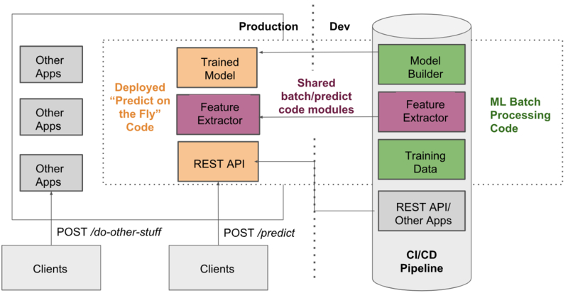
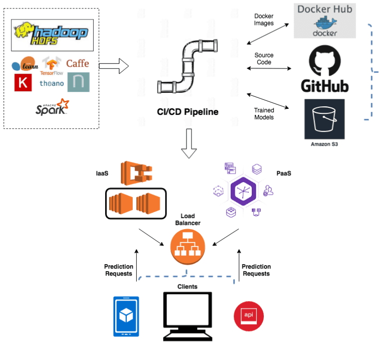
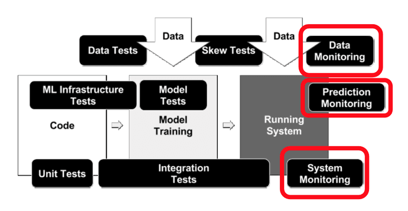

## DS Interview
Machine learning understanding
This area generally focuses on individual understanding of basic ML concepts such as supervised vs. unsupervised learning, reinforcement learning, classification vs. regression, deep learning, optimization functions, and the learning process of various ML algorithms. There are many courses and books that go over these fundamental concepts. They facilitate the learning of ML basics and help candidates prepare for the interview.

#### ROC AUC
ROC曲线全称是受试者工作特征曲线(Receiver Operating Characteristic curve). ROC 曲线上的每个点都反映着对同一信号刺激的感受性。需要注意的是，ROC的定义仅对于二分类，如果需要多分类，需要进行转换

AUC值是一个概率值，当你随机挑选一个正样本以及一个负样本，当前的分类算法根据计算得到的Score值将这个正样本排在负样本前面的概率就是AUC值。AUC值越大，当前的分类算法越有可能将正样本排在负样本前面，即能够更好的分类。

横轴是负正类率(false positive rate aka. FPR)即划分的例子中所有负例占所有负例的比例，其实就是特异度。
纵轴是真正类率(True postive rate aka. TPR)也叫灵敏度。

Y: TPR=TP/(TP+FN) 也称Sensitivity / True Positive Rate / Recall
Sensitivity tells us what proportion of the positive class got correctly classified.

X: FPR=FP/(FP+TN) 也称误诊率
FPR tells us what proportion of the negative class got incorrectly classified by the classifier.

False Negative Rate (FNR) tells us what proportion of the positive class got incorrectly classified by the classifier.

Specificity / True Negative Rate
Specificity tells us what proportion of the negative class got correctly classified.

Y: Precision=TP/(TP+FP)
X: Recall=TP/(TP+FN)

## DS
Let’s take a ***Supervised Learning Process***. The process starts with receiving a static data file with labels in it as the input file, perform ***Exploratory Data Analysis***, scale and perform ***Feature Engineering***, ***Split the Data*** records into train, test and validation set. ***Train the Model*** using the training data records, ***Fine Tune the model Parameters*** using the test data records and perform ***Model Selection*** based on the ***Performance Metrics*** on the validation data records. The well-trained model is then ***Deployed to Production*** to make a prediction/classification on unknown data records. The model is limited to the patterns it has observed in the static input file and cannot adapt to the real-time behavioural changes. Every time there is a new training data is made available, the entire process of training the model has to start from scratch.

***Feature Selection*** is the process of selecting the attributes that can make the predicted variable more accurate or eliminating those attributes that are irrelevant and can decrease the model accuracy and quality.

***Feature Correlation*** is a way to understand the relationship between multiple variables and attributes in your dataset. Using Correlation, you can get some insights such as:
- One or multiple attributes depend on another attribute or a cause for another attribute.
- One or multiple attributes are associated with other attributes.

So, why is correlation useful?
- Correlation can help in predicting one attribute from another (Great way to impute missing values).
- Correlation can (sometimes) indicate the presence of a causal relationship.
- Correlation is used as a basic quantity for many modelling techniques

***Multicollinearity*** happens when one predictor variable in a multiple regression model can be linearly predicted from the others with a high degree of accuracy. This can lead to skewed or misleading results. Luckily, decision trees and boosted trees algorithms are immune to multicollinearity by nature. When they decide to split, the tree will choose only one of the perfectly correlated features. However, other algorithms like Logistic Regression or Linear Regression are not immune to that problem and you should fix it before training the model.

How Can I Deal With This Problem?
- There are multiple ways to deal with this problem. The easiest way is to delete or eliminate one of the perfectly correlated features. 
- Another way is to use a dimension reduction algorithm such as Principle Component Analysis (PCA).

> https://towardsdatascience.com/why-feature-correlation-matters-a-lot-847e8ba439c4

***Hyperparameter Tuning*** hyperparameter除非deep learning，其它基本是要靠cv tune的，这也是被问的重点，一般randomized grid search cv也够了，如果答出bayesian optimization那是要加分的

> https://towardsdatascience.com/automated-machine-learning-hyperparameter-tuning-in-python-dfda59b72f8a

> https://www.kdnuggets.com/2020/04/hyperparameter-tuning-python.html

> https://neptune.ai/blog/hyperparameter-tuning-in-python-a-complete-guide-2020

***Missing Values*** One way to handle this problem is to get rid of the observations that have missing data. 
1. Skip all rows with missing values
2. Skip features with many missing values
3. Impute missing values using other data points
4. Modify learning algorithm (decision trees) to handle missing data
    - Missing values get added to one branch of split
    - Use classification error to determine where missing values go

However, you will risk losing data points with valuable information. A better strategy would be to impute the missing values. In other words, we need to infer those missing values from the existing part of the data. Imputation methods:
- (Mean/Median) Values
- (Most Frequent) or (Zero/Constant) Values
    - Cons: It also doesn’t factor the correlations between features.
- k-NN
    - The k nearest neighbours is an algorithm that is used for simple classification. The algorithm uses ‘feature similarity’ to predict the values of any new data points. This means that the new point is assigned a value based on how closely it resembles the points in the training set.
    - Cons: Computationally expensive. KNN works by storing the whole training dataset in memory. K-NN is quite sensitive to outliers in the data (unlike SVM)
- Multivariate Imputation by Chained Equation (MICE)
    - This type of imputation works by filling the missing data multiple times. Multiple Imputations (MIs) are much better than a single imputation as it measures the uncertainty of the missing values in a better way. The chained equations approach is also very flexible and can handle different variables of different data types (ie., continuous or binary) as well as complexities such as bounds or survey skip patterns.
- Stochastic regression imputation
    - It is quite similar to regression imputation which tries to predict the missing values by regressing it from other related variables in the same dataset plus some random residual value.
- Extrapolation and Interpolation
    - It tries to estimate values from other observations within the range of a discrete set of known data points.
- Hot-Deck imputation
    - Works by randomly choosing the missing value from a set of related and similar variables.
- Deep Neural Networks (Datawig)

> https://m.blog.naver.com/eeeee5813/221525847053

> https://www.kaggle.com/residentmario/simple-techniques-for-missing-data-imputation

> https://www.hilarispublisher.com/open-access/a-comparison-of-six-methods-for-missing-data-imputation-2155-6180-1000224.pdf

***Data imbalance*** usually reflects an unequal distribution of classes within a dataset. For example, in a credit card fraud detection dataset, most of the credit card transactions are not fraud and a very few classes are fraud transactions. This leaves us with something like 50:1 ratio between the fraud and non-fraud classes.

> https://www.analyticsvidhya.com/blog/2020/07/10-techniques-to-deal-with-class-imbalance-in-machine-learning/

> https://www.kdnuggets.com/2017/06/7-techniques-handle-imbalanced-data.html

> https://www.kdnuggets.com/2019/05/fix-unbalanced-dataset.html

> https://elitedatascience.com/imbalanced-classes

> https://medium.com/james-blogs/handling-imbalanced-data-in-classification-problems-7de598c1059f

***Overfitting*** occurs when the model performs well on training data but generalizes poorly to unseen data. In the following, I’ll describe eight simple approaches to alleviate overfitting by introducing only one change to the data, model, or learning algorithm in each approach.
- Cross-validation (data)
- L1/L2 regularization (learning algorithm)
- Feature selection (data)
- Dropout (model)
- Early stopping (model)
    - Limit tree depth: Stop splitting after a certain depth
    - Classification error: Do not consider any split that does not cause a sufficient decrease in classification error
    - Minimum node size: Do not split an intermediate node which contains too few data points
- Data augmentation (data)
- Train with more data
- Ensembling

> https://www.kaggle.com/learn-forum/157623

> https://elitedatascience.com/overfitting-in-machine-learning

> https://laptrinhx.com/8-simple-techniques-to-prevent-overfitting-3288224346/

> https://www.kdnuggets.com/2019/12/5-techniques-prevent-overfitting-neural-networks.html

> https://machinelearningmastery.com/introduction-to-regularization-to-reduce-overfitting-and-improve-generalization-error/

***Outlier Detection*** In statistics, an outlier is an observation point that is distant from other observations.
- Discover outliers with visualization tools
    - Box plot, Scatter plot

- Discover outliers with mathematical function
    - Z-Score, IQR score, Dbscan, Isolation Forest

> https://laptrinhx.com/5-ways-to-detect-outliers-that-every-data-scientist-should-know-python-code-1420067125/

> https://towardsdatascience.com/ways-to-detect-and-remove-the-outliers-404d16608dba

> https://towardsdatascience.com/a-brief-overview-of-outlier-detection-techniques-1e0b2c19e561

> https://www.kdnuggets.com/2018/12/four-techniques-outlier-detection.html

#### Big Data #### 
Storing this data is one thing, but what about processing it and developing machine learning algorithms to work with it? In this article, we will discuss how to easily create a scalable and parallelized machine learning platform on the cloud to process large-scale data.
- Environment Setup — Dockers and Containers
- Parallelization with Dask and Kubernetes
- Dask Cloud Deployment
- Example Cloud Deployment on AWS

***Docker container*** In this case, all these components will be encapsulated in a Docker container:
- The application itself,
- The Conda environment that can run your application (so a compatible Python version and packages),
- The local server or service (for example: a database server and a web server) required to run the application

***Dask*** - a library for parallel computing in Python. ***Kubernetes*** - an open-source container orchestration system for automating application deployment, scaling, and management. ***Kubernetes*** is a cluster manager. We can think of it like being an operating system for the cluster. It provides service discovery, scaling, load-balancing, and is self-healing. Kubernetes think of applications as stateless, and movable from one machine to another to enable better resource utilization. There is a controlling master node on which the cluster operating system runs, and worker nodes which perform the bulk of the work. If a node (computer associated with the cluster) loses connection or breaks, the master node will assign the work to someone new, just like your boss would if you stopped working.

***Vaex*** is an open-source DataFrame library which enables the visualisation, exploration, analysis and even machine learning on tabular datasets that are as large as your hard-drive. To do this, Vaex employs concepts such as memory mapping, efficient out-of-core algorithms and lazy evaluations. All of this is wrapped in a familiar Pandas-like API, so anyone can get started right away.

> https://towardsdatascience.com/machine-learning-with-big-data-86bcb39f2f0b

> https://github.com/TomAugspurger/dask-tutorial-pycon-2018

> https://machinelearningmastery.com/large-data-files-machine-learning/

> https://medium.com/analytics-vidhya/how-to-deal-with-large-datasets-in-machine-learning-61b966a338fe

> https://towardsdatascience.com/how-to-analyse-100s-of-gbs-of-data-on-your-laptop-with-python-f83363dda94

> https://thealphadollar.me/learning/2020/02/23/large-data-analytics.html

***Data Streams/Online Learning*** In the past couple of years, a specific type of machine learning called online learning has become extremely popular in the world of realtime data infrastructure. Unlike traditional machine learning models, the statistical methods performed in online learning “partially fit” their equations to subsets of the overall dataset. This allows for a multitude of advantages:
- Fast deployment of models
- Models can be constantly updated with new chunks of data
- Can use machines with smaller memory sizes since not all the data is required at once

> https://medium.com/analytics-vidhya/data-streams-and-online-machine-learning-in-python-a382e9e8d06a

> https://codeburst.io/realtime-machine-learning-online-learning-with-pubnub-2005e86670ad

***Model Drift*** refers to a model’s predictive performance degrading over time due to a change in the environment that violates the model’s assumptions.
- EXAMINING THE FEATURE DISTRIBUTIONS OF TRAINING AND LIVE DATA, There are a number of different things to monitor per feature including:
    - the range of possible values
    - histograms of values
    - whether the feature accepts NULLs and if so, the number of NULLs expected

Being able to quickly monitor these distributions via dashboards is a step in the right direction. This can be taken even further by automatically tracking training-serving skew and issuing alerts when the divergence in features is significant.
- EXAMINING THE CORRELATIONS BETWEEN FEATURES
    - monitoring correlation coefficients between features
    - training models with one or two features
    - training a set of models that each have one of the features removed
- EXAMINING THE TARGET DISTRIBUTIONS

> https://www.kdnuggets.com/2019/12/ultimate-guide-model-retraining.html

> https://storage.googleapis.com/pub-tools-public-publication-data/pdf/45742.pdf

***Model Retraining*** One way to think about this is that retraining doesn’t involve any code changes. It only involves changing the training data set. Depending on the maturity of your machine learning organization, such changes would ideally be introduced with A/B tests that measure the impact of the new model on predetermined metrics of interest, such as user engagement or retention.
- It’s often a good idea to start with this simple strategy but you’ll need to determine exactly how frequently you’ll need to retrain. Quickly changing training sets might require you to train as often as daily or weekly. Slower varying distributions might require monthly or annual retraining.

> https://www.inawisdom.com/machine-learning/machine-learning-automated-model-retraining-sagemaker/

***Machine Learning System Architecture***
The starting point for your architecture should always be your business requirements and wider company goals. You need to understand your constraints, what value you are creating and for whom, before you start Googling the latest tech. Questions of note might include some of the following:
- Do you need to be able to serve predictions in real time (and if so, do you mean like, within a dozen milliseconds or after a second or two), or will delivery of predictions 30 minutes or a day after the input data is received suffice?
1. How often do you expect to update your models?
2. What will the demand for predictions be (i.e. traffic)?
3. What size of data are you dealing with?
4. What sort(s) of algorithms do you expect to use (and do you really need them)
5. Are you in a regulated environment where the ability to audit your system is important?
6. Does your company have product-market fit? (i.e. do you need to prepare for the system’s original purpose to radically change)
7. Can this task be done without ML?
8. How large and experienced is your team - including data scientists, engineers and DevOps?



`Key Principles For Designing Your ML System`
Regardless of how you decide to design your system, it is worth bearing in mind the following principles:
1. Build for reproducibility from the start: Persist all model inputs and outputs, as well as all relevant metadata such as config, dependencies, geography, timezones and anything else you think you might need if you ever had to explain a prediction from the past. Pay attention to versioning, including of your training data.
2. Treat your ML steps as part of your build: Which is to say, automate training and model publishing
3. Plan for extensibility: If you are likely to be updating your models on a regular basis, you need to think carefully about how you will do this from the beginning.
4. Modularity: To the largest extent possible, aim to reuse preprocessing and feature engineering code from the research environment in the production environment.
5. Testing: Plan to spend significantly more time on testing your machine learning applications, because they require additional types of testing (more on this in part 6).

`Reproducible Pipelines`
As you shift from the Jupyter notebooks of the research environment to production-ready applications, a key area to consider is creating reproducible pipelines for your models. Within these pipelines, you want to encompass:
1. Gathering data sources
2. Data pre-processing
3. Variable selection
4. Model building

***ML Model Deployment*** There is nothing in this section that isn’t equally applicable to any non-ML system, and that is deliberate. Don’t try and reinvent the wheel with your machine learning application deployments, established practices will save you pain. When it comes to deployments, you need to decide if you’re going to go with a Platform as a Service (PaaS) or Infrastructure as a Service (IaaS). A PaaS can be great for prototyping and businesses with lower traffic. Eventually, once the business grows and/or traffic increases, you’re going to need to embrace more complexity with IaaS. There are plenty of solutions from the usual suspects (AWS, Google, Microsoft), as well as an army of niche players hoping Jeff Bezos doesn’t wipe them out one day. If you’ve never deployed anything before, I’d recommend starting with Heroku. If your applications are containerized, deployments on most platforms/infrastructure tend to be easier. Containerization also gives you the option to use a container orchestration platform (Kubernetes is now the standard) to rapidly scale the number of containers as demand shifts. Be sure that your deployments occur via a Continuous Deployment platform.

Clearly, effective building and deployment of machine learning systems is hard. Whilst it is relatively easy to pickle a model and get it behind a Flask REST API, it’s the ongoing maintenance, iterative adjustments and regulatory burden that are the real sources of difficulty.



`Containers` 
Since the arrival of Docker in 2013, containerization has revolutionized the way software is deployed. The benefits of containerization apply equally if not more so for machine learning systems. Reproducing containerized systems is much easier because the container images ensure operating system and runtime dependencies stay fixed. The ability to consistently and quickly generate precise environments is a huge advantage for reproducibility during testing and training. Containerization also works well with modern CI/CD workflows, and has implications for scaling which I’ll talk about more in part 7. Bottom line: Build your machine learning system so that all parts of it (including model training, testing and serving) can be containerized.

`CI/CD`
A lot of data scientists and people coming from academia don’t realize how important a decent Continuous Integration and Deployment set of tools and processes is for mitigating the risks of ML systems. If you are reading this and wondering, “yeah but is CI/CD really that important?” I’d recommend checking out The DevOps Handbook by Kim et al. In the context of ML Systems, having all aspects of your ML pipeline, including training and testing, baked into your automated testing and deployments results in much better outcomes - if you’re testing correctly! (See part 6). It can also be a huge help for creating audit logs.

`Deployment Strategies`
Don’t just throw your model into production! Explore the many different ways to deploy your software (this is a great long read on the subject), with “shadow mode” and “Canary” deployments being particularly useful for ML applications. In “Shadow Mode”, you capture the inputs and predictions of a new model in production without actually serving those predictions. Instead, you are free to analyze the results, with no significant consequences if a bug is detected. As your architecture matures, look to enable gradual or “Canary” releases. Such a practice is when you can release to a small fraction of customers, rather than “all or nothing”. This requires more mature tooling, but it minimizes mistakes when they happen.

> https://christophergs.com/machine%20learning/2019/03/17/how-to-deploy-machine-learning-models/

> https://papers.nips.cc/paper/2015/file/86df7dcfd896fcaf2674f757a2463eba-Paper.pdf

#### ML System Monitoring #### 
The monitoring of machine learning models refers to the ways we track and understand our model performance in production from both a data science and operational perspective. Inadequate monitoring can lead to incorrect models left unchecked in production, stale models that stop adding business value, or subtle bugs in models that appear over time and never get caught. When ML is at the core of your business, a failure to catch these sorts of bugs can be a bankruptcy-inducing event - particularly if your company operates in a regulated environment.
1. `Model Building`: Understanding the problem, data preparation, feature engineering and initial code. Typical artifacts are rough Jupyter notebooks.
2. `Model Evaluation and Experimentation`: Feature selection, hyperparameter tuning, and comparing the effectiveness of different algorithms on the given problem. Typical artifacts include notebooks with stats and graphs evaluating feature weights, accuracy, precision, and Receiver Operating Characteristics (ROC).
3. `Productionize Model`: Taking “research” code and preparing it so it can be deployed. Typical artifacts are production-grade code, which in some cases will be in a completely different programming language and/or framework.
4. `Testing`: Ensuring that production code behaves in the way we expect it to, and that its results match those we saw during the Model Evaluation and Experimentation phase. Typical artifacts are test cases.
5. `Deployment`: Getting the model into production where it can start adding value by serving predictions. Typical artifacts are APIs for accessing the model.
6. `Monitoring and Observability`: The final phase, where we ensure our model is doing what we expect it to in production. The subject of this blog post.

***Monitoring Scenarios*** The first scenario is simply the deployment of a brand new model. The second scenario is where we completely replace this model with an entirely different model. The third scenario (on the right) is very common and implies making small tweaks to our current live model. Say we have a model in production, and one variable becomes unavailable, so we need to re-deploy that model without that feature. Or alternatively we develop a super feature that we think is going to be awesomely predictive, and we want to re-deploy our model, but now taking that new feature as an additional input.



Monitoring should be designed to provide early warnings to the myriad of things that can go wrong with a production ML model, which include the following:
- Data Skews: Data skews occurs when our model training data is not representative of the live data. That is to say, the data that we used to train the model in the research or production environment does not represent the data that we actually get in our live system.
    - We designed the training data incorrectly: Distributions of the variables in our training data do not match the distribution of the variables in the live data.
    - A feature is not available in production: This often means that we need to either remove the feature, change it for an alternative similar variable that exists in production, or re-create that feature by combining other features that exist in production.
    - Research/Live Data mismatch: Data we used to train our models in the research environment comes from one source and the live data comes from a different source. This can mean that the variables may not be fabricated identically, so even though the pipeline returns the same prediction for the same input data (which will mean our differential tests pass), different data sources may lead to inherent different values in the same features, which will result in different predictions.
    - Data Dependencies: Our models may ingest variables that are created or stored by other systems (internal or external). These systems may change the way they produce the data, and sadly it’s common that this is not communicated clearly. The knock-on effect is that the variables that are produced today are not equivalent to those that were produced a few years ago. Either the code implementation of a feature changes, producing slightly different results, or the definition of a feature may change. For example, an external system may adjust the voting age from 18 to 16. If voting age is a significant feature in the model, this will change its predictions.
- Model Staleness
    - Shifts in the environment: If we use historic data to train the models, we need to anticipate that the population and its behavior may not be the same in current times. For example, if we train our financial models using data from the time of the recession, it may not be effective for predicting default in times when the economy is healthy.
    - Changes in consumer behavior: Customer preferences change with trends in fashion, politics, ethics, etc. Particularly in recommender ML systems this is a risk that has to be constantly monitored.
    - Adversarial scenarios: Bad actors (fraudsters, criminals, foreign governments) may actively seek out weaknesses in your model and adjust their attacks accordingly. This is often an ongoing “arms race”.


Most ML Systems change all the time - businesses grow, customer preferences shift and new laws are enacted. Our goal is to identify shifts in our ML system behavior that conflict with our expectations. Broadly speaking, we can categorize the ways our ML system can go wrong into two buckets:
1. Data Science issues (data monitoring, prediction monitoring)
2. Operations issues (system monitoring)

`Data Science Monitoring`
- model input distribution (numerical features) or frequencies (categorical features), as well as missing value checks
- model prediction distribution (regression algorithms) or frequencies (classification algorithms)
    - In either an automated (more on this in coming sections) or manual process we can compare our model prediction distributions with statistical tests: Basic statistics: median, mean, standard deviation, max/min values
- model versions

`Operations Monitoring Concerns`
Monitoring in the realm of software engineering is a far more well-established area and is part of Site Reliability Engineering. A great (free) reference book for this is Google’s SRE Handbook. The operational concerns around our ML System consist of the following areas:
- System Performance (Latency)
- System Performance (IO/Memory/Disk Utilisation)
- System Reliability (Uptime)
- Auditability (though this applies also to our model)

`Metrics for Machine Learning`
Given the above pros and cons, metrics are a great fit for both operational concerns for our ML system:
- Latency when calling ML API endpoints
- Memory/CPU usage when performing prediction
- Disk utilization (if applicable)

As well as for prediction monitoring centered around basic statistical measures:
- Median & mean prediction values over a given timeframe
- Min/Max prediction values
- Standard deviation over a given timeframe

Practical Implementation: One of the most popular open-source stacks for monitoring metrics is the combination of ***Prometheus*** and ***Grafana***. We can create dashboards with Prometheus & Grafana to track our model standard statistical metrics.

`Logging for Machine Learning`
If we consider our key areas to monitor for ML, we saw earlier how we could use metrics to monitor our prediction outputs, i.e. the model itself. However, investigating the data input values via metrics is likely to lead to high cardinality challenges, as many models have multiple inputs, including categorical values. Whilst we could instrument metrics on perhaps a few key inputs, if we want to track them without high cardinality issues, we are better off using logs to keep track of the inputs. If we were working with an NLP application with text input then we might have to lean more heavily on log monitoring as the cardinality of language is extremely high. We would check for input red flags such as:
- A feature becoming unavailable - (either vanishing from inputs, or a high number of NAs)
- Notable shifts in the distribution of key input values, for example, a categorical value that was relatively rare in the training data becomes more common
- Patterns specific to your model, for example in an NLP scenario a sudden rise in the number of words not seen in the training data

Practical Implementation: ***Kibana*** is an open-source analytics and visualization platform which is part of the elastic stack, formerly the ELK stack. You use Kibana to search, view, and interact with logs stored in Elasticsearch indices. You can easily perform advanced data analysis and visualize your logs in a variety of charts, tables, and maps. This is one of the most common open-source stacks for building monitoring systems for logs. Within Kibana you can setup dashboards to track and display your ML model input values, as well as automated alerts when values exhibit unexpected behaviors.

> https://christophergs.com/machine%20learning/2020/03/14/how-to-monitor-machine-learning-models/

> https://www.microsoft.com/en-us/research/uploads/prod/2019/03/amershi-icse-2019_Software_Engineering_for_Machine_Learning.pdf

> https://research.google/pubs/pub46555/

> https://aws.amazon.com/blogs/machine-learning/monitoring-in-production-ml-models-at-large-scale-using-amazon-sagemaker-model-monitor/

> https://aws.amazon.com/blogs/machine-learning/automated-monitoring-of-your-machine-learning-models-with-amazon-sagemaker-model-monitor-and-sending-predictions-to-human-review-workflows-using-amazon-a2i/


***Gradient Descent***
`Batch Gradient Descent`
```python
for i in range(num_epochs):
    grad = compute_gradient(data, params)
    params = params — learning_rate * grad
```
`Stochastic Gradient Descent`
```python
for i in range(num_epochs):
    np.random.shuffle(data)
    for example in data:
        grad = compute_gradient(example, params)
        params = params — learning_rate * grad
```
`Mini-batch Gradient Descent`
```python
for i in range(num_epochs):
    np.random.shuffle(data)
    for batch in radom_minibatches(data, batch_size=32):
        grad = compute_gradient(batch, params)
        params = params — learning_rate * grad
```

> https://towardsdatascience.com/gradient-descent-algorithm-and-its-variants-10f652806a3

> https://sebastianraschka.com/faq/docs/sgd-methods.html

> https://ml-cheatsheet.readthedocs.io/en/latest/gradient_descent.html

> https://www.geeksforgeeks.org/gradient-descent-algorithm-and-its-variants/

***Tree Based Models*** have an innate feature of being robust to correlated features. When you drop a correlated variable to others, it will leave room for the tree to use one more variable in its trees. Due to the fact you are opening room for one more variable, it is possible to end up performing poorer. However, you potentially harvest another variable, and the importance of the correlated feature you removed is spread among all other variables (and more specifically to the correlated features you had before with the one you removed).

> https://medium.com/analytics-vidhya/overview-about-the-decision-tree-model-267c870fa147

> https://medium.com/data-design/ensembles-of-tree-based-models-why-correlated-features-do-not-trip-them-and-why-na-matters-7658f4752e1b

***Variants of boosting and related algorithms*** There are hundreds of variants of boosting, most important:

`Gradient boosting` Like AdaBoost, but useful beyond basic classification

`Random forests` Many other approaches to learn ensembles, most important:
- `Bagging`: Pick random subsets of the data
    -  Learn a tree in each subset
    -  Average predictions
- Simpler than boosting & easier to parallelize
- Typically higher error than boosting for same number of trees

***Regression***
> https://www.kdnuggets.com/2020/03/linear-logistic-regression-explained.html

> https://www.statisticssolutions.com/assumptions-of-linear-regression/

> https://quantifyinghealth.com/correlation-collinearity-multicollinearity/

***Deep Learning***
`Deep Neural Networks (DNNs)` are typically `Feed Forward Networks (FFNNs)` in which data flows from the input layer to the output layer without going backward³ and the links between the layers are one way which is in the forward direction and they never touch a node again.
`Recurrent Neural Network (RNN)` addresses this issue which is a FFNN with a time twist. This neural network isn’t stateless, has connections between passes and connections through time. RNNs also have problems like vanishing (or exploding) gradient/long-term dependency problem where information rapidly gets lost over time.
`Long Short Term Memory (LSTM)` LSTMs are a special kind of RNN, capable of learning long-term dependencies which make RNN smart at remembering things that have happened in the past and finding patterns across time to make its next guesses make sense.

> https://medium.com/@sprhlabs/understanding-deep-learning-dnn-rnn-lstm-cnn-and-r-cnn-6602ed94dbff

***A/B testing*** 
> https://medium.com/capital-one-tech/the-role-of-a-b-testing-in-the-machine-learning-future-3d2ba035daeb


## DS Interview Questions
### Amazon DS
去年面热带雨林的ds position汇总了一个ml question list，此处分享给大家，祝大家逢面必过。
1. Explain Xgboost, how it is different from GBM?2. What's the difference from random forest to GBM?
3. LASSO, how to selection variable, loss function.
4. What's the difference of LASSO vs Ridge and what situations are they preferred?
5. How do you interpret ML models and their features?
6. Assumptions of linear regression
7. How to deal with categorical features
8. formular of logistic regression and the loss function
10. Explain how Kmeans is working
11. If the linear regression dataset is duplicated, how would all the parameter change in your model?
12. In linear regression, how will multicollinearit‍‌‌‍‌‍‌‍‍‌y impact the cofficients and variance?
13. If the correlated features should be excluded in random forest model?
14. what is bias-variance trade-off
15. how to deal with overfitting
16. how to deal with imbalanced dataset
17. How to deal with missing data

- 考了Bert概念，
- recommendation SVD 函数，每一列 每一行有意义么？矩阵相乘
- 还有stratified sampling 算法处理imbalanced data
- a/b 问的是：, a/b testing 情景问题:
他们做了两个 recommedation system , 怎么比较？如果有些用户不会划到下面，所以我们没有足够sample 怎么解决
- 解释了什么是 words encoding
- 解释了bert 和albert 的区别（我不知道ALbert 拼的对不对。。）好像这么读
-如果视频中的text 没办法很好extract 做training data 怎么办
- 想要看一个新的feature 的影响，但没办法加在我们系统上，怎么评价影响？

解释confidence interval
解释 linear regression 有哪些assumption
讲讲 random forest/gbdt
讲讲 kmeans
讲讲dl里的 normalization
sql很常规，题不记得了，就是写个group by 那种
python 用pandas高一些groupby， filter, count_values之类的也很基本

- examples about regression and classification problems
- Regression
    - cost function
    - multicollinearity
    - performance metrics
- Logistic regression
    - How to estimate the coefficient
- Statistics
    - What is significance level alpha, p value, beta
- AB testing
    - How to determine sample size

1. Bias-Variance trade off
2. How to optimize and find better solution. （他想让你说Gradient Descent）

Amazon Onsite一共五轮前后加上休息时间一共7个小时, 之所以是没完全挂，是面试结束之后不打算move forward to DS role but recommend to comtinue as BIE...
1. Data Science Breath + LP: 概率统计快问快答+ Small Case Study + 2 LP questions
2. Information talk: 不算在面试里
3. Application + Problem Solving + LP: 之前说是会有case但是大概只聊了简历以及大概4个LP questions
4. 一开始说是纯LP，实际面试大概3-4个LP question + case study
6. Coding + LP: Leetcode easy/medium难度的SQL + 2 LP questions.
5. Data Science Depth + LP: 简历project + case study + 2个LP

全程一小时，由ML和Coding两部分组成 最后有五分钟提问时间。根据职位要求，ML部分面试侧重general ML，decision tree的理论和实践, including the following:
* decision tree training -- how decision stumps are decided，
* how to prevent, identify and resolve overfitting, including both principles and practice of data augumentation, feature selection, regularization and cross validation.
* how to resolve data imbalance, including resampling and weighting, as well as how to adapt the related metrics (precision/recall/F1/etc).
* how random forest and gradient boosting work, including their implications in model bias-variance tradeoff,
* how to resolve multicolinearity
* how to use/transform categorical features.
* some scratch on CNN and SGD
Coding 部分考了如何find the median of a numeric stream. including
* how the candidate communicate and clarify the requirements
* how the problem was solved.
* how to code (Python) and documentation were written.
(我当时很紧张，忘了heapq，就跟面试官说我放一个placeholder用来implement a heap，但最后也没有时间implement，不过不影响算法的正确性）
准备经验
----------
* job description 一般比较general，建议面试者了解组里正真常用的techniques，不是所有ML都是DL。上手解决问题一般都要从logistic/linear regression 开始，其次xgboost，最后才想着CNN/LSTM/etc。
* 细读 ISLR / python 书，上一门本科高年级的Machine learning课。
* 建议多问问题澄清题目要求，同时练习边写边说，哪怕自觉很naive也要把想法说出来。

一小时店面，三个部分。
先是ML breath。 都是常见题，阐述logistic regression, gradient decent, trees, xgboost and gradient boost, boost and bagging, l1 l2 regularization.
第二部分是project walkthrough.详细说个自己简历上的project。 我选的是和我科研文章相关的一个， 需要一定的domian knowledge 才能理解，所以面试官问了很多背景方面的问题，真正ML 的问题比较少。
最后是coding.给两个list, 其中一个是target，另一个是数值，写class要可以给一个target，能得到对应的平均值。但时间有限，他说把大概过程写出来就行。楼主有点紧张，但最后还是完成了大概思路。面试官说get到我的idea了，不需要继续写了。

面热带雨林昂赛时有两轮system design，觉得很有意思，分享给大家。
1） 每个产品都会有很多label，比如 教育，健康etc。怎么predict一个产品的label。可以用所有网站上我们能看到的所有信息。
2） fraud detection：怎么预测fraud，需要哪些data？当我们已知的label不是100%确定时对的时候怎么办？

过简历，讲讲项目，说一个modeling的项目全程。楼主把这些准备地滚瓜烂熟了，全程也有各种follow-up，关于模型的，比如random forest v.s. boosting区别，优缺点。怎么做feature selection，楼主各种方法都说了，descriptive的， model-based的。还有
performance metrics有哪些：Area Under ROC Curve, F1 score, 把sensitivity, specicific和precision顺便也解释了。
后面有专门的问题：linear regression vs logistic regression, overfitting vs underfitting, neural network activation functions。

大家要review一下一些统计和machine learning的基本概念:
1. Tell me about yourself?
2. Tell me about your most recent project and what you learned from it?
3. Some follow-up questions about my project - mainly asking what’s the usefulness/meaning of the output from above project? What kind of metrics do you use to measure the outcome? How do you do downsampling; How do you do up-sampling
4. How do you compare the means of two samples
5. What’s the assumptions in linear regression?
6. What’s p value, what’s the meaning of p value, how do you use p value to compare two sample means
7. What’s central limit theorem and what’s the meaning of it?
8. What’s the bias variance trade off
9. What’s under-fitting?
10. What’s the differences between bagged tree and boosted tree?
Living code problem: read in a Json structured data 50,000 rows and find out the majority of the ‘label’ (categorical 3 classes) - 15 mins 这个题居然卡在了一开始，因为对Json file不熟悉工作中很少用，但是Amazon的data scientist很常用。 另外没有考SQL（有点意外）。

亚麻内部 DS如何快速转AS呢？
否则的话需要找到一个好的老板可以帮你要到AS scope的项目，同时建立起能够support你换title的人脉。比如经常跟Sr AS review你的项目。有AS/SDE review你的code。然后就是顺其自然的事了。


### Amazon AS
微软AS面试更取决于组。。每个组可以自己决定面试的侧重点。。我面了一个组是4轮coding.微软AS面试一半engineering一半ML。但ML不会这么细致，engineering bar更高一点。微软升职不错啊，但工资的确不行.
亚麻AS虽然也是组面 但是一轮AS coding三轮ML （breath depth applicatoin）不会变。。
年初要relocate面了其他几家的senior MLE Google就是coding + ML design
Meta差不多 可以选system design + ML design或者两轮ML design
Linkedin两轮coding其中一轮data coding 就是Leetcode上比较数学的coding基本都是面经题 一轮data science （ML八股文和统计基础）一轮ML design
Tiktok基本上每轮都是ML基础 （类似Amazon的breadth + 一部分depth）+ 一道题coding。。当然Tiktok可能也比较看组。。

介绍
关于ml depth方面，在传统机器学习中，除了手推lr还有其他的知识点吗，例如树和svm，adaboost, xgboost会考到什么程度
熟悉到你能够写出伪代码的程度,em算法
我个人觉得search, Aws AI, personalization, amazon video的有些组, Alexa的有些组, product graph等等感觉都还不错

presentation:
建议讲工业界的项目。不一定说一定需要很多science的innovation。更多的是自己遇到的challenges，而这种challenges 可能有很多方面，像没有high quality labeling data, 很多legacy system，太多上下游team需要communication，或者latency/scalability/robustness要求很高，或者不容易formulate business problems等等等。更多的是你需要展示你能很好的解决这些challenges。你可能需要尽量隐藏key business numbers (比如只展示relative的提升)，避开一些还没有open to general public的产品等等

AS的核心是 你首先是一个scientist，能合理的把biz problem转化成model problem，还能比较sciency地把你的理论基础，考虑了哪些candidate model，他们的优劣以及你选择的依据写清楚 （到这里为止也是DS/RS的要求），最后你要比DS/RS更能落地product，能构建一套pipeline啥的部署到aws上。注意，这里完全没人要求你的model一定要用ML或者DL，或者一定要用aws。用不用要具体问题具体分析。

senior AS的scope/工作内容
一般是会负责一到两套核心算法模块在生产环境的落地，一般是要对算法在产品上的体验负责的。核心任务一般是derisk and deliver science product。. 1point3acres.com
项目早期会比较hands on，一般是做一些demo或者feasibility study性质的工作，目的是为了团队争取资源或者推进新feature的priority。项目后期会比较focus在mentor组里更junior的deliverable上，通常会influence从2-10个人的产出和规划。
当然cross team的science合作通常也都是senior AS牵头，这类工作通常更senior SDE类似。

AS@Amazon整体来说的定义是要求你能够理解business问题，然后把business问题转化成一个ML的问题，然后提出并且implement ML solutions，从而improve business metrics的目的。它整体的定义有点类似于别的公司的half MLE + half Research Scientist的定义：
由于amazon本身没有centralized ML Research team，所以amazon基本上没有纯ML research (research for resolving general ML problems)，而只会在每个product组有Applied Research (research for resolving ML problems under a specific business domain/application)。而amazon并没有类似于google research scientist的role，所以Applied ML Research是applied scientist重要工作内容之一。BTW， amazon本身有research scientist的title，但本质上是弱化版本的AS或者非ML domain的researcher。
同时amazon没有MLE的job family (有的engineer会把business title改成这个，但实际上并不存在)。所以基本上传统意义上的MLE的工作会一部分会分到别的job family：比如ML infra和实际的ux/customer-facing product可能有engineering team做，data pipeline可能有BI engineer/Data Scientist/Data Engineer来负责。而AS会主要负责模型数据的preprocessing, post-processing, ML model training/inference。然后AS可以创建一个模型inference的endpoint从而跟engineering team来interact。
. Waral dи,
整体来说AS在amazon是个非常prestigious的job family，常常会是一个大的ML project的主要lead，从而跟其他job family的人共同推进ML产品的开发维护。所以好的优势是：
项目的scope常常比较大，从而有着比SDE更快的promotion速度。一般一个L4的AS能够在1-2年到L5 (PhD hire也有可能进来就是L5)，而一个L5 AS能够在2-4年到Sr. level。
据我所知，AS的total compensation在同样level的ic job families中也是最高的。L4有二十多万刀。而Sr. 40w+ 到 60w+。

面试
常常一个职位的面试跟这个职位所需要的人的skills是高度契合的。AS的面试主要分成三块：
一轮coding。基本上是leetcode easy - medium的题目。虽然内部要求AS达到entry level SDE的coding bar，而我的体验是很多都没有。很多AS面试的coding往往非常简单，会比很多公司的MLE的coding面试简单很多。这也使得很多非CS background的人有着更低的coding门槛。
三轮ML面试：ML breadth (类似于别的公司的ML knowledge) + ML depth + ML application (类似于别的公司的ML design，但相对更注重ML problem formulation rather than MLE八股文）。AS对ML的要求往往会比别的公司的MLE的ML要求更高更广。因为它需要你不但是个engineer也是个researcher。希望你有很好的ML基础同时有实际解决问题的能力。sample question比如说：
ML breadth: 有哪些做feature selection的方法。
ML depth: in details, transformer模型比RNN family的优势在什么地方; BERT集体的模型结构是什么；为什么需要multi-head attention。能不能写一下logistic regression的loss并且计算gradient。
ML application: 如果说现在amazon search bar只支持general retail products，然后我现在也想同时支持amazon fresh的搜索，你会怎么设计。(面试题一般非常取决于面试组的problem domain)
3. 一轮behavior questions (BQ)。常常是bar raiser面这一轮。熟悉leadership principles会非常重要。同时在其它四轮中也会有一到两个BQ. ..
research presentation。我不确定是不是每个组都需要。但如果有不错的research background是属于一轮bonus轮。
所以在准备面试过程中，你需要非常in detailed的准备常用的ML算法。同时针对面试组的domain problem有一个基本解决问题的方法。


roc curve是什么，以及项目中F-score，precision，recall怎么计算
BERT model 包含什么，mask的作用，input是什么，为什么用attention
word2vec input是什么怎么训练
bq大概是：Time when you went above and beyond your job responsibilities.和Tell me about a time when you went way beyond the scope of the project and delivered

报一个上周的店面recruiters给我找的一个AWS Applied Scientist的职位虽然我觉得背景不符，但是还是给了店面
店面有两个面试官
1. 聊了一下我research 做的东西（我research做的和ML无关）
2. 简单的概率题
3. 写逻辑回归，损失函数，以及gradient descent的递推公式 （这个没写出了，我说公式记不得了，但是知道怎么算偏导数）
4. 解释随机森林，决策树
5. 解释L1, L2正则化，两者除了公式不同外结果上会有什么区别
6. 解释简历上项目做的具体内容
7. Imbalanced data set 怎么处理
8. 介绍几种unsupervised learning 的方法
9. BQ: tight deadline, 追问: 再做一次，有什么地方可以做得更好
大概就是这些，还有些ML相关的小问题，记不起来了，总体感觉基础知识很重要，具体的公式和细节都要知道

ml：针对一个实际的例子来做设计，比如给一个场景，来询问是什么类型的问题？比如是reg还是classification？用什么样的模型去预测结果如何预测结果？中间穿插着对每一个回答的细致追问。
coding：这道题没做好。欢迎大家讨论下思路。给了一个数组有正有负，代表客户对不同产品的分数，然后选出最大满意度的组合。满意度的定义是，选出的不同产品组合的分数乘以在组合里的位置。比如 分数是[-2,0,0,3,2], 选的组合如果是[0,3,2],满意度就是0*1+3*2+2*3=12。问题是要找出给定产品分数的数组，满意度最大的组合。

总共5轮， 每轮至少30分钟军规， 大概2-3个题目。有的会直接告诉你是哪条军规。science depth就自行在简历里选一个项目，然后问模型的具体方法，为什么选这个模型，会问到公式，所以要对模型熟悉。scicen breath就是很random问模型，基本都是ML 常见问题。 science application就是给你一个想解决的问题，问你怎么用数据进行分析。我这次没有强调建模，更是对数据的处理。coding问了三道题。首先interviewer感觉很不supportive， 是个senior。 就把题扔给你，自己看，没有解释，基本上就是不说话。没有conversation，就只有我自己自言自述。说是用什么写都行，但第一题明显是个sql题。我没想到AS 会考sql,所以没准备。好在题本身不难，结构应该没错，但某个build in名字可能不是很准备，毕竟我很久没用sql了。第二天是个迭代题，没做出来。他给了一点提示，但也听不太清。还是我自己algorithm这里基本功不好吧。第三题是一个GMM, 不难，但要知道具体package的名字，我觉得其实这种题只要把function名字格式记住就行，实际操作中网上一查就知道怎么用了，放在interview中，我觉得考察不出什么来。总之coding题很怪，要不就是unexpected,要不就是感觉比较难。BR 就是纯军规，没什么特别的。

通过内推拿到了面试。前面两轮店面都是秒过。店面内容差不多，都是ML八股文+一道算法题。为了VO准备了好多BQ，但是感觉最终还是挂在了这上面。
VO六轮：Presentation, Science Breadth, Science Application, Science Depth, BQ, Algorithm. 但实际面完了觉得这些topic其实根本没用，除了算法和BQ基本都没按剧本走。然后这两轮还在VO前一天对换了，结果也没人通知我。比如Science Depth照理说是deep dive项目经历，结果只是问了一堆面试官觉得和这个职位相关的知识点，我觉得更像是Science Breadth。Science Application倒是反复地问我之前的research topic。我不知道这是不是因为刚开始就没打算要我所以就胡乱问，还是亚麻的VO就是那么disorganized。最终我追问具体的反馈也搞不清楚在技术问题上我的回答到底有什么问题，因为根本就没有按照预设的程序走。
Algorithm的问法和利口不大一样。是给了一个非常模糊的问题，然后一步一步和面试官沟通来clarify，最后确定API和实现一部分功能。这其实更像是Science Application。
我想最终还是因为LP的问题所以挂了。地理强调面亚麻时BQ的重要性，面完以后觉得说得太对啦！每轮一小时的面试至少有30分钟在讲LP。我觉得把VO说成是五轮BQ也不为过。我现在在一个中等银行做DS，感觉整个组织的leadership style可能和亚麻不匹配，所以对项目的处理态度没能说到他们期望的点上。
加一句：在VO之前的prep call尽量抓住recruiter问每个interviewer被assign到什么LP，这样能更有针对性地准备。

1. presentation of previous work 1 hour
2. behavior question + coding 找到f1 score的最好的probability 的临界点
3. behavior question + system design，related to nlp
4. behavior question from other team
5. behavior question + system design(nlp problem)
6. behavior question + my own project(detail ask from my project: technical: overfitting, how to train model, how to select model, deploy model, )

Aplied scientist phone
国人美眉放水，问了 知道的各种sort 及复杂度。2 分钟默默的背出了quick sort ，解释了一下原理move on。
还问了一个如何找95% quantile， stat 101的题
ML related：
1. 如何 design。LZ 如滔滔江水，吐沫横飞的把知道的全说了。 面试官答：you said a lot。
2. 比较logistc regress 和 各种 tree methods。
3. A/b testing 的 performance matric。
3. 如何feature selection/engineering
没有问具体的数学公式。有点像 口述小作文

AWS AI Applied Scientist岗位，NLP相关。共6轮session。5轮interview+1 tech talk。
5轮interviews:
1. Machine Learning Depth: 面试官从简历中随机选择一篇自己的一作paper，给研究员讲明白。
2. Machine Learning Knowledge：比较基础的Machine Learning问题。被问到：(1) difference between gradient booting tree and random forest (这个早忘记了。。直接跪) (2) difference between Adam and other optimizers, (3) Describe BART and BERT (4)Batch Norm + Layer Norm (5) Explain why RNN has vanishing gradients and why LSTMs could mitigate this issue.
3. Machine Learning Design：之前没有面过ML Design，还蛮有意思的，面试官会根据面试者的背景来选择一个面试者了解但不是非常精通的问题（被问到一个可以用NLP解决的CV问题），然后要propose一个可以解决该问题的产品，如何采集数据，不同的模型，evaluation （engineering metric + business metric）
4&5： 两轮coding面，不是LeetCode原题，都是在实际NLP落地场景里面抽象出的题目（被问到implement一个很简单的beam search）。还蛮有意思的
以上5轮中会穿插问巨多BQ问题，强烈推荐多多准备下故事模板，不同的面试官会分到Leadership Principle的不同i‍‌‌‍‌‍‌‍‍‌tems，然后会根据具体的items来设置问题。感觉对于没有项目经验的fresh PhD grad，面试官会启发从平时的科研经历找素材（被问到不喜欢老板安排的项目怎么办，有没有从事过自己不熟悉的科研领域的问题之类的）。

phone interview
Amazon的applied scientist， NLP方向。 这个面试很舒服，华人，很nice。
1.What is your work/project?
2.What are the metrics for measuring a classification model. What are micro-F1 and macro-F1? What are the differences?
3.How does attention work? Give an example
4.hat are regularization methods in deep learning?
5.Explain Dropout in training and inference?
6.How do you solve the problem when something is not in your programming tools? (I talked about the Pytorch loss function, restful api data storage
有几个问题是我的盲点，平时工作没有用到。后来没有过，跟我解释是我的经验不足。

第一面一小时，自我介绍项目+codin(树， 层序) + ML问题。
1. 谈过拟合，如何解决， 正则化
2. 线性回归，解， 什么时候有唯一解等。如果矩阵不可逆怎么办
3. dropout
4. batch norm


`Data Science is about extracting insights; machine learning is about generalizing from data.`

1. what is 95% CI ， 给了个例子how to get the population response rate from sample given the 95% ci.
2. 给了个例子，age~ height+weight 问了multicollinearity的问题，要求解释，完了问一般情况下怎么detect
3. 给了个 fund raising 例子，5000 alumni，1000 variables build a model to see the probability to make the donation, 这个case 还问了包括 variables selection and model vailidation的问题
4. missing value problem. 有些applicants 没有透露 income， 然后他们用average income做了填充，问这样好不好，或者你有别的什么办法吗

一些别处找来的面经，自己面试前用来准备的
what is p value, what is significance level, what is mean and variance
what is mean by strongly postitively related
how to select variables from thousands of them
一些case
1. 之前response rate 10% 现在变成18% 设计hypothesis test 来确定新的电话营销方案是真的提高而不是偶然发生的。
2. 怎样在不增加cost的情况下使得response rate 升高。
3. prsidential poll obama52% Romney49% margin error 3%， what is your conclusion.

被问到不同model为什么learning curve不同，multi-correlation怎么处理。主要是针对你用的model和feature提问。建议大家弄清自己为什么用某个方法以及用它的目的。

---Evaluation
一定要区分statistical metric和business metric
前者是你训练模型时候定义的metric，主要用来tune hyperparameter的，比如accuracy, F1-score...
后者定义你的模型是否有意义的metric，比如推荐歌单平均听的时长
一般后者意义更大，更会被问。因为是无法直接直接optimize的，只能通过ab testing才测试，所以也有可能会被问到一点点experiment design的知识

个基础知识点是几乎肯定会被问的
1. unbalanced data set
2. eval metric, e.g. precision and recall
3. model a vs model b
4. hyperparameter tuning
5. bias variance tradeoff

你也提到了几点DS不需要担心的问题，下面抛砖引玉再加几点：
数据获取和清理：online serving的时候，features从哪里来，是不是需要做一些处理？例如NLP问题，raw text进来，怎么转变成 feature？production 里面如果不能调python包，一行搞定的情况下，java/C++/别的语言怎么搞定？
deployment：要不要考虑serving latency的问题？太慢的情况怎么办？infra还没有支持到你的use case的时候，怎么办？你需要做 ab testing，那么serving的时候怎么做来实现区分 control 和 treatment

比方说hadoop和spark的区别和原理
***Hadoop and Spark*** 
Apache Spark is a fast and powerful framework that provides an API to perform massive distributed processing over resilient sets of data. The main abstraction Spark provides is a resilient distributed dataset (RDD), which is the fundamental and backbone data type of this engine. Spark SQL is Apache Spark's module for working with structured data and MLlib is Apache Spark's scalable machine learning library. Apache Spark is written in Scala programming language. To support Python with Spark, Apache Spark community released a tool, PySpark. PySpark has similar computation speed and power as Scala. PySpark is a parallel and distributed engine for running big data applications. Using PySpark, you can work with RDDs in Python programming language.

> https://zhuanlan.zhihu.com/p/95016937

> https://logz.io/blog/hadoop-vs-spark

> https://www.gigaspaces.com/blog/hadoop-vs-spark/

> https://phoenixnap.com/kb/hadoop-vs-spark

> https://www.educba.com/hadoop-vs-spark/

> https://developer.ibm.com/tutorials/getting-started-with-pyspark/

问我map reduce的工作流程， spark跟map reduce的区别？
```python
map (String key, String value):  
  // key: document name
  // value: document contents

  for each word in value:
    EmitIntermediate (w, "1");

reduce (String key, Iterator values):
  // key: a word
  // value: a list of counts
  int result = 0;
  for each v in values:
    result += ParseInt(v);
  Emit (AsString(result));
```
***Map Reduce***
> http://snap.stanford.edu/class/cs246-2016/finals/final_2013.pdf

> http://salsahpc.indiana.edu/tutorial/hadoopwc1.html

> https://cseweb.ucsd.edu/classes/sp16/cse291-e/applications/ln/lecture14.html

> http://www.ugr.es/~essir2013/slides/ESSIR_MapReduce_for_Indexing.pdf

> https://en.wikipedia.org/wiki/MapReduce

gradient descent 的pesudo

How do you handle really large datasets, over a billion rows? (Think cloud here and be able able to explain what vendor you’d use and how you get that data up there. This is the hardest part of that process)

What are gradient boosters?

What’s your favorite gradient booster and why? (Gradient booster reign supreme on structured datasets. )

What are a few metrics you use when modeling?

What’s overfitting? What’s the easiest way to reduce it.

What’s K-Fold Cross Val?

Given a 1 TB data set on disk with around 1 KB per data record, how can I find duplicates using 512 MB RAM and infinite disk space? Answer is ***Bloom Filter***  
> https://blog.csdn.net/jiaomeng/article/details/1495500

> https://blog.csdn.net/hguisu/article/details/7866173

> https://zhuanlan.zhihu.com/p/50587308

> https://stackoverflow.com/questions/2573653/given-a-1-tb-data-set-on-disk-with-around-1-kb-per-data-record-how-can-i-find-d


### References
#### Machine Learning Algorithms In Layman’s Terms
> https://towardsdatascience.com/machine-learning-algorithms-in-laymans-terms-part-1-d0368d769a7b

> https://towardsdatascience.com/machine-learning-algorithms-in-laymans-terms-part-2-a0a74df9a9ac

> https://www.kdnuggets.com/2020/03/linear-logistic-regression-explained.html

> https://communities.sas.com/t5/SAS-Communities-Library/Decision-Tree-in-Layman-s-Terms/ta-p/571690#

> https://www.experfy.com/blog/ai-ml/machine-learning-algorithms-in-laymans-terms-part-1/

> https://www.experfy.com/blog/ai-ml/machine-learning-algorithms-in-laymans-terms-part-2/

#### Statistics
> https://www.cnblogs.com/Belter/p/5923828.html

> https://online.stat.psu.edu/stat501/lesson/12

## Consulting Prep
> https://www.youtube.com/user/MConsultingPrep/videos

> https://www.myconsultingcoach.com/case-interview

> https://managementconsulted.com/case-interview-structure/

> https://www.craftingcases.com/case-interview-examples/

## MBA

## Book
> https://learning.oreilly.com/library/view/hands-on-artificial-intelligence/9781788830782/

> https://learning.oreilly.com/library/view/machine-learning-design/9781098115777/

> https://learning.oreilly.com/library/view/building-machine-learning/9781492053187/

> https://learning.oreilly.com/library/view/building-machine-learning/9781492045106/

> https://learning.oreilly.com/library/view/python-machine-learning/9781800209718/

> https://learning.oreilly.com/library/view/machine-learning-pocket/9781492047537/

> https://learning.oreilly.com/library/view/machine-learning/9789389588132/

> https://learning.oreilly.com/library/view/hands-on-machine-learning/9781492032632/

## Data Challenge
> https://www.1point3acres.com/bbs/thread-326201-1-1.html

## Projects in Resume
1. Data Engineering: A really intense data cleaning project (multiple datasets, missing data that requires imputation)
2. Cloud Engineering
3. CI/CD pipeline
4. Model deployment
5. Model and Feature monitoring
6. NLP: A text-based project
7. Computer Vision: An image project
8. Data Analysis and Data Visualization: A visualization project
9. Time series analysis
10. Unsupervised Learning like KNN

`Build a dashboard to monitor data and model in real time`
End-to-End System Building Project: A lot of data science jobs can include building systems that can efficiently analyze regular data sets as they come in, rather than analyzing a single specific data set. For example, you might be tasked with building a dashboard for the sales team that visualizes the company’s sales data and updates regularly as new data comes in.
This project should show that you’re capable of building a system that can perform the same analysis on new data sets as they’re input, as well as capable of building a system that can be understood and run with relative ease by others. The simplest version of this would be well-commented code that can take data from a public, regularly-updated data set, and perform some analysis. Its README file should explain how it can be used by others, and the project should be relatively easy for other coders to run via the command line.
If you’d like to step up the difficulty here, the sky’s the limit: you could build full-fledged interactive web dashboards, or build a system that handles real-time/streaming data. The key here is just to show that you can build an analytical system that’s reusable and that other people, or at the very least other programmers, can understand.

`Building End-to-End projects:` A great way of proving that you are truly a generalist is to build end-to-end projects (more like products). Don’t stop at finding the solution or creating a prototype for a recommendations system or a fintech chatbot. Go the extra mile, deploy it, share it with your peers to use it, collect some analytics. This shows how passionate you are about what you do and to what extent you can go to learn new technologies and methods.

`Deployed applications:` If you’ve deployed your ML-powered application, provide the link for the employer to play around with it.

`Dashboards:` If you are proud of your analysis, you can go about creating a dashboard out of it. You may use Voila or Dash if you’re working in Python. If you’re a business analytics expert, you can add your Power BI, or Tableau dashboard to showcase your analytics skills.

> https://github.com/nitsuga1986/machine-learning-nd-portfolio

# TO DO
> https://www.coursera.org/learn/sequence-models-in-nlp/programming/TzwWY/lab

> https://www.coursera.org/learn/sequence-models-in-nlp/programming/jjKpq/lab

> https://trax-ml.readthedocs.io/en/latest/notebooks/trax_intro.html

> https://github.com/jiadaizhao/Advanced-Machine-Learning-Specialization/blob/master/Natural%20Language%20Processing/Week2/week2-NER.ipynb

> https://github.com/jiadaizhao/Advanced-Machine-Learning-Specialization/blob/master/Natural%20Language%20Processing/Week3/week3-Embeddings.ipynb

> https://www.kaggle.com/dijorajsenroy/different-ways-to-use-bert-ner-sent-analysis

> https://www.kaggle.com/johoshua/word-embedding-teach-machine-to-learn-words

> https://www.kaggle.com/hoonkeng/deep-eda-word-embeddings-sentiment-analysis

> https://www.kaggle.com/ankur561999/enron-email-classification-using-word-embeddings

> https://www.kaggle.com/jannesklaas/17-nlp-and-word-embeddings

> https://www.kaggle.com/tkrsh09/nlp-starter-complete-tpu-bert-guide-keras

> https://www.kaggle.com/datafan07/disaster-tweets-nlp-eda-bert-with-transformers

> https://www.kaggle.com/lapidshay/bilstm-for-text-classification

> https://www.kaggle.com/vbmokin/nlp-eda-bag-of-words-tf-idf-glove-bert

> https://www.kaggle.com/urbanbricks/keras-lstm-for-document-classification

> https://www.kaggle.com/kawiswara/malicious-web-detection-with-1d-cnn

> https://www.kaggle.com/muonneutrino/sentiment-analysis-with-amazon-reviews
