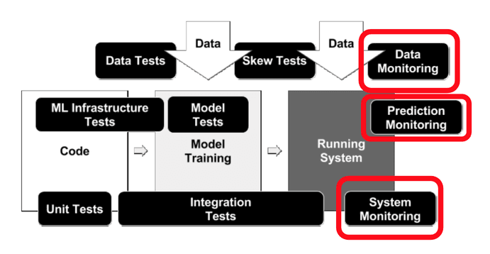

## DS Interview

1. what is 95% CI ， 给了个例子how to get the population response rate from sample given the 95% ci.
2. 给了个例子，age~ height+weight 问了multicollinearity的问题，要求解释，完了问一般情况下怎么detect
3. 给了个 fund raising 例子，5000 alumni，1000 variables build a model to see the probability to make the donation, 这个case 还问了包括 variables selection and model vailidation的问题
4. missing value problem. 有些applicants 没有透露 income， 然后他们用average income做了填充，问这样好不好，或者你有别的什么办法吗

一些别处找来的面经，自己面试前用来准备的
what is p value, what is significance level, what is mean and variance
what is mean by strongly postitively related
how to select variables from thousands of them
一些case
1. 之前response rate 10% 现在变成18% 设计hypothesis test 来确定新的电话营销方案是真的提高而不是偶然发生的。
2. 怎样在不增加cost的情况下使得response rate 升高。
3. prsidential poll obama52% Romney49% margin error 3%， what is your conclusion.

被问到不同model为什么learning curve不同，multi-correlation怎么处理。主要是针对你用的model和feature提问。建议大家弄清自己为什么用某个方法以及用它的目的。

---Evaluation
一定要区分statistical metric和business metric
前者是你训练模型时候定义的metric，主要用来tune hyperparameter的，比如accuracy, F1-score...
后者定义你的模型是否有意义的metric，比如推荐歌单平均听的时长
一般后者意义更大，更会被问。因为是无法直接直接optimize的，只能通过ab testing才测试，所以也有可能会被问到一点点experiment design的知识

个基础知识点是几乎肯定会被问的
1. unbalanced data set
2. eval metric, e.g. precision and recall
3. model a vs model b
4. hyperparameter tuning
5. bias variance tradeoff

你也提到了几点DS不需要担心的问题，下面抛砖引玉再加几点：
数据获取和清理：online serving的时候，features从哪里来，是不是需要做一些处理？例如NLP问题，raw text进来，怎么转变成 feature？production 里面如果不能调python包，一行搞定的情况下，java/C++/别的语言怎么搞定？
deployment：要不要考虑serving latency的问题？太慢的情况怎么办？infra还没有支持到你的use case的时候，怎么办？你需要做 ab testing，那么serving的时候怎么做来实现区分 control 和 treatment

比方说hadoop和spark的区别和原理
***Hadoop and Spark*** 
Apache Spark is a fast and powerful framework that provides an API to perform massive distributed processing over resilient sets of data. The main abstraction Spark provides is a resilient distributed dataset (RDD), which is the fundamental and backbone data type of this engine. Spark SQL is Apache Spark's module for working with structured data and MLlib is Apache Spark's scalable machine learning library. Apache Spark is written in Scala programming language. To support Python with Spark, Apache Spark community released a tool, PySpark. PySpark has similar computation speed and power as Scala. PySpark is a parallel and distributed engine for running big data applications. Using PySpark, you can work with RDDs in Python programming language.

> https://zhuanlan.zhihu.com/p/95016937

> https://logz.io/blog/hadoop-vs-spark

> https://www.gigaspaces.com/blog/hadoop-vs-spark/

> https://phoenixnap.com/kb/hadoop-vs-spark

> https://www.educba.com/hadoop-vs-spark/

> https://developer.ibm.com/tutorials/getting-started-with-pyspark/

问我map reduce的工作流程， spark跟map reduce的区别？
```python
map (String key, String value):  
  // key: document name
  // value: document contents

  for each word in value:
    EmitIntermediate (w, "1");

reduce (String key, Iterator values):
  // key: a word
  // value: a list of counts
  int result = 0;
  for each v in values:
    result += ParseInt(v);
  Emit (AsString(result));
```
***Map Reduce***
> http://snap.stanford.edu/class/cs246-2016/finals/final_2013.pdf

> http://salsahpc.indiana.edu/tutorial/hadoopwc1.html

> https://cseweb.ucsd.edu/classes/sp16/cse291-e/applications/ln/lecture14.html

> http://www.ugr.es/~essir2013/slides/ESSIR_MapReduce_for_Indexing.pdf

> https://en.wikipedia.org/wiki/MapReduce

gradient descent 的pesudo

How do you handle really large datasets, over a billion rows? (Think cloud here and be able able to explain what vendor you’d use and how you get that data up there. This is the hardest part of that process)

What are gradient boosters?

What’s your favorite gradient booster and why? (Gradient booster reign supreme on structured datasets. )

What are a few metrics you use when modeling?

What’s overfitting? What’s the easiest way to reduce it.

What’s K-Fold Cross Val?

Given a 1 TB data set on disk with around 1 KB per data record, how can I find duplicates using 512 MB RAM and infinite disk space? Answer is ***Bloom Filter***  
> https://blog.csdn.net/jiaomeng/article/details/1495500

> https://blog.csdn.net/hguisu/article/details/7866173

> https://zhuanlan.zhihu.com/p/50587308

> https://stackoverflow.com/questions/2573653/given-a-1-tb-data-set-on-disk-with-around-1-kb-per-data-record-how-can-i-find-d

## DS
Let’s take a ***Supervised Learning Process***. The process starts with receiving a static data file with labels in it as the input file, perform ***Exploratory Data Analysis***, scale and perform ***Feature Engineering***, ***Split the Data*** records into train, test and validation set. ***Train the Model*** using the training data records, ***Fine Tune the model Parameters*** using the test data records and perform ***Model Selection*** based on the ***Performance Metrics*** on the validation data records. The well-trained model is then ***Deployed to Production*** to make a prediction/classification on unknown data records. The model is limited to the patterns it has observed in the static input file and cannot adapt to the real-time behavioural changes. Every time there is a new training data is made available, the entire process of training the model has to start from scratch.

***Feature Selection*** is the process of selecting the attributes that can make the predicted variable more accurate or eliminating those attributes that are irrelevant and can decrease the model accuracy and quality.

***Feature Correlation*** is a way to understand the relationship between multiple variables and attributes in your dataset. Using Correlation, you can get some insights such as:
- One or multiple attributes depend on another attribute or a cause for another attribute.
- One or multiple attributes are associated with other attributes.

So, why is correlation useful?
- Correlation can help in predicting one attribute from another (Great way to impute missing values).
- Correlation can (sometimes) indicate the presence of a causal relationship.
- Correlation is used as a basic quantity for many modelling techniques

***Multicollinearity*** happens when one predictor variable in a multiple regression model can be linearly predicted from the others with a high degree of accuracy. This can lead to skewed or misleading results. Luckily, decision trees and boosted trees algorithms are immune to multicollinearity by nature. When they decide to split, the tree will choose only one of the perfectly correlated features. However, other algorithms like Logistic Regression or Linear Regression are not immune to that problem and you should fix it before training the model.

How Can I Deal With This Problem?
- There are multiple ways to deal with this problem. The easiest way is to delete or eliminate one of the perfectly correlated features. 
- Another way is to use a dimension reduction algorithm such as Principle Component Analysis (PCA).

> https://towardsdatascience.com/why-feature-correlation-matters-a-lot-847e8ba439c4

***Hyperparameter Tuning*** hyperparameter除非deep learning，其它基本是要靠cv tune的，这也是被问的重点，一般randomized grid search cv也够了，如果答出bayesian optimization那是要加分的

> https://towardsdatascience.com/automated-machine-learning-hyperparameter-tuning-in-python-dfda59b72f8a

> https://www.kdnuggets.com/2020/04/hyperparameter-tuning-python.html

> https://neptune.ai/blog/hyperparameter-tuning-in-python-a-complete-guide-2020

***Missing Values*** One way to handle this problem is to get rid of the observations that have missing data. However, you will risk losing data points with valuable information. A better strategy would be to impute the missing values. In other words, we need to infer those missing values from the existing part of the data. Imputation methods:
- (Mean/Median) Values
- (Most Frequent) or (Zero/Constant) Values
    - Cons: It also doesn’t factor the correlations between features.
- k-NN
    - The k nearest neighbours is an algorithm that is used for simple classification. The algorithm uses ‘feature similarity’ to predict the values of any new data points. This means that the new point is assigned a value based on how closely it resembles the points in the training set.
    - Cons: Computationally expensive. KNN works by storing the whole training dataset in memory. K-NN is quite sensitive to outliers in the data (unlike SVM)
- Multivariate Imputation by Chained Equation (MICE)
    - This type of imputation works by filling the missing data multiple times. Multiple Imputations (MIs) are much better than a single imputation as it measures the uncertainty of the missing values in a better way. The chained equations approach is also very flexible and can handle different variables of different data types (ie., continuous or binary) as well as complexities such as bounds or survey skip patterns.
- Stochastic regression imputation
    - It is quite similar to regression imputation which tries to predict the missing values by regressing it from other related variables in the same dataset plus some random residual value.
- Extrapolation and Interpolation
    - It tries to estimate values from other observations within the range of a discrete set of known data points.
- Hot-Deck imputation
    - Works by randomly choosing the missing value from a set of related and similar variables.
- Deep Neural Networks (Datawig)

> https://m.blog.naver.com/eeeee5813/221525847053

> https://www.kaggle.com/residentmario/simple-techniques-for-missing-data-imputation

> https://www.hilarispublisher.com/open-access/a-comparison-of-six-methods-for-missing-data-imputation-2155-6180-1000224.pdf

***Data imbalance*** usually reflects an unequal distribution of classes within a dataset. For example, in a credit card fraud detection dataset, most of the credit card transactions are not fraud and a very few classes are fraud transactions. This leaves us with something like 50:1 ratio between the fraud and non-fraud classes.

> https://www.analyticsvidhya.com/blog/2020/07/10-techniques-to-deal-with-class-imbalance-in-machine-learning/

> https://www.kdnuggets.com/2017/06/7-techniques-handle-imbalanced-data.html

> https://www.kdnuggets.com/2019/05/fix-unbalanced-dataset.html

> https://elitedatascience.com/imbalanced-classes

> https://medium.com/james-blogs/handling-imbalanced-data-in-classification-problems-7de598c1059f

***Overfitting*** occurs when the model performs well on training data but generalizes poorly to unseen data. In the following, I’ll describe eight simple approaches to alleviate overfitting by introducing only one change to the data, model, or learning algorithm in each approach.
- Cross-validation (data)
- L1/L2 regularization (learning algorithm)
- Feature selection (data)
- Dropout (model)
- Early stopping (model)
- Data augmentation (data)
- Train with more data
- Ensembling

> https://www.kaggle.com/learn-forum/157623

> https://elitedatascience.com/overfitting-in-machine-learning

> https://laptrinhx.com/8-simple-techniques-to-prevent-overfitting-3288224346/

> https://www.kdnuggets.com/2019/12/5-techniques-prevent-overfitting-neural-networks.html

> https://machinelearningmastery.com/introduction-to-regularization-to-reduce-overfitting-and-improve-generalization-error/

***Outlier Detection*** In statistics, an outlier is an observation point that is distant from other observations.
- Discover outliers with visualization tools
    - Box plot, Scatter plot

- Discover outliers with mathematical function
    - Z-Score, IQR score, Dbscan, Isolation Forest

> https://laptrinhx.com/5-ways-to-detect-outliers-that-every-data-scientist-should-know-python-code-1420067125/

> https://towardsdatascience.com/ways-to-detect-and-remove-the-outliers-404d16608dba

> https://towardsdatascience.com/a-brief-overview-of-outlier-detection-techniques-1e0b2c19e561

> https://www.kdnuggets.com/2018/12/four-techniques-outlier-detection.html

#### Big Data #### 
Storing this data is one thing, but what about processing it and developing machine learning algorithms to work with it? In this article, we will discuss how to easily create a scalable and parallelized machine learning platform on the cloud to process large-scale data.
- Environment Setup — Dockers and Containers
- Parallelization with Dask and Kubernetes
- Dask Cloud Deployment
- Example Cloud Deployment on AWS

***Docker container*** In this case, all these components will be encapsulated in a Docker container:
- The application itself,
- The Conda environment that can run your application (so a compatible Python version and packages),
- The local server or service (for example: a database server and a web server) required to run the application

***Dask*** - a library for parallel computing in Python. ***Kubernetes*** - an open-source container orchestration system for automating application deployment, scaling, and management. ***Kubernetes*** is a cluster manager. We can think of it like being an operating system for the cluster. It provides service discovery, scaling, load-balancing, and is self-healing. Kubernetes think of applications as stateless, and movable from one machine to another to enable better resource utilization. There is a controlling master node on which the cluster operating system runs, and worker nodes which perform the bulk of the work. If a node (computer associated with the cluster) loses connection or breaks, the master node will assign the work to someone new, just like your boss would if you stopped working.

***Vaex*** is an open-source DataFrame library which enables the visualisation, exploration, analysis and even machine learning on tabular datasets that are as large as your hard-drive. To do this, Vaex employs concepts such as memory mapping, efficient out-of-core algorithms and lazy evaluations. All of this is wrapped in a familiar Pandas-like API, so anyone can get started right away.

> https://towardsdatascience.com/machine-learning-with-big-data-86bcb39f2f0b

> https://github.com/TomAugspurger/dask-tutorial-pycon-2018

> https://machinelearningmastery.com/large-data-files-machine-learning/

> https://medium.com/analytics-vidhya/how-to-deal-with-large-datasets-in-machine-learning-61b966a338fe

> https://towardsdatascience.com/how-to-analyse-100s-of-gbs-of-data-on-your-laptop-with-python-f83363dda94

> https://thealphadollar.me/learning/2020/02/23/large-data-analytics.html

***Data Streams/Online Learning*** In the past couple of years, a specific type of machine learning called online learning has become extremely popular in the world of realtime data infrastructure. Unlike traditional machine learning models, the statistical methods performed in online learning “partially fit” their equations to subsets of the overall dataset. This allows for a multitude of advantages:
- Fast deployment of models
- Models can be constantly updated with new chunks of data
- Can use machines with smaller memory sizes since not all the data is required at once

> https://medium.com/analytics-vidhya/data-streams-and-online-machine-learning-in-python-a382e9e8d06a

> https://codeburst.io/realtime-machine-learning-online-learning-with-pubnub-2005e86670ad

***Model Drift*** refers to a model’s predictive performance degrading over time due to a change in the environment that violates the model’s assumptions.
- EXAMINING THE FEATURE DISTRIBUTIONS OF TRAINING AND LIVE DATA, There are a number of different things to monitor per feature including:
    - the range of possible values
    - histograms of values
    - whether the feature accepts NULLs and if so, the number of NULLs expected

Being able to quickly monitor these distributions via dashboards is a step in the right direction. This can be taken even further by automatically tracking training-serving skew and issuing alerts when the divergence in features is significant.
- EXAMINING THE CORRELATIONS BETWEEN FEATURES
    - monitoring correlation coefficients between features
    - training models with one or two features
    - training a set of models that each have one of the features removed
- EXAMINING THE TARGET DISTRIBUTIONS

> https://www.kdnuggets.com/2019/12/ultimate-guide-model-retraining.html

> https://storage.googleapis.com/pub-tools-public-publication-data/pdf/45742.pdf

***Model Retraining*** One way to think about this is that retraining doesn’t involve any code changes. It only involves changing the training data set. Depending on the maturity of your machine learning organization, such changes would ideally be introduced with A/B tests that measure the impact of the new model on predetermined metrics of interest, such as user engagement or retention.
- It’s often a good idea to start with this simple strategy but you’ll need to determine exactly how frequently you’ll need to retrain. Quickly changing training sets might require you to train as often as daily or weekly. Slower varying distributions might require monthly or annual retraining.

> https://www.inawisdom.com/machine-learning/machine-learning-automated-model-retraining-sagemaker/

***ML Model Deployment***

> https://christophergs.com/machine%20learning/2019/03/17/how-to-deploy-machine-learning-models/

> https://papers.nips.cc/paper/2015/file/86df7dcfd896fcaf2674f757a2463eba-Paper.pdf

***Machine Learning System Architecture***
The starting point for your architecture should always be your business requirements and wider company goals. You need to understand your constraints, what value you are creating and for whom, before you start Googling the latest tech. Questions of note might include some of the following:
- Do you need to be able to serve predictions in real time (and if so, do you mean like, within a dozen milliseconds or after a second or two), or will delivery of predictions 30 minutes or a day after the input data is received suffice?
1. How often do you expect to update your models?
2. What will the demand for predictions be (i.e. traffic)?
3. What size of data are you dealing with?
4. What sort(s) of algorithms do you expect to use (and do you really need them)
5. Are you in a regulated environment where the ability to audit your system is important?
6. Does your company have product-market fit? (i.e. do you need to prepare for the system’s original purpose to radically change)
7. Can this task be done without ML?
8. How large and experienced is your team - including data scientists, engineers and DevOps?

#### ML System Monitoring #### 
The monitoring of machine learning models refers to the ways we track and understand our model performance in production from both a data science and operational perspective. Inadequate monitoring can lead to incorrect models left unchecked in production, stale models that stop adding business value, or subtle bugs in models that appear over time and never get caught. When ML is at the core of your business, a failure to catch these sorts of bugs can be a bankruptcy-inducing event - particularly if your company operates in a regulated environment.
1. `Model Building`: Understanding the problem, data preparation, feature engineering and initial code. Typical artifacts are rough Jupyter notebooks.
2. `Model Evaluation and Experimentation`: Feature selection, hyperparameter tuning, and comparing the effectiveness of different algorithms on the given problem. Typical artifacts include notebooks with stats and graphs evaluating feature weights, accuracy, precision, and Receiver Operating Characteristics (ROC).
3. `Productionize Model`: Taking “research” code and preparing it so it can be deployed. Typical artifacts are production-grade code, which in some cases will be in a completely different programming language and/or framework.
4. `Testing`: Ensuring that production code behaves in the way we expect it to, and that its results match those we saw during the Model Evaluation and Experimentation phase. Typical artifacts are test cases.
5. `Deployment`: Getting the model into production where it can start adding value by serving predictions. Typical artifacts are APIs for accessing the model.
6. `Monitoring and Observability`: The final phase, where we ensure our model is doing what we expect it to in production. The subject of this blog post.

***Monitoring Scenarios*** The first scenario is simply the deployment of a brand new model. The second scenario is where we completely replace this model with an entirely different model. The third scenario (on the right) is very common and implies making small tweaks to our current live model. Say we have a model in production, and one variable becomes unavailable, so we need to re-deploy that model without that feature. Or alternatively we develop a super feature that we think is going to be awesomely predictive, and we want to re-deploy our model, but now taking that new feature as an additional input.



Monitoring should be designed to provide early warnings to the myriad of things that can go wrong with a production ML model, which include the following:
- Data Skews: Data skews occurs when our model training data is not representative of the live data. That is to say, the data that we used to train the model in the research or production environment does not represent the data that we actually get in our live system.
    - We designed the training data incorrectly: Distributions of the variables in our training data do not match the distribution of the variables in the live data.
    - A feature is not available in production: This often means that we need to either remove the feature, change it for an alternative similar variable that exists in production, or re-create that feature by combining other features that exist in production.
    - Research/Live Data mismatch: Data we used to train our models in the research environment comes from one source and the live data comes from a different source. This can mean that the variables may not be fabricated identically, so even though the pipeline returns the same prediction for the same input data (which will mean our differential tests pass), different data sources may lead to inherent different values in the same features, which will result in different predictions.
    - Data Dependencies: Our models may ingest variables that are created or stored by other systems (internal or external). These systems may change the way they produce the data, and sadly it’s common that this is not communicated clearly. The knock-on effect is that the variables that are produced today are not equivalent to those that were produced a few years ago. Either the code implementation of a feature changes, producing slightly different results, or the definition of a feature may change. For example, an external system may adjust the voting age from 18 to 16. If voting age is a significant feature in the model, this will change its predictions.
- Model Staleness
    - Shifts in the environment: If we use historic data to train the models, we need to anticipate that the population and its behavior may not be the same in current times. For example, if we train our financial models using data from the time of the recession, it may not be effective for predicting default in times when the economy is healthy.
    - Changes in consumer behavior: Customer preferences change with trends in fashion, politics, ethics, etc. Particularly in recommender ML systems this is a risk that has to be constantly monitored.
    - Adversarial scenarios: Bad actors (fraudsters, criminals, foreign governments) may actively seek out weaknesses in your model and adjust their attacks accordingly. This is often an ongoing “arms race”.


Most ML Systems change all the time - businesses grow, customer preferences shift and new laws are enacted. Our goal is to identify shifts in our ML system behavior that conflict with our expectations. Broadly speaking, we can categorize the ways our ML system can go wrong into two buckets:
1. Data Science issues (data monitoring, prediction monitoring)
2. Operations issues (system monitoring)

`Data Science Monitoring`
- model input distribution (numerical features) or frequencies (categorical features), as well as missing value checks
- model prediction distribution (regression algorithms) or frequencies (classification algorithms)
    - In either an automated (more on this in coming sections) or manual process we can compare our model prediction distributions with statistical tests: Basic statistics: median, mean, standard deviation, max/min values
- model versions

`Operations Monitoring Concerns`
Monitoring in the realm of software engineering is a far more well-established area and is part of Site Reliability Engineering. A great (free) reference book for this is Google’s SRE Handbook. The operational concerns around our ML System consist of the following areas:
- System Performance (Latency)
- System Performance (IO/Memory/Disk Utilisation)
- System Reliability (Uptime)
- Auditability (though this applies also to our model)

`Metrics for Machine Learning`
Given the above pros and cons, metrics are a great fit for both operational concerns for our ML system:
- Latency when calling ML API endpoints
- Memory/CPU usage when performing prediction
- Disk utilization (if applicable)

As well as for prediction monitoring centered around basic statistical measures:
- Median & mean prediction values over a given timeframe
- Min/Max prediction values
- Standard deviation over a given timeframe

Practical Implementation: One of the most popular open-source stacks for monitoring metrics is the combination of ***Prometheus*** and ***Grafana***. We can create dashboards with Prometheus & Grafana to track our model standard statistical metrics.

`Logging for Machine Learning`
If we consider our key areas to monitor for ML, we saw earlier how we could use metrics to monitor our prediction outputs, i.e. the model itself. However, investigating the data input values via metrics is likely to lead to high cardinality challenges, as many models have multiple inputs, including categorical values. Whilst we could instrument metrics on perhaps a few key inputs, if we want to track them without high cardinality issues, we are better off using logs to keep track of the inputs. If we were working with an NLP application with text input then we might have to lean more heavily on log monitoring as the cardinality of language is extremely high. We would check for input red flags such as:
- A feature becoming unavailable - (either vanishing from inputs, or a high number of NAs)
- Notable shifts in the distribution of key input values, for example, a categorical value that was relatively rare in the training data becomes more common
- Patterns specific to your model, for example in an NLP scenario a sudden rise in the number of words not seen in the training data

Practical Implementation: ***Kibana*** is an open-source analytics and visualization platform which is part of the elastic stack, formerly the ELK stack. You use Kibana to search, view, and interact with logs stored in Elasticsearch indices. You can easily perform advanced data analysis and visualize your logs in a variety of charts, tables, and maps. This is one of the most common open-source stacks for building monitoring systems for logs. Within Kibana you can setup dashboards to track and display your ML model input values, as well as automated alerts when values exhibit unexpected behaviors.

> https://christophergs.com/machine%20learning/2020/03/14/how-to-monitor-machine-learning-models/

> https://www.microsoft.com/en-us/research/uploads/prod/2019/03/amershi-icse-2019_Software_Engineering_for_Machine_Learning.pdf

> https://research.google/pubs/pub46555/

> https://aws.amazon.com/blogs/machine-learning/monitoring-in-production-ml-models-at-large-scale-using-amazon-sagemaker-model-monitor/

> https://aws.amazon.com/blogs/machine-learning/automated-monitoring-of-your-machine-learning-models-with-amazon-sagemaker-model-monitor-and-sending-predictions-to-human-review-workflows-using-amazon-a2i/


***Gradient Descent***
> https://towardsdatascience.com/gradient-descent-algorithm-and-its-variants-10f652806a3

> https://sebastianraschka.com/faq/docs/sgd-methods.html

> https://ml-cheatsheet.readthedocs.io/en/latest/gradient_descent.html

> https://www.geeksforgeeks.org/gradient-descent-algorithm-and-its-variants/

***Tree Based Models*** have an innate feature of being robust to correlated features. When you drop a correlated variable to others, it will leave room for the tree to use one more variable in its trees. Due to the fact you are opening room for one more variable, it is possible to end up performing poorer. However, you potentially harvest another variable, and the importance of the correlated feature you removed is spread among all other variables (and more specifically to the correlated features you had before with the one you removed).

> https://medium.com/analytics-vidhya/overview-about-the-decision-tree-model-267c870fa147

> https://medium.com/data-design/ensembles-of-tree-based-models-why-correlated-features-do-not-trip-them-and-why-na-matters-7658f4752e1b

***Regression***
> https://www.kdnuggets.com/2020/03/linear-logistic-regression-explained.html

> https://www.statisticssolutions.com/assumptions-of-linear-regression/

> https://quantifyinghealth.com/correlation-collinearity-multicollinearity/

***Deep Learning***
> https://medium.com/@sprhlabs/understanding-deep-learning-dnn-rnn-lstm-cnn-and-r-cnn-6602ed94dbff

***A/B testing*** 
> https://medium.com/capital-one-tech/the-role-of-a-b-testing-in-the-machine-learning-future-3d2ba035daeb

### References

#### Machine Learning Algorithms In Layman’s Terms
> https://towardsdatascience.com/machine-learning-algorithms-in-laymans-terms-part-1-d0368d769a7b

> https://towardsdatascience.com/machine-learning-algorithms-in-laymans-terms-part-2-a0a74df9a9ac

> https://www.kdnuggets.com/2020/03/linear-logistic-regression-explained.html

> https://communities.sas.com/t5/SAS-Communities-Library/Decision-Tree-in-Layman-s-Terms/ta-p/571690#

> https://www.experfy.com/blog/ai-ml/machine-learning-algorithms-in-laymans-terms-part-1/

> https://www.experfy.com/blog/ai-ml/machine-learning-algorithms-in-laymans-terms-part-2/

#### Statistics
> https://www.cnblogs.com/Belter/p/5923828.html

> https://online.stat.psu.edu/stat501/lesson/12

## Consulting Prep

> https://www.youtube.com/user/MConsultingPrep/videos

> https://www.myconsultingcoach.com/case-interview

> https://managementconsulted.com/case-interview-structure/

> https://www.craftingcases.com/case-interview-examples/
