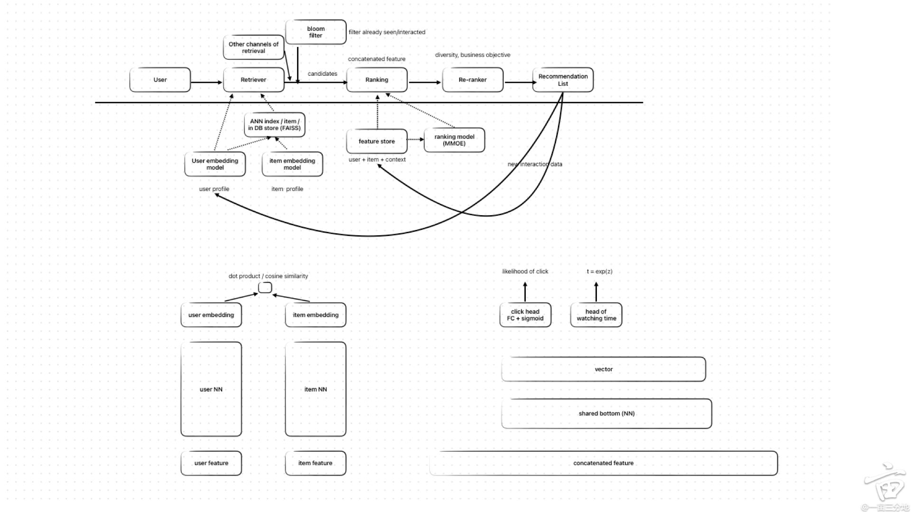

### Python
Python refers to values that cannot change as immutable, and an immutable `list` is called a `tuple`.

#### Functions
- `Making an Argument Optional`
Calling this function with a first and last name is straightforward. If we’re using a middle name, however, we have to make sure the middle name is the last argument passed so Python will match up the positional arguments correctly.
`def get_formatted_name(first_name, last_name, middle_name=''):`

- `Passing an Arbitrary Number of Arguments`
Python allows a function to collect an arbitrary number of arguments from the calling statement.
`def make_pizza(*toppings):`
The `asterisk` in the parameter name `*toppings` tells Python to make a `tuple` called toppings, containing all the values this function receives.

- `Mixing Positional and Arbitrary Arguments`
If you want a function to accept several different kinds of arguments, the parameter that accepts an arbitrary number of arguments must be placed last in the function definition. Python matches positional and keyword arguments first and then collects any remaining arguments in the final parameter.
`def make_pizza(size, *toppings):`
For example, if the function needs to take in a size for the pizza, that parameter must come before the parameter `*toppings`.

- `Using Arbitrary Keyword Arguments`
Sometimes you’ll want to accept an arbitrary number of arguments, but you won’t know ahead of time what kind of information will be passed to the function. In this case, you can write functions that accept as many `key-value pairs` as the calling statement provides.
You’ll often see the parameter name `**kwargs` used to collect nonspecific keyword arguments.
`def build_profile(first, last, **user_info):`
The definition of build_profile() expects a first and last name, and then it allows the user to pass in as many name-value pairs as they want. The double asterisks before the parameter `**user_info` cause Python to create a dictionary called user_info containing all the extra name-value pairs the function receives. Within the function, you can access the key-value pairs in user_info just as you would for any dictionary.

- `Styling Functions`
If you specify a default value for a parameter, no spaces should be used on either side of the equal sign:
`def function_name(parameter_0, parameter_1='default value')`

#### Classes
```python
❶ class Dog:
    """A simple attempt to model a dog."""

❷     def __init__(self, name, age):
        """Initialize name and age attributes."""
❸         self.name = name
        self.age = age

❹     def sit(self):
        """Simulate a dog sitting in response to a command."""
        print(f"{self.name} is now sitting.")

    def roll_over(self):
        """Simulate rolling over in response to a command."""
        print(f"{self.name} rolled over!")
```
- `Inheritance`
When you create a child class, the parent class must be part of the current file and must appear before the child class in the file.
The `super() function ❹` is a special function that allows you to call a method from the parent class.

```python
❶ class Car:
    """A simple attempt to represent a car."""

    def __init__(self, make, model, year):
        """Initialize attributes to describe a car."""
        self.make = make
        self.model = model
        self.year = year
        self.odometer_reading = 0

    def get_descriptive_name(self):
        """Return a neatly formatted descriptive name."""
        long_name = f"{self.year} {self.make} {self.model}"
        return long_name.title()

    def read_odometer(self):
        """Print a statement showing the car's mileage."""
        print(f"This car has {self.odometer_reading} miles on it.")

    def update_odometer(self, mileage):
        """Set the odometer reading to the given value."""
        if mileage >= self.odometer_reading:
            self.odometer_reading = mileage
        else:
            print("You can't roll back an odometer!")

    def increment_odometer(self, miles):
        """Add the given amount to the odometer reading."""
        self.odometer_reading += miles

❷ class ElectricCar(Car):
    """Represent aspects of a car, specific to electric vehicles."""

❸     def __init__(self, make, model, year):
        """Initialize attributes of the parent class."""
❹         super().__init__(make, model, year)
❶         self.battery_size = 40

❷     def describe_battery(self):
        """Print a statement describing the battery size."""
        print(f"This car has a {self.battery_size}-kWh battery.")

my_leaf = ElectricCar('nissan', 'leaf', 2024)
print(my_leaf.get_descriptive_name())
my_leaf.describe_battery()
```

- `Instances as Attributes`
For example, if we continue adding detail to the ElectricCar class, we might notice that we’re adding many attributes and methods specific to the car’s battery. When we see this happening, we can stop and move those attributes and methods to a separate class called Battery. Then we can use a Battery instance as an attribute in the ElectricCar class:

```python
class Car:
    --snip--

class Battery:
    """A simple attempt to model a battery for an electric car."""

❶     def __init__(self, battery_size=40):
        """Initialize the battery's attributes."""
        self.battery_size = battery_size

❷     def describe_battery(self):
        """Print a statement describing the battery size."""
        print(f"This car has a {self.battery_size}-kWh battery.")


class ElectricCar(Car):
    """Represent aspects of a car, specific to electric vehicles."""

    def __init__(self, make, model, year):
        """
        Initialize attributes of the parent class.
        Then initialize attributes specific to an electric car.
        """
        super().__init__(make, model, year)
❸         self.battery = Battery()

my_leaf = ElectricCar('nissan', 'leaf', 2024)
print(my_leaf.get_descriptive_name())
my_leaf.battery.describe_battery()
```
In the ElectricCar class, we now add an attribute called self.battery ❸. This line tells Python to create a new instance of Battery (with a default size of 40, because we’re not specifying a value) and assign that instance to the attribute self.battery.
❸ This line tells Python to look at the instance my_leaf, find its battery attribute, and call the method describe_battery() that’s associated with the Battery instance assigned to the attribute.

- `Importing a Single Class`

```python
❶ from car import Car

my_new_car = Car('audi', 'a4', 2024)
print(my_new_car.get_descriptive_name())

my_new_car.odometer_reading = 23
my_new_car.read_odometer()
```
The import statement ❶ tells Python to open the car module and import the class Car.

- `Storing Multiple Classes in a Module`
You can store as many classes as you need in a single module, although each class in a module should be related somehow. The classes Battery and ElectricCar both help represent cars, so let’s add them to the module car.py.

```python
"""A set of classes used to represent gas and electric cars."""

class Car:
    --snip--

class Battery:
    """A simple attempt to model a battery for an electric car."""

    def __init__(self, battery_size=40):
        """Initialize the battery's attributes."""
        self.battery_size = battery_size

    def describe_battery(self):
        """Print a statement describing the battery size."""
        print(f"This car has a {self.battery_size}-kWh battery.")

    def get_range(self):
        """Print a statement about the range this battery provides."""
        if self.battery_size == 40:
            range = 150
        elif self.battery_size == 65:
            range = 225

        print(f"This car can go about {range} miles on a full charge.")
class ElectricCar(Car):
    """Models aspects of a car, specific to electric vehicles."""

    def __init__(self, make, model, year):
        """
        Initialize attributes of the parent class.
        Then initialize attributes specific to an electric car.
        """
        super().__init__(make, model, year)
        self.battery = Battery()
```

- `Importing Multiple Classes from a Module`
You import multiple classes from a module by separating each class with a comma ❶. Once you’ve imported the necessary classes, you’re free to make as many instances of each class as you need.
```python
❶ from car import Car, ElectricCar

❷ my_mustang = Car('ford', 'mustang', 2024)
print(my_mustang.get_descriptive_name())
❸ my_leaf = ElectricCar('nissan', 'leaf', 2024)
print(my_leaf.get_descriptive_name())
```

- `Importing an Entire Module`

```python
❶ import car

❷ my_mustang = car.Car('ford', 'mustang', 2024)
print(my_mustang.get_descriptive_name())

❸ my_leaf = car.ElectricCar('nissan', 'leaf', 2024)
print(my_leaf.get_descriptive_name())
```

- `Styling Classes`
Class names should be written in CamelCase. To do this, capitalize the first letter of each word in the name, and don’t use underscores. Instance and module names should be written in lowercase, with underscores between words.
Every class should have a docstring immediately following the class definition. The docstring should be a brief description of what the class does, and you should follow the same formatting conventions you used for writing docstrings in functions. Each module should also have a docstring describing what the classes in a module can be used for.
You can use blank lines to organize code, but don’t use them excessively. Within a class you can use one blank line between methods, and within a module you can use two blank lines to separate classes.
If you need to import a module from the standard library and a module that you wrote, place the import statement for the standard library module first. Then add a blank line and the import statement for the module you wrote. In programs with multiple import statements, this convention makes it easier to see where the different modules used in the program come from.

#### Unit Tests and Test Cases
A `unit test` verifies that one specific aspect of a function’s behavior is correct. A `test case` is a collection of unit tests that together prove that a function behaves as it’s supposed to, within the full range of situations you expect it to handle.
A good test case considers all the possible kinds of input a function could receive and includes tests to represent each of these situations. A test case with full coverage includes a full range of unit tests covering all the possible ways you can use a function. Achieving full coverage on a large project can be daunting. It’s often good enough to write tests for your code’s critical behaviors and then aim for full coverage only if the project starts to see widespread use.

```python
# test_name_function.py
from name_function import get_formatted_name

❶ def test_first_last_name():
    """Do names like 'Janis Joplin' work?"""
❷     formatted_name = get_formatted_name('janis', 'joplin')
❸     assert formatted_name == 'Janis Joplin'
```

- `Using Fixtures`
In testing, a fixture helps set up a test environment. Often, this means creating a resource that’s used by more than one test. We create a fixture in pytest by writing a function with the decorator `@pytest.fixture`. A decorator is a directive placed just before a function definition; Python applies this directive to the function before it runs, to alter how the function code behaves. Don’t worry if this sounds complicated; you can start to use decorators from third-party packages before learning to write them yourself.
```Python
import pytest
from survey import AnonymousSurvey

❶ @pytest.fixture
❷ def language_survey():
    """A survey that will be available to all test functions."""
    question = "What language did you first learn to speak?"
    language_survey = AnonymousSurvey(question)
    return language_survey

❸ def test_store_single_response(language_survey):
    """Test that a single response is stored properly."""
❹     language_survey.store_response('English')
    assert 'English' in language_survey.responses

❺ def test_store_three_responses(language_survey):
    """Test that three individual responses are stored properly."""
    responses = ['English', 'Spanish', 'Mandarin']
    for response in responses:
❻         language_survey.store_response(response)

    for response in responses:
        assert response in language_survey.responses
```
When a parameter in a test function matches the name of a function with the `@pytest.fixture` decorator, the fixture will be run automatically and the return value will be passed to the test function. In this example, the function `language_survey()` supplies both `test_store_single_response()` and `test_store_three_responses()` with a language_survey instance.
When you want to write a fixture, write a function that generates the resource that’s used by multiple test functions. Add the `@pytest.fixture` decorator to the new function, and add the name of this function as a parameter for each test function that uses this resource. Your tests will be shorter and easier to write and maintain from that point forward.


## Google


## Meta
E7面试总共六轮，两轮ml design, 一轮coding, 一轮behavior, 一轮cross functional collaboration, 一轮tech retrospect.
Xfn这轮相当于另一轮behavior 重点在和pm以及其他非eng以及跨org eng的合作上
Tech retrospect讲一个你过去做的项目然后deep dive.
E5+昂赛五轮，两轮coding+两轮ai design+一轮bq

`店面`
电面是一轮一小时，40分钟coding(两道题）+20分钟BQ
第一题是easy版的560，只需要输出有没有可行的sequence （True or False）。首先是有负数的情况下怎么做，写了个presum，然后follow up问全正数的条件下怎么继续优化，提示下用two pointer优化了空间复杂度。
第二题是这个 梨蔻，但是matrix是正方形。follow up是如果有duplicate number该怎么改算法，对时间空间复杂度有没有影响。
https://leetcode.com/discuss/post/125301/find-longest-consecutive-path-in-a-matri-vgq9/
二面 就是利口： 1570 这题到处都看到有人面， 第二道题没见过后来尝试找也没找到， 有点像403。然后条件特别多也记不清了。这道题不太熟悉，只说了个思路，写到一半也没时间了。
129, 215   19(问能不能不traverse两边list), 1570
346-follow up：deque是static data structure还是dynamic，what if two threads call this at same time
162- no n[i]!=n[i+1] assumption, no need strictly greater than
follow up: what if we need to do strictly greater than, can you still use binary search?
125, 1249   133, 给两个list of interval，两个都sort过了，把两个merge起来
https://leetcode.com/discuss/post/124616/facebook-merge-two-interval-lists-by-eva-th6a/
1249, 415    339, 973     528, 270    1004,         938, 71     938, 复杂版56（双列）  415,139变形
打印矩阵对角线
给定一个整数矩阵，按从 右上到左下 的方向打印其对角线上的值。每条对角线都向 左下 方向移动。每条对角线的输出之间应有换行。[[1,  2,  3,  4],
[5,  6,  7,  8],
[9, 10, 11, 12]]
输出:1  
2 5
3 6 9
4 7 10
8 11  
12  
最大化最长假期
一个字符数组，其中包含 H 或 W：
H = 假期（Holiday）
W = 工作日（Workday）
有一定数量的个人休假天数，需要尽可能使的最长假期时间最大化。
例如：arr = [W, H, H, W, W, H, W], PTO = 2  
你可以最大化的假期长度为 5 天。[W, H, H, W, W, H, W]
    P  P
1  2  3  4  5
极简版伊斯刘146，只需要建一个class，可以get，put，remove不要求复杂度
528 follow-up有没有更快的方法sample
703 Variant get the larget nubmer from a data stream (call an API) where the the order is messed for at most K steps -> heap
Create a generator to return in order from a BST -> in order traversal with stack
第一题是给一个string类似 139依散酒的变形
s = "catanddog"
复制代码
和一个list of str作为dictionary,
d = ["cat", "and", "dog"]
复制代码
，问
s
复制代码
是否能够由
d
复制代码
中的单词表示，可以无限用。总感觉是lc的题，但没搜到，有知道的大神欢迎补充。交流了几种方法，后来决定用backtracking，应该是写得差不多，但后来问复杂度的时候有点发蒙，引导纠正了几次才过去。经提醒第一题应该是依散酒的变形，因为面试的时候其实还要求如果能被拆分，要输出拆分后的结果，所以在DP和backtracking之间选了backtracking，但现在想想DP也行
第二题是酒气伞973的变种，除了给一堆points
复制代码
以外，还给一个
query
复制代码
坐标，问最近的k个。follow up是如果
points
复制代码
的量特别大怎么办。
62变种，需要返回所有的unique path
第一题很像560，但是多了一个里面数值大于零的条件。
如果所有数值大于零，挪动 right pointer guarantees increament in subarray sum, 挪动 left pointer vice versa
当 subarray < k，++right 直到 subarray sum >= k, 当 subarray sum > k, ++left 标准解法用prefix sum 如果有大于零条件，可以用two pointers
第二题是109，要求不能用额外的资料结构。
以前面过同样岗位的实习，刷top 20题就能过，
这次面全职，刷了top 50题，没有遇到原题，第二天收到挂了，
第一题 14，有点麻烦的easy题，
第二题 🔗 leetcode.com， 是23的变种，
https://leetcode.com/discuss/post/169334/facebook-phone-screen-sorted-iterator-by-2hpf/
第二題 高頻 987 不需要考慮最後值的順序
Q1:
Given the root of a binary tree, return the vertical order traversal of its nodes’ values (from left to right, top to bottom, column by column).
Example:
Input Tree:
        100
       /   \
      2     3
     / \   / \
    4   5 6   7
Output:
[[4], [2], [100, 5, 6], [3], [7]]
Q2:
Given an array of integers (both positive and negative), return the number of contiguous subarrays that sum up to a given target k.
Example:
Input:
        •        array = [1, 2, 3, 4, 5]
        •        target_sum = 5
Output:
        •        2 (because [2, 3] and [5] both sum to 5).
先是bq: 1.proudest projects->at would you do differently if you do this project again->how do you evaluate the impact ->how you dealt with impact that is different than your expectation. 2. Handle team conflicts.
Coding: 幺儿舞125，follow up怎么处理特殊符号/regex
药吾妻灵1570，follow up不能用hashtable怎么搞，如果变成dense vector但依然不能用hashtable怎么搞。两题都追问time/space complexity, at best/worst case scenario.
第一题50是merge 两个sorted array，其中有一个有一些dummy elements. 要求efficiency.
第二题是确认一个binary tree是不是complete.
第三题是给一个binary tree, 假设人站在右面看，输出一个list, 包含每一个level最右面的element.
相信常刷题的小伙伴知道LC代码，楼主几乎没刷过LC，不出意料地挂了。算法都很简单，但是写不出code.
第一题写一个function算出a的b次方，先写了最简单的for loop，面试官问能不能优化，想到可以用类似binary search，之后在提示下磕磕绊绊写出来了略微超时
第二题检查一个array里有没有一段连续的数字加起来等于target，用cumulative sum比较简单，但面完发现少了个edge case
药奇岂捌1778 变种 就是move from current location, 找target. 但是没有给定m, n,  assume 有些function avaiable, 比如canmove(), Istarget()， etc. 用bfs 或者 dfs都可。我记得lc不是求最短距离吗？这个就是找target，一遍dfs就可以了。
代码轮1：
器灵罢708
乌尔疤528 否楼阿婆 时间怎么O(1)
一个比较容易忽略的地方是，当递增或者递减趋势变化的时候，要把指针pointer+2而不是+1。比如4，5,6,1,2,3。6->1，虽然递增变递减，但是不应该子序列计数+1。个人觉得O（1）不太可能，除非 每个数字都拿来做 num:idx mapping，这样可以做到O（1）时间复杂度, 但是是用空间复杂度换取的，而且不scalable和practical。 如果prefix的数字间隔是某个数字的倍数，那么可以用beckting来做 number➝bucket_id - >{buket_id:idx}的映射
应该就是每次趋势变换时候就counter+1，最后loop结束return counter+1就好了。因为最后一个序列不会被捕捉到。
代码轮2：
我还没刷到，知道的人可以po一下题号。一个数列，由多个单调递增或者递减的数列拼成，要求数出来里面有多少个单调数列。
坝流散863
https://leetcode.com/discuss/post/5203188/metaonsitee5-by-anonymous_user-9xwc/
https://leetcode.com/discuss/post/4525578/meta-phone-screen-by-eegbunam-kn7f/
蠡口留疤玲+姨儿遗留
蠡口物流领
recruiter 还发邮件强调没有任何的 DP 问题（md 我最擅长 DP 问题了），所以有一道 followup 本来是用 DP 解的，面试官直接说别了，超纲了，这个 recursion 就够了。
followup就是 姨儿遗留，最优解是DP，但是我加memoization的时候被打断了，所以留了个带重复计算的recursion解法
https://leetcode.com/discuss/post/4288566/e4-meta-phone-screen-qs-by-anonymous_use-s6ug/
https://leetcode.com/discuss/post/124616/facebook-merge-two-interval-lists-by-eva-th6a/
https://leetcode.com/discuss/post/4392657/meta-phone-screen-e4-by-anonymous_user-e92p/
https://leetcode.com/discuss/post/715406/facebook-merge-graph-nodes-by-anonymous_-7qmx/

62. Unique Paths
def unique_path(m, n):
    ret = []
    def dfs(i, j, cur):
        if i == m-1 and j == n-1:
            ret.append(cur[:])
            return
        if i < m-1: dfs(i+1, j, cur + [(i+1, j)])
        if j < n-1: dfs(i, j+1, cur + [(i, j+1)])

    dfs(0, 0, [(0, 0)])
    return ret
时间复杂度我个人想的是O(2^(m+n-2)) 或者O(2^(m+n)), 因为对于每一个格子都要做一次decision，除了最后一列和最后一行。-2可以认为是常数忽略不计。
空间复杂度的话因为记录每一条path，所以是O(m+n) * (m+n-2)! / (m-1)!(n-1)! 其中(m+n)是每一条path的长度，后面的factorial是ret的长度。
用普通的dfs (backtracking) 就行，这题本来是考dp的，为了不让你用dp就改了条件
base case里的: ret.append(cur[:]);  因为copy current path, 这步花的时间应该是O(M+N), 这一步不用算在time compelxity里吗? total time complexity应该是O((m + n) * 2 ^ (m + n - 2))吧
类似生成所有的combination，用dfs在每一步枚举所有向下或者向右走的情况
时间复杂度应该和空间复杂度是一样的，因为每一步有效操作都是添path里的一个位置

第一题是给一个string类似
s = "catanddog"
和一个list of str作为dictionary,
d = ["cat", "and", "dog"]，问s是否能够由d
中的单词表示，可以无限用。总感觉是lc的题，但没搜到，有知道的大神欢迎补充。交流了几种方法，后来决定用backtracking，应该是写得差不多，但后来问复杂度的时候有点发蒙，引导纠正了几次才过去。
第二题是酒气伞973的变种，除了给一堆
points
以外，还给一个
query
坐标，问最近的k个。follow up是如果
points
的量特别大怎么办。
还以为第一题复杂度上磕磕绊绊会挂，结果两天之后HR回复说过了……这大概就是鱿鱼捕捞季吧
经提醒第一题应该是依散酒139的变形，因为面试的时候其实还要求如果能被拆分，要输出拆分后的结果，所以在DP和backtracking之间选了backtracking，但现在想想DP也行  

45min两道题，工作7年多的白男，体验不错
第一题：
留疤凛680
follow up是弈迩噫瑬1216，可以移除k个的情况
我以为只是简单的follow up没想到是道hard的dp，我写了个recursive的做法，但没用memorizaion，面试官说looks nice
第二题
简易版巫硫囹560，只问是否存在这样的subarray
follow up 1：返回所有这样的subarray，用字典记录前缀和的index即可
follow up 2：array变成一个矩阵的情况。这题我一开始没太理解，想着是返回所有和为target的path。只想到了dfs全部遍历，但我说这样的解法复杂度是n^4，面试官说没事儿先写下来。因为时间很少来不及写完就写了个框架。面试官说ok，知道我能写出来。我面完后意识到也许path是只能向右向下或右下的，那就可以用前缀和优化（不然这个follow up和原题几乎完全无关了）
希望对地里的朋友有帮助。
顺便想问一下我答成这样过的几率大吗。两道题本身都很简单但 1）follow up数量多而且都要code出来；2）第一个follow up是hard，第二题第二个follow up也不是很好写（考虑到时间）。我回答的不完美的地方有1）第一题follow up不是最优解；2）第二题第二个follow up没写完，同时没确认题目意思，但面试官看了我写的都说nice，也没让我改。。。
https://www.geeksforgeeks.org/print-all-paths-in-matrix-with-given-target-sum/
他是要找 rectangular submatrices, 还是找所有可以合为target的点啊
array变成一个矩阵的情况。这题我一开始没太理解，想着是返回所有和为target的path。只想到了dfs全部遍历，但我说这样的解法复杂度是n^4，面试官说没事儿先写下来。因为时间很少来不及写完就写了个框架。面试官说ok，知道我能写出来。我面完后意识到也许path是只能向右向下或右下的，那就可以用前缀和优化（不然这个follow up和原题几乎完全无关了）
不是rectangle，我的理解是一条路径（8个方向的那种），那样的话就是dfs。如果是只能往右/下/右下的path的话，就有点类似这道题🔗 leetcode.com 可以用前缀和来优化。很后悔当时没问清楚（如果我没解释明白的话欢迎再问哈）。主要也是我说了思路后他说sounds great，就让我写起来了。题目本身我做的其实也没有特别快，而且以为只会有一个follow up我看时间还多就慢慢地walk through examples。。。不然还能来得及写完
谢谢补充，如果是在matrix里面找路径的合为target，那是不是可以backtrack， 当sum 大于target的时候可以提早结束 (但是不适用有负数）
  BQ：国人大哥，人不错，非常常规的bq问题，都是地里常见的，因为是phd ng，主要问phd相关的
  ml design：国人姐姐，人超级nice。recommend places near you，非常常规的问题，按推荐系统流程回答即可。主要我讲，讲完之后她会问一些简单的问题。几乎没有任何ml八股文的东西。最后问怎么monitor和refresh model，我说我没在业界怎么待过不太熟悉，她说没事前面已经答得很好这是bonus points
  coding1：国人小哥。第一题好像不是tag题，非常简单，问给定字符串能否重排成回文串。followup是能否只traverse一次。第二题408司令把，followup是判断l2tc1de和l4ode是否是可以是同个单词的缩写
  coding2：印度小姐姐，是校友。第一题姨儿思旧1249，followup是能否O1 space。第二题山意思314，followup是问我能不能dfs写。
  整个面试难度，表现和体验的话，电面我觉得是最难的，因为问了3个followup，每个都要写出code，还有一个是hard题（虽然是tag但我当时没刷到）。bq中规中矩，还剩10分钟的时候面试官表示收集到足够的signals就直接q&a了。ml design非常常规的推荐系统，国人姐姐人非常好很和蔼一直给我正反馈。coding的话都会问空间时间复杂度，vo的coding基本全是超高频，几乎全在前6道高频tag里。所以大家一定好好刷题。一开始比较担心会不会像有些说的国人/烙印面试官容易踩雷，但结果上讲每个面试官人都非常好，meta的面试体验是我目前面过的最专业的
  关于你的第一个问题。首先我觉得你的想法是可行的。不过更简单的方法是用和解决原问题相似的方法。原问题里我们是用两个指针，缩写的那个的指针在遇到数字后会让另一个指针向右移动数字对应的格数。那对于这个followup我们可以采取类似的方法，在某一个指针碰到数字后，移动另一个指针数字对应的格数。但是要一格一格移以免碰到另一个指针跳过数字的情况。
  第二个问题的话，可能是我表述不清楚，是使用O(1)的额外空间，主要就是让你别用stack或者set之类的存要remove的括号的index。我记得leetcode这题的solution（非官方）里有这样的解法，可以去找一下~

10.23 电面
第一题1762
我用的是stack从左往右maintain一个单调递减stack，没有用从右边loop记录最高建筑的最好的解法（自己刷到的时候想到了，结果面试的时候就第一反应是stack。。。）不过面试官也让我就写了stack。
第二题不记得题号了，但是就是常见的走迷宫。输入是
[[0, 0, 1],
[1, 0, 1],
[0, 0, 0]]
1代表墙，0代表可以走，找一个从左上到右下的完整的path。
这题我答bfs dfs都可以，但是bfs要在queue里面储存完整的path，所以太占空间。面试官问bfs能不能有更好的写法，我当场想到可以保存一个字典，key是每个格子，value是这个格子是从哪个格子去的。然后找到了终点以后再一步一步回溯回去得到path。可能是面试官看出来我之前这种题都是dfs backtrack path写的，bfs是临时想的，所以我问面试官想让我写哪个的时候 他说就写bfs吧。好在第一题做的很快，第二题写完还有挺充足时间dry run。
面完两个小时以后收到hr说过了，开始约vo
11.20/11.21 VO四轮
BQ：国人大哥问常见的那些问题，为啥读phd，为啥来工业界，proud project，failure，solve conflict，都是地里的问题。结束的时候还提前结束了一点，国人大哥说该有的东西他都收集到了。
System design：设计一个ML系统detect一个广告里包不包含weapon。一个印度小哥面的，全程都是我在drive(背模版)，每讲完一个部分问他有没有什么问题他都是“good 继续“这种。我觉得对于NG来说除了自己看看Grokking the ML Interview那个课，提前找人mock interview至关重要，我在网上付费找人mock了两次，提升非常大。我第一次mock的时候甚至不知道要在白板上写什么。甚至我第二次mock的时候题目是detect harmful information很多东西可以直接套上去。
Coding 1：
local minimum：给个array 比如[3，2，1，4，5] 找某个元素小于等于它旁边的元素。binary search就好了
1650：这道LCA有space complexity O(1)的巧妙解法（🔗 leetcode.com），我之前刷到时候只用了space complexity O(H)的解法，跟面试官说完以后他让我再想想O(1)的。我想了一会没想出来，然后他给了一点hint，说如果p q都在一个level可以怎么做，然后我一下子反应过来了，后面也顺利写完，感觉面试官还满意收集到了我和他互动解决问题的过程，虽然我用了提示没有直接给出最佳答案，但是可能比起直接背最佳答案他可以更好的评估我解决问题的能力。所以大家如果遇到了没有刷过的题也千万不要紧张，就放平心态think aloud跟面试官一起解决就好了。
follow up是另外一个更常见的LCA 236，只用说思路不用写代码。
Coding 2:
543和56。都是常见的easy medium题。还是老规矩先clarify question再讲思路，交流充足以后写码。第二题我最后corner case有小bug，国人大哥提示了不过我改了但是没有完全改。谢谢国人大哥高抬贵手没有计较。面试完了以后内耗了一阵子怕因为这个小失误就被拒。不过从HR反馈来看这一轮应该还是positive的。
https://leetcode.com/problems/lowest-common-ancestor-of-a-binary-tree-iii/solutions/1233986/python-find-depth-difference-explanation-pictures/

分了两天， 11/14 ML SD 和一轮coding， 11/15 一轮coding和BQ
ML SD 印度老哥， 问的是Reel video recommendation system， 体验不是很好，一直打断我问问题，然后就有点乱了节奏好多没说到
第一天的coding是个白人老哥，很nice， 散散就339和把把88变种，merge 3 sorted arrays with duplicates， output sorted without duplicates。有一点following up但很简单。
第二天的coding一开始是个印度老姐，周一换人了换了个国人，体验不是很好。 第一题是吾儿靶528的变种，第二题非tag，类似仐遛饵362，design a service SimpleTally，it has two functions, bump and query, take no input. query returns the total number of times bump was called in the exactly last one hour, with accuracy being one minute. 两个题都很多follow up问为什么不那么做要这么做之类的，有点压迫感，第一题问完就剩15分钟了，学统计的本身coding不是很强，刷蠡口的时候没遇见过第二题这种，一下慌了。。感觉寄。。遇到叫Y. T. （Ads infra的）可以考虑避一下T^T
BQ就很常规了，coding完感觉寄了就很释怀放松了，聊的很开心，感觉国人老哥没准备太多问题后面让我自己找个想说的topic说，然后就聊了聊在西雅图和加州的office的不同感受之类的了

E6最后通知down-level到E5,没有给理由。面试题都挺常见的题目。
BQ： 1) most impactful project + deep dive -> most challenging part in the project -> how to handle it
          2)negative feedback
          3)how to lead a project + deep dive -> 问的很细，由于没想到一个题目下问的这么细，回答得有点卡
1st coding： easy 滑动窗口求平均；medium 树转换成双头linked list
2nd coding:  easy: f6k == facebook;  medium 树按column 和 row 打印出来。都是高频题
1st ML design: video recommendation
2nd ML design: news feed recommendation
coding没什么好说的，都是高频，自己表现的也不太好，但是最优都写出来了，还以为挂了。
ML 设计：老掉牙的题目，面试官很少问话，我全程drive the conversation,说到最后感觉没什么新意，和高级一点的ML八股文一样，可能是自己练习了很多遍吧。相比其它公司的面试难度真的不是很大。多练习就好！

AI design1: 设计multi-array speech enhancment on device
AI design2: 设计video dubber, 功能参考上个月meta刚发布的实验AI产品，能翻译能对嘴型
Coding1：sparse vector dot production，online convolution
Coding2：subsets，subarray sum to k，第二题不让我写brute force也不让我写prefixsum，问我怎么o(1)然后时间小于o(n^2)，想了半天想不出来，告诉我多个条件元素大于0（早tm不说），没时间坑坑巴巴写了个双指针被指出bug然后修好了，不知道会不会挂，如果标准是bug free估计没戏了，但是不说元素》0真不是我问题吧
元素 > 0，就双指针，指针区间的sum < k就移右指针，> k就移左指针。在提示下找出bug应该也算过
是原题，用prefix sum加hashmap就能o1。买它大都原题、老哥你题没刷够啊 力扣 唔遛琳560

E6，被reschedule了三次，后来分成了2天分别面code， ML design，然后code bq ML design，集中说第二天的。
code1 左上到右下有障碍物打印路径，我上来就傻b了，选择bfs，满脑子想着返回步数，快写完了想起path回不去啊，visited set返回的不是path，真惨。dfs我会写的，面试官也无奈说你选了hard mode
code2 word abbreviation只判断是否valid，小改了允许0和leading 0，其实就加一行0 continue就好，秒了
BQ45分钟问了有八个题，大概是后面几题我说的太快或者答案太短。前几题star我准备的都是大项目，什么节省50GPU hour达到训练精度之类，面试官wow了一声让我找回了自信。BQ任何问题都是communication先，然后说出hold myself还是pivot的理由，我感觉面试官是找够signal了
楼主bq很强啊，“然后说出hold myself还是pivot的理由”，这里方便给点template来套自己的故事么
ML第一轮是harmful content detection，第二轮是nearby place recommend，老套路了。这个我花了最多时间准备，特别是设计搜广推，有空再写个我的完整模版，这三个都有funnel pattern就是retrieval先narrow candidates，然后追求高精度的用concatenated feature深度学习做ranking，中间加个bloom filter，最后加个rerank，因为推荐需要diversity，广告需要business logic，搜索需要quality reorder。 place这题不同就是要geohash 距离做为一个召回通道，而且面试官说没有like save这些interaction只有user rating1-5。我想了一分钟，解释说我不打算用1-5因为这不是这个ML系统该考虑的，只要用户点开了就是positive signal，rating是user visit了这个地方以后才给的rating，不该算推荐系统的positive。然后加了dwell time t做为另一个task head， 用 t/t+1 去逼近sigmoid exp z / 1 + exp z。面试官只说了句make sense，continue… 召回主要讲了embedding双塔，排序用multi task，画了2图，最后讲了deploy ab test holdout canary，每小时的incremental learning for user embedding和每天一次1 epoch full update shuffle new data. Follow-up 问了longtail 不popular的place怎么办，我答了default embedding for new place not from random initial。时间太紧了，很多想说的没机会深入
面完第二天就跟recruitor发信自己coding表现不好，如果其它轮还行，能不能给个coding 加面。

背景：ng phd， 顶会若干。
timeline:
12月海投
1月16 phone screen
1月22 coding + ML
1月25 coding + BQ
2月9号通知过了
coding 1: 山亿思， 思玲扒。314, 408 这轮是个烙印，没出什么难的题目，顺利过关
coding 2: 山山就，义乌其玲。339, 1570 第一题没有给和lc一样的api, 我用python写的是isinstance 去判断的，面试官表示可以。第二题我先说了用dictionary 然后又说了用list的做法，这些lc里面都有。
coding 3 一二四舅， 把二期。1249, 827 第一题最优解的space 是o(1)，two pass. 第二题虽然是hard但是不难。
meta coding都是高频原题，认真准备一下coding至少可以拿hire。比较幸运的是这几轮面试官都没有刁难。
ML design: detect harmful content. ml design.我准备的时候是看的alex的书，非常有用。步骤大家都知道没什么好说的：
clarify problem -> collect data -> feature engineering -> model (model architecture, loss) -> metric (offline, online) -> AB test , monitor
ml design 是一个向面试官展示你 proactively lead project 的过程，方方面面都要考虑仔细，尤其是有些重要的细节问题。
比如常见的模型选择，为什么选择a，而不是b，要比较优劣。整个过程要把面试官当成一个Stakeholder，比如方法a速度快，但是需要大量资源，方法b可能慢一点，但是不需要那么多资源，这个时候我们需要问面试官我们的business更看重哪方面。比如在metric的时候，你可能会说auc，你要解释一下为什么我们选择auc-pr而不是auc-roc。（因为auc-pr可以更好的处理imbalance data, harmful content本身就是少数）。再比如选择online monitor metric的时候，可以像面试官问一下我们的business想要更严格的去控制harmful content 还是想要更flexible一点。总之，当你lead一个project的时候你需要考虑很多trade-off, 要么自己解释为什么做出这个选择，要么问面试官我们的business需要什么样的东西。
bq都是常见的问题，比如proud project, failure, conflict. 一定要注意按照STAR的模版去答。可能很多人并不在意bq，花了大量时间去准备coding，甚至有人觉得bq不会挂人。级别越高的职位bq越重要。花1-2天时间好好准备bq基本上可以拿个hire，好好polish一下拿个strong hire不是问题。比如回答里的这个bq 攻略就很好。请一定注意， bq是一个向面试官展示你品质的地方，而不是一定要死板的回答他的问题。比如面试官问“failure"，你不要推卸责任说是别人的错或者傻傻的说了一个大大的red flag, 一定要体现你的成长过程。再比如conflict, 千万别说我和别人没有conflict， 这是一个red flag。conflict的重点不是谁对谁错，谁说服了谁，而是体现一个怎么解决conflict过程的。
1249 的two pass最优解的space 是o(1） 吗？ Leetcode editorial 说是 O(N)
class Solution:
    def minRemoveToMakeValid(self, s: str) -> str:
        # Pass 1: Remove all invalid ")"
        first_pass_chars = []
        balance = 0
        open_seen = 0
        for c in s:
            if c == "(":
                balance += 1
                open_seen += 1
            if c == ")":
                if balance == 0:
                    continue
                balance -= 1
            first_pass_chars.append(c)
        # Pass 2: Remove the rightmost "("
        result = []
        open_to_keep = open_seen - balance
        for c in first_pass_chars:
            if c == "(":
                open_to_keep -= 1
                if open_to_keep < 0:
                    continue
            result.append(c)
        return "".join(result)
但好像可以这样改：
class Solution:
    def minRemoveToMakeValid(self, s: str) -> str:
        # Convert string to list of chars (this doesn't count as extra space
        # since it's just a different representation of the input)
        chars = list(s)
        
        # First pass: Replace invalid ')' with '*'
        open_count = 0
        for i in range(len(chars)):
            if chars[i] == '(':
                open_count += 1
            elif chars[i] == ')':
                if open_count == 0:
                    chars[i] = '*'  # Mark invalid ')' for removal
                else:
                    open_count -= 1
        
        # Second pass: Replace trailing '(' with '*' (right to left)
        for i in range(len(chars) - 1, -1, -1):
            if chars[i] == '(' and open_count > 0:
                chars[i] = '*'
                open_count -= 1
        
        # Final pass: Build result string excluding '*'
        return ''.join(c for c in chars if c != '*')


`BQ`
The worst / best collaboration
A time when you find others know something you need but you don't know;
The most challenging experience that you cannot make the deadline
A time you need to learn something new rapidly
Why join phd? Why go back to the industry？
How do you take constructive suggestion
constructive feedback, conflict time, etc
constructive feedback; project without enough information
go beyond your scope, deal with hard people, constructive feedback, how to measure impact
conflicts/ cosntructive feedback/ do you have failed project
最骄傲项目，如何合作，被pushback，老板的反馈
BQ： conflicts, constructive feedback, proud projects, least favorable people to work with, failure


`MLSD`
1. 经典推广搜，在chat app上给用户推广告，给了很多方便条件narrow down问题。十分感谢!
2. Design a yelp-like system for places recommendation. 设计一个推荐附近event的系统，感觉类似yelp. 推荐一些像是餐厅酒吧活动之类的，一共有6个category，要求两个场景，一个是不分category推，一个是分category推（类似用户可以filter）. design a system to recommend new events for a user.
Yelp那轮侧重high level design,需要讲怎么做retrieval怎么做ranking。感觉面试官的重点在怎么设计metric和eval/testing去满足business need。模型设计也聊了，但时间所限没有讲太多细节（基本上就是name drop, e.g. 2-tower model,DCN, SENet, Transformer, etc)。
Classification那轮面得更细节一些（毕竟没什么high level architecture好讲）。few shot learning一般不会用于online serving（太贵），做offline data labeling(+human raters) 可以，但我没聊这个话题（面试官让我assume可以随意获取需要的labeled training data)。主要还是针对metric,多给几个建模方案（从最轻量到最复杂），讲清楚pros/cons, 再讲一讲online learning+unsupervised learning，最后说清楚怎么serving+testing，时间就差不多了.基本都是我在说，面试官没有给什么feedback，也不知道是不是说在他的考点上。serving就是谈一谈模型上线后可能遇到的问题和需要做什么优化（毕竟不是MLops岗，这里聊得很粗浅），testing就是分offline和online讲，说清楚各自怎么做/为什么要做/怎么分析和决策
3. recommendation 变种hashtag，没见过，问了各种embedding长啥样，loss function什么
4. video recommendation
5. 偵測武器 harmful content detection
请问unsupervised learning 在harmful content detection怎么应用啊？
可以参考下Contrastive learning, 尤其是BYOL一类的论文用到的的joint predictive embedding方法。meta自己的DINO也是类似的方法去训练图像embedding。最后在提炼的feature上面加相应的prediction heads就行了。因为面试官让我考虑posting里包含image/video的情况，我就顺带聊了聊。当然这类模型普遍需要参数量较大，刚好可以一起把model distillation讲一讲
6. reels short video recommendation， model部分主要在讨论结构 和方案选型
7. Research design问了如何设计一个多模态的推荐系统，lz当时alex xu看的不够仔细准备的不好，可能也是挂的主要原因。
8. news feed in fb reel
9. Design a notification filtering system -> ranking model by user, notification, time and locale infomration, plus a ruled based layer to filter on push frequencies
10. 推荐Facebook events给用户, 推荐活动的变形，问了如何收集label
分享个Meta ML design面经。
我个人不做异常检测，考我异常检测的ML设计。。。不给可以选择topic的机会
facebook有很多posts，怎么检测暴力信息的posts。给了四个方向，数据，特征，模型，评估。
我首先确定了busines方面的理解，然后确定KPI。
数据是包含多模态，有少量人为标签（ground truth），大量unlabeled。
到这里就很工业界，和学术界很不一样，如果不是做这种方向的很少了解吧？
说了做数据分析，特征工程等等。
到设计模型简单画了模型结构以及loss function
因为有unlabeled data，我提出使用Contrastive Learning（我也是一知半解，当场想到的，没做过。。。）
然后简单说了说。
最后讲评估围绕confusion matrix， AUC讲的。
最后问线上评估和线下评估区别？

感觉自己没有好好准备，如果稍微刷刷面经的话，或者好好准备一下，应该还是蛮容易的。所以希望大家好好准备。面完以后看了面经，发现还是蛮常见的题. Meta system design常见题：
* Live comment
* Leetcode coding contest website
* Presence indicator
* Ins bidding
* News feed
* Dropbox
* Ads click aggregation
* Proximity
* Youtube


1. `推荐的题目`, `maketplace item 推荐, short video 推荐, nearby place推荐等`; `推荐系统一般只有general query或者没有query`, 只能当类别retrieval channel或者user embedding的一部分, 不需要query processing. 而要侧重user login作为输入, 输出是a list of recommendations according to personalization and user preference. `ML objective是accuracy ???`, 还要考虑diversity. 其它的non-functional requirements可以提一下scalability, low latency足够.
2. `广告ranking题目`, 我觉得是类似推荐的, `没有query, 只有user past behavior做personalization`, 也需要考虑diversity, 毕竟不能把相似广告放一起给用户影响体验. 如果不考虑diversity, 那就要在metric里考虑DCG或者PNR了, 因为最后输出的list, order是重要的, 不只是binary的点和不点了. 同时广告要考虑explicit negative feedback, 就是hide block这种反馈, 对于multi-task的ranking来说很好实现, 就是多一个头label反着01, 但在策略上可能要考虑delay多久再次投送的问题
3. `搜索的题目`, 就要问清是general search还是vertical domain search了, 需要query process, 这部分很重要但是在ML design里却不太重要, `可能涉及query的tokenization, BPE, wordpiece, sentencepiece, 还有term的weight; 涉及user intention detection, 比如是否时间敏感; 涉及搜索对象的quality estimation, 比如doc的EAT分数, website的pagerank分数,图像的resolution分数 ???`; 但并不是ML design的重点. search虽然用到user past interaction作为参考, 但更重要的是query和candidates的relevance, 这个和推荐不一样. 有一类搜索题目是图搜图, 或者copyright, 这个模版就不太适合了
- `Clarify部分`, 要问清是否有query, user interaction有哪些种类, click, like, save, share, rating, 是否考虑负面反馈, 是否考虑implicit feedback比如long click或者dwell time; 要问清是否是user generated content, 因为UGC的话goal就多了个penetration rate, 希望content pool越大越好, new content能够被及时曝光, 要讨论`cold start`, 不然会影响user engagement. 对象一般会包括textual, image, 有没有video要问清. 然后问是否考虑user-user connection, follower和friend, 有些同学可能会用GNN做, 我个人会把user-user当一个召回通道, `比如news feed的题目, 其实是推荐`, 因为你friend的post并不多.
- `Data部分`, 广推是personalization为主, user部分需要ID, demographic, past behavior, user embedding`通过双塔来学习 ???`; item部分是category, hashtag, description, age, 如果UGC就需要creator info. item的feature engineering是在发布时线下学好的, 其中textual的部分basic LM extract feature vector, 比如word2vec, BM25, TFIDF; image用unsupervised model不用label的那些CLIP, SimCLR来extract, video也用frame-based就好, 因为这些feature是初步的, `真正的item embedding也是双塔来learn`; 这里我说的不对的话大佬指正; user, item,然后是user-item interaction data; 还有aggregated statistics, 就是interaction in 1week/month之类; 还有contextual data, 就是device, time of the date, location,isHoliday之类; feature engineering可以提one-hot和buketize. 搜索就没personalization那么多事儿, item部分差不多, query部分前面讲过一些
- `Outline`, 我是习惯讲retrieval和ranking这种funnel design的, 因为一个fast but coarse,一个slow but precise, 感觉有对比很像考核点. 我现场会选择画图把online, offline都画上, 这样万一没时间讲deploy也有个online部分做垫底. 细节就见图了, `召回 + bloom filter` 和其它rule-based filter + ranking (肯定没时间分粗排精排) + re-rank (简单讲diversity或者business logic). 然后提feedback loop, 提召回 offline的vector DB, `有同学说提FAISS博个好感`. 我会提有些deploy会把`usr embedding model和ANN index放一个docker里, 用memory访问代替network速度更快`.



越写越多累了, 后面省略一些, 就按`推荐`来吧. `召回`是基于user embedding或者query和item embedding的cos similarity, narrow to thousands of candidates. `召回的训练, 正负样本选择会是个考点, 正样本是有过交互行为的, 但是负样本可以是无交互行为的几乎全数据集采样, 可以是简单负样本和困难负样本(过了召回没过ranking)的集合, 也可以是in-batch sampled negative(只用于listwise loss, 1个pos, N-1个neg, N是batch size)`. loss 可以是pointwise的BCE, pairwise的hinge loss, pairwise logistic, 或者listwise的softmax + CE; 这样基本回答了imbalance data的问题. 这里可能还会问`long tail也就是训练会被popular item dominate的问题`, solution可以是`log q correction`, 也可以是`self-supervised item embedding`; 还有个问题是cold start, 就是说new user或者new item, 它们的embedding还没有经过back propagation啥也不是的情况, solution 1是分配default embedding给他们而不是0 initial或者random initial; solution 2是用其他retrieval channel比如`category-based retrieval`, 这些通道用reverse chronological order存新item, 减弱cold start problem, 缺点是只能work一小段时间.
- `ranking`就用multi-task classification, 每一种interaction作为一个task head, predict the likelihood of like/save in user-item pair. 召回产生的candidates, 它们的feature要整合成大feature, concatenated by user, item, statistics, context feature, 然后过shared bottom. 速度慢但精度高. multitask的好处, 1有些task的数据不多,现在可以大家share了; 2 consistency among tasks, 3. richer feature; 坏处是训练慢一些, 不好对某些任务做prioritize; 改进方案是`multi task Mix of Expert (MMOE)`. 训练的正负样本就是有无相应的交互行为, `对应每个head做sigmoid`; 整个ranking的loss是weighted sum of BCE, weight是超参预设; 输出是一个aggregated score用于排序. 这里有正负样本imbalance的问题, downsample就好, 但是要calibrate according to downsampling rate. 有可能会有watching time或者dwell time这种使用非离散数据的head, regression也行, 也可以用 t / t+1 去逼近 sigmoid exp(z) / 1 + exp(z), 转换成BCE.
- `Metrics`, offline的, 召回其实最重要是recall; end2end的metrics, 不考虑rank的就都是binary的mAP, F1, AUC那些; 考虑order的就提一提MRR, ERR, DCG, PNR这些. online的metrics, click through rate肯定要提, GMV, conversion rate, DAU, user engagement time这些就看着办了.
re-rank和deploy就不讲了. 我个人是做视觉和多模态的, 搜广推全是自学, 肯定有很多遗漏甚至错误, 自己也fail了面试, 希望别怪我在误人子弟, 以上只是分享我的准备, 兴许给大家多个思路. 面试的时候说不了这么多, 但是也不得不多准备一些, 还是那句话, 大家弃之糟泊的看. 大佬多补充.

楼主楼主， 能讲讲怎么copyright 检测吗？另外model serving的部分应该怎么答呀～ 类似how to roll out new model? how to monitor model health? how to design the infra for data collection? real-time tracking event etc...在面试中被问到了，但是Alex xu的书里这方面的讨论很少
copyright检测我的理解就是用图搜图, 用embedding找similarity. 要clarify多大的范围找candidates?如果很多,那就套漏斗设计先粗粒度召回narrow范围,再上深一点的模型做细粒度的检测
- `model serving`就是我online那部分, 假设offline已经训练好了embedding model, 建立了ANN indexing, 就可以对新的输入做similarity search找出k个candidates了. 然后对candidates augment more feature,  用这个concatenated feature作为shared bottom模型的输入, predicted score怎么aggregate一下, Learn to rank也有可能, 就输出了
- 新模型要过`AB test`, 用online metric做评估, AB test可以遵循canary release, 留10%做holdout, 其它的做factorial experiment design,就是同一个factor内的level要互斥, 不同factor之间是正交; 如果一段时间里significant improvement就可以推全, 留一小部分做reverse AB. 你说的roll out应该就是这个流程
- `monitoring`提一提Grafana, prometheus, 观察online metrics, 防止business shift; Data collection, 尽量不要去标注, 用系统记录交互行为和驻留时间. 如果非要标注, 提一提aws sagemaker ground truth, 把标注任务分发给同事一起完成, 我觉得面试用足够了吧


我之前在另一个帖子里面分享了，ML design 面试的解题思路总结，大家反应很有用。最近又在实践中总结出来一套ML design答题模板，成功的过了几个大厂的ML design面试。因此分享给大家。
求加米，给我米不会减少你自己的米，举手之劳，互惠互利。
面试就是要在有限的时间里，尽量把自己懂的东西都让面试官看到。你懂那么多模型理论，怎么才能让面试官也觉得你很懂呢？要有策略，有重点。什么样的策略好用呢?
抓住核心，兼顾深度和广度。
ML design的核心，万变不离其宗，本质都是train一个model来实现某个task，比如prediction/ranking/classification。有经验的人都知道，实际上给定一个问题，好用/常用的solution基本上只有很少的几种。所以想要显得你懂很多，不仅要从深度上要cover这几种solution，更要从广度上显示你有end-to-end的experience。具体怎么实行呢？
- `Step 1：理清核心问题`
  不是每个面试官都能用一目了然的方式提问。有的面试官水平差，自己也理不清问题的逻辑。遇到问题很模糊的时候，要尽快理清核心问题。抽象出来，可用信息/输入有哪些，要求的输出是什么样的，这是一个classification的问题，还是regression，还是relevance/matching/ranking？理清楚核心问题，就能判断需要train哪种类型的model，整个pipeline就很容易flow out了。
- `Step 2：理清核心问题后，请白板画图，最好是一个diagram。有前后逻辑关系的work flow最能展示你思维的广度。`
  在理清核心问题后，具体分析model之前，先把solution的大体框架在白板上画出来。目的是让整个讲解过程逻辑清晰。按照逻辑的先后关系，typical的解答逻辑包括这几大块：training/testing data, input representation, model, output, evaluation, optimization(parameter estimation). 我一般从model开始画，一个框框摆在中间，这是核心。然后画上游，下游。在这里，只要把框架搭好，告诉面试官，我要讲这些内容，面试官有个心理准备，就可以开始听你讲课了。
- `Step 3：讨论model。`
  为什么我用“讨论”这个词？因为能seriously被考到design的人，都不是entry level。对于更senior的人来说，面试的最好氛围不是你问我答，而是我把我知道的都讲给你听，你看看还有什么想听的。所以你讲的过程中要和面试官互动。要看ta的反应，哪里皱眉了，哪里表情不轻松了，你就要停下来，问他Is there anywhere that you want me to talk more? 这给面试官一个机会表达自己，也帮助你更好的address面试官的考点。
  Model方面，针对task 的类型，propose哪些model可用，把你能想到的都name出来。选择2-3个常用的，比较优劣，然后选择一个大家常用的。不同的model，输入输出可能不一样。所以决定了model，其他的component就很自然的浮现了。这一步，要在你的model框框里，把关键的component列出来，说明它们之间的关系。分析各个model的优劣，可能需要在旁边额外画出model的visualization，比如说到dnn，你就画几层multi perceptron layer，再顺便提一下SGD和ADAM。说到用logistic regression 做classification，你就顺手写一下log likelihood，显得你optimization也很懂。说到regularization，你就写写L1 norm和L2 norm。显示你的深度，主要就靠这一步。
  有时候面试官会告诉你ta想用的model，你就按照ta的来，你也可以在讲解完几个model的优劣后，根据经验自己决定一个model。
- `Step 4：输入输出。`
  前面一步把model定下来。根据不同的model，解释一下input 和output的format。比如dnn就有one-hot encoding，这种最好用上embedding，顺便讲一下有什么好处。比如需要自己设计feature的，就重点讲一下有哪些常用的feature。
  到此，这轮面试的核心你都cover住了，可以得到60分。Step 5和step 6 是能区别ML**和ML老手的部分。如果你做了，答的一般可以再拿20分，答的好可以再拿40分。有ML经验的人在这两个部分，一定要把握。
- `Step5：data。不讲data的ML design是没有灵魂的。`
  从2个方面identify data：training + label,  testing + ground truth。1. propose可用的data 来源+data format。2. how to preprocess data -> make training data, how to build/create label, etc. 完成建模。根据具体的问题，data的solution可以非常creative。甚至Training data和testing有时候不一致。比如language model方面的问题：decide一个twitter post是什么语言？training 可能就用wikipedia，testing则可以收集user data或者platform-specific的data，这时候也需要指明testing如何get ground truth(testing label).
- `Step6：evaluation`
  evaluation很容易讲，重点在metrics。主要有三个部分，一个是ROC/AUC curve。第二个是domain specific metrics，比如广告就有CTR。第三个是confusion matrix，重点是从它延申出来precision/recall/accuracy等等对你的solution重要的metrics。
  最后再说几个加分项：
  熟练的讲解参数估计，能显示solid的数学背景。讲估计参数可以用哪些optimization的方法(MSE, loglikelihood+GD, SGD-training data太大量, ADAM-sparse input)，比较优劣.
  解答逻辑的每个部分，尤其是你熟悉的方面，要自己主动讲，因为每个部分都很重要。别问面试官想不想听你说，除非他明确制止你讲(如果面试官说不用讲，你就失去了一个展示自己的机会)。正确的做法是，lead conversation，一边白板画框图，一边告知面试官我要讲XXX这几个部分。整个design讲完了以后，再问面试官：Is there anywhere that you feel I missed?
  The last but not the least: 每一步都尽快和面试官确认，move on，不耽误时间。想要在45分钟之内把面试官讲的心服口服，这么多个component，每个只有很少的时间。

对于一个成功的面试来说，先讲什么取决于面试官最想听什么。
根据结构化表达的原则，我们要主题先行。什么是一个ML design的主题？显然是model。同样的data，不同的modelling，水平立分高下。
其次，一般在面试官出题的时候，随着问题介绍，data都会告诉你，如果这时候继续讲data，就陷入data的细节挖掘了。如果你有很多面试的经验，你就会知道，一个design的面试中，讲清楚主题之前，如果陷入任何一部分的细节挖掘，都会让面试官开始皱眉头。


系统设计轮
1. 时间足够的话，可以买一本alex xu的系统设计书来看，或者youtube上面的system design多看一些，但一定要总结规律，比如常见的news feed push/pop选择，nosql的优势，message queue是什么用，分布式CAP理论，在线订票系统如何保持一致性。我会把资料发到后面。
2. 在面试中，可以根据这个模版顺序来回答
第一步理解系统设计需求，需要明确系统所用于何种商业目的，要求的功能&技术，来成功定义面试官内心的“标答”
第二步明确所设计系统需求的资源
第三步画出关系清晰的架构图
第四步设计数据结构与存储、核心子服务、接口等
第五步明确所设计系统的可扩展性、容错性、延迟要求等
第六步解决缺陷并处理可能遇到的问题


`Small Talk`
跟HM面谈的时候，我喜欢问些关于行业前景的。当然自己也要提前做好功课，以备在必要的时刻插上一句话：
1. What is the biggest question that your team is trying to answer in 2019?
2. What do you see as the number 1 competitive advantage in the industry?
3. How do you use that competitive advantage to form a game plan against your competitors?
可能前面写的有点混乱，但是这些问题主要是面对director级别的。如果是经理的话，可以适当把问题改成your team's competitive advantage in the organization
或者是what's your team charter? where does your team add the most value to the organization, and how did you achieve it?


`Coding`
toplogical sort, union find, trie等还是需要掌握的，Graph更需要了

第一题留领悟，感谢高抬贵手。
第二题没找到原题，island题，给定地图，要求在水上找建立一个新岛，不能和现存的岛四向接触，返回最大的岛的面积。DFS
跑两遍，第一遍用DFS把每个岛屿的面积算出来，第二遍跑岛屿相邻的0，把这个0的相邻所有的岛的面积相加
第一题夭柳嘶寺，要求Time O(depth) 空间 O(1)。空间复杂度最优的方案卡了很久在提示下才做出来。刷题的时候就没太注意，果然宰了跟头。幸好在不直接提示解法的情况下想到了。parent pointer的情况下，真的可以Time O(depth) Space O(1)
第二题简单版计算器，只考虑加减，要求时间O(N) 空间O(1)。空间复杂度最优上出了小小问题，again刷题还是要精才行。
1. Count how many times a given number shows up in a sorted array.
countOccurrences(20, {10, 10, 20, 20, 30, 30}) => 2
2.Given a 2D grid of 0s and 1s, what is the maximum area of an island that can be formed by flipping at most one 0 to 1? An island is formed by connected 1s, where connectivity is horizontal and vertical only (not diagonal) 下面这个example，答案是5[
  [1, 0],
  [0, 1],
  [1, 1]
]
1. 236
2. 一个data storage
# interface AbstractDataTypeWithLast<K, V> {
#     void put(K k, V v);
#     V get(K k);
#     K last();
#     void delete(K k);
# }
# last() return the most recent accessed key in the store.
# put("a", 1)
# put("b", 2)
# get("a")
# last() --> "a"
# delete("a")
# last() --> "b"
215, 1570
227 只有加号乘号，followup：所有符号和有括号时候； 236， 佛咯啊噗：不是Binary树怎么办， 如果有无数children怎么办；721 说思路
coding 1: baisic calculator & LRU cache; coding 2: valid parenthesis & simplify path;
coding 3: merge sorted arrays & find local minimum in an array； calculator限制不能用stack诸如此类
88, 314    95(h), 827    34, 💃陸苓 variant: non-negative input; follow-up: integer input
record most listened top 3 songs for each user
left + right side views of binary tree
121, 1197, 76
1.一个简单的calculator，只有加号和乘号
2. 回文，最多删除一个character判断是否是回文
3. 给几个城市人口，根据人口比例sample 城市 input: cities = [20,30,50]
call function: sample()
20% return 0, 30% return 1, 50% return 2
4. 最小parent
Coding1: （印度小哥，人狠话不多，原题基础上不停加限制条件，一会不准这个一会不准那个，搞麻了）636， follow up how to deal with multi thread. 1091，follow up 1: print the full path, follow up 2: change to non-binary matrix with ints, each int represent a cost to visit that position. Find the path with minimum cost
Coding 2: （国人小姐姐人超级nice,感谢放水！！）1644，560
528, 56   543, 398
528, 827
- round1: 215和变种 变种就是实现一个类封装起来(215这个高频题的解法的确不常规，需要一定沟通和验证，尤其是如果使用了3-way partition)注意关键词 3-way partition, 正常的快选用得是2-way.普通的快选都是二分，但215这个题后来可能是新加了个test case，里面有大量的重复值，二分的话会tle，需要用三分.用count sort一般需要知道数值范围，所以正常情况下其实不太考虑用count sort。一般都默认数据量最多是10^5，但数值范围不做限制，比如允许 -10^9~10^9，这时count sort可能就不太方便了。面试时面试官一般也不会告知数值范围是多少。当然感觉可以作为一个讨论点跟面试官聊
- round2: 346 207
coding 1 查树直径，合并三个有序数组；
coding 2 二叉搜索树范围内求和，造一个大岛屿
Coding的题目很简单，第一道题973，第二道题是IoU求交并比。我不确定题号是啥，可能是面试官自己想的，题目就是输入是2个字符串数组，求2个字符串数组的交集和并集的比例，不能使用额外空间。我的解法很简单，就是用字典计数来做。
coding 1:
14
💃陸苓 variant: non-negative input; follow-up: integer input
coding 2:
record most listened top 3 songs for each user
left + right side views of binary tree
coding 1: 680, follow up: 1216; 314
coding 2: 346
第二题很奇葩, leetcode没有, 叫 compress graph,不过他一直循循善诱, 先问我, 怎么判断要不要merge, 实现一个func来判断给定两个node需不需要merge, 然后写 Merge的code, 然后问,给一个图怎么compress. 要用到前面写的两个function 🔗 leetcode.com 给我直接干蒙了, 写完了前面两个, 写到第三个没写完就到40 分钟了.
https://leetcode.com/discuss/post/715406/facebook-merge-graph-nodes-by-anonymous_-7qmx/
88 follow-up n个array怎么merge, 543    253, 往返机票min price问题，总结其他帖子说的，应该是给两个数组，一个代表出发的机票价格，一个代表返回的机票价格，index就是日期，求往返机票最低价格。比如出发：[2,6,1,3]，返程：[2,4,3,5]，输出结果是5，选取第0天出发，第2天返回。有的面试官允许当天往返，那上面的例子结果就是4. There are 2 arrays which denote departing and returning flights with the respective indexes being time and the values of the array being the cost it takes for the flight. Return the minimum cost for a round trip provided the return flight can only be taken at a time post departing flight time (i.e if departing at time i, one can catch a returning flight only from time (i+1) onwards). For eg departing = [1,2,3,4] and returning = [4,3,2,1], the minimum cost for round trip will be 2 i.e departing[0] + returning[3]. Solve this is O(n) time.
https://leetcode.com/discuss/post/4288566/e4-meta-phone-screen-qs-by-anonymous_use-s6ug/
987, 43     76, 300 刚收到消息通知挂在第二轮了，因为用了dp，虽然都做出来了但是还是挂
四个编程题目，第一个是只含有0和1的数组算<仙叙盒 先序和>，
https://leetcode.com/discuss/post/4392657/meta-phone-screen-e4-by-anonymous_user-e92p/
第二个是三个<有序数组合并>，第三个是链表交换两个指定index的节点，第四个是<两个二叉树>，同时遍历，按序打印（不需要返回，就是打印）假如两个树的中序遍历分别是(1,3,4,5,7)和(2,5,6,9)，那同时遍历两个的话，打印出来就是(1,2,3,4,5,5,6,7,9)，这个打印出来的东西就是题目想要的输出。 题目给了两个树的根节点。可以想象一下给了两个有序数组，然后同时遍历，按顺序打印。然后把有序数组换成两个树，做同样的事
1249 created a cache to store left bracket, asked to optimize space complexity, changed to store the number of remaining open left bracket
return if a tree is complete
415 variant with demicals there -> 2 pointers
find a cheese in a maze, you don't have the map but API to tell you if you can move certain direction and if you find the cheese -> backtracking, stucked on how to represent visited without map, get hint on relative indexing and solved it
力扣 1249 Minimum Remove to Make Valid Parentheses。名义上是中等&实际上简单难度题，用栈来解，O(n) time + O(n) space worst case, 没有太多可以说的。
力扣 56(Merge Intervals)的变种,给两个已经按start time排好序的interval lists，要求返回一个排序的无重叠的interval list。做过这道题 + 对merge sort实现(双指针combine two sorted lists)熟悉的朋友，将二者结合起来即可。也许有更优的解法，只是当时我写出来的是这种
没有找到力扣原题，第一题比较简单: Check if 180-degree flip of input number string is the same, return a boolean.
Example:
101 → True
86098 → True
23 → False
1668 → False
解法有很多种了，时间复杂度应该是O(n),空间复杂度O(1)。
第二题是尧耳舞寺1254(Number of Closed Islands)的变种，不需要计算有多少closed islands，而需要找到最大closed island size。在原有BFS/DFS实现基础上, return local island size + 记住global max即可。
Code: calculator 變形 + 339 + merge two list of intervals + 找subarray 是否存在sum 加起來等於Target
刚结束了OV面的第一轮，也就是AI coding。问了两道题，一道是给定一个array和window size，计算moving average。一道是给定一个array，找出local minimum. 最像的题是leetcode上的一道Meta tag的题，是找 peak element的。另外，我两个同学考到了一道leetcode原题，是找离原点最近的K个点。
总的来说比较简单，但是第二道题如果没看到答案，蛮难想出optimal solution的。面完才发现第二道的brute force解法出了一点错，index弄错了，希望影响不大。


## Amazon
- Example: # Question: Given an array of numbers a and another array of numbers b, # find k nearest elements from a for each element in b. # a = [1, 2, 10, 100, 102, 205] # b = [3, 80] # k = 2 # output = [[1,2], [100, 102]]


## Plaid

https://leetcode.com/discuss/post/1637489/credit-cardloan-application-system-desig-aexw/

我觉得面试必须得在这几点上比较strong才算稳过了
1 跟面试官clarify题目意思，确保双方on the same page
2 做之前一定要清楚地communicate自己的思路再做，不然即使答案对了也是一个huge red flag
   如果时间允许，提出一些alternatives，各个alternatives的trade off，捎带展示一下数据结构知识
3 把题目都做完，有的时候会有2到3道。如果做到最后一道，但是做地比较迷糊没做完之类的，就比较危险，碰到比较严格的面试官大概率是不会过
4 做完之后主动写test cases，各种情况的正面反面test case都要cover
5 做的过程中如果遇到了bugs，能展现快速debug能力(论坛里所谓的要求bug free只是有些人利用bug free来避免展示debug能力而已，谁会真的要求一个人写的所有代码都是第一遍bug free的呢)

1. 两个问题，第一问coupon只能用于一个category，怎么用最省钱。第二问是如果coupon能用于多余一个category，怎么用最省钱。
这里有个小细节，第一问里的coupon数据结构一般都会有一个 "valid_category"或者类似的field，只对应一个category，第二问要多个category的时候不要头铁想着怎么refactor成list，直接开一个新的field，重写一个新的打折函数就完事儿了，会产生很多copy&paste代码但是能工作，面试官不介意的
代码量不少，注意控制时间
讲slides就是挑一个自己拿手的项目，写slide给他们讲。最好之前看看面试官的背景适当做些调整，不然技术细节太多他们会听不懂

地理有人说过的优惠券题。题目面试官纯口述，只给输入的例子。NDA，用全中文写。
优惠券 = (种类：电子产品，百分比：二十，额度：无，最少购买数量：二，最少购买金额：二十)
购物车 = [{价格：二， 种类：电子产品}， {价格：五， 种类：厨房用品}， {价格：十五，种类：食物}]
要求：优惠券有两种形式，一个是打折，一个是减额度，但两者都有或两者都没有，优惠券无效报错。最少购买数量和最少购买金额就是满足了才能用，可以是无。
求使用优惠券后，购物车里的产品的总价。这题输出是1.6+5+15=21.6
第二问：优惠券的种类可为多个，并且有多个优惠券。
优惠券 = (种类：[电子产品，食物] ，百分比：二十，额度：无，最少购买数量：二，最少购买金额：二十)
购物车 = [{价格：二， 种类：电子产品}， {价格：五， 种类：厨房用品}， {价格：十五，种类：食物}]
要求：其他同上，如果多个优惠券都可用于同一个种类，直接报错（要求有点怪）。
同样求使用优惠券后，购物车里的产品的总价。这题输出是2+5+12=19，因为用于食物是最大化优惠。
他家的bar确实迷，最后做出来但挂了。感觉应该是抓取有效信息不全面吧，面试官上来噼里啪啦把题目和各种细节怎么处理都讲了一遍，但信息量有点多，实现代码的时候，我重新确认了几个他一开始阐述过的要求，没办法。分享给后面要面他家的小伙伴吧

Coding题目也不难，用户有一个shopping cart，有一个coupon，让你写一个程序判断满不满足条件使用coupon，discount是多少。Followup是有好几个coupon时怎么办。

2. sd是credit history那道题。说是250 writes per second的流量，我就没有加message queue做缓冲（解释了这个load真的很小所以任何database都可以轻松handle，然后口头比较了一下各种db的优缺点）。然后read方面沟通了qps说也不会多大因为每个user一年也查不了几次credit score，于是我说cache也没必要做，因为费钱还需要更多的setup。credit monitoring我表示可以直接cron job每个决定opt-in这个功能的user检查一下然后跟上次的对比，因为credit score变动不会很频繁（一年几次）于是做event streaming是overkill。面试官感觉全程一脸
问了一下feedback应该主要是coding那个bug的问题，但sd被说“api performance没有处理好”，所以是真的想在250 qps的情况下加queue吗-.- 那随意了，我们组relational db都是5k-15k qps写入，没queue也好好的。
挂的点楼主应该理解错了。message queue的目的，并不总是为了handle峰值流量。
试想一下，如果下游的database短时间挂了，那你的所有write request是不是都丢失了？如果你有message queue的话，你就可以存住这段时间的所有write request，等database再起来以后，retry所有message就好了。
不过我认同你的说法，很多面试官应该都是觉得用一个mq来replay应该比较保险。只是我自己的实际工作经验告诉我mq并不必要，但也许那个面试官并没有这样的经验所以他觉得我在胡扯（我给他讲我们组实际系统性能和设计的时候他非常震惊脸）。

店面：算法是地里中央银行那题 + credit history 系统设计 感觉和脸家系统设计的风格差不多 就是画图呗 常见的什么 nosql + kafka + stream processing 甩上去就差不多啦 特别说啦说为什么不用lamda
Lamda 有个最大的坏处就是 同一套逻辑implement两次。 以前batch processing 经常被拿来纠正stream processing的错误 实际上很多时候batch processing自己的误差也挺大的。现在的stream processing因为stateful的原因 是可以支持很高的正确率的。 网上有很多killing lamda的tech blog，有兴趣可以去找找。我印象里LinkedIn和Uber的tech blog都有提过
但这个这个db只是需要支持update 和 查询，不用什么join之类的 你用sql也行 但数据太多 表之后可能太大 之后就不好办啦
read heavey write heavy是可以在面试的时候问的 我记得我问啦update和查询都是什么情况下用 又是怎么用 根据具体api的定义还是比较好推断的
我用stream是因为这个系统还要支持monitor 个什么东西， 出现变化大于某个值就要发notification什么的 db change stream  + stream process之前工作见挺多 就用上啦


3. coding，Central Bank Algo好像之前有人说过的银行转账问题，基本上一摸一样。follw up是给出一个提案 减少transaction总量，大概是利口 中等的难度。
银行转帐都会通过一个中央行A转账，给一个list的转账信息 最后需要output一个简化版本的list
是动态的选择中央银行
请问可以展开讲一下吗？什么是动态的选择中央银行？ 可以是根据transaction amount或者number of transactions来选择中央银行？
要最少的，number of transactions
union find
coding 就是那道central bank A and simplify transaction among A-Z banks followup 沒central 怎麼搞 大致講了算法很快就原用上題的code run  test case就結束了
应该要和interviewer商量一下 我用的是批判标准是最小的balance

"This question is inspired by Plaid's Auth product which serves as a gateway to the ACH system. ACH stands for Automated Clearing House and is the backend for almost all bank payments in the United States."
"Plaid customers such as Venmo use Plaid to authenticate users before issuing ACH transfers to your bank to fund your Venmo account."
"ACH processes transfer requests in large batches, typically once a day in order to simplify each large batch of transfers into the simplest equivalent set o
"ACH processes transfer requests in large batches, typically once a day in order to simplify each large batch of transfers into the simplest equivalent set of transfers between member banks. This process is called Netting."
sourcebank targetbank amount
Input:
AB1
BA2
AC3
output
[BA1,AC3]

问如何选中央银行
要注意handle一些edge cases
like
filter 0 transfer的值
A->B 10
B<-A 10
很简单的，一共三问吧。就一个bank里有不同的account, 然后有个interval，每隔多久会有account update。现在有多个bank   Call一个function with time stamp，问现在有update的account 列表。。第二问是想把这些update 尽量平均一下，比如interval是3, 有4个account 那这个bank就可以0秒2个，1秒1个，2秒1个，3秒2个这样。第三问是有sleep window 不update 但是尽量不丢失信息 我写出来其实有edge case不对的，但是面试官说不重要了

example 2
input: ["AB1", "BA2", "BC3"] // A转$1到B，B转$2到A, B转$3到C
output: ["BA4", "AC3"] // 合起来算B转$4到A，A转$3到C
followup是 不指定中央行是A怎么找到一个最合适的中央行，然后output
from collections import defaultdict

def simplify_transactions(orig_transactions, cent_bank):
    flow_map = defaultdict(int) # dict{bank : $ flow in, negative means expense}
    res = []
    # step 1: process and populate flow_map, clearing house
    for tran in orig_transactions:
        payer, payee, amount = tran[0], tran[1], int(tran[2:])
        if payee != cent_bank:
            flow_map[payee] += amount
        if payer != cent_bank:
            flow_map[payer] -= amount

    # step 2: output
    for bank, amount in flow_map.items():
        if amount > 0:
            res.append(cent_bank + bank + str(amount))
        elif amount < 0:
            res.append(bank + cent_bank + str(-amount))

    return res


def simplify_transactions_v2(orig_transactions):
    flow_map = defaultdict(int) # dict{bank : $ flow in, negative means expense}
    # step 1: process and populate flow_map, clearing house
    for tran in orig_transactions:
        payer, payee, amount = tran[0], tran[1], int(tran[2:])
        flow_map[payee] += amount
        flow_map[payer] -= amount

    # step 2: choose central bank
    max_net_amount = 0
    cent_bank = None
    for bank, amount in flow_map.items():
        if amount != 0 and abs(amount) > max_net_amount:
            max_net_amount = amount
            cent_bank = bank

    if max_net_amount == 0:
        return []

    # step 3: output
    return simplify_transactions(orig_transactions, cent_bank)

02/02/2022: 面的也是这个题目， followup有个code case：["AB1", "AC1", "AD1", "AE1", "DE1000"]
补充内容 (2022-03-20 12:25 +8:00):
code case --> corner case
最佳银行应该是transaction数和转账总算两项都为最少的那个。就["AB1", "AC1", "AD1", "AE1", "DE1000"]而言，遍数选各个为中央银行的可能：
A：AB1, AC1, AD999, AE1001,  total sum: 2002
B：AB4, BC1, BD999, BE1001, total sum: 2005
C：AC4, CB1, CD999, CE1001, total sum: 2005
D：AD4, DB1, DC1, DE1001, total sum:1007
E：AE4, EB1, EC1, ED999, total sum:1005
所以E应该是最佳答案。这是我的理解。
问如何选中央银行
要注意handle一些edge cases
like
filter 0 transfer的值
A->B 10
B<-A 10


他们叫TDD，technical dive deep。准备一个 slide deck 简单介绍一下自己做过的项目，其实不用讲得太细，主要流畅把项目说好就ok，我这个环节感觉更多他们考核是言语表达能力。Follow up问题 都很high level，没怎么问细节。


ML depth and width & optimization
Suppose we have a training dataset with 10M data points, each marked either “healthy” or “unhealthy.” In the dataset, 100,000 points are unhealthy, and the rest are healthy. For each data point, we have 1,000 features that we’d like to use to predict if the data point is healthy or unhealthy

电面基本上地里的内容 最少不同银行转账的flow 还有一个购物车和优惠券的题目没啥算法 不难
还有一个是写job scheduler 把record给不同银行 也不难
表演 设计lender查信用记录的系统 lender会一直发很多record去系统 并且如果fico score降低可以通知

Round 1 - Coding (挂在这轮）
应用题，具体记不太清了，大体是设计一个job scheduler, 定时汇报需要更新的银行账户。需求非常奇怪，然而具体到编程, 难度就是LeetCode Easy. 一小时的面试时间，撸主花了整整30分钟来理解题目，然后十几分钟刷刷刷两问做出来了。
Recruiter 的feedback是面试官觉得理解问题速度太慢，花了太多时间无效clarify question, 挂。
Round 2 - System Design
Credit/Loan Application System 变型。可以参考这个设计并思考怎么拓展（然而LeetCode这老哥RESTful API是有问题的)
https://leetcode.com/discuss/post/1637489/credit-cardloan-application-system-desig-aexw/
Round 3- Behavioral
特别常规的聊天，主要问简历项目
面试整体非常简单，主要撸主太菜，不适应做应用题。HR回复速度很快，哪怕拒信也在电话给了相对具体Feedback, 体验非常好。


两轮coding，祖传的两道题都碰上了，中央银行 & recurring transactions
https://leetcode.com/discuss/post/1367137/plaid-phone-interview-by-anonymous_user-gjl2/
第一轮答的很好，相谈甚欢
第二轮跟面试官解释等差数列里 中间项 * 2 = 前一项+后一项，他表示不明白，我说 【10，20，30】， 20*2 = 10+30，他表示不是很明白
写出来了但是莫名跪了，可能等差数列真的很难吧: )
很奇葩的经历，第一次面试要自己准备code pad，我现场注册了coderpad，写完还要把code发邮件给面试官，记关视频前把他们email都存好
做题建议不要装傻，会写就赶紧写出来，争取把followup也都写/跑出来，他们可能自己也知道就这两道题，除非写的炉火纯青倒背如流不然不给过
central bank 面试官建议iterate只要involve的银行就可以作为central bank，直到它被清零
第二题我没被问到follow up，装傻坐太慢了lol，地里看到有人被问到amount，也有人被问到both，建议都准备一下哈
btw我放的刷题网链接的答案有问题（transaction那一道），仅作题目参考
1. central bank followup是用了absolute最大值求解？
2. recurring txn 20%区间只是 timestamp only 还是 apply to both timestamp and amount？

可以請問一下credit history有什麽特殊要準備的地方嗎！還是説標準的system design! 感謝！
比较标准，但是会侧重于  API endpoints 和 data schema。 建议熟悉一下官方doc。Read write traffic要不同的service和database 选择。
LZ前两题除了transaction还有哪一题？Transaction followup是timestamp和amount都要20%浮动，还是只有amount？
都要20%， 但是是很簡單的那種，不用多想， 想再問問credit history, 問題就是design a system which can calculate the credit history？這樣是不是就是read > write 然後注重db怎麽存，怎麽scale好像想不出來啥特別的，感覺availability 和 consistency 沒那麽重要，可以多説説嗎，我剛開始準備， 沒啥頭緒，感謝！！


1. Coding
find recurring transactions.
[
  ("Netflix", 9.99, 10),
  ("Netflix", 9.99, 20),
  ("Netflix", 9.99, 30),
  ("Amazon", 27.12, 32),
  ("Sprint", 50.11, 45),
  ("Sprint", 50.11, 55),
  ("Sprint", 50.11, 65),
  ("Sprint", 60.13, 77),
]
# input always valid
# days are increasing
这题不难，要和面试官讨论一些clarifying questions来明确reqs，主要还是看你的engineering best practice，modularity啊readability，extensibility什么的因为会有follow up比如加一个新的req怎么修改code。
System Design是设计一个给lender查询user credit history服务。service需要handle lender查询某个用户过去几年的信用记录，并且支持用户贷款payment update。
第一次面系统设计所以答得特别差，回想起来基本踩了所有雷区。应该是挂在这轮了。
coding
List Transaction, category, recurring
[
  ("Netflix", 9.99, 10),
  ("Netflix", 9.99, 20),
  ("Netflix", 9.99, 30),
  ("Amazon", 27.12, 32),
  ("Netflix", 9.99, 40),
  ("Sprint", 50.11, 45),
  ("Sprint", 50.11, 55),
  ("Sprint", 50.11, 65),
  ("Sprint", 60.13, 77),
]
找出recurring transaction
1. 连续三次时间间隔一样，钱数一样
2.时间和钱数可以允许20%的偏差
"""
[
  # merchant, amount, date
  ("Netflix", 9.99, 10),
  ("Netflix", 9.99, 20),
  ("Netflix", 9.99, 30),
  ("Amzn", 27.12, 32),
  ("Sprint", 50.11, 45),
  ("Sprint", 50.11, 55),
  ("Sprint", 50.11, 65),
  ("Sprint", 60.13, 77),
]
"""

给一个 transactions list，找到重复的 merchant，重复的意思 merchant 是出现三次，amount 相同并且之间相差相同的时间。 比如上面这个例子 output 是 ["Netflix"].
follow-up 是把重复的定义改成 amount 的最大值和最小值相差不超过20%，其他条件不变。

其实就是系统设计经典几大块：API，LB，services，database。API和DB schema要设计的详细一点，requests来的量大了怎么handle。然后DB选哪种，read-heavy还是write-heavy，sql vs nosql，consistency vs availability应该更偏向哪种情况，怎么partition。requests和数据多了以后系统怎么scale，bottleneck在哪里。感觉能展开讨论的地方还挺多的，但是最后没时间了

电面两道题，都比较简单：
1. 妖舞舞
2. write a function to valid check a routing number. You can google to find out the rules for verifying routing number.

两轮电面。一轮是简单题，lc min stack变种；一轮是涉及到multithread的，LC上的design hit counter


## Bloomberg
`MLE`
ML SDE电面，先聊聊做过的ML project，问的挺细的，需要自己准备准备。
然后大概30mins问ML的问题，问我什么是supervised/unsupervised learning，举几个例子。然后问我logistics regression，问的很细。。要写cost function，然后怎么optimize求parameter，一直要写公式，中间还问我什么是EM和cross entropy，GG了。。
后面小半个小时coding，利口要斯留`LC146`原题LRU Cache。

有一陣子很常在LinkedIn上看到的職缺 Bloomberg Law Senior machine Learning Engineer
網投後大概一週收到HR面，一週後接著電面，再一週通知reject
1. HR面
大概問了一下Why Bloomberg跟Do you know Bloomberg Law，樓主算是在相關產業工作所以跟hr聊了5mins就直接安排下一輪電面了
2. 電面
ML輪，問了非常多NLP / ML / DL / Resume 的細節
Random chat
1. Why BB Law? What’s your interest?
2. What’s the most recent paper you read and like the most?
Resume / ML Chat
1. Describe your most recent project in very high-level statement
2. How do you explore your dataset? Which dataset are you working on?
3. How do you pre-process / clean the dataset?
4. How do you build the vocabulary set?
5. What's the word vector? How do you use the embedding?
6. Why do you choose the model you mentioned (LSTM-CRF)?
7. What's a sequential model?
8. What’s LSTM? Can you explain that a bit? What problem is solved?
9. What problem still exists in LSTM compare to vanilla RNN?
10. How do you do model evaluation?
11. What metrics do you choose to evaluate the model, name a few (accuracy, F1-score, ......)
12. How do you compare / testing the results in unseen dataset, while you don’t have labels?
13. How do you retrain the model in production?

HR在linkedin上勾搭。2轮店面，4轮onsite。
店面第一轮：过了一遍简历，问了一些基础的BERT问题。
店面第二轮：不是LC题目，implement a tokenizer，需要识别alphanumeric, whitespace和punctuation。code中提供了判别alphanumeric和whitespace和punctuation的API。
onsite第一轮：ML design，从文件中识别出法律条款并且linking，基础的NER和entity resolution问题，还问了如何获取labeled data。
onsite第二轮：现场load一个dataset，用的pandas，需要对数据进行处理，比如说处理label，解决imbalance的问题，解决missing feature的问题，建议提前熟悉下pandas语法，可以google。
onsite第三轮：Senior HM 聊天，过简历
onsite第四轮：HM和tech lead聊天，过简历

ML position
1) CODING题•            im_stream: A stream (generator) that produces IMPosts. Calling next(im_stream) will yield a new post.
•            target_sender_id: a string, the sender_id of the user we want to get a context for
•            window_size: The number of posts before and after the target post that should be included
•             in the context.
•            
•            Returns: An iterable (anything we can iterate over) containing the posts from the first conversational context found in im_stream.
•            A context consists of an "target post" sent by target_sender_id, plus the window_size posts immediately
•            before and after the anchor post that were made in the same chatroom.
2) ML 题
Consider an equity trader who chats with other traders on an instant messaging app:
- She is in several chatrooms, exposed to various kinds of chatter:
news about the market (e.g, "Oil prices are spiking")
trade negotiations (e.g, "I want to buy Tesla stock")
relationship building (e.g., "Lovely weather!")
- When flooded with unread messages (e.g., after stepping away from her desk or if the incoming message volume is high):
she'd like an automated way to discover actionable unread posts
i.e., posts in which people have indicated interest in buying/selling equities

面的是Bloomberg MLE.
phone screen(两轮)
第1轮 简历和ml knowledge，
面试第一轮问了简历(没有coding)，深挖了一个NER的项目(LSTM + CRF)，貌似这个team很多工作都有NER的使用，所有面试官问了整个build NER 的细节: 怎么采集数据，怎么验证你收集的数据，包括你在哪个平台上用什么样的格式收集tagged data，以至于到后来network architecture， CRF 的input和output是啥, 很具体.
第2轮coding，
写一个tokenizer，不用包写一个tokenizer把一句话分成三种tag的token(word, punctuation, 还有一个啥忘了)
VO(4轮):
VO1: 设计NER 一个具体case， 也是从头到尾设计一套NER， 和两个engineer一起讨论.
VO2:  codepad上面的一个jupyternotebook, 数据都load好了，你要先做EDA，数据里面各种问题， category 太多， data unbalanced, 有的column全是空，有的column只有几个有值，你一边写pandas code 一边和面试官讨论，允许查api但是感觉最好不要太频繁，所有pandas的语法最好熟悉。 最后写一个model 做classificatiion，我最后都没写model的code， 描述了一下要干啥，怎么evaluation， code要写的话估计我要去查scikit-learn的api了.
HM: 然后半小时后hiring manager: 两个人，就是问简历，各种深挖简历项目，没有特别technical, 但是沟通和对简历的熟悉比较重要。
vo1一行代码都没写，纯说话.
vo2写了pandas的code。 比如说你说你要看下某一个column是不是都是0， 然后你就写一点点code， 验证一下，解释清楚了之后，然后就接着讨论。然后你又想把某一个categorical feature转成one-hot encoding， 你又写一行代码，看看对不对，然后再接着讨论。

随手海投被recruiter捞了，2轮电面
第一轮是个国人小哥，问了基础的ML知识，外加一个coding，是sparse vector/matrix multiplication。 写得很一般但是他很nice地给了很多hints帮忙
第二轮是个白人EM，问了一个ML design是如何给群聊里面的会话分类：如果在time t 有人说了句“good”，这个good是接前面哪一个对话的，或者这是又开了一个新对话。我这一轮回答的很不好，把这个问题想偏了。
然后10分钟让我快速写了个personalized Pagerank类似的random walk统计，我写了个乱七八糟😂
两天后居然通知过了，让我进VO
VO每一轮改成两个人，而且每组俩人好像是随机搭配的。
第一轮，混血华裔+天竺： 问ML design，题目具体忘记了，但很常规。
第二轮，俩ABC面coding，又是sparse vec/mat multiplication那个题目。但是这次要求详细写class，exception，各种意外的处理等等。果断写得不好。而且这种coding被俩人盯着写很不爽，俩人都七嘴八舌各种问你问题挑战你。我到后面各种typo，打错函数什么的。
第三轮， 这一轮好像不评分，俩EMs陪你聊天，随便你问问题。
第四轮， 又是俩EMs好像。给了一个dictionary，里面的词建立一个trie/prefix trie然后用这个trie去试图match一个string里面所有可能的词。开写后我也是脑残想着优化一下提前terminate。结果俩面试官里有一个好像不太coding的就看不懂了，问了一堆问题让我解释了十分钟到底怎么回事。另外一个面试官最后试图帮我就写了个例子，然后让我拿着例子解释。最后也干脆说你别优化了就用最straight forward的办法写吧。最后写完时间也基本用完。

VO1 应该是两个RS 都是phd 问了个open end的ML question: 如何实现一个只有integer precision的ML model，提了KNN和SVM 但trap在SVM的details上所以最后都没时间work on这个问题 大概率无了 当时答了类似mixed precision但可能不是想要的方向 现在感觉可能是想问类似mixed integer programming的问题 不过也不确定 希望有大神能解答下 ORZ
VO2 偏engineering 实现一个 instant chat message context retriver API 给定人名然后需要返回不同chat room里面的k-lines context 然后需要考虑是stream data 很快就写完了然后follow up问了下如果OOM怎么处理 也不太确定这轮是想问什么
HR 大概问了下experience 以及package range 很迷 HR还一直在打哈欠
VO3 感觉是infra team 先做了个简单的coding 给一段no space string 和 一个vocabulary dict 要做space parsing 然后问适不适合用ML来解决这个问题 感觉是个ML design 从data collection到model training，deployment，performance tracking。不过是个NLP task 不太熟悉感觉design有点失败。这轮interviewer很nice 但LZ不是很熟这一套所以估计两边都比较suffer

这周四三轮onsite
第一轮: ML modeling, 直接给你个dataframe的数据集，让你分析数据，设计模型，模型不用写出来，给思路就好
由于我最近没怎么写pandas, syntax又忘光了，面试官允许网上搜pandas的一些function
感觉整个面试都在纠结这个。。。
第二轮: ML modeling
直接给你他们目前在解决的问题，深入问了data annotation,
为什么选这个模型还有一些edge case问题
这轮感觉答得最好
第三轮 HM
deep dive了之前做的和开花堡这个组类似的项目，这轮很神奇是两个HM
中间还让设计了一个推荐系统
第二天recruiter说positive feedback, 又让约了一轮30分钟和大Boss的meeting

热乎乎的店面，面的是MLE职位；recruiter说phone screen有两轮，说这一轮是coding
结果面试聊了80分钟，全程无coding，然后被告知是ML model轮。。。。
面试官三哥哥人很nice，上来问项目，深入问项目的model，这里简单聊了transformer和 bert 介绍下model structure
没有问loss之类的
重点是model deployment 和evaluation
就evaluation又拓展问了evalution metrics 和 edge case，和benchmark
全是项目相关的问题
因为面的组和我目前做的很类似，所以聊的很开心，后面就是俩人一起吐槽data processing的问题，也是醉醉哒

第一面
面试官一个印度小哥，没有coding，问的是deep learning相关的问题：
1) 在train neural networks的时候，如果可以同时选 a) full-batch training; b) mini-batch training。 优先选哪个？
答案是b)。原因是mini-batch training带来的随机性可以：1. 在优化陷入saddle point的时候帮助跳出saddle point；2.一定程度上能加速training convergence（这点是小哥说的，我不是特别清楚）。
Mini-batch vs Full-batch Training
Correct choice is b) mini-batch. Key reasons:
Noise as regularization: Stochastic gradients help escape saddle points (critical for non-convex optimization)
Convergence acceleration: Mini-batches provide more frequent parameter updates per epoch
Hardware efficiency: Better GPU utilization through parallelization
Implicit regularization: Noise prevents overfitting (similar to small LR+GD)
2) 解释一下train graph neural networks的时候有哪些hyper-parameters可以调。
GNN Hyperparameters
Architectural: Number of layers (message-passing steps), hidden dims, aggregation type
Optimization: Learning rate, batch size, # epochs
Regularization: Dropout rate, weight decay, edge dropout
Graph-specific: Normalization (Layer/Batch/GraphNorm), sampling neighbors
Advanced: Attention heads (GAT), jump connections
3) Deep neural networks(DNN)有很多参数特别复杂。按照传统机器学习理论它应该过拟合，然后在测试集上表现不好。但是为什么在实际中DNN表现得不错？
我其实也不知道为啥。。。随便答了一个说可能data有low-dimensional structure
DNN Generalization Paradox
Your answer about low-dimensional structure is correct (manifold hypothesis)
Additional explanations:
Implicit bias: GD prefers "simple" solutions (e.g. low-norm)
Double descent: Modern NN regimes differ from classical U-shaped risk
Overparameterization: Enables interpolation without overfitting
SGD noise: Acts as implicit regularization。
4) Train graph neural networks (GNN) 的时候， 做aggregation可以用什么？
   答案是：max, mean, 或者用一个MLP。 然后有一个follow-up：有人用RNN来做aggregation，这有什么缺点？ 答案是：RNN的输出和输入的order有关; 如果用RNN做aggregation的话，aggregation的结果和nodes的labeling有关，这违反了我们希望GNN是permutation invariant的初衷。
GNN Aggregation Methods
Correct answer on RNN limitation (order sensitivity violates permutation invariance)
Additional context:
Mean: Preserves distributional info
Max: Focuses on dominant features
Sum: Cardinality-aware
Attention: Dynamic importance weighting
MLP: Universal approximator but computationally heavy
5） GNN的hidden layer的维数一般倾向去选“比较大的维数”还是“比较小的维数”。我答的是"比较小"。原因是数据里可能有low-dimensional structures, 选比较小的维数能促使GNN去学这些low-dimensional structures.
6) Train GNN的时候，如果内存放不下一整个graph怎么办？回答是：可以采用mini-batch training，也就是每个epoch从graph中选a subset of nodes, 然在这个subset产生的小图(the graph induced from the subset) 上训练。
7) 解释一下GNN的工作原理。
就是把每个node的embedding怎么产生的简单描述一下。
8）解释一下Adam optimizer；  Adam在记录gradient的哪些信息（答案：一阶和二阶gradient信息）；Adam怎么发挥作用（答案：可以adaptively调整learning rate）。
     解释一下Batch normalization和Layer normalization。我答的是：batch normalization是通过(在每个mini batch上)减均值除方差的方式稳定training; layer normalization就不懂了。
9） 如果把batch size从128变成256， 那么learning rate应该怎么调？我答的是：batch size变大，那么在这个mini batch上的variance就变小了，相应地learning rate可以稍微增大一些。但具体应该增大多少没答出来。
第二面
同胞小哥，没有coding。问的是简历上的项目，以及两道机器学习和统计的题。
1） 推导一下ridge regression的weight estimator怎么算？这里第一步要记得说bias term单独估计; 第二步说loss function是convex的，所以可以求导以后通过让导数为0来求estimator; 第三步是推导weight estimator； 最后得到的estimator里有个矩阵求逆，小哥问了这个矩阵一定可逆吗？答案是“一定可逆”，原因是那个矩阵是个正定矩阵。
2） 假设X是一个服从标准正太分布的随机变量 (X ~ N(0, 1))， 写一个小程序计算P(X > 5)。 这题我用一个简单的蒙特卡洛来算，但是因为 X>5这个事件概率太小了，即使采样一百万次所有的样本都是小于5，所以最后错误地算出 P(X>5)=0...  正确答案是用 importance sampling来算。
第三面
同胞姐。没有coding，简历问了一点。
1） 手推Bias-Variance Tradeoff的公式。这题稍微有点无语没答出来。一般面试就是让解释一下Bias-Variance Tradeoff， 但这里要求精确地写出公式。。。面试官让考虑一个带高斯白噪声的linear regression model，基于这个model来推Bias-Variance Tradeoff。其实最后她要的就是这本书(https://hastie.su.domains/ElemSt ... LII_print12_toc.pdf)   242页的公式(7.9)的第二行。
这里吐槽一下这个姐讲话不清楚，然后用电脑上的手写板通过鼠标写公式给我看，根本看不懂她写的啥。。。。
2） 解释一下什么是Central Limit Theorem。给N个random samples：X_1, ..., X_N，它们的sample average （(X_1+...+X_N) / N）的variance是多少 (答案：Var(X_1) / N)。

2月中旬 猎头 linkedin 联系 职位是Sr MLE 应该是组招
2月末 店面邀请
3.月初 第一轮店面 是一个很有好的国人小哥哥 准备之前以为只有coding 没想到 其实是half ML half coding， 是1D candy crush 用的是一二零酒`LC1209` Remove All Adjacent Duplicates in String II的逻辑 第一部分也是比较偏向设计 关于从文档中提取表格的metrics 之类的
两天之后 约第二轮
前几天 第二轮店面 是manager Level 的人walk through 一个具体的case （吐槽一下 我是真的没想到一整轮都是walk through 和recruiter联系 他感觉也不是很清楚 他说的是有coding和ML theory 和design
从句子里面提取NER相关信息 会比较发散的问比较多的细节 比如你会怎么设计， 如果结果不好了怎么办？ 提取的数据其实是不同的类型 还有什么其他方法 我一直很不安等待他问coding 结果没有问 中间突然说从英文转成数字用什么算法 我当时直接愣住了 我想的就是直接brute force转

突然想起来了，还有一个系统设计的题目，如何实时更新logging系统， logs在不同的cluster，怎么让user能pull log是chronic order。。。。

先说一下Timeline:
10/06 -- 内推+网申
10/15 -- recruiter电话聊天
10/20 -- 电面
10/25 -- 电面
11/04 -- VO
11/8 -- recruiter口头通知pass
11/9 -- 约team matching
VO一共4轮，每轮2个面试官，耗时1h。整个VO持续4.5hs。
第1轮：
Introduction, 从简历里扣research interest的一个方向问细节。然后开始ML design。假设你有一些house的信息（地理位置，price等），需要设计一个ML model，给定一个house，预测对应的price。
Follow up:  1) 怎么设计feature，预处理，high dimensional怎么办，怎么处理地址信息，怎么获得更多feature，怎么更好利用feature，还有什么实际情况需要考虑;  2) 用什么Model，lz举了linear regression和GBDT，于是针对两个model的细节都问了不少。比如convexity, gradient descent, regularization和GBDT的概念和参数等;  3) 怎么train，怎么evaluate。
第2轮：
Introduction，问实习project details，扣了下feature和model细节，why use A instead of B，model的最终performance如何。完了开始代码
面试官1问了下popular clustering model有哪些，都有什么联系和差别，然后implement Kmeans from scratch。可以用numpy。边实现边回答细节问题，比如怎么initialize centers和怎么choose k。码完后让自己写一个test case测试一下运行结果。
面试官2紧接着来了个经典的利口药尔灵舅`LC1209`，把题目的fixed k换成 k>=3。码完跑test case测试运行结果
前2轮结束后休息了30分钟，接着开始3-4轮。
第3轮：
Introduction，问了与DNN相关的project，然后让解释什么是NN，常见的NN strcuture有哪些，能否并行，怎么参数怎么更新等等，接下来又是一道ML design
bloomberg有很多document谈论某个公司的信息，设计ML model分类article的sentiment。Follow up: feature提取feature，RNN是什么，怎么定义，GRU和LSTM有什么区别，NN structure细节，结果怎么evaluate，label 不balanced怎么处理等等。
第4轮，HM面:
2个HM轮流介绍自己team的工作，然后让lz发问。lz针对hm的介绍问了两个具体问题，HM于是开始滔滔不绝，互问互答吹了30分钟。其后HM开始BQ。1) why BB, how does ur background fit BB。 2) what do you think about going from academia to industry。完了之后其中一个HM开溜了，另一个HM问我还有没有关于BB的其他问题。lz随口问了一下WLB和Internal mobility。完了后相互感谢商业互吹结束。
VO完了第2天（周五）发邮件给recruiter要feedback，recuriter说最早要周一才能给。于是约了周一phone catch up。周一通知pass。稍微说了一下lz整个过程的表现。特别需要mention的是面试时lz的coding part有些小bug以及需要面试官给hint，但过程中他们很看重collaborative problem solving skills。所以不要一味coding，该打嘴炮商业互吹时一定不要沉默不语。

bloomberg article有很多entity。需要写一个 data structure，输入text，累计每个entity出现次数，返回top-k frequently mentioned entity.
用hashmap counting + heapsort 秒了。问了下时空复杂度
Follow up: 如果经常访问top-k，能不能有更好解法。一开始没什么好思路，小哥给了个hint之后勉强搞了个O(n)解法，时间比较紧但刚好写完
from collections import defaultdict
import heapq

class EntityTracker:
    def __init__(self):
        self.counts = defaultdict(int)

    def process_text(self, text):
        entities = extract_entities(text)  # Assume this exists
        for e in entities:
            self.counts[e] += 1

    def get_top_k(self, k):
        return heapq.nlargest(k, self.counts.items(), key=lambda x: x[1])
Process text: O(1) per entity (hashmap update)
Get top-k: O(n + k log n) (heapq.nlargest implementation)


一个support ticket system，用户写ticket主题内容后需要填分类，每个分类都有相应specialist处理。ticket按FIFO处理。如果分类错specialist需要按自己理解纠正分类，然后重新排期。设计一个ML系统降低用户和specialist的等待时间。整个过程不停的扣细节，从特征到model到evaluation问得非常细。

上周面了VO
第一轮 两个题 一个是auto complete（应该用Trie 的 但是楼主当时概念不熟 没写出来
第二题就是coin change2的题， 只不过用了不同的题目问题（什么加油站之类的
（感觉这也不是Bloomberg高频题 = =
看到第一个题 心态就不稳了 导致这场coding其实表现的很不好 而且我一开始的时候是想和面试官说我的思路 我要怎么写 但是面试官就说这是你的代码 你就写呗 （没表现好
第二轮 是design的问题 给一堆没有空格的str 你怎么把空格复原 我觉得我答的算还行吧 主要是面试官很nice 一直沟通就感觉蛮好的
第三轮 是hiring manager面的 前面一部分是BQ 不知道为什么我觉得沟通起来也不是很顺畅 后面部分是relation extraction的design的问题 问的题比较发散

问题是level order traversal of binary tree
基本上树中的每个节点都是一个字符，我们必须打印字符串 by level order traversal of binary tree。我用了BFS，然后用hashmap保存每个level的字符as list.
Follow up:
1. 为什么在哈希图中使用列表而不是字符串？ 速度会如何变化？ 我回答说速度不会改变。 Asymptotically,它是相同的复杂性
2. 为什么要使用哈希图？ 你可以用orderedMap代替吗？ 我对orderedMAp 了解不多，但我告诉过hashmap 的插入时间为O(1)，所以我们可能无法做得更高效。

four rounds
第一 round
    a. 妖恶灵酒 LC1209
    b. basic ML problem, starting from my previous project
第二 round
    a. 衣遛柒遛 LC1676
    b. design a API to de-duplicate the same news article generated daily (There are 2M articles/day; same article: same title and same body)
第三 round
    a. design a ML system to identify different threads in a discussion log.
第四 round
    a. talking with HM
2b -> 类似leetcode 的 design 标籤题目 可以参考，大致要求就是要你写出interface 然后实作，因为这个例子规模小，不用任何distributed system setup.
3a -> deep-dive into a specific ML problem. 主要用叙述，pseudo-code表达自己意思，很随性。
重点在于从 data collection -> feature engineering -> data cleaning/preprocessing -> model choosing -> model training (tuning) -> model evaluation 都要能提出几个方案和自证这个方案是最可行的。
会需要大量互动，因为是open-ended question，他们也不一定有标准答案。我认为这就是典型的ML design interview，不过他们面试不包括model deployment 和 distributed system setup.

猎头主动找的, 面的是Senior Software Engineer (in AI/Machine learning)总共有两轮电面+4轮 virtual onsite
1. 电面1：
一个看起来很拽的年轻面试官，面了一个ML system design的问题，具体是怎么设计Named Entity Recognition system. 如果做过相关问题应该不难
因为楼主之前没怎么准备过，所以感觉答的不好，另外面试官有点盛气凌人，所以以为要挂了
结果还是过了，所以面试的感觉有时候不太准。。
2.电面2:
一个很和气的senior，design一个基于文本的fraud detection ML system. 因为是简单的supervised learning system, 所以答得还可以，可以看出来面试官也很高兴
3.Virtual onsite:
总共5轮，其中三轮是technical的，从早面到晚，因为是virtual onsite，所以连午饭时间都基本没有:(，因为还要自己赶快找点吃的。。。
1. 简单的coding+design NER; 这次楼主准备好了感觉答的还不错
2. `ML design：search ranking`
3. 吃饭+HR聊天
4. coding/design: 给定一个stream，要求写一个method，返回top k frequent elements, 有点类似leetcode `LC347`, 不过因为要对stream经常调用这个method，所以需要设计一个比较好update的，时间complexity也比较好的；
这一轮楼主先打答了brute force的方法，然后讲了一个用heap的方法，method complexity 是 NlogK的；但是面试官不满意，一定要求想出kLogN的，在面试官提示下，最后写了一个dictionary+heap， 然后heap是从底层开始实现，需要有heap udpate （bubble up)的方法，花费了好大功夫。。。
不知道这题是不是曾经出现过在哪里？虽然最后写出来了，但感觉面这个题好像是烙印面试官在坑楼主一样的。。如果大家有什么想法或者知道leetcode题号可以跟大家说一下
5. director聊天，一个很年轻的director，一直在讲bloomberg onboarding process怎么好，对new grad怎么友善，话说我面的senior为什么要给我讲这个。。

回报地里报一个bloomberg ai 的面经
总共两轮技术电面 五轮onsite（包含三轮技术）
每轮技术面都是1-2道lc 和 ml/dl concepts 和 case study
遇到的题目有利口 `LC1396 1029 146 380` （时间有点久了就记得这么多了）
还有implement 一些简单的ml算法
concept部分很简单 ex. l1l2 的区别 ， gradient boosting 和 random forest区别； pca的原理； 描述svm
case 部分 问了multi label classification （news topic）； sequential data ；

店面：两个天竺友人。现实聊了半小时简历+经验。然后问了一道tree的题。不在lc上。他们自己想的。但是dfs，recursion基本可以解决。
当天就通知VO。先面3轮，顺利的话再安排senior leader。
VO 前一天才prep call。也不告诉我面试官名字。
VO当天coordinator 跟我说了名字，发现全是友人。原来这是个5人组，4个烙印。
1. 两个人。第一个问了bipartite graph。但是input比较模糊。lz clarify了一阵子。写完之后，看了半天。总说不懂，手动run了4-5个test case。还是说confused。期间，第二个友人插过嘴，态度差。做了35分钟，开始第二题。类似word index count。第二个面试官态度很差，总是打断我说话，不想看code。这题主要问如何distribute，如何实现mapreduce
2. 店面的两个烙印。第一题 OO design online prediction service。第二题 system design bbg tv scale up。讨论了cdn，api。没仔细问partition，replication。
3. 一个白人小哥。冷脸。主要简历+system design process large logs。还是mapreduce。没任何引导，也不知道他想deep dive 啥。

9月16日第一轮电面
怎么选feature，怎么做prediction？linear regression，feature correlation怎么办？regularization 有哪些？L1 的作用是什么？如果有个变量range特别大怎么办？会发生什么？L1对这个情况有什么影响？怎么sample你的训练集，如果是time series的怎么办？
coding：`就是飞机票打印那题Reconstruct Itinerary`
9月30日第二轮电面
`236, 235` + 时空复杂度，最坏情况？
Logistic Regression是什么？怎么做？怎么迭代更新？怎么split你的data，什么是cross validation？你的这种data split 什么情况下是无效的？那要怎么处理？

新鲜的开花堡电面加onsite
第一轮电面 基本过简历以及相关的dl知识，像是batch normalizaion 什么的，给了一个case study ：news multi-topic怎么设计.就是有好多news，每个news有多个topic label，如何设计一个learning system来完成。
第二轮电面 coding，国人老哥，人很nice，没的说，乐扣 Add Strings 和 Multiply Strings
virtual onsite 六轮
第一轮 ml + case study, name entity
第二轮 coding topk
第三轮 两人闲聊半个小时
第四轮 hr聊半个小时
第五轮 ml + case study credit card fraud detection
第六轮 面见大boss Anju

电面1：ML project dive deep 然后问了一些ML基础相关的然后20分钟写道题，给个API
class LegacyDate:
    def isBizDay():
        return True/False
    def addDays(numDays):
然后实现
def nextMonday(d : LegacyDate):
    # d = Tuesday
    # return d.addDays(6)
电面2：
1. 乐扣雾医霸`LC518` 需要输出最少硬币得到target的组合
2. 一个多叉树，每个节点有一个值，输出从跟节点到叶节点的max path sum。

1,  原题，longest substring without repeating characters
2, Trie, autocomplete

ML Eng, 第一轮店面，好像有两轮店面，国人小弟，挺友好
开始是ML的问题，问熟悉的classical classifier models, 具体问了logistic regression 和 random forest,  lost fuction, gradient descent, regularization.
后来进入深度学习，问了RNN, CNN
后半部分写程序，类似于`word break`, 不要求syntax correct, 后来扩展到如果 字典里的word有权重，要结果最大化平均权重怎么做，没有要求code

BB 家的AI research scientist， title是sales intelligient。九月份的时候就找人内推了，当时HR说只招2019/12 入职的，就搁置了，过了一个月HR又来联系说HC开了。大致流程是两轮店面，各一小时，35-40分钟ML剩下时间coding和问问题。
面试大哥是london打过来的，一开始问了ML基础：
evaluation metrics L1/L2 区别 data不balance怎么办，聊到decision tree和random forest 又问了training时候的区别。为什么data不imbalance也可以。我当时说是因为train的时候cosset function是totalloss， 所以即使有class很大也没关系
又问了logistic regression和SVM的区别。
提到了`PCA`但没细问，估计可能看出我不太熟PCA了。。。
最后问了为什么LSTM比RNN好之类的
感觉ML面就是很杂，但都不深，可能想general了解一下吧
coding是一道palindrom的题，太简单不太记得，目测easy难度

Generative model & Discriminative model 区别
Decision tree & logistic regression区别
介绍常见的无监督算法，KMeans算法原理
`对于Fraud transaction detection 设计feature和model`
公交路线给定(swipe_in time, car_id,station_id), (swipe_out time, car_id,station_id), O(N)计算平均trip的时间

面的是腐国的AI组，聊ML细节，做过的project，问的比较细致，譬如怎么train embedding，w2v loss function是什么，input和output looks like，如何防止overfitting，和一道coding，一个sampler，大意就是给一个p vector（对应一个distribution）， 如何做一个符合这个distribution的sampler，如何优化，时间复杂度等等
第二轮从头开始implement node class， graph class， 然后就是利口找有方向图里面的圈，感觉oop弄清楚了， DFS会没啥问题，没刷过题就稍微有点一脸懵逼

一个图算法。
测试是不是DAG

1）`LC445` 怎么帮一个存成linked list （从高位到地位： 1234 --》 1--->2 ---> 3 ---> 4；2）如何用linkedlist 来做integer的加法。如这题： https://leetcode.com/problems/add-two-numbers-ii/

1. HR 店面之后的第一轮技术店面，问了很多我简历上的经历，包括PhD的研究用到的所有ML algorithm都问得很详细，我经历里有用到的Gaussian Process 和Random Forest 他都会让我详细解释一遍，例如decision tree 的impurity index公式一类的都让在online hackerrank上打出来。最后做了一道很简单的leetcode easy.
2. 主要是coding, 聊了一些behavioral (past experience, why bloomberg...)， 问了一些简单的NLP word embedding, 然后做了一道binary tree common ancester和一道anagram问题。hackerrank上写没有让跑。
3 Onsite 第一面是live coding，让写一个function 保存并输出data stream的mean，做的不是很好，一开始用binary search，后来interviewer提示用data structure，但是花了很长时间想最后时间不够就结束了。第二面问我一些ML的问题，有一题是data set 的 Golden standard， 怎么test 一个data set 是不是golden standard，这个到现在我也不知道怎么做。。。最后让我写一个能在GPU上跑的Kmean我就直接懵比了？？？？面完第二轮hiring manager告诉我他们临时有别的安排就先面这两轮然而我知道已经挂了

第一轮做45分钟presentation，
第二轮：一个印度瘦哥加一个美国胖哥，ML基础知识，问了logistic regression，各种loss，啥是reguarlization等等非常基础标准的问题
第三轮：一个中国大哥加一个印度小哥，第一题 里扣 二舅吾 `LC295`，第二题问了一个系统设计题（印度小哥说的是系统设计题，但我听起来感觉像LRU），无奈楼主实在没准备过这类问题，题目有些忘了，大概是bb有数据不断的stream in，先是问怎么来设计数据结构能够最快找到公司股价，并且返回某个公司最新的股价之类的
午饭：一个伊朗小哥和一个日本小哥带我吃饭，人都挺好的，聊得挺high
第四轮：HR: 我以为到此为止就跪了，结束了的，后来发现HR就给讲讲BB有好多好处，接下来会有两个hiring manager跟我聊
第五轮：一个孕妇大姐，人很好，看起来很和善，先问为啥选BB，然后问我如果让我做sentiment analysis我该咋做，接着问我如果数据没有label你咋办，在接着问我，如果我们给hedge fund提供信息，不想用deep learning那样复杂的方法，你咋办。
第六轮：一个大叔，眼神犀利，感觉快我把射穿了。。自称是所有ML的头，直接给CTO汇报啥的，所以比较紧张吧，然后先问为啥选BB，然后问了我一道非常奇怪的open question，楼主实在是记不起来题目的具体内容了，大概是什么有twitter的评价，但没label，要评分还是啥的，这个问题实在是非常古怪，感觉答得不。

不知道哪国大叔，聊实习项目，问了`KNN`,lasso regression, random forest, 然后`coding实现decision tree`，写完后又写了`一个函数prune这个tree`（就是假如leaf太多overfit了，如何减少leaf的数量），没写完，最后留了一点儿伪代码
听口音是亚裔或中国女，聊实习项目，类似前一轮的一些理论问题，然后coding kmeans。然后一个credit card fraud detection的case study

给定两个整数 n 和 k，建一棵有 n 个节点，每个节点有 k 个子节点的树。用 bfs 做就可以了。
Follow-up 是问如果每个节点可以有 1-k 个子节点，总共可以构建多少个不同的树。只要讲思路不要求实现，再提示下发现是个动规的问题，虽然最后感觉没有完全答对，还是给过了，感谢。
比如 n = 7，k = 3，得到的树就是：
              1
        2    3    4
      567
from collections import deque
# BFS
class TreeNode:
    def __init__(self, val=0, children=None):
        self.val = val
        self.children = children if children is not None else []

def build_k_ary_tree(n, k):
    if n == 0:
        return None
    root = TreeNode(1)
    queue = deque([root])
    current_val = 2
    while queue and current_val <= n:
        node = queue.popleft()
        for _ in range(k):
            if current_val > n:
                break
            child = TreeNode(current_val)
            node.children.append(child)
            queue.append(child)
            current_val += 1
    return root

# 示例：构建n=7，k=3的树
root = build_k_ary_tree(7, 3)
# DFS
class TreeNode:
    def __init__(self, val=0, children=None):
        self.val = val
        self.children = children if children is not None else []

def build_k_ary_tree_dfs(n, k):
    if n == 0:
        return None
    current_val = 1
    root = TreeNode(current_val)
    current_val += 1
    stack = [(root, 0)]  # (node, depth)

    while stack and current_val <= n:
        node, depth = stack.pop()
        for _ in range(k):
            if current_val > n:
                break
            child = TreeNode(current_val)
            node.children.append(child)
            stack.append((child, depth + 1))
            current_val += 1
    return root

# Example: Build a tree with n=7, k=3
root = build_k_ary_tree_dfs(7, 3)
# followup
def count_k_ary_trees(n, k):
    dp = [0] * (n + 1)
    dp[0] = 1  # Empty tree
    dp[1] = 1  # Single node

    for m in range(2, n + 1):
        for i in range(1, k + 1):
            # Distribute m-1 nodes into i subtrees
            # Using stars and bars method to find all possible partitions
            # Here, we use a helper function to compute the sum of products
            # For simplicity, we'll use a recursive approach to partition
            total = 0
            from itertools import combinations_with_replacement
            for partition in partitions(m - 1, i):
                product = 1
                for size in partition:
                    product *= dp[size]
                total += product
            dp[m] += total
    return dp[n]

def partitions(remaining, parts, min_size=1):
    if parts == 1:
        if remaining >= min_size:
            yield (remaining,)
        return
    for first in range(min_size, remaining - parts + 2):
        for p in partitions(remaining - first, parts - 1, first):
            yield (first,) + p

# Example usage
n = 3
k = 2
print(count_k_ary_trees(n, k))  # Output: 2


前半个小时是ML/NLP概念题：怎么处理overfitting/underfitting，什么是regularization，什么是convex optimization，什么是gradient vanish，LSTM用几层，keep gate的结构，Drop-out的结构…… 有一道题我不明白：Machine learning分为numerical和categorical两种，它们各自假设的分布是什么？我随口说一个连续、一个离散，他说是不是正态呢？我不知道怎么回答……
后半个小时是coding题：利扣x，x=我国一共多少个民族。因为我答的比较快，他又加了一道，就是贪心法的股票题，不过时间不够了我说说算法即可。


332, 987, 140, 1679, 642第二轮烙印，给个非tag的hard，还非要我把tire结构先画出来，不用说肯定跪了


`NON MLE`
第一面前10分鐘自介
coding 40 分鐘
Given a class to add price with the company name and get the most recent price by the given number for that company 
addPrice(Company, Price)
getPrice(Company , Number)
Follow Up 
1)If the limit number with 5 how do you change thing differently 
2)If you can add the past price 
Give a start time and end time of the event
Find the most busiest time of the event

第一轮
一个 N 叉树，要求找出一条到叶子节点的路径，让路径上的 节点值总和最小。
第二轮：
给一个字典和一组单词，需要根据该字典中的字母顺序对单词进行排序。
第三轮：
system design 展示 Top N 热门新闻

Senior engineer
BQ加问了一些experience和相关的project
第一题 一个array 只有1和0，比如[0 1 0 1 1 1 0 1 1]。如果可以flip一个0变成1，最多有多少个连续的
follow up：如果可以flip K次0变1，最多有多少个连续的 -》 sliding window
个人猜测第一问就希望你用滑动窗口做，然后follow-up直接让你稍微改一下原本代码，接着再给你出一题？我最近面别的onsite也遇到过类似情况，感觉倾向于需要你做两题如果原本题目只有lc medium难度的话，因为就这题它还能有follow up比如说在二维空间下怎么做。

然后做题 两道题
都是lc tag的
第一道是 给一个string 你可以remove其中的一个char 如果remove了以后所有string的frequency一样的话就true要不然就false
第二道是`LC430`原题
感觉面试官挺nice的 就是做题的时候用了counter()和deque啥的面试官不懂让我解释或者换一种东西用

一面：1/14: 過簡歷，離口：`LC56，102，380`
二面：2/4
上午：過簡歷，`LC42, 1274`
中午：過簡歷，`LC79`，meeting room變種。中間問到了Trie這種data structure. 大部分人大學應該都沒學過。
下午：HR面：為什麼選擇CS專業，薪水期望，需不需要sponsor，為什麼bloomberg，介紹職位。
​三面：3/5
EM面，純聊天，過簡歷。只面了45分鐘，中間一直是我在說話，感覺對方不怎麼搭理我。對我做過的東西好像不是特別感興趣。搞得我很暈。我到底是表現的好還是不好？有人有經驗麼。

力扣 `LC1387`变形题，dfs + memorization解决。这题轻松过
力扣 地铁系统变形题，主要是讨论的想法和数据结构，实现了进站方法。

Bloomberg 25ng 4轮挂经
vo1: word search + encode str(aabbcc->2a2b2c)
vo2: Collatz + decode str (2[a2[bc]] -> abcbcabcbc)
vo3: design browser history + followup（没答好）
hr: why bb, top priorities of applying for jobs / choosing offer, proud project+ 反问（反问没问够10mins)
timeline 1月中开始，每个vo隔一周， vo3和hr连一起
分享挂经攒人品，总结就是题没刷好。最好全部都完美+optimal解出来

BBG superday第一场就挂了，面试官台湾40+男性，开场聊的还行，第一题给了一道一维candy crush，很快就写完了。
他说你写得很快，给你一道难一点的，题目如下：
设计一个class ，用来判断stream of characters是否是palindrome。有两函数，track(char)，用于，添加新的char。isPalindrome()，用于判断当前是否是panlindrome，返回True/False。input stream could be Terra bytes.
例如track(“a”) track(“b”) track(“c”) track(“b”) track(“a”) isPalindrome() should return True.
时间复杂度要低于O(N).
我面试时尝试了指针，dp，说实话20分钟真的想不出来。事后查了下网上，有人说rolling hash，但在他给的这个terrabyte语境下collide很严重啊。不知地里各位大佬有没有更好的想法。真的自闭了，tag题3个月的我都会写，对bbg的题印象一直不难，结果面试给了这个飞天大锤😭
50分钟时说我第一题写的有问题，不是每到三个就crush，而是三个以上一起crush所有连续的。可是我读完题目的时候还跟他确认过，dry run也演示过，最后他改变了他对题目的理解。最后我花五分钟重写了一遍，他说我也不知道你这个对不对，我们没时间了，你有问题问我吗。

Spelling Bee:
Example Required: N
Example Optional: V C O D E Y
Goal: List all words that satisfy the following rules:
* Minimum 4 letters
* Required letter appears at least once
* Optional letters can appear any number of times (repeats allowed)
* No other letters allowed
Example valid words: ENCODE, NONCE, DONE, NODE
Required: O
Optional: G, L, E, P, T, N
Example: POLE, TONE, TOLL, GONE
TROPE
TON
# 1.define all necessary letters and possible letter and store them in hashset to reduce time complexity.
# 2.built in dictory which can be referred, it is dictory.
# 3.check if they are in dictory.
    # required = ['N']
    # Optional = ["V",  "C",  "O", "D", "E", "Y"]
    # dictionary = {all possible english words}

第一题
有一个function equiv可以检测两个 input是否同为基/偶数（也可以是别的逻辑面试官说就是一个返回true false的function），是的话返回true不然false
用这个equiv和一个input array把input分成equiv里都是true的subarray
基本思路就是有一个 result array 和 flag，loop input 用equiv 检查现在的值与result里每个subarray的第一个值是否相等，相等则加进一个subarray然后break，全找不到则自己建一个subarray，最后return result
第二题collatz
输入一个数字n，如果n为偶数则n = n/2,如果n是基数 则 n= 3n+1计算最后到1的时候要多少步
纯用if else写解，follow up问怎么提升performance，就是要用一个in memory cache (map就行)记住每次结果的步数，还可以用cache记在loop里每次经过的步数，这样在过程中cache查到一个数字也能直接查结果+当前已经走过的步数。。
follow up 真的挺巧思的，反正是学到了cache还能这么用。

店面 1h 一道colartz number一道design deck of card 第二题没写完 进入vo
vo
一轮 1h all path from src to dst+meeting rooms
二轮 1h 自己出的 encode number 输入1113344 输出312324 要求不能转成string做
三轮hr 30min why bb 选公司有几个方面 收到的negative feedback

首轮考了三道题
HR面：為什麼選擇CS專業，薪水期望，需不需要sponsor，為什麼bloomberg，介紹職位。

自創題： Given an input representing each node and its child, for example: NodeID: 1, child: 2; NodeID: 2, child: none; NodeID: 3, child: 1, find the root of the tree.

然后开始coding，给一个矩阵，求从起点到终点的最小cost，途径的weight加起来就是cost。先讲了dfs，然后说了dp的做法，最后实现dp的code，跑了一个case。20min搞定，小哥看时间还多，出了个脑筋急转弯，和位运算相关。题目很长，他自己都clarify了5分钟才说清楚。想了10min，一直交流但还是想不出来。告诉了我解法，大概其实和1000瓶水找出有毒的一瓶的解法有异曲同工。但题目是不一样的，方法类似。

第一轮：技术面 (coding)
两位面试官，最开始15min问了点简历上的project内容
后面45min在hackerrank上写两道题（不用跑测试）
`LC1347, 1209` 题目还是很简单滴
第二轮：技术面 (coding)
Round 2 (60 min.): This round will focus on your coding skills and knowledge of data structures and algorithms.
前十分钟问了一些之前实习项目的内容，后面五十分钟做两道题（主题是重叠区间）
第一题是力扣`LC253`（最少meeting room），第二题是第一题的追加问题，计算最大重叠数量
第三轮：技术面 (project)
Round 3 (60 min.): Progressing from your previous interview, this one-hour virtual interview will further assess your technical skills. The focus of the interview will be to assess your technical skills through discussion of a real world problem. Your interviewer will be assessing your technical communication skills and problem solving from first principles.
邮件里说第三轮是further assess your technical skills，我以为是system design，结果问得之前实习项目经历等。主要问的是：
实习经历（遇到的挑战 有哪些可以改进的地方）
熟悉的编程语言（面试官提到bloomberg主要以python和c++为主）
平常如何track new technology
为什么申请这个岗位
第四轮：BQ (HR)
Round 4: This interview will not be technical and instead will focus more on your work and/or academic experience so far, as well as your motivations for becoming a Software Engineer at Bloomberg. For this interview you will meet with one of our recruiters.
这轮主要是BQ，问了：
团队合作的例子
团队发生冲突是如何解决
得到负反馈是如何对应的
第五轮：BQ (manager)
Round 5: This interview will last approx 60 mins and will be with one of our Engineering Managers. They will ask questions to learn more about your previous experiences and project work, with an emphasis on technical decisions and your impact on the project, team, or company as it applies to your background. They may ask you a question to gauge your problem solving and technical communication skills to understand how you leverage your knowledge to approach real-world applications. This will be another opportunity for you to learn about Bloomberg and ask any remaining questions.
这轮虽说是60min，面试官说面30min差不多了，问了几个问题后就让我自己问想问的问题了
之前的实习项目中如何处理real-time data的，有没有遇到什么挑战
未来对工作地点有什么要求

店面 lc: linkedlist 删除倒数第N个Node lc: LRU 秒
VO1 地里出现过题 BFS (followup dijkstra) 秒
VO2 easy + 地理的Underground 秒
HR + EM 全BQ，没准备现场想的，答得不好

两道题，一道类似`LC200`；还有一道类似`LC443` string compression，但input和output都是integer。

一共4轮
Coding 1
写一个Iterator，要求支持next(), hasNext(), reset()，这就是linkedlist 但是另外记录一下head保留着别扔。
running window medium
Coding + BQ
聊简历，聊对他们项目的看法
写一个统计学校里面成绩的代码，要求给出各科前10
SD + BQ
team lead聊简历，culture，然后设计一个挂单竞价系统
BQ
team lead 她老板，就聊聊motivation，passion之类的，没聊项目
感觉金融公司的面试题都是偏简单，可能面试者自己也搞不懂太难的题目。倒是他们很在乎你的motivation，很多问题都是侧重于看你是不是真的想去

Tl:
9.21 refer
9.26 apply
10.3 phone邀请
10.24 phone interview：
25分钟简历➕why bloomberg，做了`LC445`。
10.28 VO邀请：
on campus满了，virtual约到了11.7。
11.7 Back to back：
两轮VO+一轮HR：考了LC wordbreak minstack还有他们自己出的题
11.12拒信

都是利口变形 妖妖柳`LC116` 么尔斯久`LC1249` 伞拔冻`LC380`
还有一题找不到原题 是 grid 上找两点的 shortest path, 可能有 obstacle
HR 面 30min 主要是 bq 和介绍入职后的 training program
self intro, proudest project, why bloomberg, constructive feedback, top 3 priority choosing an offer
感觉对方在我回答时没什么兴趣听, 我也就尽快讲完重点

第一题很像舞遛零`LC560`，但是多了一个里面数值大于零的条件。如果所有数值大于零，挪动 right pointer guarantees increament in subarray sum, 挪动 left pointer vice versa
当 subarray < k，++right 直到 subarray sum >= k, 当 subarray sum > k, ++left. 标准解法用prefix sum 如果有大于零条件，可以用two pointers
第二题是腰零九`LC109`，要求不能用额外的资料结构。

经典题目LRU cache，只存value，最后return前K个values即可

面试一共五轮
前三轮都是lc technical，第四轮recruiter，第五轮em
sliding window
妻舅妻`LC797`
叁霸妻`LC387`
binary tree traversal
还有两题不记得了，都是easy-medium难度
em简单问了一下过去的project和简单的design。

2. You need to count the overlapping intervals. I put each start and end time in a list,
and then counted the maximum number of overlapping intervals, which was very similar to meeting rooms ii

第一道是霰妖司`LC314`变种，题目一样只是把数字换成了character，最后输出一个单词
第二道题是幺洱司酒`LC1249`原题

一面：齐救齐`LC797`、幺尔私酒`LC1249`
二面：给一系列股票操作，比如[[9.1, BUY, 100 (shares), $50], [9.3, SELL, 50 (shares), $80]，但是30天内sell不能超过buy price（不能赚钱）问怎么判断是否valid；先假设只有buy，followup是如果有的有sell怎么判断
三面：
1.给一些fail的节点，每个节点知道自己的children，找到最开始fail的那个节点
2.类似 耳零零`LC200`，但是找number of lakes

店面
coins 无线数量 【1,5,10,25】
给定一个target
按照给定格式
返回最小硬币数量的所有组合
散酒`LC39`
要求优化 好像意思是memorization 没搞出来

输入 stream of data, 有id, value 和 时间，
id       value  time
--------------------
5149，agru,  4
4349,   sret,   12
5663，t46u,  7
1549，a4y5, 13
依次输出 id       value  time其实就是留舞流`LC656` 和 药散就榴`LC1396` 的合体
但是是分成两个部分问的，千万不要被第一个迷惑了

分别是这两题：
1.利口 two city scheduling
这题压中题了，轻松过
2.药饵丝丝 1244, 要你设计一个解决方案 - input是股票的名字和交易数量，设计一个方程来储存这个input，会不停地被call到；然后设计另一个方程输出所有股票的名字和总交易数量，按交易量从大到小排序
这题我用一个priority queue做的，但是不是最优解，估计没有过

题目： 设计一个sequecer类 输入id和content， 按照id顺序输出， 假设id不连续就暂时缓存， Example： [1, "aaa"], [2, "bbb"] [4, "ddd"], [3, "ccc"] etc，
输出  aaa
         bbb
         ccc ddd
代码其实很简单 中间穿插问了unordered_map, map, stack的插入查找复杂度。
followup Q： 如果missing id一直不出现该怎么办？（buffer size, timeout, curr_id - missing_id > some_threshold， etc）

coding 1: 打印最深层次括号里的字符串。 没见过。
我的思路是找到最深层次的括号，然后标记下位置。然后再倒序查找，找到字符串。
明显不是他想要的。不过也写了。
然后说太麻烦，要求只loop一遍。
Coding 2: 三八零 `LC380`
follow up: 三八一 `LC381`
我觉得这货绝对有大病。我用的就是经典的map<String, List<Integer>> 结构。他不满意，说这样不行。不能达到O(1). 然后我说我们可以用PriorityQueue.
还是不满意。说是要存一个index 然后每次能很精准的找到位置，就达到O(1)
问题是你找到index 删除index 的值不占时间的呀。神经病嘛。 这是给的解，自己看吧。

VO3: 利口药流药斯`LC1614` 药药气`LC117`（我用的BFS，followup如何用DFS实现）
每题都followup了时间空间复杂度

二面：刷的有限，没见过这题，题目是给一个数，从1开始只能✖️数字a或者除以数字b （具体a和b是啥忘了）来达到这个给的数，知道的人可以贴个题号
第二题补充一下，求的是最短的sequence，sequence例如 [“乘以a”, “乘以a”，“处以b”]
第二题我之前也遇到过，抽到这个题基本上就无缘了。跟散酒其`LC397`很像，我当时说了bfs，dfs和加memo做。最后结果是悲剧。这个题源于Collatz conjecture，不是搞数学的，基本上做不出来
1654 用一个log 把乘除改成加法
三面：设计题，minstack

非tag非leetcode题：
"A string is valid if all characters of the string appear the same number of times. It is also valid if we can remove just 1 character in the string, and the remaining characters will occur the same number of times. Given a string s, determine if it is valid. If so, return true, otherwise return false.
For example, if s=abc, it is a valid string because frequencies are {a:1,b:1,c:1} . So is s=abcc because we can remove one c and have 1 of each character in the remaining string. If s=abccc however, the string is not valid as we can only remove 1 occurrence of c. That would leave character frequencies of {a:1,b:1,c:2}."
大概easy-medium level？但是楼主一开始思路想错了（想到stack 去了）导致最后几分钟才完成绝杀。。。
搜了一下有点像刷题网`LC2423`，不同之处是如果原来的letter count都相同的话也return true

/**
Ranked Choice Voting
More than 50% wins
No one reaches 50% it's a re-do
例子2： 1和2都有2票，第五个人投给3没用，只能投给1，所以赢家是1
例子3: 第一轮之后，1和2都有2票，平局，第五个人只能投给1而不是3才会产生赢家1
1.[ [1], [1], [2] ] -> 1
2.[ [1], [1], [2], [2], [3, 1] ] -> 1
3.[ [1, 2], [1, 2], [2, 1], [2, 3], [3, 1] ] -> 1
**/
没做出来，只能说了思路，分析时间复杂度。
这不是tag题吧，也没做过leetcode原题，类似`LC1366`，但也有很大不同吧，投票不是分轮，感觉很tricky
感觉这个像是一个backtrack呀，回溯每一个人的投票，每次都从第一志愿一直选到最后。尤其按照“例子3”的描述，如果所有人的投票投不出结果，那就从后往前改（最后投票的先改自己的票），这正好符合了backtrack自底向上回溯的过程。
下面是我的实现，目前的三个测试用例是都可以过的，可以作为参考
from typing import List
from collections import Counter

result = None
def q4(votes: List[List[int]]) -> int:
    backtrack(votes, Counter(), 0)
    return result

def backtrack(votes: List[List[int]], counter: Counter, index: int) -> None:
    global result
    if result:
        return
    if index == len(votes):
        winner, count = max(counter.items(), key=lambda item: item[1])
        if count > len(votes) // 2:
            result = winner
        return
    for candidate in votes[index]:
        counter[candidate] += 1
        backtrack(votes, counter, index + 1)
        counter[candidate] -= 1

votes = [ [1], [1], [2] ]
print(q4(votes)) # 1
votes = [ [1], [1], [2], [2], [3, 1] ]
print(q4(votes)) # 1
votes = [ [1, 2], [1, 2], [2, 1], [2, 3], [3, 1] ]
print(q4(votes)) # 1

System Design 设计一个job scheduler。面试官重点问了很多monitoring 和Capacity planning的东西，比如应该monitor哪些metrics, 用哪些metrics来做autoscaling，还有怎么做capacity planning。这一轮答的一般般吧

原本和hr交流的时候他们说是一轮coding一轮system design，但是不知道为什么两轮都是coding.
第一轮考了两题：
第一题是在一个数组里面，有一些数字重复了2次，找到并返回不重复的数字。这题轻松秒杀。
第二题提供一堆数和一个函数，这个函数输入两个数字会给出一个结果 (可能是true/false，也可能是1,2,3)，需要写一个函数把这些数字按函数的结果group到一起，然后返回一个2d array。这题也不难，用脚趾头都能写出来。
第二轮面试官迟到了，两面试官都是印度人：
首先给自我介绍和之前项目的时间已经不多了，我简短的介绍了一下，想着快点给我出题吧。
题目是设计一个浏览器，需要支持两个函数：visit(url) 和history, 如果一旦visit了之后, history网页顺序需要修改，比如history = [a,b,c,d,e], 在visit(c)之后history = [c, a,b,d,e], 我心想这不就是力扣幺漆舞瘤吗？我把我的想法告诉面试官了，结果面试官一直challenge我，让我写一个history是O(1)的答案，我想了一下用priority queue可以解决，但是visit需要花O(log(n))的时间，面试官继续challenge我，让我把visit也用O(1)解决（两个函数都必须是O(1)），我思考了一下用了一个hint，结果在他们的hint下解决了这道题。并且我们还从头到尾演算了一遍，代码没有问题。跑完演算之后时间也不多了，问了他们几个问题就结束了。
浏览器 visit history 那个题应该是要用 linkedHashMap
没错，我在他们的hint下用linked list + hashmap 解决了，但是问题是他们说我代码不能运行，我不能理解为什么这么说。明明当着他们的面跑了一次。
是`LC1472`. Design Browser History的一道变题，要求用O(1)解决那些函数实现：

vo2是找maximum non-overlapping intervals的题  一开始思路搞错方向了耽误了很多时间 第二题是1d candy crush

ghc最后一天第一轮vo，一个小时，前15min问了一波简历，做完了两道半medium，Longest Substring Without Repeating Characters 和Flatten a Multilevel Doubly Linked List，最后还有时间所以又做了半道题（Decode String），没写码只聊了一下思路
oct 11第二轮，是一个台湾or香港姐姐，structure跟第一轮差不多，问的是的All Paths From Source to Target的变种。题很快做出来了但time和space complexity脑抽了想了好久（factorial），感觉是因为这个寄的，还是功夫不到家

两位印度面试官, 20分钟简历+bq, 40分钟做了两道lc hard, 题号是`LC987, 239`. 由于我解题太过丝滑, 印度姐姐又给`LC239` follow up了一下, 让我找滑动窗口里的median.
楼主真心脾气好，那个第一轮做完那两个让你做找median，有一说一这个根本不算239的follow，而且是双红黑树这种级别的代码量，摆明了要黑你，你还叫她姐姐，没有骂娘你是真心牛
sliding window median得用two heaps来解吧，是让写代码运行吗，我觉得细节还挺多的
em面试官是一位在bbg干了20年的印度大叔, 人非常sweet, 也很聪明的感觉. 他考了我一道开放式的设计题: 有三个数据源, 每天产生很多股票交易, 设计一个系统，从每个数据源返回特定股票的最新股价。每支股票都有一个ID和一个价格，数据规模庞大，确保可扩展性和准确性。
我的回答(用chatgpt概括了一下lol):
创建包含5列的表，包括“主键”、“股票ID”、“股票价格”、“时间戳”和“数据来源”。
建立joint index在股票ID和数据来源上以提高查询效率。
使用缓存存储常更新的股票数据，包括股票价格、时间戳和评估分数。
更新缓存中的数据并计算评估分数，考虑最新时间戳和频率。
当缓存接近满时，淘汰评分最低的数据并存储到数据库。
定期备份数据库以保障数据，如果缓存丢失可回滚数据库。
根据流量负载的情况，动态管理缓存大小。
当需要时，将读写操作转向数据库，确保数据准确性。
为了满足未来高流量需求，准备多个备用数据库。
印度大叔讲了许多工作感悟, 我也学到了很多, in general he feels like a manager that I want to work with, really articulate and intelligent.

面试官是印度老哥，正常人都是两道medium，然后给我出的很难，怀疑被坑了
一开始给的LC洱市`LC20`，然后又问不能用stack应该怎么解，后来又说怎么把它divide and conquer解出来，需要时间复杂度小于O（n）
可以不用stack 用一个数组和一个指针指向数组顶部就可以代替stack 达到O(1)的空间复杂度

面试官很友好，说主要看解决方法和思路，先问了问自我介绍，然后两道高频tag题，`LC242+430`
两道题都有follow up，第一道题用hashmap做，问有没有edge case，有没有其他方法节约空间
第二道题用stack做，问有没有不用stack的方法，时间不够面试官没有要求写

去gym找杠铃片，给1,5,10,15,20种杠铃片，问给定重量，最少用多少片
w=100 ->  (20)(20)(10)-----(20)(20)(10) ->6
用了dp O(w*types)
不限制coin system的情况下要判断coin system 是不是canonical，我研究了一下看到这个 https://stackoverflow.com/a/69997310/4982678。这应该就是楼上同学说的一个n^3算法判断。
如果判断是non-canonical coin system，那么只有用dp O(w*types)‍‍‍‌‌‌‌‍‍‌‍‌‍‌‍‍‍‌‍‍才能解，如果是正常coin system，那么greedy跟dp O(w*types)‍‍‍‌‌‌‌‍‍‌‍‌‍‌‍‍‍‌‍‍的答案是一样的。
假如我说这个coin system是canonical面试官要你证明的话，我感觉只有神人才能证明而且跟面试官解释清楚。这个follow up好奇葩
不限制数目的话，那就是尽量用大重量的，这不就是最少的片数了？
total = 50;
bells = int[]{20, 15, 10, 5, 1};
ans = [];
while(total>0){
    if(total>=bells[ptr]){
       total -= bells[ptr];
       ans.Add(bells[ptr]);
    }
    else  ptr++;
}
return ans;
OK got it: (from stakeoverflow)
For example, for the set {1, 15, 25} and the sum 30, the greedy algorithm first chooses 25, leaving a remainder of 5, and then five 1s for a total of six coins. But the solution with the minimal number of coins is to choose 15 twice.

题目就是NLP的训练（我投的不是MLE）：
input =[ ["I","am","Sam"],
["I","am","Bob"],
["I","like","eggs"]]
要求写3个函数：
第一个训练，统计每个词后面最可能出现的词，
第二个打印，就是打印所有的词，词后面出现的词，以及出现次数，
第三个接受一个词作为输入，输出频率最高的词。
感觉比我看的面经简单一些。但是还是没做好，因为设计存储的时候，用的dict of list of pairs。为的是好根据词频排序。但面试官说其实不用排序，直接训练好了以后，找到频率最高的再存一份就好。我说可以用heap，这样可以在存储过程中就排好了，面试官说heap是follow up的内容。也就是说，有个follow up我没触发。。大概是说需要不停加入新词训练，如何提高performance，这样就是heap了。

2道medium
第一题是 word break的变形, 但是要求return所有的combination
第二题是leetcode `LC3`原题

Input: A=[22, 19, 18, 15, 14, 10, 5, 1, 3, 4, 7, 20, 25] k=21
Output: the number of elements in A strictly greater than k. In this case, output will be 2.
面试官说不能简单过一遍
他其实是一个Rotated sorted array
前半部是大到小
后半部是小到大
我把它们分两半用Binary Search做的
但应该有更好的解法
单调栈吧 `LC739`

上来互相介绍，然后第一题是先让你解释什么是binary search tree，然后写一个function判断这个bst是不是valid。DFS carry over lo/hi解决。
第二题是让你设计彩票系统，三个功能（添加参与者，删除参与者，随机选参与者），他想要三个功能都用constant time complecity O(1)
我的解法是自带两个dictionary，一个{idx:person} 一个{person:idx}，用空间换时间。考虑一些edge case比如不能添加重复，不能删除不存在，不能随机0参与者。

最近面的开花包senior岗
onsite 两轮算法 + 一轮design
算法1. 地里多次提到，重复率超级高。请看到小伙伴一定要注意！
问题在于excute trade 是realtime processing 一直在被call，如何存储很重要。
execute_trade(company, volume)
print_topk_company(top_n)
举例:
execute_trade("MSFT", 900)
execute_trade("APPL", 300)
execute_trade("GOOG", 1000)
execute_trade("APPL", 400)
execute_trade("META", 200)
execute_trade("BA", 500)
print_topk_company(2):
  GOOG|1000, MSFT|900, APPL|700,
让print_topk_company越快越好
算法2:
你有个sentence = "youareanapple"
你有个dictionary = ["you", "we", "are", "an", "apple", ....] 1M words
如果你能把sentence词都找到， 结果 输出是 “you are an apple”
是个trie tree + backtracking 的题。时间有点短我没有写完，说完了思路
系统设计：
设计一个检查 是否能够交易的系统， 假设你有10w个银行 彼此之间会有交易的限额。银行在进行交易的时候，会发request 给这个交易系统， 如果还有额度可以交易。系统设计还可以。
算法一做的非常不好，看似很简单，看到地里的同学很多都挂在这道题上了。我面的面试官一直在challenge你。
补充一下算法题2: 意丝岭`LC140` 看到是hard tag 我也没什么遗憾了
第一题只能想到用Heap。 这是处理大量的call，然后输出top K。这样的话，就是 N logK (K is the size of the heap).

一共面了三个组。
1.嗯按value递增 刷题网嗣叁灵`LC430`，变种：在展开的基础上， 保持递增排序，比如：
dummy
|
[1] . [2] . [3] . [8] . [10]
|      |
|     [9]
|
[4] . [5] . [6]
              |
             [7]
结果：
[1] . [2] . [3] . [4] . [5] . [6] . [7] . [8] . [9] . [10]
叁灵依`LC301`，删括号变种，比如：
abcd()efg)()((
结果：
abcd()efg()
要求：线性时间复杂度，和常数空间复杂度。
3.第三题是陆依依`LC611` 给定一个自然数数组，每个数字可以是三角形的一个边长，找出能组成一个三角形的三组数的个数。数字允许重复。比如[4,4,3,5,6,7], 三角形有[3,4,4], [3,4,5], [3,4,6], [3,5,6], [3,5,7], [4,4,5], [4,4,6], [4,4,7], [4,5,6], [4,5,7], [5,6,7]; 所以返回11。

接下来是系统设计面试，忘记具体问题了，因为我有考AWS证，对AWS整体系统设计有了解，又有10多年工作经验，就根据问题说了一通，系统设计不外乎数据库设计，缓存数据设计，Load Balancer设计，还有Log监测系统，Message Queue等，反正根据问题和面试官的反应往上套，系统设计是很开放的问题，随便聊了一通

店面：`LC200` 只不过把数Island改成了数图片中的云
followup:
1.如果每一行的长度都不一样，该怎么改
2.如果用不同的数字表示不同云朵的颜色，你的代码要输出每种颜色的云的数量并且找到最大的一朵云的尺寸，那该如何修改code （提前不知道一共有多少种颜色的云）
第二轮:
实现下面两个函数:
execute_trade(company, volume)
print_topk_company(top_n)
举例:
execute_trade("MSFT", 900)
execute_trade("APPL", 300)
execute_trade("GOOG", 1000)
execute_trade("APPL", 400)
execute_trade("META", 200)
execute_trade("BA", 500)
print_topk_company(2):
  GOOG|1000, MSFT|900, APPL|700,
让print_topk_company越快越好
followup:
如果top_n很小 (<5) 如何优化
保证print_topk_company快的同时能不能优化 execute_trade 的实现

stream of input of
{EURUSD, 100}
{CHFEUR, 200}
{EURUSD, 100}
return the top k total amount

3轮，前两轮技术，HR说一轮算法一轮系统设计，但感觉来了两轮算法，最后半小时经理bq。
第一轮：一个白人伯伯+一个有口音的白人大哥，两个人都挺nice的
15min各自自我介绍，15min解释问题，问题是设计一个简化版的他们的product。计算规则超级复杂的散散酒`LC339`。其中考了design pattern，我模糊记得但没设计对，我以为是decorator，后来查Gang of 4的那本书才知道记错了，是composite 。要根据描述的规则自己设计数据结构，总之是某种树。具体大概是给一个数目，根据不同规则，分别分到不同的bucket里。譬如，给100，有3个bucket，A容量30,B容量20,C容量50。分配的规则有两种，一种是按顺序的，先fill up A,还有剩下的fill up B，还有就fill up C。另一种规则是按比例分配，100，A会分到3/10, B分到2/10,C分到5/10 etc。最后结果是要求进行一轮这样的分配后，所有bucket还有多少容量。规则里可以嵌套其他规则。
譬如，你有3个bucket，你可以先A，B，C之间用按比例分配，然后B，C之间按顺序分配，可以无限嵌套无限层
第二轮：白人大哥+国人大哥，
15min各自介绍，15min浅挖project，问了遇到什么困难，怎么解决。然后上算法题。这轮没写出来，说真的，我到最后也没理解到底怎么判断。题目大概是这样的，说一堆学生做project，大家都有想组队的小伙伴，但老师给随机分配了。最后求，有多少学生不开心。但这个不开心的定义我没看太太懂。好像说，A如果被分给D，如果A在D想组队小伙伴的优先列表里排序比其他的小伙伴高，A就开心。如果C排得比A前，那么A就不开心。（这个记不清楚，基本没看懂）两个都挺nice的，尤其是国人大哥，几次试图拯救，但真的没懂题目。这题感觉考阅读理解呀艹 `unhappy friend`

设计一个函数 packetize(), 能够根据输入的packets 找到 complete messages. 然后 call 另一个函数 process 去处理每一个完整的message.
Ex. Input: (123456abc), (de)
      123456 和 abcde 在逻辑上是两个完整的message. 但是它们被分散到了两个不同的packets。
      Output: packetize() 需要找到这两个完整的message 并且分别call process(123456) and process(abcde) 进行处理
     首先讨论如何判断一个message 是否complete. 这是一个完全开放的问题， 跟面试官讨论多个options 并且说明tradeoff. 比如每一个complete message 之间加一个separator 之类的。
     根据上一步的讨论，可以将input预先处理成(123456#abc), (de#)。
     然后implement packetize() 函数。这一步不难，就是要考虑到一些edge case.


通过坐标输出值。坐标如下
y ^
   |
4 | 15
3 | 10 14
2 | 6  9  13
1 | 3  5  8  12
0 | 1  2  4  7  11
  +---------------->
    0  1  2  3  4  x
比如(2,0) -> 4, (3,1)->12.  算是一个数学题，找到规律即可。
Input 是坐标点，比如（3,1），（2,0）。Output是值，比如12， 4.
(x, y) -> (x+y+1)*(x+y)/2 + (y + 1）
第一列的差从下往上是【2，3，4，5】第一行从左到右的差是【1，2，3，4】。剩下就是看坐标了。

onsite 三轮
第一轮 coding 两个面试官
国人大哥问了一个 变种散散`LC33` 前半段array是decreasing的 要求logn
美国小姐姐问了 lc露丝二`LC642` 只来得及说了思路 写了个trie的class
第二轮 coding 两个面试官
国人小哥 给你一个数n 你从1开始，可以选择把当前数乘以2或者除以3(除不尽的话直接round down取整），然后求最少步数把1变到n
eg. input 10=1*2*2*2*2/3*2 -> output: 6
印度小哥 lc 伞`LC3` 要求one pass
半小时休息
第三轮 sd
美国大哥 前15分钟聊个自己组里的project 后面问了半小时design一个system 处理大量股票交易transaction files，parse file然后存到db，要求low latency和data accuracy。这个是很具体的business use case，所以注重讨论

Bloomberg：电面：国人面试官，力扣`LC53`。背靠背两轮vo（全是tag题），力扣`LC1209`，top k stocks（用heap做）（这道题两轮都有类似的，就是换了个壳），还有一道easy（大概就是一个数是奇数就乘一个给定的常数，如果是偶数也是线性变换，问多少steps变成一个target value。Followup：多次call这个函数怎么办，答案：用hashmap记录已经算出来的结果）。VO2结束的时候面试官说后半个小时hr面，都是地里面hr面常问的问题，但是问预期工资属实是有点尴尬。Em面：最恶心的一轮面试，屏幕那头一看到三哥我就知道要挂了，最后果然被他恶心了。基础知识问了hashmap怎么实现，还有一些杂七杂八的数据结构以及怎么实现。然后问我想做什么，我说想做xxx，因为之前学了一门课很有兴趣，他直接原地教我做人：你不能因为学校学了一门课就说感兴趣（nmd是看不见我简历做的project吗）。然后问实习做了啥，感觉他没咋听懂，最后问了一句，你写代码了吗（nmd以为所有工程师都像你们一样能说会道不会写代码是吧）。果然一周后催了hr收到拒信。

第一轮是也是dfs/bfs 2d 搜索是否可以到达出口，中间一次性加油站可以获得对应油量。写出来了没跑，面试官nice，亚裔
第二轮两个题，是个非裔？小姐姐，说话比较模糊，听不太清楚每个问题都基本上要求重复 尽管是最简单的那种，，，所以感觉面的不行，虽然代码基本上都写出来了
一个是decode 3[a]->aaa 这个，一个是flatten linkedlist 就是把down 和 next 弄成一个，两个题都表演了一会，最后都写完了，有个小bug不知道他看到没，第二个中间交流的不是很充分，比如merge的原则，因为只有十几分钟了，就大概说了下。反正面完就是感觉gg，第二天拒信。

题目是team match 每位新员工将对所有团队进行排名，每个团队将对所有新员工进行排名。如果match不上就team的意愿优先
eg {team1: [A, B], team2:[A, B]}
{A: [Team1, Team2], B: [Team2, Team1]}
结果输出
team 1 : A
team 2 : B
A: team 1
B: team 2

第一轮 两个题都不是tag，一个是给一个排序后的序列，按数字平方排序，一个是输出当前时间点调用某函数的次数
第二轮 第一个题是top k 变形，第二个是min stack

一共5轮，分两天进行。Target是 Senior SWE Infra track。 Recruiter LinkedIn上联系的。
第一天三轮：
1. Coding round I:  (PASS) 白女 Sr SWE 挺nice的。
题目和过往面经一样。
['apple, facebook, google', 'banana, facebook', 'facebook, google, tesla', 'intuit, google, facebook']
然后有一个 filter list， 根据 filter list 输出这些 Tags 的补集
比如 filter by ['apple']那么 return ['facebook', 'google'] (只有第一个里面有 APPLE）
比如 filter by ['facebook', 'google']那么 return‍‍‍‌‍‍‍‍‍‍‌‌‍‍‍‌‌‍‍ ['apple', 'tesla','intuit']
我是用hashmap 做Cache。 Follow up 是怎么更好的index 这个hashmap (Key 是啥，Value 是啥）。
2. Experience：（PASS) 中年白男 Sr SRE/SWE，很nice，问的很切合也很懂。
这一论是深入讲解一个以前做过的Project 从设计到实现到合作都问，问的挺深的，建议一定要是自己做过或者drive过的。
3. Value (aka Behaviour round): （PASS) 中年白男 director.
各种behaviour questions 轰炸。不过准备过几个常用例子就不怕。
第二天两轮：
4. Design (aka System Design) (FAIL) 华人小伙男（呵呵🙂，🤮） 各种找茬，真是。。.
题目也是以往面经题目。让你设计一个flight ticket deals email notification system, 要求 1.不能发重复的deal 2.如果有新users加入且subscribe 了他想知道的目的地的deal, 之前发过的no‍‍‍‌‍‍‍‍‍‍‌‌‍‍‍‌‌‍‍tification也需要发给他
我用的是message queue 做传送notifications, 用cache 做read heavy 的缓存。期间一直问如果十分钟内有10 billion deals 咋办 怎么存，要不你试试问你老板怎么去存。。。
5. Coding round II: (勉强PASS). 小白男，挺Nice 的，我一直以为这轮会挂。主要脑子到这轮不好使，被上轮气疯啦， 😃。。。
题目很简单。一个INPUT array , 每行要么是Query String （starts with Q: ) 要么是 Log message String (starts with L) , 输出一个Array, 每行如果是INPUT 的Query String, 就输出 query string, 如果是Log String, 就输出 Log String + all query index. (i.e, "My database connection failed, Query ID=1,2,3" 如果input 里有Query String 而且每个word都出现在LOG 里。比如第二行有database,第三行有 connection failed, 第四行里有 database connection failed). 注意大小写不区分，ID starts with 1 not 0. 面试官挺不错，一直给hint. 题目不难，细节tricks 有点多。

10 billion deals or 10 billion notifications?
Forget about 10 billion deals b/c it bombards users.
Assume 10 billion notifications in 10 minutes with 10 billion users.
First of all, it'll crash external systems, include email/SMS servers. Therefore, the system must (a) batch processes (b) spread out notifications into days. (Hours might not be feasible.) (c) multiple external email/SMS servers.
Well, maybe also forget it. If it works, it's more like a DDOS. It must be the center of hatred b/c it creates too much junk emails and crash/saturate external systems. Most likely the system will be blocked permanently.
feedback是recruiter给我的，说这是面试官写的，具体recruiter也不懂，毕竟不是technical. 我的猜测是这个SYSTEM Design可能主要考察怎么选数据库，怎么存数据，怎么design document/schema吧


电面通过后recruiter给联系了两个组，每个组各面两轮，每轮一小时
第一个组based在伦敦，对了，每轮面试都有两个面试官，每个组都是一轮coding，一轮design
都是zoom面试+hackerrank
1, coding
有个执行交易的interface：execute_trade(ticker, quantity) 被调用很多次 问：打印出当天交易量top k tickers
requirements非常模糊，需要自己clairify，以上信息是交流过程中最后获得的，开始没有提供interface
一个面试官在LN，感觉比较jerky，另一个在纽约。 题其实不难，属于考察气场的题，面试官可以故意坑你
2，design
设计一个系统，从100个交易所接受实时的交易数据，储存+处理之后，输送给不同的应用场景，比如其它的计算服务引擎，或者显示终端
考点在典型的multi-producer / multi-consumer messaging system，capacity，caching，partitionning等等
需要back of envelop计算，画图（用的hackerrank），讨论tradeoff
两个面试官都是纽约的，都很nice
后来得知挂在了coding
我也是这道code题， 我感觉我也挂了。 问题在于这个 execute_trade(ticker, quantity) 是real time processing的。感觉不是很好处理。你确实有很多的方式。不过感觉我面到的面试官有点故意为难你。

上周一口气面了两个组
分别是这两题：
1. `LC1029` 利口 two city scheduling
这题压中题了，轻松过
2. `LC1244` 要你设计一个解决方案 - input是股票的名字和交易数量，设计一个方程来储存这个input，会不停地被call到；然后设计另一个方程输出所有股票的名字和总交易数量，按交易量从大到小排序
这题我用一个priority queue做的，但是不是最优解，估计没有过 会被反复call到
第二题有什么好办法？ 用hashmap存很快，但是取的时候要sort。n log n 用heap，存取都不快。
输出所有股票，是最后call一次，还是反复会call到？ 除了priorityQueue用heap， 实在想不起来其他有什么data structure用heap了，面试官想我换一个用heap的数据结构但是我说除了pq我比较熟练其他的不太了解也不常用，面试官也没说应该用什么，感觉这个面试官也很一般
第二题有点像药饵丝丝, 看了一眼，感觉是的，少了个reset(playerId)方程，怪我没准备充分没刷到哈哈
```
Complexity Analysis
Time Complexity:
O(1) for addScore.
O(1) for reset.
O(K)+O(NlogK) = O(NlogK). It takes O(K) to construct the initial heap and then for the rest of the N−K elements, we perform the extractMin and add operations on the heap each of which take (logK) time.
Space Complexity:
O(N+K) where O(N) is used by the scores dictionary and O(K) is used by the heap.
```
class Leaderboard:

    def __init__(self):
        self.scores = {}

    def addScore(self, playerId: int, score: int) -> None:
        if playerId not in self.scores:
            self.scores[playerId] = 0
        self.scores[playerId] += score

    def top(self, K: int) -> int:

        # This is a min-heap by default in Python.
        heap = []
        for x in self.scores.values():
            heapq.heappush(heap, x)
            if len(heap) > K:
                heapq.heappop(heap)
        res = 0
        while heap:
            res += heapq.heappop(heap)
        return res

    def reset(self, playerId: int) -> None:
        self.scores[playerId] = 0


1249, 26, 399, 200, 314, 56, 102, 380, 42, 1274, 1347, 1209, 33, 443, 445, 116, 560, 109, 797, 387, 103, 146, 1472, 39, 656, 1396, 91, 1656, 428, 1244, 1029, 253(meeting room II)


## DE Shaw
给出一个没有括号的operation，比如1 + 2*3 + 4*5 + 6，让你在这其中添加任何数量的括号，问怎样添加可以得到最大者，最大值是多少。面试官一开始假设我们只有加号和乘号。我一开始想的比较多，直接开始套用LC的模板去解这题，然后想到用DP去做。后来看了一下才发现其实加括号是有规律的，比如上面这个例子就是 （1+2）* （3 + 4） * （5 + 6），其实就是在每一个连续乘积分的开始和结尾都括上就行。知道这个之后就用正常的计算器算法去解就可以了。这里需要对原算法有一定的了解感觉，不如解起来会有点麻烦。

CodeSignal, 一个半小时四道题,
第一道是换硬币, 给硬币面额和一个想凑成的数值, 选硬币来尽可能接近这个数值
第二道题找suffix, 给一个array元素是string, 输出互为suffix string pair数量
第三题砍树, 一个数值代表路的长度,一个array代表树的位置, 路被树分割开, 另外一个array代表每次要砍掉的树的位置, 输出每次砍完树之后最长的完整的路的长度

LC: 先问了 刷题网 儿耳 然后有followup
https://math.stackexchange.com/q ... alanced-parentheses
数学: fixed price auction
you have an unknown amount of coins in a jar. each coin is worth $1
n competitors, playing optimally
your goal: bid $X. the highest bidder wins; if you don't win, you lose nothing. if you win, you get all the coins in the jar.
you cannot see the bids of other bidders. what's the optimal strategy?

1. 力扣4
2. 2 sum，input不是sorted。4 sum不限制内存要做到O(n^2)时间
3. 一个长度n的array包含1。。n-1的数字。至少一个数字出现了2次或以上。找出这个数。input不允许修改。可以二分查找。也可以构图，要找出indegree > 1的点，就变成了力扣142
4. 模拟一个类似跳棋的单人游戏。棋盘是正三角形。0是空地，1是有棋子。每步选一个棋子跳一步，被跳过的棋子要被拿走。找出一个走法使得棋盘山最后只剩一个棋子。
0
1 1
1 1 1
1 1 1 1
5. 力扣188

DEShaw 7.22 OA，投的software engineer，当天完成，题目感觉比别家oa稍难。题目忘拍照了，只记了个大概
1. 给n次query，每次query插入或者删除一个数（如果是删除保证这个数存在），问每次query之后数组里有多少对相差为diff的数。例：query=["+4", "+5", "+2", "-4"]，diff=1，则答案为[0, 1, 1, 0]。query.size() <= 1e5, -1e9 <= query[i] <= 1e9
2. 给一个数组，求数组中满足如下条件的数的对数：对于一对数nums[i]和nums[j]，i<j并且交换nums[i]里至多两个digit可以使nums[i]==nums[j]。nums.size() <= 1e4，0<=nums[i]<=1e9
3. 在-1e9到1e9的范围里种树，每棵树占据一个数字空位，最开始数轴全空。总共种k次，求问每次种树后长度不小于minLength的segment个数。例：[1, 2, 3, 6, 7], minLength = 2, 答案：[0, 1, 1, 1, 2]
4. 一个1000*1000的矩阵，在矩阵中找满足以下条件的最大十字：十字中心元素大于等于其余所有元素，且十字四个方向等长。例子：[[2,1,2],[3,4,3],[1,4,2]]， 则以中间的4为中心的十字最大，臂长最大为1（不算中心点）

如果给一个data stream，让输出最近一百万个数里面的最大值。这题不需要写码，口头答就行。我说的是用monotonic queue，然后面试官问了worst case runtime，还问了能不能找到worst case runtime O(1) 的算法（这个没答上来）。然后给了道coding，输入是一个数组，在index i 的数表示二维坐标系上的点（i，arr[i]），还有一个输入是一个在y轴观测点的y坐标，问把数组里面的点连起来，从观测点能看到哪些点（折线会挡住右侧的一些点）。我直接算了最大和最小的tangent，然后每次看新的点在不在这个范围内（O(n)）。当场跑出来了，然后又问了followup，如果现在这个系统
有两个function，init和query，query输入是一个x坐标和一个观测点y坐标（同上）看能不能看到这个点，问怎么implement比较efficient。我答的有些模糊，不过大概就是init把每个点在y轴上最上面和最下面的观测界限记录下来，然后query就直接比较观测点在不在这个界限内。
这个window是递减的，所以可以用binary search应该是O(log(window size))。不要一个一个pop，直接用pointer指index就好了

第一轮
先问了二十分钟behavior，上一轮实习干嘛了，怎么处理团队之间的关系等
coding是 利口 而司令
第二轮是coin change变形，link在这里

一上来聊了很久的background, 还有简历。然后开始问memorization, 问什么东西可以given the same input, always give the same output. 我不知道，面试官很nice告诉我是pure function。
然后做题，先是best time to buy and sell stock I and II, 但是加了个条件，有initial cash的限制。
Follow up是IV, 不用写code, 就说一下思路，我感觉说的不是很清楚，加上个initial cash的限制，我只能做到O(k*n^2), 没法O(n*k)诶~大家有什么想法
III的最佳解法应该是state machine，IV也是适用的， 只要保证每个状态不小于零应该就好了？ O(k*n)  

打电话来的是个印度哥哥，口音不太重，还好，先介绍自己的resume，然后问为什么这公司，为什么这职位，三个词评价下自己，还有些乱七八糟的过场。。。然后开始tech面试。
1. 1000的阶乘有多少个trailing zeros，就是算多少个5啦。
2. 说下java里的final 和 c 里 static的用法。
3. 怎么在jvm里实现synchronize
4. 操作系统设计，给你cpu, hard disk, memory, 怎么做一个brand new operating system（给跪了，说了一堆，快死了）
5. 问了下stack的生长方向。
6. 最后终于有一个算法，问怎么sort array of strings。
最后问我还有没有什么问题，我一看都面了1小时20分钟，本来说好了就60分钟，我赶紧说，没问题了，88

1. n-queens, follow up 如何O(1) detect conflict
2. 52 cards, half red half black. Every round you are asked to guess the card on the top. You have two options: 1) call red 2) call pass. If you got the correct color, you get 1 points. Wrong color, -1 point. Pass, 0 point. If you have not guessed any cards, you have to call red at the final card. Return expected score using optimal strategy. (第二题我当时听完是懵逼的)
第二题用MDP


面试官年轻白人小哥刚毕业一年，面试体验很舒服，面试官友善氛围轻松
一共一小时，一道智力，两道算法，五道bq，一个小时很充实。不过因为题量大算法题没让写代码，口述每一步详细做什么，数据结构和时间空间复杂度
1. 自我介绍
2. N marbles, 每次只能秤两个石子，每个石子的重量都不一样，最少需要称多少次，答案N-1
  a. 想法一：拿两个石子称一次，取最重的和下一个称
  b. 想法二：binary search，每两个称一次，取最重的下一轮称，N/2+N/4+N/8+… = N-1
  c. 想法三：每个石子是在一个有向图里的，每称一个新的石子相当于创建一个edge放进有向图里面，需要把所有石子连起来至少要N-1个edge
3. 一个国际象棋棋盘，骑士从一个角落走到对面角落，刚好20步时到达，有多少条路径
  a. 想法一：用BFS或者dijkstra，浪费branch因为可以往回走，重复了
  b. 想法二：用dp记录每个格子有几种走法，循环20次
4. 如果有一个数据结构，你需要能够查询最近输入的k个数字里最大的一个，怎么设计
  a. 单调递减队列题型，用大小不超过k的deque储存，力扣耳叁玖变体，这道题正好之前狗家面过，感觉算高频题量
5. 描述一个你认为很有意思的项目和你采取的design decision
6. 说一个你需要改变交流方式跟别人合作的情况
7. 讲一个和合作者有分歧并且解决的情况
8. 说一个你浪费了很多时间但是事后发现不值得的情况，和你下一次会怎么做
9. 描述一个你上课学到的概念

D E shaw 面经， 连续两小轮共两小时（之前没有电面）是第一轮
估计是挂了，因为本来约的是10-13.30，结果12点过后hr和我说面完了，估计是不通过所以没有下午那一轮了
第一小轮：  面试官感觉是ABC，是做quant的（这家好像quant和software的面试题接近）
BQ
技术题目： 1.   给一个数组values和对应的weight，问weighted median是多少
我问weighted median定义是啥，他让我自己定义。所以只能自己YY一个
我用了排序方法解出来了，然后他问我能不能不排序
2. 请证明需要多少次比较才能从N个数中找出最大数
我说N-1，并且证明了上限是N-1次
他问我能不能证明下限是小于N-1还是也是N-1，我想了半天只能说下限应该也是N-1次，但不会证
第二小轮：  印度人面试官，没啥口音，也是做quant的
BQ
技术题目（全口述）： 1.  8*8国际象棋棋盘，马从左下走到右上有多少种走法，最多20步
这题不能直接用bfs，因为走法允许反复到达一个点，
而直接搜索的复杂度是指数级的
我想到用dp，在面试官的提醒下，我考虑到把走了多少步也纳入状态，即dp[x][y][k]，做出来了
然后面试官问我能不能再优化循环次数（本来的是8*8*20*8），他提示了可以用对称性
答案是把k从1-20优化到1-10，然后用对称性去计算答案（循环次数应该是8*8*10*8）
就是 res = sum ( dp[i][j][10] * dp[7- i][7-j][10] ) over (i,j)吧， 这样只用计算O(8 * 8 * 10 * 8).
就是走日的，国际象棋的knight，中国象棋的马
2.  （非技术题）如果你要投资一些检测疾病的试纸，请问你会问关于这些疾病的什么问题，去决定你怎么投资
他提示我可以用消费者角度考虑，我说的是  严重而且不明显的疾病，消费者会倾向于购买
总结：   D E shaw面试难度挺大的，而且会问很多证明，给我的感觉更像《算法导论》而不是leetcode，需要你想办法优化一切可能性，而不仅仅是时间空间复杂度


## Intuit
技术面半小时讲之前做过的项目，从model choice到data pipeline还有deployment都问了。 剩余半小时coding，力扣LRU原题。整体不算太难，能讲清思路就好
我看DS店面和你的MLE还蛮像的：
“The first 30 mins is dedicated to  learning about you (relevant experience, projects, etc.) and asking general ML questions which may include fundamental topics such as data sampling, modeling approaches, pros/cons of algorithms, cross-validation, etc. The last 30 minutes is a live coding session, which usually includes a focus on core Python data structures or data manipulation (arrays, dictionaries, Pandas, Numpy, etc.)“

leetcode 124， 一道题

利口咬吴起菱 follow up是1. 写一个unit test 2: How about the corner cases? 3. How should you design the API to handle the corner cases?
剩下的时间聊一个机器学习的算法，如何实现以及loss function

第三轮：过简历+coding，数据流中求median的问题，以及内存不够怎么处理。写出了第一问，内部不够的问题没有答好
第四轮：machine learning，讲两个最熟悉的算法，然后比较。还有一个product 问题，如何从银行流水中判断哪些是personal transaction，哪些是busineess transaction


## DataDog
讲项目
设计油管
window sum
log and query
BQ

两个地里出现的题目：
查找出现频率大于1的单词的数量
DFS求最大深度的那个题
第一题，去除,.的时候用了replace，后来debug的时候，自己发现并改成replaceAll，才run过
第二题，回答空间复杂度的时候，回答成O（1），脑抽了，面试官challenge了一下，立刻反应过来，回答出来average，和最差情况

强盗抢劫房子 蠡口 亿酒捌
做出后 follow up 了 尔亿伞

面试之前过了一遍Datadog所有面经 结合Recruitor发我的文档 我预计面试应该是10min project deep dive + 2道题目maybe 结果面试老哥来了之后简单互相介绍了下直接要开始做题了 我明确问有没有project deep dive环节 老哥说那是project round的事情 他只管做题, fine. 然后问了个这个题目 🔗 leetcode.com 有很多follow up, 问OOM的时候让我解释了recursion和iteration时候内存分配的区别 然后还问我有没有O(1) 空间复杂度的办法(就是读取 + parse absolute path str本身, 也挺精巧的)

here were 2 questions:
Find duplicate words in a paragraph. Words are duplicate if they are spelled the same, even if one is capitalized and the other is not.
Return the maximum amount of points gained in a maze game. In this game, you are given a graph representing a maze game and the amount of points awarded for entering each room. Add the total amount of points.

File system/File path题变种。给了写好的class FileEntry以及它的sub classes，可以是Directory也可以是File，需要写个method 算出来给的FileEntry底下所有文件size总和。
Follow up: Input 变成一个filepath 然后要求return这个filepath底下的所有entry的size

1. 给一段话，word count然后算总共重复的个数，注意大小写，只有period和comma。
2. 给一个file system tree和directory/file interface统计总共的文件大小，follow up是给一个path统计path下的文件

coding 1: log query
follow up: 怎么ensure thread safe
coding 2: buffer file
这题需要自己写一个MockFile class 这样才可以测试
follow up: 如果file.write 每次只能写最多n个bytes到disk -> flush function 里面加一个while loop
follow up: 怎么ensure thread safe --> lock
system design: flight ticket price notification system
project deep dive: 讲自己的project
values: 正常的BQ

1. maximum tree path sum
2. frequency of words

计算word重复次数，老面经题了（easy难度），简单hashmap，但是一定要注意corner case（去标点符号和换小写）。datadog很在意你代码能不能跑通，确实跟别的公司这点不太一样。
求一个文件夹里所有file的size，有的文件是file，有的是folder，他们都是基于相同的base class。如果你用java的话，你可以像我一样，用instanceof来区分（面试官允许你google）。就是一个最简单的recursion

Coding 1: BufferedFile
Coding 2: Log and Query
System design: A system to detect if someone shares your photo on Instagram. Assuming you have a Instagram post firehose, and ML model for facial detection.

第一题是换硬币，刷题的时候以为要用dp。结果看到题发现只用普通的遍历一遍就好了。follow up：edge case
第二题是max path sum to leaf，这么简单的题我还卡了一下，3分钟没debug出来。希望不会因为这个被挂

面的staff职位
coding：
地里常说的log and query。 很快就做出来了，还问了个bonous问题
SD：
design youtube，这个也聊感觉还好，最后面试官也不知道问什么了，就聊了聊他们组正在做的东西。但最后的feedback是我自己drive的不太够，让他们问了太多的问题
past project presentation：
这个感觉做的也还可以，主要是一个hiring team的director问了很多问题，最后还说这是一个很challenge很有意思的项目，然后就让我问问题了
HM behavior：
问了一堆标准问题。past project，how to handle conflict之类的
最后挂了，感觉也是尽力了。 SD我觉得auth不是很重要的部分，就没太细说，后来面试官就一直追着问auth怎么做，我心想auth不都是用cookie吗，都是标准做法，还有啥深入探讨的，没想到面试的人就因为这个觉得我lead的不够，我也是醉了

Coding 1: given a file system api, Implement a api to list, delete all files under given path.
followup: how to reduce resource usage.
coding 2: Given a File class, implement a bufferedfile to simulate file writer with buffer
follow up: optimize buffer
System D: design a web crawler system, how to scale, how to reduce resource usage.

给一个文件夹目录“/home”，“/home”里存有几个文件夹和几个文件。每一个文件file 都有一个size 大小，求根文件夹目录的总size。
题目连File class 和Directory class的inheritance都给摆好，自己添点啥方便自己的member或者function也允许。test case也写好了，不用自己写。 解法基本就是一trie的recursion。
很可惜楼主代码写完后有一个很tricky的bug最后没找出来，打印的size总不对，面试官和我研究了半天是不是答案有误，虽然两个人都觉得这代码没问题啊。。。然后。。。挂了。

数据狗电面:
1. 坐标系线性拟合, 补丢掉的坐标点那题. (写了一个小bug, 跑了两遍之后改了过来)
2. 令牌桶那个题. (bug free 一把过)

第一题 - 地里的找文章里重复单词的个数，follow up是问input可能会有什么问题，我说可能有其他特殊符号需要特殊处理。
第二题 - 给两个人的available time intervals，还有duration，求两个人都available的最早时间段，并且持续时间大于等于duration。我一开始想是不是可以merge interval，问他intervals是不是sorted，回答可以这么认为。然后开始写，写着写着发现code很杂乱，于是问brute force行不行，他说可以，于是又开始用两个loop来对比所有的interval，最先找到的就是最早available，写了一半突然问我在写什么。我一直在一边写一边解释，他好像有点走神没有跟上我的思路，第一题也有这种情况，一边说一边写，期间他没有打断我，写完了结果要我我从头把思路讲一遍，浪费了很多时间。最后第二题没写完，他让我把思路讲了一下，然后说I get what I want，就结束了。

都是面经里的题。第一轮电面的面试官是个美国小哥，问了我两题，第一个是文章段落找重复单词总数，第二个是直线上补齐缺失的点。面完以后很快HR通知virtual onsite。
onsite总共4轮，两轮coding一轮system design一轮experience。
experience轮详细问我之前的一个项目，让我画了这个项目的架构。system design轮是设计mint.com。coding第一轮是给3个function，问如何实现删除一个目录里所有文件的函数，followup是如果oom了该怎么办，我给了一个方案以后再问如果这个方案还是oom了该怎么办，最后说了思路时间就差不多了。coding第二轮是面经里的high performance filter，followup是如果数据量很大的话该如何优化。

第一题：given a string, find the number of repititions
第二题：a variant of max sum from root to leaf of a n-ary tree

3月初面的，贡献一份面经，求点大米，给别人加米不消耗自己的大米，求大佬们加点分
电面:
1. 简单的coding, 面的很久了，忘记了，挺简单的两个题，一个是线性拟合插入点
onsite
1.2轮都是coding，一个是带数字字符串的match，一个是挺不清晰的一个题，感觉是read4那个题 with buffer，实际上这轮交流占主要部分，第二题忘记了
3轮是bq，
4轮是system design，低价机票通知系统
5轮deep dive（system）这轮挂了，没准备deepdive project，还以为是第二轮system design结果上来不问system design，让说project
就是给(x1,y1)...(xn,yn)，然后有些点的间距不符合要求，有丢失的点，需要你补上那些点。 感谢加密

第一题是repetition 求重复的次数而非总数。给一个段落，记得去标点符号和换小写。
第二题是root 到leaf 最大路径和。 follow up是 dfs recursive变iterative和 多parent如何避免cycle

1. max sum from root to leaf.(n-ary tree)
2. minimum number of coin change. 用backtrack找combination，找到了直接return result

刚面完datadog就来地里回馈大家： 一上来一个白人小哥挺热情， 然后介绍了下流程，然后开始自我介绍，然后两道coding题，第一道是地里老题：给一个paragraph,求repetitions很简单，秒了。第二道是类似于求最大路径和，但是不能回溯，题目是一个video game的milestone, 给了mileston 结构体，然后求从root到leaf的最大和，当时代码写出来有点问题，然后面试官给了点提示，然后debug了一下通过了，希望不要挂我，整体面试体验很好，看得出来内部氛围也挺好，希望能过，分享给大家，攒rp.

coding1: log query
coding2: buffer write, follow up: what happen if multithread write same file
experience: 會問你一個你工作過的一個系統，要選一個複雜的系統，不要用太簡單的，我用了一個read only service with cache, 他們覺得太簡單。
value: how do you resolve conflict, handle a task under tight deadline
system design: design youtube, 對話要清楚解釋design原因,比如為什麼要RESTful，為什麼不用web socket等等,不要直接跳進去用一個tool/technology
# Assume we have a File class whose constructor takes a filepath string as an argument. It has a single method called write, which persists bytes directly to disk.

# f = File('/tmp/my/file.txt')
# f.write(b"hello world")
# Write a wrapper class for the file object which allows us to buffer the writes in-memory. The wrapper class, BufferedFile is initialized with a File class object and a buffer size. It has two methods: write and flush. The data should be flushed to disk when the buffer is full, or on demand with a method called flush. All bytes must be stored in the buffer first before being written to disk. The buffer cannot use more memory than the max bytes allowed.

# Example usage:

# f = File('/tmp/my/file.txt')
# buf_size = 1000

# b = BufferedFile(f, buf_size)
# b.write(b"hello world")
# b.flush()
很像依伍妻
follow up multi threading, 你可以說要加 lock = threading.Lock(), with lock:

Datadog Onsite 一共面了5轮
Values
Coding I
Coding II
Design
Experience
一开始打电话的时候说Staff很难给，基本说Senior除非面试表现特别出色。好久没面试了不懂路数以为Design和Value / Experience做自己就好，Coding我面试没挂过所以没准备。结果也是如我所料Coding feedback是很好但是剩下的都不好，连Senior都没给到。
Values：
career goals, motivations, 什么事情决策不对的后来怎么解决，和别人有conflict了后来怎么修复
Coding：
​在string 里面找最长的substring，里面不能有重复的字母
一个matrix里面有很多数字，找个路径使得数字和最大。路径只能选两个方向走。
Design：
设计个系统可以监测互联网上出现自己的脸，出现了消息提醒
Experience：
问了mentor别人的经验，问了向上管理，问了时间分配，特别是如果别人需要你帮忙，怎么看待花的时间
Behavior和SD回答的时候对方笑嘻嘻，还以为答的不错结果挂了

Datadog面经：sliding windows evaluate sum of last k value, filtered by tag, sorted by timestamp ascendingly
input = [{tag: ["env:prod", "prod1"}, timestamp: [1, 10, 3, 100, 2], value: [-1, 10, -10, 100, 2]}, k = 2, tag = "prod1"
Output
Step 1: filter
Step 2: sorted = [1, 2, 3, 10, 100], value = [-1, 2, -10, 10, 100])
Step 3: output = [1, -8, 0, 110]

1. count_repetition(String paragaph)
给一段string，找出 total reprtition of words
str = "hello， world, world hello"
hello -> 重复一次
world -> 重复一次
所以output 是1 + 1 = 2
注意把 str convert 成lowerCase 然后去除special chars 空格啥的。
2. Design a circular buffer/Queue with push(), pop(), peek(), size() functions
这题注意用2个point， front， rear 然后他们移动的时候用 （front + 1）% capacity 到下一个位置防止array out of index
这个题我pop的时候忘了用 （front + 1）% capacity 而是惯性的用了 front++ 导致有个testcase 没过
不过最后5分钟问面试官问题的时候我想起来了怎么改就顺嘴提了一句front移动下一位的公式用错了。

第一题> - 文章段落找重复单词总数
+ 老题字串里面, 计算word重复次数，用coderpad 做题，求每一字重复的总数。
第二道题
求一个文件夹里所有file的size，有的文件是file，有的是folder，他们都是基于相同的base class。如果你用java的话，你可以像我一样，用instanceof来区分（面试官允许你google）‍。
-给一个文件夹目录“/home”，“/home”里存有几个文件夹和几个文件。每一个文件file 都有一个size 大小，求根文件夹目录的总size。

coding考了几道常见题目，log and query, calcualte file size given a directory
design an alert system notify user when issue is detected
behaviror include experience deep dive, how to resolve conflict, why datadog

coin找零，组合一定是能greedy的，问了什么样的组合不能greedy
max path sum，从root开始


VO总共5轮
1. Coding I
给一系列字符串
[
"Q: Hello world";
"Q: Good morning";
"L: Hello my friend and the morning is good in this world";
"L: This morning is good"
"Q: Be quick"
"Q: Be carefully"
"L: Be quick and careful"
...
]
有的是Query，有的是Log。这些字符串是从左往右一个个按顺序进来的。每进来一个Query，你要打印出这个Query被assign的ID，比如第一个Query Hello world就需要打印1，第二个Query Good morning就需要打印2，以此类推3，4…。每进来一个Log，你要打印出有哪些之前进来的Query是match这个Log的。Match的定义就是该Query的所有单词都在该Log里出现，次序不重要。所以对于第一个Log，我们要打印Query 1和2都match，对于第二个Log，我们要打印Query 2是match。
我写的Brute Force，follow up是我们会收到超级多个Query，怎么优化。我给的办法就是Inverted Index，把每个Query肢解后，每个单词作为key存入Map，value就是对应的Query IDs （ArrayList）。这样子针对Log查找的时候，可以查验哪些Query有足够的单词presence。没时间implement了，但感觉面试官还算满意。
2. Coding II
套了一层FileWriter的外皮，其实就是有一个空的固定size的byte array，写一个method可以往里边从左到右append bytes，再写一个method可以flush/清空byte array里面的bytes。这个flush method可以直接被call，或者当append operation时候内部的byte array满了，就需要内部call flush之后再resume append operation。follow up就是每次flush operation不会全部清空所有的existing bytes，而是左边的一部分，至于具体多少呢，他会以数字的形式换会告诉你，你需要handle这个情况，知道完成flush的使命。
3. SD
设计一个Flight Deal Notification Service，其中Flights Crawler是个外部API，但是需要你告诉它crawl哪个或哪几个cities，而且Deal Decider是个外部API，需要你把Flight Ticket输进去，会告诉你这个flight ticket是不是好的deal。此外Notification也是个提供好的API。
4. BQ
闲聊，问了为啥想跳槽，conflict的例子和其他常规BQ
5. Project Deep Dive
在Excalidraw里手画了一个做过的Project架构图，谈一下要解决什么问题，技术难度有哪些，你都做了什么工作，timeline等等。


LinkedIn上recruiter reach out。首先和recruiter视频闲聊了一会，唠唠家常的感觉，就开始约店面Coding轮了。
店面前15min，自我介绍了下，然后着重讲了一个自己drive的project，回答了一个对方针对性的提问。不需要画图，纯口述。
第一题是给一个target sum，和[1,5,10,25]。问使用最少的数字个数来凑齐这个target sum。解答很简单：先用大数，再用小数，直到最后用1来凑齐。
第二题是给一个File System，input structure都提供好了，其实就是个N-ary Tree，每个tree node要么是directory with children nodes，要么是file with size value。需要输出total file sizes。解答很简单：DFS，遇到directory就继续recursion，否则就increase的total size。
跑完tests后时间还很多，就follow up了一下：如果给一个inner directory的path string，如何输出total file sizes。其实也很简单：recursion method里面carry当前的path，和一个当前是否已经进入到了目标子树的flag。

面的DataDog的Senior，但是recruiter发邮件说feedback mixed，愿意约时间go through the feedback。
他把每一个feedback一字一句的念给我，然后说Senior的signal不够Strong，属于介于High Mid到Senior之间的区域。所以这次没法给Senior的offer，但是也没有冷冻期，想明年上半年再找我。
他们还是想看到更多的mentorship/big scale conflict/project difficulty这些方面。

coding第一轮：删除目录，followup是什么情况会OOM以及怎么办
coding第二轮：write to a file with a buffer，followup是write可能部分成功（类似pwrite）
sys design轮：design mint，followup是怎么monitor这个系统，这轮比较轻松
value轮：常规bq问题，答的一般
experience轮：画了几个图没太认真做slides，感觉面试官技术水平一般，讲深了就听不懂


面试senior software engineer， fail了， hr反馈系统设计一般，整体体验还不错，感觉每个人都很chill，应该是个适合长待的地方。 顺便求点大米
第一轮： coding， 老题，query和log
写一个function，读入这组strings, 如果是query, 要register不同的query并给他们assign一个qid，如果是log, 找到match的query qid并print出来. match 的意思是query的words是 subset of log‘s words。
Input example:
["Q: hello world",
"Q: data failure",
"Q: world hello",
"L: hello world we have a data failure",
"L: oh no hello system error",
"Q: system error",
"L: oh no hello system error again",

"L: oh no hello world system error again"]
Output would be:
[ "Registered q1",
"Registered q2",
"Registered q1",
"Log q1, q2",
"Log no match",
"Registered q3",
"Log q3",

"Log q1, q3",

]
第二轮：系统设计， design mint
就是设计一个类似能看到花销的系统（可以下载个mint或者花销管理软件感受一下），你需要从外部的银行拿到用户的花费条目，不能访问bank太多次数。 同时内部要能够生产report。 最后为了一个如何灾备的问题，比如一个data center都坏了，如何引导用户流量去其他数据中心
第三轮： presentation
我准备了一个我lead项目， 主要时间最好把握在30分钟，这样他们能够留下30分钟的时间问问题。我感觉present和回答问题各占一半分数，一定要确保对present的系统每个环节都比较清楚，因为有3-4个面试官每个都很资深，会从各个角度问问题。
第四轮： BQ
1. 失败的项目。 2. 如何处理冲突。 3.领到过最大的项目
第5轮： 简历dive in
对简历上的项目进行询问，最好能说出一个能体现enginering excellence的项目

Datadog最近招人不少
第一轮面试：coding
给你一些文件的接口函数：
write(const uint8_t* bytes, int nBytes)
flush()
然后实现BufferedFile类，要求模拟一个memory storage
constructor： (File* f, int nMaxBufferedBytes)；nMaxBufferedBytes is memory size
write(const uint8_t* bytes, int nBytes)： 优先写入memory，memory FIFO写入disk
flush(): from mem to disk
第二轮面试：coding
给你一些文件的接口函数：
FindList(string path): find all sub dir and files in current path
Delete(string path): if file or empty dir, delete and return true.
isDir(string path): if path is dir, return true
然后实现rm -rf，删除path下所有内容
解法： recursion
follow up：what if you have out of memory issue?
===to do===
第三轮：design
第四轮：BQ

七月面的数据狗，题基本跟地里的面经差不多，除了系统设计不太一样
HR简单聊了以后，
第一轮 1H电面 简短自我介绍+两个题+简单QA
1. 换硬币, 建议直接从大到小直接遍历，follow up 就是leetcode那个DP的题，问你怎么优化，给定的硬币如果不一样了，能否从大到小继续这样做等等
2. 树DFS遍历求和，节点路径最大值，follow up就是问你如果树变成了图怎么办.
第二轮 四轮电面 1H coding *2 + 1H system design + 1H Deep dive
建议能拆开两天就两天面，连续4个小时有点累的
Coding
1. string match，地里一模一样的题
d3dog datadog
2. revert forward index，也是地里一样的题
输入就是两种
Q: a b c
L: log a b
L: log c a b d
问你如何快速找到所有的L, L包含Q里面提及的所有单词，单词按空格划分
上面第一个L不match，因为缺一个c
第二个match，因为包含a b c
System Design
设计一个油管，实现上传，搜索，观看三大功能
follow up一般就是
大文件如何cache: HLS一样分割成N second
怎么添加hot topic搜索功能: 看你具体怎么设计
网上很多类似的设计，建议查一查
Deep Dive
A场Star模型+自己准备一个自己做的比较复杂的项目

总体来说题库很小，题很简单。
面senior， 一轮sd一轮bq两轮coding。
第一轮sd：
要求设计一个系统可以通过用户的银行消费记录分析出用户在某类消费的数量和价值等信息。一开始搞错重点了想着要考设计payment这些，结果说到一半面试官建议就把我们当做一个3rd party就好具体payment部分不用关心，主要是分类整合用户信息……讨论metric设计， api/MQ， db（我自己的设计是单独一个db存每一条action的log，但感觉这个应该是不需要的），如何监控这个系统正常运行（我当时有点慌只想到了heartbeat，zookeeper欢迎大家补充）
第二轮bq：
一个director面得，第一个proj大概聊了半个小时，具体除了很多细节技术和我的职责，就是不经意间的bq常见问题： 组内组外协调，队员犯错或不同意见，遇到的困难，self motivation。后面时间不太够了有大概花了10min聊了聊其他的项目和我喜欢和讨厌现公司的点。
第三轮coding：
datadog -> d3dog follow up也基本一样（见其他面经，如果数字是两位数或多位数，用{1,3}表示等等）。我大概写了下代码， 用memorization 记录index。复杂度。
第四轮coding：
filter match也是常见题，因为面试官是manger感觉他也没想在这轮coding上做什么文章，大概跑了几个基本数据就过了总共不到20min。然后开始聊proj，聊bq，然后聊了些可能他自己比较感兴趣的话题（我司现在的一些技术）。
总体感觉人都很nice而且听起来就是他们公司很闲，wlb很好（每一轮面试官都在不同方面表示过类似观点）。但是最后没要我……我也很难受呀。


题很简单，第一题给一段文字查多少重复单词，用个set和counter跑一遍就可以了。第二题，给一个类似树的结构查max root to leaf path，dfs，bfs，divide and conqor都可以。follow up问输入可能会有什么问题影响答案，答正环。
刚刚开始出来面试，经验太少了，时间掌握的非常不好，两道题加follow up，用了不到15分钟，剩了20多分钟尬聊些有的没的，回头想想这样真是不好，第一题应该多少说一下解体思路，第二题follow up也应该展开说一下有正环可以用spfa，记录每个点的更新进queue次数，大于n-1次说明有正环，虽然有些算法面试官也不一定知道，但是说出来也么什么坏处，展示一下自己的知识量还是好的。大家一定记得不管多简单的题，一定要跟面试官先说你的思路，他说ok你再写。这种店面都是easy题，大家都能做出来，更重要的是沟通和表达能力的考查，你怎么表达清楚你的思路，千万不要因为题太简单就直接上手写。现在市场上供大于求，大家尽量把细节做好，别给别人挑毛病的机会。


基本上全面经阵容，但系统设计想得太复杂时间控制得不好，最终还是没过。把最重要的技术轮和大家分享下：
1. 系统设计：Flight Ticket Discount Notification system，要多确认需求，能简化不少设计。不能发重复的deal，只发邮件notificiation。不用考虑多个航程转机的细节，也不用考虑discount怎么来的，有一个推荐系统直接给定discount。大家一定注意时间，把重要模块讲清楚。
2. Coding1：几乎是面经里的High Performance Filter，有incoming stream，有filter list，根据filter list输出tags的补集。实际题里是metrics log，所以有一些分割符号需要处理，不仅是像之前面经里的逗号那么直接。总体思路还是inverted index没问题。
3. Coding2：简化版的Encoded String Match，datadog -> d3dog那道，输出是true、false，pattern和word是否match。只要求考虑0-9的数字，至少第一版不用想的太复杂（比如10以上的数字怎么办，是否需要处理特殊的escape character之类的）。
tech dive deep只要详细准备一个project就好。剩下的非技术轮关键是结合经历准备例子，相信大家都能弄好。
面试总体体验不错，绝大多数面试官都很nice，除了一个大叔比较闷。。。感觉他家的HC委员会和狗家比较像，最终会比较严格。
小女子马上有好几个onsite需要看面经准备，还差几十分不够，这篇是结合之前面经用心总结的，不是重复信息。希望大家走过路过多给点米支持下:D


coding 两题：
1. 给一个bucket_size和bucket_width和一堆input数字。最后返回每个bucket里装了多少个。我就用一个int array数数，每次除一除就知道是哪个bucket的了。有一个edge case，最后一个bucekt是所有大于max的加和。譬如，我有10个bucekt，每个size是1，如果我的input里有90，这个90算在最后一个bucekt里。
2. 多叉树path sum那题，leetcode里的二叉树改成loop就好了。最后问了一下input可能会有什么问题，我想半天没想出来。然后，小哥说，可能会有loop，然后问了我解决方法。我说，用个visited，但应该要跟着树的结构，不能直接是个array什么的。现在回想，其实可以用hashset，因为每个node都是一个object。（是不是这里挂了？）
感觉题都做出来了，聊得还算愉快，并没有冷场或者什么的，但两个小时后收到拒信。
之前看面经说，这家可以给feedback的，然而我问了recruiter，说不给specific feedback，说综合了两轮考虑，不要。
第二题求有环有向图最大路径，不确定是否存在正环的算法是spfa。就是写个bfs，记录一个访问过点的最大路径值，如果比之前的大，重新进queue，还得记录一个每个点被更新的次数，如果超过n-1次，则说明有正环，跳出。

Datadog 视频Onsite 一共面了5轮  今天接到email,挂，但不知道是挂在哪一轮，还是都挂
Design
Coding I
Coding II
Values
Experience
System Design: 之前地里出现的类似于mint.com
Coding:    FileSystem , 地里出现过
                  给出了API
                  list(string path) 返回STRING列表，每一个可以代表DIR，也可以是一个FILE
                   isDirectory(String path)
                   delete(String path) 如果是文件会返回true，如果是空目录，返回true, 如果不为空，则返回false
      让实现一个新的DELETE(String path)，可以删除本目录以及子目录，如果是文件，直接删除
      递归实现
       follow up question:  系统运行后，发现OOM, 怎么FIX                                                    
3。 coding 2：给出, 无序的list of point  (tags, timestamp, int value),  例如
                      {   "env:dev", 0, 444
                           "env:dev", 5, 300
                           "env:dev", 1, 300
                           。。。。。。。。。。。。。。
                      }
                     
                 实现query( String tag, int windowSize), 返回某一个tag, 在给定的WINDOW SIZE内， value的SUM
prefix sum?应该也是可以的，
我当时用的是sliding window,
因为是一次返回特定size的sum .
比如
3,4,3,4,3,4     如果window size 是2
那就要求返回: 7,7,7,7,7
4。 Value: 比较类似于BQ ，问一些做过的项目，担任的ROLE，怎么沟通等。
5。 Experience： 讲一个自己做过的PROJECT。  画了architect图，讲了一些设计的选择等。。

system design
设计mint.com

problems coding:
Query and Log. 给一系列字符串
[ "Q: Hello world";   "Q: Good morning";  "L: Hello my friend and the morning is good in this world"; "L: This morning is good"..]
每进来一个Query，你要打印出这个Query被assign的ID，比如第一个Query Hello world就需要打印1，第二个Query Good morning就需要打印2，以此类推3，4…。每进来一个Log，打印出有哪些之前进来的Query是match这个Log的。Match的定义就是该Query的所有单词都在该Log里出现.
      => 地里之前有讨论， 进来一个Q就build inverted index.  然后到L里查找就好
第一题：地里高频的logs and queries match
设计一个queries search object，它每次读取一行信息string。当这个string格式是
"Q: hello world" 表示这是个queries， 内容是 hello world
如果string 格式是 “L: hello morning world”那么表示这是个log， 内容是 hello morning world。 每次读取query要保存query内容并赋予query id， 每次读取log要把所有在这个log中出现的query id给出来。 这里出现的定义是如果query的每一个word都在log中出现了。注意这里有可能要求log中相同word的出现次数要多于或等于在query中出现的次数，也可能不要求次数，word只要出现即可。但不管怎样，在log中的每个word都能和不同的query中的word重复而独立的匹配。解法是用地里之前提到的reverted index 去记录每一个word在哪些query中出现了，然后遇到log把每个word带入reverted index 去重建 qid-> words list 结构然后和那个qid的word list相比较。
这里列一下我的解法代码：
```
from collections import defaultdict, Counter
class LogsAndQueries:
    def __init__(self):
        self.queriesDict= {}
        self.revertedIdx= defaultdict(list)
        self.id=1
    # assuming there is no number in the queries and logs
    def getHashFromCounters(self, counter):
        res = []
        keys = list(counter.keys())
        keys.sort()
        for w in keys:
            res.append(w)
            res.append(str(counter[w]))
        return "".join(res)
    def input(self, entry: str):
        tp, content = entry.split(":")
        words = content.strip().split(" ")
        counter = Counter(words) # a dictionary of word counts
        if tp == "Q":
            hash = self.getHashFromCounters(counter)
            if hash not in self.queriesDict:
                self.queriesDict[hash] = self.id
                for word in counter:
                    self.revertedIdx[word].append(self.id)
                self.id += 1
            print("receive query {}".format(self.queriesDict[hash]))
        else:
            result = []
            queries = defaultdict(list)
            for word in words:
                for q in self.revertedIdx[word]:
                    queries[q].append(word)
            for cq in queries:
                chash = self.getHashFromCounters(Counter(queries[cq]))
                if chash in self.queriesDict and self.queriesDict[chash]==cq:
                    result.append(cq)
            print("recieve log and the relevant queries are {}".format(result))
```
注 这个代码是对应于需要考虑相同word在每个query中出现次数的情况，如果不需要考虑出现次数，那么做相应简化即可，思路是一样的。


电面和VO按类型分类
coding：
322 用面值 [1,2,5,10] 硬币组合出面值为n， 求最少硬币使用数量
=> 贪心尽量多用大面值
文件目录统计文件大小sum,
=> 多叉树的遍历。

第二题： implement a buffered writer: 这个writer存在一个buffer 和可设置的最大buffer size，这里的buffer工作方式是
1， 读取的数据先存在buffer里面不写入硬盘
2， 当buffer里的数据量达到buffer size的时候，一次性清空所有buffer内的数据到硬盘中。如此往复。
写文件的api 要使用缓存写。 缓存满后要先flush，然后继续写。
=> 类似 蠡口 157


system design:
设计用户花费通知系统。 类似这个
https://www.youtube.com/watch?v=ZWXmPgwInjg


店面：（都是老题，strong hire）
1. 段落找重复词 (regex，小心多余空格）
2. 文件夹求总大小 （递归。有个follow up的，我写了一半，但具体忘记了，还是很简单的）
昂塞：
1. Log and query老题。秒了，拿了strong hire。
2. 跟这个帖子的第二个coding题一样的，是最近三个月的新题。解法是用sliding window，需要先跟面试官互动问清限制条件还有sorting与否之类的，一共有两问的。
我第一轮做完做到了follow up。follow up的window是要按时间戳，不是总数。我follow up没写完，口头说了没写完的那几行是啥。拿了个weak hire。
3. BQ就是常见那些。聊的非常好，拿了个strong hire。
4. Project deep diving 就是聊过去一个project。拿了strong hire。
5. SD 先mint.com。然后那个面试官很不懂的样子，问data model什么的我都简单答了，结果最后反馈说他觉得我太aggressive还抢话了，导致他觉得我根本没去回答他想要的data modeling和API design signals。
6. 其他拿strong hire轮的要求recruiter给我加面个SD，面ins api找脸那题。地里很少见，但有过两人报面经的。这次特别咱真不aggressive了，认真跟面试官互动，被问了很深。广度也cover住了。就是你是用户，然后有个ins的API，让你设计一个一旦有你脸的照片出现在ins就给你发通知的系统
最后说SD平均两轮算，总的signal就不够强，所以还是拒。据说它家现在要全hire且strong越多越好。


系统设计是设计打折机票通知，蛮多non functional的要求，感觉能讲完就很不容易的，有被问到数据库的设计。
还想问问机票折扣通知这个题，是不是跟design camelcamelcamel会很类似？ 这个题有哪些可以在deep dive环节讨论的functional/non-functional requirement?
跟三骆驼是像的，但具体怎么问其实是面试官决定的。我就记得当时被问了半天从3rd party那里pull了以后如何aggreation以及replication的问题。再就是后面notification。还有它家本来就是做monitoring的，所以就主动说了一下这里。

两个题，第一个是换硬币，利口叁贰贰变体，要求输出每个硬币用了多少个的数组而不是总和。
本来我疯狂输出dp和bfs但是他拦住了我说是没那么复杂，意思就是直接从大到小遍历下硬币数组即可。
第二个题是实现一个circular buffer用fixed sized array, 要求实现queue的各种基本操作。没写完，只说了思路，用两个指针分别存下一个push 和pop的位置。

两题coding, 地理都有
1. put a list of integers into a list of buckets, with a specific bucket width, return counter per bucket
for example,
a list of integers - [1,2,11,20, 100]
num of bucket - 3
bucket width - 10
0-9:       2 (1,2)
10-19:   1 (11)
20+:      2 (20, 100)
最后一个bucket, 包含所有后面的数字
2. 给一个list 里面有坐标，按间隙补齐缺失坐标,  点和点之间是直线连接，缺失的点也必须在直线上
for example, interval=5, interpolate missing point at x-coordinate with incremental of 5 (e.g. (0,y1), (5,y2), (10,y3)....
input = [(0,10), (10,10),(20, -10)]
output = [(0,10), (5,20),(10,10),(15,0) ,(20,-10)]
(5,20) 在直线(0,10)-(10,10)上, (15,0)在直线(10,10)-(20,-10)上

非常想去的公司，做了很多的准备。地理的面经很有用，全看完基本能覆盖8成。
第一轮，白人小哥，非常nice不断提示，题目是飞不同城市最大化holiday天数，比利口上的标签题简单。
但follow-up把我卡住了，要求在最大化同时最少化飞行次数，有个edge case一直过不去：
比如
w1:  [2,0,2]
w2:  [3,0,3]
w3:  [1,0,1]
w4:  [0,0,2]
三个坐标分别代表三个城市在这周的假日，所以需要从第一周开始就待在第三个城市。其实解法不难，但当时时间紧卡住了，小哥说没关系。我以为挂在这一轮。
第二问应该也是greedy吧？就是代码可能会写的冗长一些。greedy的话就是不太好证明，我的理解是不管怎么样某一周的最优解一定是从上一周的最优解（可能有多个）飞过来，不存在上一周次优解飞过来？
哦哦，我明白了，直接找出每一周哪个城市假期最多存起来，最后直接找出出现最多那个城市就行
哦哦，那第一问就是纯粹greedy了，每周挑假期最多的待着
第二问确实不好想，目前我就想到dfs肯定能做，优化成dp的话目前只能想到三维dp，周，城市号，flight 次数是三个纬度，不确定能不能走通
关于sd，题目是有一个api查机票，如果发现有优惠需要通知user，还有我遗漏的功能吗？对的 功能上和以往面经一样，基本都八九不离十，
关键点是scale，也是他们主要考察点
第二轮，华人大哥，人不太nice，系统设计flight折扣原题，准备了很久，整个过程基本一气呵成。大哥表示满意，但后面其中一个follow-up，关于为什么一个地方用DB存而不直接用queue。可能没答出他想听到的，最后HR feedback显示挂在了这一轮。
我猜sd他问的是notificatin里为啥存db没有用queue？
第三轮，白人小哥，L+Q问题， 建inverted index就可以，有很多follow up，但只要一开始interface建好后面extend非常简单。小哥当即反馈是他见过最全面和整洁的代码
第四轮，印度经理，大量BQ，得问了有快7，8个问题，对答如流。

11月，店面都是地里面经题，1. frequency of words; 2. max path sum in a tree
12月，onsite
coding都是地里的原题，但有一道log and query感觉地里reverted index解法是错误的。
Q1: hello world
Q2: hello, apple
Q3: morning, world
L: hello morning world
如果对query建inverted index 会是这样
hello -> Q1, Q2
world -> Q3
morning -> Q3
对query建inverted index一点用都没有，还是得扫描所有query暴力破解
inverted index有用的应该是对log, 想下面这样
log1: hello world,
log2: hello, apple
log3: world, google
query: hello world
如果对log建inverted index 会是这样
hello -> log1, log2
world -> log1
query -> hello ^ world -> (log1, log) ^ log1 -> log1
楼主当时一上来就按地里的解法，但最后stuck。换了一个思路，只能暴力扫描所有query。
coding 2: file buffer
system design: design mint.com
experience: 详细讲解自己做的一个项目，中间会夹杂BQ.
最后feedback是都只达到SDE II level，但不给降级，说是SDE II 没有 HC。那道log coding题的反馈是没有最优解，面试官的意思是我开始的inverted index是正确的，但我真不知道怎么用inverted index。


一周多前面的Datadog VO， 一共四轮，两轮Coding，一轮SD，一轮project deep dive.
第一轮Coding，之前面经看到过的Log and Query题：
给一组strings,开头可能是"L: " or "Q: "，如果是Q就是query，后面会跟一组words比如“Q：hello world”; 如果是L就是log,后面同样会跟一组words比如"L: hi hello world"
写一个function，读入这组strings, 如果是query, 要register不同的query并给他们assign一个qid，如果是log, 找到match的query qid并print出来。
Input example:
["Q: hello world",
"Q: data failure",
"Q: world hello",
"L: hello world we have a data failure",
"L: oh no system error",
"Q: system error",
"L: oh no system error again"]
Output would be:
[ "Registered q1",
"Registered q2",
"Registered q1",
"Log q1, q2",
"Log",
"Registered q3",
"Log q3"]
注意有几个tricky part
1. query 里面的单词顺序不管，只要有一样的set of words就算是一样的query。但是单词出现次数要管，比如"hello world world"跟"hello hello world"是两个不一样的query。
2. log里面也是顺序不管，但是单词出现次数要一致。
第二轮Coding, 简单版LC408.
就是给一个word和一个pattern, pattern里有数字，如果看到数字就match word里的几个字符，这题有3 parts
1. 如果数字只是一个digit： word: datadog, pattern: d3dog -> match
2. 数字可以是多个digit: word: accessibility, pattern: a11y -> match
3. 加分项，可以escape数字，in which case escape掉的数字就要match word里面的数字
word: datadog, pattern: d\3dog -> NO match
word: d3dog, pattern: d\3dog -> match.（这part可以不用写就说思路就行，但是我前两part很快写完所以很快把这个也写完了，就这样加上前后聊天还是多出来15分钟左右，最后这轮提前结束了）
第三轮SD,
设计一个类似mint.com的系统，design an application which will collect and store purchases from credit and debit cards and provide the user with insight into their spending habits. 这轮讲的时候我觉得讲的挺好，有具体讨论Database choice, schema, pw如何存etc.但最后给的反馈是这一轮fail了，因为没有讲太多detailed design。我也是不大懂要detail到怎样。
第四轮manager问past experience，就准备好讲一个past project，challenge在哪儿，问得挺细，最好要讲自己真正做过的project。然后还问了几个BQ，就是很Frequent那种，遇到conflict怎么做啊什么的。
整个面下来体验不错，面试官都很nice，聊得也都不错，就是fail的理由感觉有点牵强，可能他们也没有急着招人吧。新人，看在我写得这么详细的份上请大家多赏点米让我好看面经吧！

1. coin change
2. 给一个多叉树，每个节点上都有自己的分数，问 从 根节点到最终叶子节点 累计分数最大值是多少。DFS or BFS

1. 给一个string，排序每个word出现次数
2. 添加中间数达到线性
eg1： input：[5，10，20], 5  output: [5,10,15,20]
           数组，间隔
eg2：input: [5,25,35], 10   output:[5,15,25,35]

题目一
题库毵薾薾, 我用的是解法里面没有的greedy的方法，时间复杂度是S, 还解释了半天
题目二
Tree Max Sum Path, 但是是n-ray tree, 还是用BFS，单独一个queue用来存路径就可以

Given a string of words, output the number of duplicated words.
其实就是第一次看到的word不算，如果已经看到过了return value加一。 需要注意的是大小写以及标点符号。
LC 986, 211

第一轮: hiring manager projects deep dive, 会问得非常细. 然后有5-10分钟会问你behavior, 把 亚马逊的leadership principles背了 准备几个例子就可以了
第二轮: 一道lc medium 的string processing 问题. 两个parameters: 一个array of streams, 一个 array of key words.
每个stream都有key word 用 | 来分开, 让你寻找这几个key words的mutual stream.
第三轮: 让你设计一个flight ticket deals email notification system, 要求 1.不能发重复的deal 2.如果有新users加入且subscribe 了他想知道的目的地的deal, 之前发过的notification也需要发给他

首先是hr轮
然后视频面试，要装摄像头和对‍‍‌‍‌‍‍‍‍‍‌‍‍‌‌‌‌‌‌面面试，大概1小时，45分钟做题，15分钟聊天。题目是一道LC easy难度的用hashmap的题和另外一道图的遍历的题，大概就是Medium里比较简单的那种，有点类似LC二灵期解决一个有依赖关系的job schedule，但是入度为0的点只有一个，用最简单的bfs就可以做。
过了视频面试之后，会再有一轮HR讨论下一轮怎么面 O.O
下一轮要写一个log msg aggregator类似的程序，给的输入是一个文件里面类似tomcat的request log，要按照他的要求按照stream读入输出当前各种统计数据，比如10分钟内最大的responsetime之类的，最后还要写好unittest。这个assignment可以在家里做也可以直接onsite做，给的时间一共3个小时。但他们家对时间要求每那么严格。强烈建议提前把你IDE配置好，unittest framework setup之后再开始做题。最后要打包成一个可以跑的程序，还要把怎么跑的instruction写好，编程语言不限。
过了上面这轮，就是onsite了，住在时代广场附近，他家大楼在new york times building里面，没事可以去当旅游，风景还是非常牛逼的。onsite可能有5-6轮，他们的hiring process很不正规，感觉你会的东西多，他们可能会加一轮。中间还有一个环节是产品展示，给你show一下datadog多好用，这一轮你可以随便问一些问题。真正的题目只有第一轮和第二轮，第一轮是一道LC HARD难度的题，也是输入时某种形式的log message，然后按照某个field做统计，由最简单的实现到最后扩展到怎么做pre-setup让处理更快。这个题还挺新鲜是他们自己出的，抱歉时间久远忘了具体啥题了。但是如果LC MEDIUM你基本都能做出来，那在他的提示下应该可以做出这道题。
第二轮是我挂的一轮，系统设计youtube，完全现场发挥，我挂的地方是上传视要用event queue来做来保证fault tolerant（断点续传），我没用，我说可以通过browser端检测和单独一个table来实现断点续传（后来想想是够麻烦的）。
后面几轮都是behavior。
最后挂了，但是recruiter说，结果很奇妙最后内部分歧很大，要说有问题就是设计youtube没用message queue。也有可能我跟他们说我已经有的offer他们觉得match不了，谁知道。

问了一个简单的写代码题，找零钱(蠡口叁贰贰)的变种，但是没那么复杂，接口如下
/*Given a number of cents, write a function to make change with the fewest number of coins,returning the number of coins for each denomination needed for the given number of cents.make_change(33) -> (3, 1, 0, 1)
[1, 5, 10, 25] * * If you need more classes, simply define them inline. */
public int[] make_change(int amount){
        final int[] denoms = new int[]{25,10,5,1};
        int[] counts = new int[]{0,0,0,0};
        int numCoin = 0;
        for (int i = 0; i < denoms.length; i++){
                 numCoin = amount / denoms[i];
                 counts[i] = numCoin;
                 amount %= denoms[i];
         }
         return counts;
}


coding 两题：
1. 给一个bucket_size和bucket_width和一堆input数字。最后返回每个bucket里装了多少个。我就用一个int array数数，每次除一除就知道是哪个bucket的了。有一个edge case，最后一个bucekt是所有大于max的加和。譬如，我有10个bucekt，每个size是1，如果我的input里有90，这个90算在最后一个bucekt里。
2. 多叉树path sum那题，leetcode里的二叉树改成loop就好了。最后问了一下input可能会有什么问题，我想半天没想出来。然后，小哥说，可能会有loop，然后问了我解决方法。我说，用个visited，但应该要跟着树的结构，不能直接是个array什么的。现在回想，其实可以用hashset，因为每个node都是一个object。（是不是这里挂了？）
第二题求有环有向图最大路径，不确定是否存在正环的算法是spfa。就是写个bfs，记录一个访问过点的最大路径值，如果比之前的大，重新进queue，还得记录一个每个点被更新的次数，如果超过n-1次，则说明有正环，跳出。


coding
- 地里原题filter tag
design
- 设计streaming website like youtube
coding
- 地里原题 encoded string, datadog -> d3dog

VO 4轮
1. 那道log 题，用inverted index, 面经很多
就是把match的 array index存下来 最后再找intersection
2. coding: string match. 给定一个string和一个compressed string, 判断是否match. compressed string里数字代表任意n个letter
datadog, d3dog -> true
datadog‍‌‌‍‍‌‌‌‌‌‌‍‍‌‌‌‌‍‌, d2dog -> false
很多follow up , parse 各种新的字符
代表range d{1,3}dog-> d1dog, d2dog, d3dog 然后再对比 ddog
d10dog (parse 两位数),
(d^4dog, d4dog)  ^ 代表skip pattern
一些edge case, empty string 这些
3. System design flight ticket 那题，感觉关键实在MQ， 和 cache flight 上面，如果不cache, 就打太多request 到flight API 上，还问了应该多少时间打，我说1小时，如果flight 价格变换太快 整个系统就没有意义
4. BQ deep div 问了很多技术细节

题目是地理面经的题，coin change的变种。这是求一个min coin change的具体方案。可能现在的面试者都太强了，地里大家都说简单，没有看到有人写思路。一开始没认真审题，还以为是求随便一个方案。然后写了个递归backtrack的，小哥指出来，我才再认真审题。我吭哧吭哧地继续用递归来写，但一直卡，因为不知道怎么把挑选了的coin记录下来，虽然大概猜到是backtrack，小哥看我卡了很久给了一个hint，可以返回个list。然后我写着写着又卡，因为min的时候需要打擂台，一时紧张脑塞想不出用一个变量来记录，小哥又来了一个hint。后来还出了几个bug，自己调过了2个，第三个求min的时候还用错了变量来比较，小哥给我指出来了。
没时间写memoization优化，没时间写第二题，小哥甚至不屑问我时间复杂度，跪得彻底。
greedy优先把大数额的塞进去就好了 但是coin change还是推荐dp
对于coin change有些情况下greedy会失效（比如1 15 25， 目标30)，听说有一个多项式时间内检测能否用贪心的办法但是面试的时候那个检测几乎没用
之前常见的一个 coin[i] + coin[0] >= 2* coin[i-1] 条件也被1 15 25这个反例打破了
贪心有些testcase过不了，比如说【1， 2，5， 25】 33， 贪心的话 return 硬币数量是 0， 4， 0， 1
但答案实际上是1，1，1， 1
coin change 的最小问题，贪心只对于某些input是可行的。
所以要看题目的coins 面值 是不是固定。如果是固定的且符合贪心解法，这种情况才可以用贪心。
这里有个证明
https://www.cnblogs.com/hapjin/p/5575112.html
https://www.cs.ucf.edu/~dmarino/progcontests/cop4516/notes/Greedy-Contests.pdf

1. 找钢镚，简单greedy，1,2,5,25,  找33，就从大到小，return 每个 钢镚的数 [3,0,1,1]
2. root 到 leaf 和，follow up 是 一个node, 多个parent, dfs/bfs 会重复读取

基本和地里一样
1. 给一个text，叫你数一下里面有多少个重复的，要注意，是数重复的数量，不是重复的总数，比如“hello world text, text hello, text"， 那么text重复了2次，hellow 重复了1次，答案就是3
2. 给一个file system，要你统计文件大小。
home/
|--- me/
|.      |--- foo.txt : 231
|.      |--- abs.txt : 443
|--- haha.css : 52
就一个BFS或者DFS
follow up：给你一个制定的dir，你去数一下里面文件的大小，比如 /home/me/

四十分钟：两个coding
第一题：给一个list of integers要放进buckets里面, 给 number_of_buckets, bucket_width，output 每个bucket里面有几个数
直接用array/hashmap存，divide by width, 注意如果是落入最后一个bucket，整除的数会大于number_of_buckets, 要设置一个max才不会index out of bound
第二题：
给一个file system structure (json) 算出所有文件的内存大小。去壳：遍历树并求叶子的值之和

124, 568, 518

1，输入一窜长String，找重复单词次数。这个其实不用map或者pq那么复杂。用个set记一下哪些出现过，再出现+1就结了
2，N-tree的root-leaf最大值，标准dfs
可能我写的比较块，问了很多follow up，时间空间，input里有环怎么判断，怎么提升效率等等。白人小哥，待了3年的senior，人挺好的

一共有两道题， 面了一个小时。
第一题是力扣三三二， 经典找零题，一开始有点愣住，给了一个hardcoded 解体，之后面试官要求才改成用coin 面值当input
第二题 是 树结构file structure，有子文件夹和文件， 要求output 每个文件夹的总文件大小。
这题很简单，一个BFS就基本解决了

1. coding: 经典面经题, 给定一个array, 每个元素都是一个string array, 输入一个string array, 返回输入对每个给定string arrary的补集 (需要保证输入里每个单词都在string arrary里), 直接返回一个arrary就好.
  给定: [['apple', 'facebook', 'google'], ['banana', 'facebook'], ['facebook', 'google', 'tesla', 'apple'], ['intuit', 'google', 'facebook']]
  输入: ['apple'], 输出: ['facebook', 'google', 'tesla']
  输入: ['facebook', 'google'], 输出: ['apple', 'tesla', 'intuit']
2. coding: string match. 给定一个string和一个compressed string, 判断是否match. compressed string里数字代表任意n个letter
datadog, d3dog -> true
datadog, d2dog -> false
data, 4 -> true
3. system design: design mint.com. 主要功能是连接bank account, 可以制定budget, 分类.
4. HM BQ: why change company, why datadog, project deep dive.

面试官是白人小哥，在数据狗工作两年多，挺nice的，10分钟自我介绍，问了一个the most challenging project，剩下45分钟做两个题，用Coderpad，题都是地里的面经，最后5分钟问问题。
1. 给一个string，找重复单词的总数
function: count_repetition()
input: paragraph = "The sun is the largest object in the solar system. It is the only star. And the sun is bright."
output: 7
the: appears 5 times (repetition: 4)
is: appears 3 times (repetition: 2)
sun: appears 2 times (repetition: 1)
number of repetition : 7
大小写不管，我用hashmap
请问标点需要考虑吗？只算单词，所以我把句子里的标点，大小写，空格，都预处理一下，然后把单词放进hashmap里。
2. 给一个list of points，points是坐标，按间隔补齐缺失的坐标，坐标都是线性增长或减少的
function: interpolate()
input: (0, 0), (5, 100), (15, 300), (30, 150)
output: (0, 0), (5, 100), (10, 200), (15, 250), (20, 250), (25, 200), (30, 150)
给了一个Point class表示坐标
我就linear scan，计算比例，插入缺的坐标。
没有要求写不同的test cases，我把他给的example做出来就停了，随后问了时间复杂度和空间复杂度。

coding 2：白人姐姐 LC 568
题目是给你一些国家和这些国家放假的日期，假设你可以随意旅行，最大化利用每个国家的放假时间，让自己休息最长时间。
没有给定严格的输入输出，先讨论用什么数据结构，要存些什么信息，然后我先用了一个暴力解法，面试官认可。
随后要求优化，要把旅行的开销算进去，就是你要找到一个可以待最长时间不旅行，又可以最大化休息日的国家，我只讲了一下思路，没有写完代码。
system design：ABC小哥
设计一个financial tracking system，类似mint，之前好几个面经里都提到过。
功能比较简单，只需要用户可以连结银行账户，然后显示自己的开销，不需要分类，不需要制定预算，不需要notification，面试官只让我focus在基本功能。很基本的distributed system，用message queue和worker在连接银行账户和获取数据的时候做aysn，设计database schema，用SQL和cache，怎么scale，怎么shard，系统什么时候refresh数据，user authentication怎么做，如何使用authentication token和refresh token。
behavior：三哥，Director
先是project deep dive，问得很细，然后是一些senario的问题，最后反向bq，他在狗家做了15年，跳到这里刚半年。

店面两道题
1. 找硬币，给你硬币【1，5，10】， target 33 ，找到最少需要的硬币数量
2. 给一个多叉树，每个节点上都有自己的分数，问 从 根节点到最终叶子节点 累计分数最大值是多少。
VO四轮，因为选择不做homework， 所以有两轮coding
1. 给你一个file class， 有delete，list，isDirectory 等helperfunction，给你一个absolute path，做一个rm 操作
followup： 用dfs，bfs是否会有memory issue 如何解决。
如果subfolder有太多层，recursion可能会stack overflow，可以先问file system有没有什么限制，像是最多有多少sub folder level, 或者是每个folder是否有最多subfolder数，根据情况选dfs还是bfs，如果选dfs可以用stack写，如果还是out of memory，可以dfs/bfs每次处理最多n个subfolder，最后看root是否已经空了，没有空的话循环一直到root空了返回delete完成
2. 跟有个人的面经一样，不重复了
['apple, facebook, google', 'banana, facebook', 'facebook, google, tesla', 'intuit, google, facebook']
然后有一个 filter list， 根据 filter list 输出这些 Tags 的补集
比如 filter by ['apple']那么 return ['facebook', 'google'] (只有第一个里面有 APPLE）
比如 filter by ['facebook', 'google']那么 return ['apple', 'tesla','intuit']
需要 high performance filter
3. system design
design mint.com 不要求做notification， 只需要track spent
4. manager 聊天BQ
5. HR sync up

design， notification system，就是flight ticket 变化了，要通知用户，需要实现exactly once。讨论了用户怎么设置alert，price history的数据，notification system。

given a string, find the total number of repetitions. Repetition means if a word appear more than once, and repetition number is the times minus one.
for example: The sun is the largest object in the solar system. It is the only star.
"the" apprears 4 times, "is" appears 2 time so return value is 3+1 = 4

两道题，感觉是easy LC 但是我对不上号
第一题，给一个字符串，把里面重复的单词的数量输出
例如 “This is a nice car, I would like to buy one. But I don't have enough money” 输出 2，因为 I 重复两次
我的解法: hash, linear scan
第二题，给一个list 里面有坐标，按间隙补齐缺失坐标
输入[(0,10), (5,20),(20, -10)]
输出[(0,10), (5,20), (10,10),(15,0) ,(20,-10)]
我的解法: linear scan，同时补齐
题目是一组二维坐标 x, y 而 x 是时间 按固定 interval 增长，y 是值 线性递增但是有峰值会线性下降
嗯，都给了的，可能可以用二分查找，不过输出要求是把所有数补齐，个人觉得直接扫描一遍比较合适

Coding:
Sliding window. 给一个数组，每个元素代表一个时间，统计window里的数据。windown的定义是一个时间段。
Coding:
类似于Read4。数据先存到buffer里。buffer再存到file里。
follow up：多线程怎么办，用mutex写。
System Design
Design mint: user can get transaction history; user can set a budget.
两个Behavior

第四轮系统设计：设计一个系统来识别用户的肖像是否出现在了ins的post上，如果识别到了要通知用户。假定：有API可以接受来自ins的event包含图片信息，有现成的算法来做面部识别。

coding: rolling window based mad (median absolute deviation) values, 输入是一个list 和一个window size, 计算每一个window的mad value, 输出也是一个list of value. MAD 的定义可以参考这个（https://en.wikipedia.org/wiki/Median_absolute_deviation），需要求中位数。暴力解法秒解，问了一下时间复杂度，因为对window sort了所以时间复杂度偏高。后面问怎么优化，我只回答了一个大概的思路避免每次都sort, 面试后发现求解中位数的过程和蠡口司八玲类似，不知道面试官出这道题的目的是不是直接找最优解，如果是那这里就跪了。这部分大约面了二十分钟出头，面试官说move on 到data science quesitons.
DS questions: 给了一个场景然后是两个variable (cost & money), 问怎么进行拟合，答linear regression,  计算mse loss。怎么看模型性能以及怎么predict, 答用train,val,test 预测的时候用weight & bias。 如果有 outlier 怎么办，答需要先做data preprocessing 剔除 outliers,  再训练linear regression. 这里问怎么detect outliers, 答看distribution以及看根据数据intervals 有没有outliers（当时想到箱型图但是描述的不好），后面追问怎么具体做，对哪个variable 做，突然有点懵逼，就改口说要对y/x 这个计算一个值来发现 outliers, 因为x,y过大过小并不算outliers,  只要他们符合线性回归方程（这个就扯到怎么定义outliers）这里答的不好。后面问如果几百个features 怎么做，那就高维线性回归，不过要考虑overfitting 的问题，得去做一些feature selection,  以及对feature做 normalize 以及scaling。又问如果不是linear 的关系，怎么去拟合，答加一个activation functions类似NN 去拟合非线性关系，感觉这里答的不好，面试官应该想问如何去拟合曲线。

一周多前面的Datadog VO， 一共四轮，两轮Coding，一轮SD，一轮project deep dive.
第一轮Coding，之前面经看到过的Log and Query题：
给一组strings,开头可能是"L: " or "Q: "，如果是Q就是query，后面会跟一组words比如“Q：hello world”; 如果是L就是log,后面同样会跟一组words比如"L: hi hello world"
写一个function，读入这组strings, 如果是query, 要register不同的query并给他们assign一个qid，如果是log, 找到match的query qid并print出来。
Input example:
["Q: hello world",
"Q: data failure",
"Q: world hello",
"L: hello world we have a data failure",
"L: oh no system error",
"Q: system error",
"L: oh no system error again"]
Output would be:
[ "Registered q1",
"Registered q2",
"Registered q1",
"Log q1, q2",
"Log",
"Registered q3",
"Log q3"]
注意有几个tricky part
1. query 里面的单词顺序不管，只要有一样的set of words就算是一样的query。但是单词出现次数要管，比如"hello world world"跟"hello hello world"是两个不一样的query。
2. log里面也是顺序不管，但是单词出现次数要一致。
第二轮Coding, 简单版LC408.
就是给一个word和一个pattern, pattern里有数字，如果看到数字就match word里的几个字符，这题有3 parts
1. 如果数字只是一个digit： word: datadog, pattern: d3dog -> match
2. 数字可以是多个digit: word: accessibility, pattern: a11y -> match
3. 加分项，可以escape数字，in which case escape掉的数字就要match word里面的数字
word: datadog, pattern: d\3dog -> NO match
word: d3dog, pattern: d\3dog -> match.（这part可以不用写就说思路就行，但是我前两part很快写完所以很快把这个也写完了，就这样加上前后聊天还是多出来15分钟左右，最后这轮提前结束了）
第三轮SD,
设计一个类似mint.com的系统，design an application which will collect and store purchases from credit and debit cards and provide the user with insight into their spending habits. 这轮讲的时候我觉得讲的挺好，有具体讨论Database choice, schema, pw如何存etc.但最后给的反馈是这一轮fail了，因为没有讲太多detailed design。我也是不大懂要detail到怎样。
第四轮manager问past experience，就准备好讲一个past project，challenge在哪儿，问得挺细，最好要讲自己真正做过的project。然后还问了几个BQ，就是很Frequent那种，遇到conflict怎么做啊什么的。

第一轮: hiring manager projects deep dive, 会问得非常细. 然后有5-10分钟会问你behavior, 把 亚马逊的leadership principles背了 准备几个例子就可以了
第二轮: 一道lc medium 的string processing 问题. 两个parameters: 一个array of streams, 一个 array of key words.
每个stream都有key word 用 | 来分开, 让你寻找这几个key words的mutual stream.
第三轮: 让你设计一个flight ticket deals email notification system, 要求 1.不能发重复的deal 2.如果有新users加入且subscribe 了他想知道的目的地的deal, 之前发过的notification也需要发给他
feedback说第一第二轮都没有问题 第三轮因为我的设计too heavy read/too heavy read 被挂掉了

4. Design (aka System Design) (FAIL) 华人小伙男（呵呵🙂，🤮） 各种找茬，真是。。.
题目也是以往面经题目。让你设计一个flight ticket deals email notification system, 要求 1.不能发重复的deal 2.如果有新users加入且subscribe 了他想知道的目的地的deal, 之前发过的no‍‍‍‌‍‍‍‍‍‍‌‌‍‍‍‌‌‍‍tification也需要发给他
我用的是message queue 做传送notifications, 用cache 做read heavy 的缓存。期
database connection failed). 注意大小写不区分，ID starts with 1 not 0. 面试官挺不错，一直给hint. 题目不难，细节tricks 有点多。 结果就是 system design 挂了，因为我的设计too heavy read/too heavy read。


第一题是一个文章的段落，需要找到重复的单词的总数。比如段落里apple出现了5次，那么apple重复的次数就是4， google出现了3次，那么google重复的次数就是3，然后这个段落的重复总数是4 + 3 = 7。用regex取出单词的数组，用set记录一下出现过的单词。
第二题类似利扣依尓斯124类似， 不过简单很多;‍只需要找到从root到leaf的路径和的最大值，分治法很容易做
很NICE1. 简单题。 给一行字符，输出出现频率最高的单词. HashMap + PQ
2. 类似利口124. 给了类似树的结构，输出从ROOT 到 LEAF 节点的最大值‍‌‌‍‍
数据狗电面总共60分钟。一个笑眯眯的engineer面的，先他自己自我介绍自家产品，然后我自我介绍，说说自己的项目，工作中遇到的最大挑战是什么。15分钟
两个题，第一个是换硬币，利口叁贰贰变体，要求输出每个硬币用了多少个的数组而不是总和。
本来我疯狂输出dp和bfs但是他拦住了我说是没那么复杂，意思就是直接从大到小遍历下硬币数组即可。
第二个题是实现一个circular buffer用fixed sized array, 要求实现queue的各种基本操作。没写完，只说了思路，用两个指针分别存下一个
1. coding: 经典面经题, 给定一个array, 每个元素都是一个string array, 输入一个string array, 返回输入对每个给定string arrary的补集 (需要保证输入里每个单词都在string arrary里), 直接返回一个arrary就好.
  给定: [['apple', 'facebook', 'google'], ['banana', 'facebook'], ['facebook', 'google', 'tesla', 'apple'], ['intuit', 'google', 'facebook']]
  输入: ['apple'], 输出: ['facebook', 'google', 'tesla']
  输入: ['facebook', 'google'], 输出: ['apple', 'tesla', 'intuit']
3. system design: design mint.com. 主要功能是连接bank account, 可以制定budget, 分类.
4. HM BQ: why change company, why datadog, project deep dive.
面试官是白人小哥，在数据狗工作两年多，挺nice的，10分钟自我介绍，问了一个the most challenging project，剩下45分钟做两个题，用Coderpad，题都是地里的面经，最后5分钟问问题。
1. 给一个string，找重复单词的总数
function: count_repetition()
input: paragraph = "The sun is the largest object in the solar system. It is the only star. And the sun is bright."
output: 7
the: appears 5 times (repetition: 4)
is: appears 3 times (repetition: 2)
sun: appears 2 times (repetition: 1)
number of repetition : 7
大小写不管，我用hashmap
2. 给一个list of points，points是坐标，按间隔补齐缺失的坐标，坐标都是线性增长或减少的
function: interpolate()
input: (0, 0), (5, 100), (15, 300), (30, 150)
output: (0, 0), (5, 100), (10, 200), (15, 250), (20, 250), (25, 200), (30, 150)
给了一个Point class表示坐标
我就linear scan，计算比例，插入缺的坐标。
没有要求写不同的test cases，我把他给的example做出来就停了，随后问了时间复杂度和空间复杂度。
求过！
面试是在zoom上进行的，自我介绍后问了15分钟的BQ，最有挑战的project，有follow up questions， how to scale。
一共有两道题， 面了一个小时。
第一题是力扣三三二， 经典找零题，一开始有点愣住，给了一个hardcoded 解体，之后面试官要求才改成用coin 面值当input
第二题 是 树结构file structure，有子文件夹和文件， 要求output 每个文件夹的总文件大小。
1，输入一窜长String，找重复单词次数。这个其实不用map或者pq那么复杂。用个set记一下哪些出现过，再出现+1就结了
2，N-tree的root-leaf最大值，标准dfs
可能我写的比较块，问了很多follow up，时间空间，input里有环怎么判
聊了聊简历和项目 然后做题 都是面经
第一个硬币找零 硬币都是可以假设硬币都是美国标准硬币 1, 5, 10, 25
第二个多叉树找从root到leaf最大的路径
onsite
coding 两轮 都是给你一串log 需要build index或者reverse index 很水
design youtube
重点吐糟hiring manager轮。一个linkedin过去的director，极度自以为是，每一句话都assume你在撒谎…后面提到和前文他理解的有出入就会用一种“老子抓住你刚才撒谎”的语气马上问你刚才说xxx 现在又说yy‍‌R
1. 给一个text，叫你数一下里面有多少个重复的，要注意，是数重复的数量，不是重复的总数，比如“hello world text, text hello, text"， 那么text重复了2次，hellow 重复了1次，答案就是3
2. 给一个file system，要你统计文件大小。
home/
|--- me/
|.      |--- foo.txt : 231
|.      |--- abs.txt : 443
|--- haha.css : 52
1. 找钢镚，简单greedy，1,2,5,25,  找33，就从大到小，return 每个 钢镚的数 [3,0,1,1]
2. root 到 leaf 和，follow up‍‌‌‍‍‍‍‌
前两道coding都是地里面的原题，系统设计是设计查看银行transaction history的系统，也是地里原题。 以上都过了，精彩的是BQ，挂了。
问我BQ的是一个做前端的director，然后我给他讨论的我做的后端项目，很底层的东西，就是如何去实现优化Map-Reduce之间那个shuffle stage。我同样的话，已经说给了好几个其他的HM听过了，人家都觉得没啥问题，这货，给我挂了。说我‍‌R
Coding 2 类似刷题王舞溜罢
十分钟：面试官自我介绍，面试者自我介绍，介绍一个项目，面试官问follow up
四十分钟：两个coding
第一题：给一个list of integers要放进buckets里面, 给 number_of_buckets, bucket_width，output 每个bucket里面有几个数
直接用array/hashmap存，divide by width, 注意如果是落入最后一个bucket，整除的数会大于number_of_buckets, 要设置一个max才不会index out of bound
第
第一道是给英文段落，然后你统计words的repetitions
思路就是linear scan，遇到delimiter，如果有cur word 就存在hashmap里面。最后扫一遍hashmap 算repetition
注意大小写，存的时候可以换成lowercase
第二题 就是root to l
数据狗新鲜店面
简单自我介绍和过去project介绍
两题coding, 地理都有
1. put a list of integers into a list of buckets, with a specific bucket width, return counter per bucket
for example,
a list of integers - [1,2,11,20, 100]
num of bucket - 3
bucket width - 10
0-9:       2 (1,2)
10-19:   1 (11)
20+:      2 (20, 100)
最后一个bucket, 包含所有后面的数字
2. 给一个list 里面有坐标，按间隙补齐缺失坐标,  点和点之间是直线连接，缺失的点也必须在直线上
for example, interval=5, interpolate missing
;‌‌‌‍) ,(20,-10)]
(5,20) 在直线(0,10)-(10,10)上, (15,0)在直线(10,10)-(20,-10)上
求米，后续更新，同时祝大家面试顺利
店面轮 给你string（是integer） array 求bucket, 0,10,20.。。。100+，count。 第二题不记得了，也是很简单的
Onsite
design， notification system，就是flight ticket 变化了，要通知用户，需要实现exactly once。讨论了用户怎么设置alert，price history的数据，notification system。
HM，闲聊，问你想做什么。。。
coding，leetcode easy 级别的题
Coding第一题是吴要发的变形题，第二题记不清了，是关于树的遍历。两道题总共用时20分钟，testing全过。然后问了时间空间复杂度的问题。
趁着还有些记忆，把店面和OV的题目分享一下
店面两道题
1. 找硬币，给你硬币【1，5，10】， target 33 ，找到最少需要的硬币数量
2. 给一个多叉树，每个节点上都有自己的分数，问 从 根节点到最终叶子节点 累计分数最大值是多少。
VO四轮，因为选择不做homework， 所以有两轮coding
1. 给你一个file class， 有delete，list，isDirectory 等helperfunction，给你一个absolute path，做一个rm 操作
followup： 用dfs，bfs是否会有memory issue 如何解决。
2. 跟有个人的面经一样，不重复了
['apple, facebook, google', 'banana, facebook', 'facebook, google, tesla', 'intuit, google, facebook']
然后有一个 filter list， 根据 filter list 输出这些 Tags 的补集
比如 filter by ['apple']那么 return ['fa
performance filter
3. system design
design mint.com 不要求做notification， 只需要track spent
4. manager 聊天BQ
5. HR sync up
两题都很简单。
第一题，有[1, 5, 10, 25]硬币，用最少的组合，得到33。我写了一个while loop，然后FUQ是怎么improve RT，我说的module，然后他没有让我写
第二题，tree, max path sum fr
和地里另外一个面经两道题是一样的
第一道题是找total repetition 需要注意case
第二道题line
两个题目：
1. 给一个string，排序每个word出现次数
2. 添加中间数达到线性
eg1： input：[5，10，20], 5  output: [5,10,15,20]
           数组，间隔
eg2：input: [5‍‌‌‍R
#8205;,25,35], 10   output:[5,15,25,35]
面到一样的第二题，需要先求出斜率（可上升/下降）然后再根据斜率补充missing的点。
电面是在hackerrank上，他家基本没有面筋所以也没有怎么准备，记得就是两道大概是lc medium-的题，应该就是类似扫一遍list或者array然后做一些string操作或者是int操作， 时间有点久所以不记得了
VO是3轮 coding , design , Hring manager
coding：
有一个数据流会进来一些tags比如
['apple, facebook, google', 'banana, facebook', 'facebook, google, tesla', 'intuit, google, facebook']
然后有一个filter list， 根据filter list输出这些Tags的补集
比如filter by ['apple']那么return ['facebook', 'google'] (只有第一个里面有APPLE）
比如filter by ['facebook', 'google']那么return ['apple', 'tesla','intuit']
需要high performance filter
这个题挺奇怪的， 到现在我也不知道它正确解法是什么， 当时写了一个single thread 解法然后面试官一直表示要high performance, 然后我问它这个可以把stream 分几个机器parallel执行就行貌似面试官也不是想要这个。然后一开始给的stream格式是Array，后来又说不能fit in
ul feedback。事实上system design 如果面试官自己都不知道requirements到底是什么的话， 整个design可以go anywhere
简单自我介绍和简历项目介绍后有2道题
第一道easy 输入一个字符数组，每个字符串是逗号分割的一堆tag
就像 "tag1,tag2,tag3"
然后叫你统计每个tag出现的次数 hashmap秒了
第二道还是easy 输入一堆 job，duration，children job的pairs，和一个job id
让求总共
1. coin change
2. 给一个多叉树，每个节点上都有自己的分数，问 从 根节点到最终叶子节点 累计分数最大‍‌‌‍‍‍‍‌‍‍‌‍‌‍‌‌‌‍值是多少。DFS or BFS


讲讲极高频的mint.com design，
以下仅代表我个人准备的内容，仅供参考, 反正我遇到的面试官在我说了以下一半内容不到的情况下（时间关系）就让我过了。
functional 和 nonfunctional requirements
functional requirement:
1, user bind account to financial accounts
2, going to the target financial accounts to get users' expenses information
3, categorize these expenses records to several buckets types and calculate total amounts of each for each month
4, users can read monthly report about their expenses distributions
5, if users spend more than the threshold defined, it will notify the users.
non-functional:
available 10millions users, read 1/day and 10expenses/day, 100millions write/day 1200 rps, 1kB/write, 100GB/day to storage  3T/month distrubuted DB and multiple servers
reliable
performance: fast computation and fast data receiving/writing low users waiting time for a report
scalable:
security
我准备的图见附件
system design面试60分钟，留给你讨论题目的时间只有45~50分钟。必须在10分钟之内讨论完functional， nonfunctional requirements和back envelope calculation。calculation不需要很精确，只要通过每天/每月增加的storage 和 RPS证明必须要用distributed system面试官就认为你上道了。然后你必须在另外20分钟内画完所有functional requirement的service graph和列出来Data Storage里面要存储的数据的大体内容和互相关系。这个题我列的data storage conent就是 users table，users finance accounts table, users expenses records from bank accounts, reports DB, (如果你在reports DB 和 users expenses raw data 之间加一个aggregated data by user,month,expenses bucket 作为中间的dynamic data storage用作动态生成功能更多的reports的作用那也很好)。 然后你必须有最后15到20分钟讲讲整个系统的bottle neck，怎么优化，或者对于data storage你怎么选型，最好能把理由归结到你之前列的non-functional requirements上。这里面可讲的部分包括：
1， scheduled expenses records crawling 和 data aggregation calculation是 batch job 还是 streaming job
2， 根据data storage内容的性质分析是用SQL还是nonSQL，并列出理由（我在附件中写的是 users， finance accounts data 用 SQL。 users expenses raw data用 BLOB like s3, reports DB 用 nonSQL mangoDB）
3， 讨论系统的性能瓶颈，这里可以是reports DB的读取，也可以是持续读取users expenses来计算更新reports，取决于你之前back envelope number的设定。而writing如果是batch job 可以讨论会在writing的时候，怎么缓解对reading的影响，streaming的话writing强度如何等等，然后就自然引入下面几点的对reading和writing的优化。
4，reports DB用partitions做horizontal sharding, 讨论用user id做partition key。然后谈谈怎么做partitions load balance to avoid skewed hot data, 然后提到consisitent hash之类的。然后对每一个partition 加多个read replicas， 然后谈谈这个 read replicas和 master node之间怎么data sync. 这个例子你可说expenses reports不需要很强的最新数据同步性，所以可以用async write更新read replicas来增加writing的performance, 如果你认为writing performance不重要因为writing not intensive，而users reading latest and consistent reports 更重要那就说要用synchronous way去更新read replicas
5， 添加cache缓存最近读过的reports
6， 讨论是否可以通过区分active users 和non-active users来采用不同的reports生成策略。因为active users的data reading intensity更大，那么是否可以设batch job主动生成reports以减少用户request等待时间？non-active users 几乎很少request reports，是否可以不主动生成reports减少系统资源开销？这样可以通过有request的时候临时生成reports来应对。那么由此带来的用户等待时间极其长怎么办，可以引入第7点
7， display reports service 接到request，可以先查看cache，如果cache没有则用async模式把request放入队列中由reports query/generation service读取队列。这样display reports service可以先返回客户端消息表示reports正在生成。reports query/generation service读取request之后先查询DB是否存在reports，如果没有则现场query aggregated dataset去生成reports存入DB，存入cache然后返回客户端reports或者用另一个队列把消息送会给display reports service（display reports service这时候需要保持与客户端的long term TCP链接？），或者用另一个notification service去通知用户reports已生成。这些各种options都可以讲讲去实现异步生成reports的功能。
8， 出于security（non-functional requirements），可以设定在用户添加或查看银行账户的时候，需要额外的认证。可以讲讲怎么设计一个给用户手机发送passcode然后让用户输入passcode来认证用户，然后在front end service生成一个加强版短期有效的cookie的方案。我随便写了一下可见于附件图中。
9， 讲一讲怎么monitor 你的DB partition nodes， 各个servers去异常检测，比如让这些node每隔10秒1分钟之类的发送 heartbeat， CPU usage， memory usage rate给monitoring server，如果需要scale怎么办，如果node not responding怎么办，然后就可以讨论一下DB nodes replicas re-election来生成新的master nodes， hot ready servers fail-over backup, 怎么scale DB partitions， replicas， 和 service servers之类的
10， 因为datadog就是做monitoring的，它很希望你说一说给这个系统设计一个logs based monitoring system架构。这个内容我有被面试官主动问道，所以我就在附件中附上了monitoring and alerting system架构参考图。
这10点只是我认知范围内可以谈的内容的举例。相信大家还会有其他很好的提高nonfunctional requirement的点可以详细谈。实际上因为时间关系你不可能谈这么多点。我的经验是如果你谈到了3个点，那就很有可能过关了，如果你谈了4到5点，那你就相当稳了。
最后说一点我的感受吧。
1， 多看看 youtube上的interviewing.io 这个频道 https://www.youtube.com/@interviewingio，FLAANG面试官真人和训练者实战，非常权威非常有帮助。
2， the easiest way to sound like a smart guy in system design interview: 画图的时候直接用这个模版 client -> load balancer -> rate limiter(prevent malfunctional users sending abnormally high volume of requests) -> front end servers(act like api gateway，authentication etc) -> each service components based on your functional requirements -> DB 无脑用，百利而无一弊。
3， 不要有题家思维认为system design会有一个在面试官脑海中的标准答案，而我要做的就是要揣测这个标准答案然后回答出来让面试官满意。实际上面试官没有标准答案，连requirement是什么都是高度开放的。面试官就是想让你自己折腾，想看你对系统设计的理解深度怎么样。你要做的就是自己假设一个requirement，然后自圆其说为了达到这个requirement该怎么设计系统，这个系统的瓶颈在哪儿，怎么改进。面试官的评判标准就是看你是否能利用系统设计的知识对你自己提的假设所产生的难点提出一个解决方案，并且这个解决方案逻辑自洽，符合行业广泛共识。
4， 不要问面试官太多requirements问题，自己假设自己说。不要花太多时间在requirements gathering和back envelope data calculation上。不要怕自己不和面试官沟通自说自话导致偏离了面试官的本意。因为面试时间非常非常有限，时间过得很快，你必须在10分钟之内进入画图设计阶段才有充足时间谈细节，谈瓶颈，谈优化，而这些才是面试官真正想听的。面试官真的没有太多预设的本意藏着不说故意等你问。你尽管假设然后往下说根据这个假设自己的想法，如果面试官觉得你偏离了其预设的内容TA会自动纠正你的。你要做的就是如果TA明确指出你的方向之后，不要和TA犟，接受这个设定，然后在此基础上继续假设继续说，直到下次TA纠偏你。面试官不会因为纠偏你而扣你分，因为考点根本不是猜requirements是什么，考点永远是你针对你提出的requirement有什么好的system design解决方案。当然面试官也有可能会challenge你提出的解决方案而打断你，那你要判断是否是你的设计不合理或者是你也可以坚持己见用自洽的逻辑和知识储备捍卫你的观点，这也可以是亮点，当然取决于面试官和你自己的硬实力了，就不多说了。
5， mock interview 真的很重要，对于我们这种英语不是母语的人来说更重要。看人吃豆腐牙快，自己上了才知道原来这么不顺手。强烈推荐去一些付费的找真实FLANNG面试官mock interview的平台练练。你即使不用和真人mock interview也要自己找个没人的地方假设处于面试中把整个流程走一遍，一切和真实面试一样去画图，对着图大声说，然后掐时间算好，就能发现原来自己有这么多问题之前都没意识到。然后结合网上mock interview的真人视频（比如上面第1点的）去听听面试官给训练者的反馈，反复自己模拟练习，会很有帮助。


## Scale AI
Tell me a time you made a hard decision, talk about the trade off.
Tell me a time you failed the project and need to redo it, and the hard work you did.
What do you see yourself in 3 years?

hiring manager问的behavior轮：问的以前最complex的项目，你的缺点等等

Engineering manager screen - Behavioral screen ("tell me about the hardest project you've worked on", "tell me about a time you faced failure", "tell me the biggest impact you've had")

第一轮系统设计题。外组abc小年轻，老大哥国人shadowing，体验不错。全程不为难你，让你顺着思路讲完。
设计ml embedding classification system，他们公司就是做这个的，所以不难猜到。
不需要提供ml的design，focus on pipeline，基本就是八股文: queue, redis, noSQL, batch processing之类的。


`1 play card game，有三轮，扑克游戏，52张扑克，属性是类别和数字，第一轮写出随机发牌后四个玩家手上的结果。第二轮四个玩家按照规则play，玩13轮，写出每轮play的结果，第三轮每轮按规则算分，算出每个玩家的总分。最后得出哪个玩家赢得游戏。手牌和每轮结果都是print出来的，所以并不需要考虑复杂的情况。
这题提供了基础的card class和player class，需要写出play function还有game的逻辑。 题目本身没有涉及到算法，都是数据结构和数据处理。

第一轮，60分钟写出一个卡牌游戏
有三个sub problem
有提供basic class 如 player 等等
卡牌有两种属性，suit and rank，suit and rank都是string
四人轮流抽牌，抽一张print 一句statement，最后sort和print 所有人手中的牌, 先按照suit, 再按照rank（2最小，A最大）
轮流出牌，第一个人出什么suit，余下的人都要出那个suit（任何rank都可以），如果手上已经没有该suit的牌，就可以随意出。赢的人（该suit最大的牌）成为下一轮的出牌者。
每次出牌都要print，例如：
玩家 1 出 2s
玩家 2 出 3s
玩家 3 出 4s
玩家 4 出 5c
那么下一轮print的可能长这样：
玩家 3 出 …
玩家 4 出 …       
玩家 1 出 …
玩家 2 出 …
算分，每一轮赢的人可得分，分数＝5* 多少张5 + 10*多少张10 or K
每一轮print出谁赢了, 拿了多少分
最后print 出每个人的分

第一轮是个 OOP 的店面。 60 分钟，题目是 card game 。一上来给了 suit 和 rank 的定义，也给了 card, deck, player 的 class 。让写三个部分。
第一部分是每个 player 轮流抽牌。
第二部分是每个 player 轮流打牌。每个人出牌有一定的规则，每一轮还要比较谁赢了，并作为下一轮的 starter 。
第三部分是算分。

第三个part是在第二轮的游戏规则上计分的，winner可以把这一轮出了5、10、K牌所对应的点数都加进去，最后打印每个玩家的总得分，和得分最高的玩家

店面卡牌游戏： 第一轮实现轮流打牌 第二轮算每轮的赢家 第三轮计分
最后面试官还说player的编号print出来要从1开始不能从0开始

面试是一个类似桥牌游戏，已经写了Card，Deck，Player，要求implement三个部分。Deck可以draw可以shuffle
第一部分要求一副牌发给4个玩家，每个玩家根据花色手牌排序
第二部分每个玩家轮流按花色出牌 牌最大的下一轮先出
第三部分计分，5 10 K是分 牌最大的得一轮的分 牌全出完算分最多的玩家

开始coding 一样也是52张卡但是game像UNO，那么在一小时内完成会给你的CARD 和 DECK 的classes。
一开始给你4个玩家，每个玩家可以分到 X牌，然后需要整理卡的 RANK 和SUIT顺序。
游戏开始会deck出random一张牌，然后每个玩家会照一个指定的顺序打出一样 RANK/SUIT的 combination牌。打出的牌的RANK+SUIT 也有分数需要统计。没有相对的牌需要从DECK抽进HAND里。一旦一个人打完整个牌游戏结束。最后算出赢家。

一种纸牌游戏的模拟，玩家轮流出牌、比较牌面大小以决定每轮胜者。游戏要进行13轮。
`


`具体问题就是给了六个rule，如果满足其中任意一个rule就是valid的hand。让你判断一个hand是不是valid。六个rule就是我们熟悉的德扑的rule：同花顺，顺子之类的。
第二问：如果有大小王可以代表任意一个牌的话，怎么做。

规则有变, 如果有同花顺怎么办, 如果有顺子怎么办, 如果有炸弹怎么办

OOD是经典卡牌题, 52张扑克牌，给定六条规则（类似于德扑里同花顺、顺子的规则），如果一个手牌（hand）符合其中任意一条规则，就返回True，不valid的情况返回False。Followup是如果有wildcard怎么办。

Use OOP to code aspects of a poker game. The functions should check for poker patterns like flush, straight, full house, 4-of-a-kind, etc. Input is a list of cards and output is a boolean whether there is a pattern or not. The follow-up is to modify the functions to consider the Joker a wildcard. The wildcard can be used to match any rank and suit.
part of the problem is checking if the hand has 5 cards. So, the hand may have any number but if the hand does not have 5 cards, it should return False immediately.

1. 给一个Card的class，里面有rank和suit。实现一个方法提供5个cards，判断是否符合德扑的一些规则（有6个）。如果符合return True，else return false
2. 手牌里可以有任意数量的JOKER牌，JOKER牌可以当作wildcard，可以当作任意rank和suit。返回是否valid。2的method同样也要能过1的test cases。
3. 提供两个人的手牌比大小，提供德扑各种rule的顺序。

还是扑克牌，五张牌，写 checker，用德扑的规则判断是不是 valid，followup 是 joker 当 wild card, 而且wildcard是任意数量
就是牌里如果有joker的话，joker就是万能牌，然后看能不能组成一个valid hand. 手牌是5张
`

Given already set-up code structure(card, hand class)
Uses python enum
Need to sort
Calculate max
Another card game:(OOP)
First need to generate 52 cards, 13 ranks in each of the four suits: clubs (♣), diamonds (♦), hearts (♥) and spades (♠), then implement draw cards function and shuffle function。Then create 2 Play/Hand, each player gets 5 cards from the deck, then 2 players compares with each other using their biggest card，who is bigger who wins, otherwise tie

地里提过的card game
有已经setup的code structrue (card, hand class)
用到了python enum
需要sort
计算max

首先要生成52张牌，13 ranks in each of the four suits: clubs (♣), diamonds (♦), hearts (♥) and spades (♠) 然后实现抽牌函数 (draw) 以及洗牌函数 (shuffle)。之后，创建2个Player/Hand，每个player从牌堆里抽5张牌，然后2个人用手里牌最大的比，谁更大谁就赢，如果一样就是平局。
