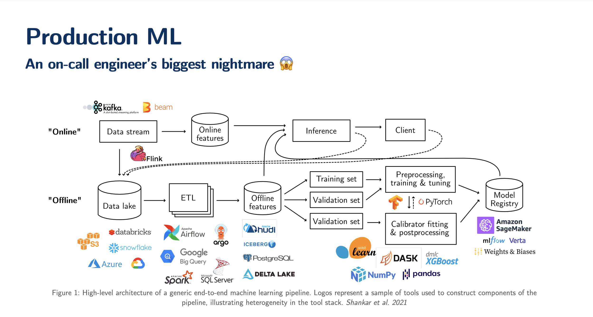
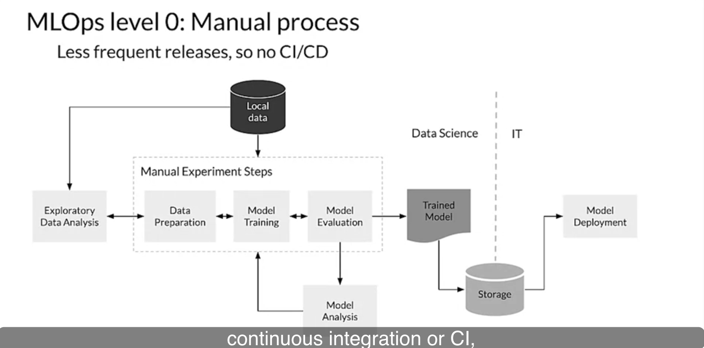
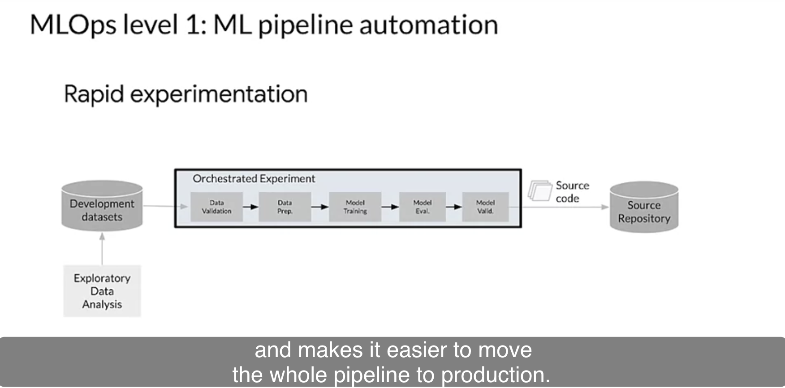
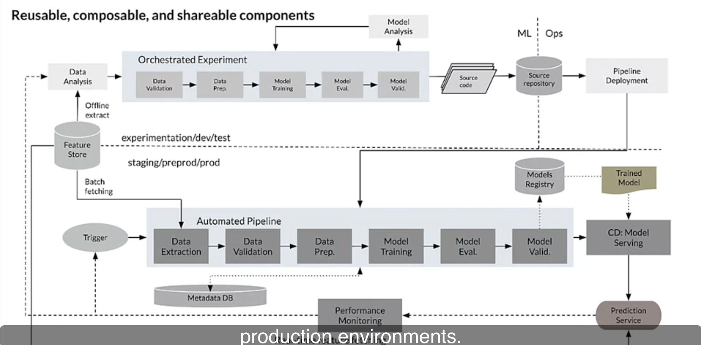
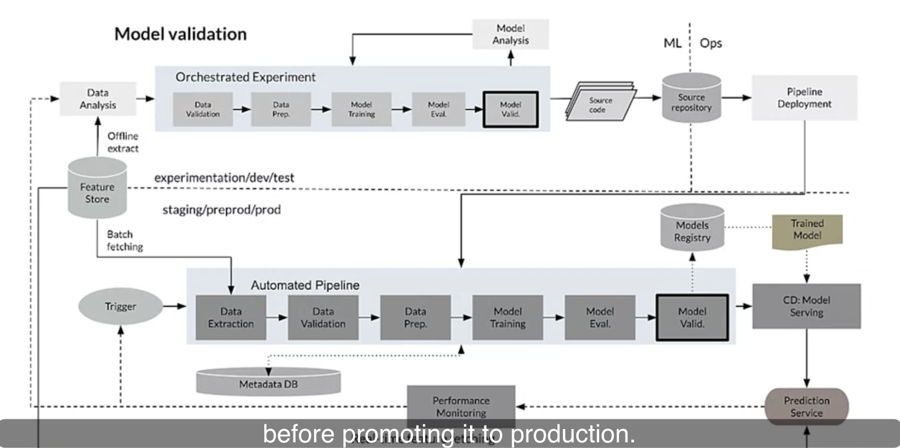
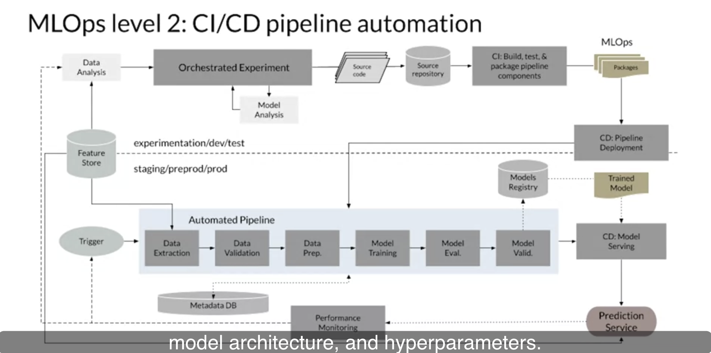
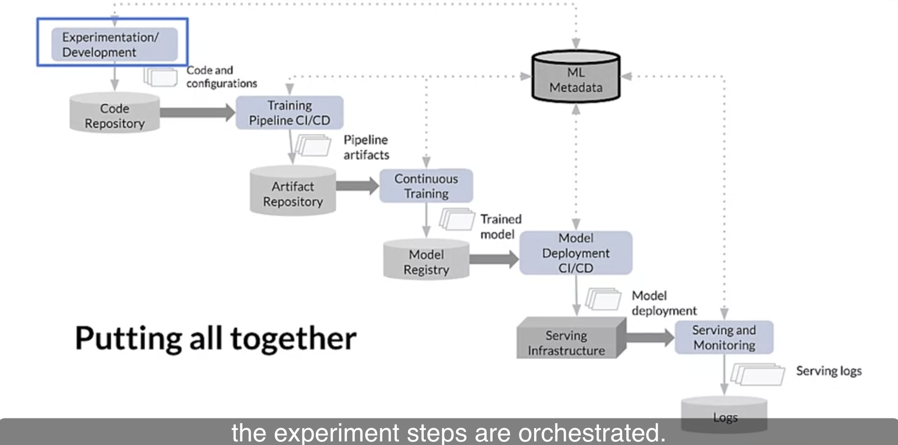
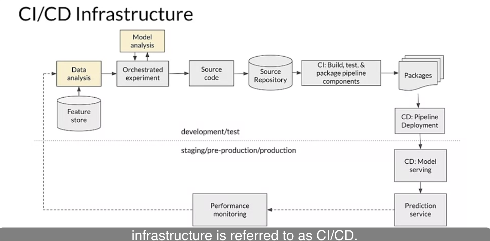

## MLOps interview prep
### Model Deployment
Serving machine learning models as an API is a common approach for integrating ML capabilities into modern software applications. This process helps to simplify the development of applications and has multiple benefits, such as scalability, efficiency, flexibility, and accessibility. Basically, the aim of such an API is to integrate machine learning models into other components of the application, which enables using the predictive power of machine learning in real-time. So, this process allows systems to use the model’s predictions and insights without having to replicate the entire architecture and infrastructure of the model.

If a frontend developer needs to use your ML Model to create an ML powered web application, they would just need to get the URL Endpoint from where the API is being served. These endpoints are URLs that accept HTTP requests and return responses, often in a standardized data format such as JSON or XML. Machine learning models can be consumed as restful APIs. Building API’s has never been easier, thanks to Python and Fast API. We will explore an end-to-end machine learning project, create a restful API for the model and finally containerize the application with Docker.

`FASTAPI`
FastAPI is a modern, fast, and high-performance web framework for building APIs with Python 3.7+ based on standard Python-type hints. It is designed to be easy to use, high-performance, and provide automatic documentation.

- Features:
  - Fast performance: the framework is built on top of Starlette for the web parts and Pydantic for the data parts, making it one of the fastest Python web frameworks available.
  - Automatic API documentation: automatically generates interactive API documentation based on the type annotations and validation rules defined in your code.
  - Built-in async support: supports asynchronous code out of the box, making it easy to build high-performance and scalable applications.
  - Simple and intuitive API: makes it easy to get started and build APIs quickly.
  - Dependency injection system: simplifies sharing code and data between different parts of your application.
- Pros:
  - Fast and efficient, and has excellent performance.
  - Supports async code out of the box: built-in async support makes it easy to build scalable and high-performance applications.
  - Fewer bugs: allows to reduce about 40% of developer-induced errors.
  - Robust: has automatic interactive documentation.
- Cons:
  - Limited community and ecosystem: FastAPI is a relatively new framework, so its community and ecosystem are still developing.
  - Requires Python 3.7 or later.
  - Limited built-in functionality: the focus on performance means that it may not have as much built-in functionality as other frameworks.
  - Is not well-optimized for running ML models.
  - Struggles with handling multiple ML requests simultaneously.

`FLASK`
Flask is a Python-based framework that has become a popular choice for building small to medium-sized web applications as it is designed to be simple and flexible.

- Features:
  - Lightweight and flexible: it is highly customizable and can be used for a wide range of applications.
  - Built-in development server and debugger: makes it easy to test and debug your application.
  - Extensible through a wide range of plugins and extensions: they can be used to extend the functionality of the framework.
  - Supports various templating engines: it will be easy to render dynamic content in your application.
- Pros:
  - Easy to use: has simple API and documentation.
  - Flexible and customizable: suitable for a wide range of applications.
  - Good for small to medium-sized applications: because of its simplicity, Flask is a great choice for building small to medium-sized applications.
  - Great for rapid prototyping and development.
- Cons:
  - Not suitable for large-scale applications: due to its nature, Flask is unsuitable for building large and complex projects.
  - Limited functionality compared to other frameworks: because of its simplicity, Flask may not have as much built-in functionality as other frameworks.
  - Requires additional setup for larger applications.

`Containerize with docker`
Docker is a platform for building, running and shipping applications in a consistent manner. Any application can be run on docker. It basically encapsulates your application and all its dependencies, making it able to run consistently across different environments. This is why it is called containerization.
- Create Docker File
- Create a requirements.txt file
- Build the docker image
- Run the docker container
- Push image to docker hub


`TENSORFLOW SERVING`
TensorFlow Serving is an open-source serving system for machine learning models developed by Google. It is designed to serve machine learning models in production environments, allowing them to be easily deployed and scaled.
- Features:
  - High-performance serving: the framework is optimized for serving machine learning models in production environments, with high performance and low latency.
  - Flexible deployment options: supports a wide range of deployment options, including serving models as a REST API or gRPC service.
  - Built-in model management and versioning: includes built-in model management and versioning, making it easy to manage and deploy different versions of your models.
  - Integration with TensorFlow: integrates seamlessly with TensorFlow, making it easy to serve TensorFlow models in production environments.
- Pros:
  - High performance and low latency: TensorFlow Serving’s performance is optimized for serving machine learning models in production environments, with low latency and high results.
  - Flexible deployment options: TensorFlow Serving supports a wide range of deployment options, making it easy to integrate with existing systems.
  - Built-in model management and versioning: TensorFlow Serving’s built-in model management and versioning make it easy to manage and deploy different versions of your models.
  - Seamless Library Management: you can access domain-specific application packages that extend TensorFlow and look through libraries to build complex models or methodologies.
  - Scalability.
- Cons:
  - Limited to serving machine learning models: TensorFlow Serving is designed specifically for serving machine learning models, so it may not be suitable for other types of applications.
  - Requires more setup and configuration than other frameworks: TensorFlow Serving requires more setup and configuration than other frameworks, which may make it less suitable for small-scale applications.
  - Focused on serving only TensorFlow models.

Prior to serving your ML model as an API, you will need to ensure that it’s trained, tested, and ready to use. This process includes training your model on a suitable dataset, evaluating the performance, and saving it in the right format.
- Train and test your model: Before serving your model, you will need to train and test it on a suitable dataset. This includes choosing a suitable ML algorithm, selecting appropriate features, and tuning hyperparameters. Once the model is trained, you’ll need to evaluate the performance on a test dataset, which will allow you to ensure that the model is accurate and reliable.
- Save your model in a compatible format: After your model is trained and tested, you can save it in a format that can be loaded by your chosen framework. This may involve converting your model to a specific file format. For example, the SavedModel format is required for TensorFlow models and the ONNX format for models that can be used with FastAPI.
- Prepare any necessary pre-processing and post-processing steps: Depending on your particular case, you may need to perform additional pre-processing or post-processing steps on your input or output data. For example, you may need to normalize input data or convert output probabilities to class labels.
- Test your model in the chosen framework: Before deploying the model, the step of testing it on the chosen framework is a must. This will allow ensuring that everything loads and works properly and that your model can make accurate predictions. In a few minutes, we will explain this aspect in more detail.

By following these steps, you can ensure that your model is ready to be served as an API and that it will work reliably in a production environment.
- DEFINING YOUR API ENDPOINTS: An API endpoint is a URL that your application uses to access your model. Basically, it is the code that allows two software programs to communicate with each other. This works by the following principle: when a user sends a request to your API endpoint, the server processes the request and sends the response back to the client. Along with outlining the details of your input and output parameters, it may be necessary to indicate any authentication or security protocols that your API requires. This could involve a requirement for a valid API key or OAuth token to gain access to your API.

- TESTING YOUR API: As was mentioned earlier, it is crucially important to test the API during the development process to ensure that it functions correctly and behaves as expected in various situations. To accomplish this, developers can use different tools such as Postman, Apigee, or the Katalon Platform to submit HTTP requests to the API endpoints and review the corresponding responses. By testing your API thoroughly, you can identify and fix any issues before deploying it for use. This will help you ensure that your API is reliable and efficient and provides functionality that meets your needs and requirements.

- DEPLOYMENT OF YOUR API: When the API is developed and tested, it can be deployed to a server or a cloud-based platform. Deploying your API makes it accessible to users and allows it to be used in production environments. Here are some general steps to follow when deploying your API:
  - Choose a deployment platform: You can choose to deploy your API to a server or a cloud-based platform such as Amazon Web Services, Google Cloud Platform, or Microsoft Azure. Consider factors such as scalability, cost, and ease of use when choosing a deployment platform.
  - Set up the environment: Once you’ve chosen a deployment platform, set up the environment by installing any required dependencies and configuring the server or cloud-based platform.
  - Upload your API code: Upload your API code to the server or cloud-based platform. This can be done by copying the code files to the server or by using a version control system such as Git to push the code to a repository.
  - Configure the API endpoint: Configure the API endpoint on the server or cloud-based platform. This involves specifying the URL for the API endpoint, any required parameters, and any security settings such as authentication and authorization.
  - Test the deployed API: After deploying the API, test it to ensure that it works as expected. You can use the same testing tools, such as Postman that you used during the development phase.
  - Monitor and maintain the API: Once the API is deployed, monitor it to ensure that it is performing well and that it is meeting the required service level agreements (SLAs). You may need to update and maintain the API over time as new features are added or as the underlying technology changes.
By deploying your API, you make it accessible to users and allow it to be used in production environments. This can provide significant benefits such as increased efficiency, scalability, and accessibility.

`MONITORING THE API`
Monitoring the API is an important step that will help you ensure that the whole system performs well and meets your requirements. Here are some of the key things you should monitor:
- API performance
- Error rates
- Resource utilization
- Security
- User behavior
By monitoring the API, you can identify any issues and aspects that need to be improved. Thus, you will ensure that the API provides a smooth and high-quality user experience.
Here you can see the tools that we commonly use at Sciforce:
- Prometheus — is an open-source monitoring solution that with multiple features such as precise alerting, simple operation, efficient storage, and many more.
- Grafana — a tool for data visualіsation with multiple functions that allow sharing insights.
- Sentry — a platform that allows developers to diagnose, fix, and optimize the performance of their code.
- Graphite — an enterprise-ready monitoring tool that allows to store of numeric time-series data and rendering graphs of this data on demand.

### LLM based application


#### git

> https://xosh.org/explain-git-in-simple-words/

> https://eagain.net/articles/git-for-computer-scientists/

> https://learngitbranching.js.org/


```
* git merge feature: on main branch, merge feature onto main

git merge main: on feature branch, move feature to the same commit main was attached to, since feature was an ancestor of main.

* git rebase main : on feature branch, rebase feature on top of main

git rebase feature: on main branch, move main branch ref forward to feature in history, since main was an ancestor of feature.
```




APIs are simply endpoints that accept some sort of input and return some sort of output. Computers just want to share data. And so that’s what an API provides.

REST API. We’ll use the library Flask. Flask is a web framework, which is a fancy way of saying a library with a bunch of helper tools for building web applications.
I will go over how to productionize a Machine Learning model by building a normal website using the Flask web micro-framework.










## Sagemaker
<!-- https://www.analyticsvidhya.com/blog/2020/11/deployment-of-ml-models-in-cloud-aws-sagemaker%E2%80%8Ain-built-algorithms/ -->
Creating a Notebook Instance: The whole process kicks start by creating a notebook instance where a virtual machine(EC2—Elastic cloud) and storage(EBS volume) get allocated for our objective. It is the user’s choice to pick the type & size of the EC2 as well as the capacity of EBS volume. Amazon Elastic Block Store (Amazon EBS) provides block level storage volumes for use with EC2 instances. EBS volumes behave like raw, unformatted block devices. You can mount these volumes as devices on your instances.
`Step1: Creating a Notebook Instance`
`Step2: Loading Datasets, EDA & Train validation split`
`Step3: Dataset upload in S3 bucket`
#boto3 => Pyhton library for calling up AWS services
`Step4: Training Process`
Since we are using in-built algorithms, we need to make a call to those algorithms for training. These algorithms are stored as containers in ECR (Elastic Container Registry) which are maintained for each region. The subsequent step is building the model using the docker container from ECR. Amazon Elastic Container Registry (ECR) is a fully managed container registry that makes it easy to store, manage, share, and deploy your container images and artifacts anywhere. Docker Hub is a service provided by Docker for finding and sharing container images with your team. During the training, the algorithm is accessed from ECR and the datasets are retrieved from the s3 bucket.
`Step5: Model Deployment and Endpoint Creation`
The final step in the whole process is deploying the finalized model and creating an endpoint that will be accessed by external interfaces.
The next step would be to use our own model rather than the one already present in the ECR that comes with Sagemaker.

<!-- https://medium.com/geekculture/84af8989d065 -->
- Training and deploying inside SageMaker , both using SageMaker’s own built-in algorithm containers (pls note these are AWS managed containers).
- Use SageMaker’s (AWS managed) built-in algorithms containers, but customize the training as per needs with our own scripts ( Bring Your Own Model type).


The notebook code does the following.
- Load the model file, open it and test and then upload it to a S3 bucket ( from where SageMaker will take the model artifacts).
- Create a SageMaker model object from the model stored in S3. We will use SageMaker built-in XGBoost container for this purpose, as the model was locally trained with XGBoost algorithm. Depending on the algorithm you use for modelling, you have to properly pick the corresponding built-in container and deal with the nuances associated with that..SageMaker developer guide should help in that.
- Create an Endpoint Configuration. Endpoint is the interface through which the outer world can use a deployed model for predictions. More details about Endpoints can be found in SageMaker documentation.
- Create an Endpoint for the model.
- Invoke the endpoint from within the deployment notebook to confirm the endpoint and the model are working fine.
After running the notebook till this point, you can see the endpoint created under
Sagemaker -> Inference -> Endpoints in AWS console.

The following diagram shows how the deployed model can be called using a server-less AWS architecture. A client script calls an Amazon `API Gateway` API action and passes parameter values. API Gateway is a layer that provides the API to the client. API Gateway passes the parameter values to the `Lambda` function. The Lambda function parses the value and invokes the `SageMaker model endpoint`, passing the parameters to the same. The model performs the prediction task and returns the prediction results to `Lambda`. The Lambda function parses the returned value and sends it back to `API Gateway`. API Gateway responds to the client with that value.

- `Training our model locally/outside SageMaker and then use SageMaker’s built-in algorithm container to just deploy the locally trained model (Bring Your Own Model type ).`
1. In local laptop, use Jupyter notebook and train a XGBoost classification model on the popular Iris flower data set.
2. Test the model and save the model file locally using joblib.
3. In AWS console, create a SageMaker notebook instance and open a Jupyter notebook.
4. Run the iris-model-deployment notebook in SageMaker.
5. Create a IAM role that includes the following policy, which gives your Lambda function permission to invoke a model endpoint.
6. Create a Lambda function with the below mentioned python code, that calls the SageMaker runtime invoke_endpoint and returns the prediction.
7. Create a REST API and integrate with the Lambda function
8. Finally, use Postman App in your laptop, to POST the Iris flower test data to API gateway and get the prediction result back from AWS cloud.


- `Train our model in whatever method / or our own algorithms as we want locally in our container (built and managed by us ) and then bring that container to SageMaker and deploy it for usage (BYOC- Bring Your Own Container).`
<!-- https://towardsdatascience.com/deploying-your-ml-models-to-aws-sagemaker-6948439f48e1 -->
It starts with putting your tarballed ML models into an AWS `S3 bucket`. Then you deploy your `Docker image` to `AWS ECR`, which will be consumed by your `SageMaker`. Docker is used to package your ML inference logic code into a containerized environment. SageMaker will also consume your models in S3 as well. As a client, you only interact with the SageMaker endpoint, which downloads your models from S3 first and invokes your ML inference code from ECR.

In summary, the idea is to create a docker container and deploy it to AWS ECR and create a SageMaker instance to use the ECR image. I hope you find this explanation and the attached code useful but it’s worth mentioning that this whole interaction with SageMaker was quite frustrating.

`Machine Learning Serverlessly Using AWS Lambda, Docker, ECR, S3 and API Gateway`
<!-- https://towardsdatascience.com/machine-learning-serverlessly-1a532685fa7c -->
We chose a serverless architecture so that we don’t have to provision, run and maintain servers but instead focus on developing a user-friendly application.


## Docker
> https://github.com/https-deeplearning-ai/machine-learning-engineering-for-production-public/blob/main/course4/week1-ungraded-labs/C4_W1_Lab_1_Docker_Intro.md

These ungraded labs will be using [Docker](https://www.docker.com/) extensively. As a result of this, most of them will **require you to run the code in your local machine as Coursera currently has no support for Docker**.

### Why Docker?
Docker is an amazing tool that allows you to **ship your software along with all of its dependencies**. This is great because it enables you to run software even without installing the required interpreters or compilers for it to run.

Let's use an example to explain this better:

Suppose you trained a Deep Learning model using Python along with some libraries such as Tensorflow or JAX. For this you created a virtual environment in your local machine. Everything works fine but now you want to share this model with a colleague of yours who does not have Python installed, much less any of the required libraries.

In a pre-Docker world your
colleague would have to install all of this software just to run your model. Instead by installing Docker you can share a Docker image that includes all of your software and that will be all that is needed.

### Some key concepts

You just read about Docker images and might be wondering what they are. Now you will be introduced to three key concepts to understand how Docker works. These are **Dockerfiles**, **images** and **containers**, and will be explained in this order as each one uses the previous ones.


- `Dockerfile`: This is a special file that contains all of the instructions required to build an image. These instructions can be anything from "install Python version 3.7" to "copy my code inside the image".

- `Image`: This refers to the collection of all your software in one single place. Using the previous example, the image will include Python, Tensorflow, JAX and your code. This will be achieved by setting the appropriate instructions within the Dockerfile.
- `Container`: This a running instance of an image. Images by themselves don't do much aside from saving the information of your code and its dependencies. You need to run a container out of them to actually run the code within. Containers are usually meant to perform a single task but they can be used as runtimes to run software that you haven't installed.

Now that you have a high level idea of how Docker works it is time for you to install it. If you already have it installed you can skip most of the following items.

------

<!-- https://medium.datadriveninvestor.com/build-and-deploy-your-machine-learning-application-with-docker-f6ec5acdf2ff -->
<!-- https://github.com/raja-surya/aws-deployment-1/blob/main/Iris-model-deployment.ipynb -->
Create `Dockerfile` (txt file) -> Build `Docker Image` (docker build) -> Create `Docker Container` (docker run/docker ps) -> Serve as containers for your application
`Docker` is a tool that makes it easier to create, deploy, and run any application by using what is called a container. It’s also a software platform, which is used to create Docker images that will be referred to as a Docker container once it’s been deployed.
A `Docker Container` is an isolated environment which contains all the required dependencies for your application to run, it is often referred to as a running instance of a Docker image.
a Docker Image is a read-only file that contains our application along with the dependencies (like a blueprint) and a Docker container is a running image (we can run a number of containers using one image)
A `Docker Image` is a file(read-only), comprised of multiple layers, that is used to execute code in a Docker container. Docker images are found in a large hub which is referred to as Docker Hub. So you pull images from the hub or you build a custom image from a base image and when these images are being executed they serve as containers for your application.
So combining the pieces together we can simply define `Docker` as:
A Software platform which makes it easier to create and deploy any application by creating a Docker image which will then be a Docker container which contains all the dependencies and packages we need for our application to work once it’s been deployed.
`Benefits of Docker`
- Docker solves the problem of having an identical environment across various stages of development and having isolated environments in your individual applications.
- Docker allows you to run your application from anywhere as long as you have docker installed on that machine.
- Docker gives you the liberty to scale up quickly.
- Expand your development team painlessly.
A `Dockerfile` is a text file that defines a Docker image. You’ll use a Dockerfile to create your own custom Docker image when the base image you want to use for your project doesn’t meet your required needs.

Deploy that dockerized image to the cloud with AWS using `AWS EC2` instance
<!-- https://medium.datadriveninvestor.com/dockerize-and-deploy-your-machine-learning-application-on-aws-e2537bd3df21 -->
They talk of launching a AWS EC2 instance to host our own Flask App and ML model; where a client (browser) would be used to send the test data to the flask server hosted on EC2, which in turn invokes the model hosted on the same EC2 to get the prediction and then sends the prediction result to the client.

push your image to `Docker Hub` (container registry) -> Setting up `AWS EC2` -> Run the `Docker Image` on the `EC2`
<!-- https://www.machinelearningplus.com/deployment/deploy-ml-model-aws-ec2-instance/ -->
<!-- https://blog.dataiku.com/how-to-perform-basic-ml-serving-with-python-docker-kubernetes -->
<!-- https://levelup.gitconnected.com/deploy-your-machine-learning-model-as-a-rest-api-on-aws-english-dcb1a0db3110 -->
- Setting up `AWS EC2`
- Create a Key Pair
A key pair is a file that is needed to connect to your AWS instance.
- Create a new security group in the Configure Security Group section.
A security group lets us control who can send requests to the server (instance).
- Connect to AWS EC2 instance using ssh
The SSH allows me to connect to my instance on my machine and the HTTP routes my server IP to the DNS for me to make the DNS accessible anywhere.
- Move your files (project folder) to AWS Ec2 using Secure Copy (scp)
- Install the necessary packages and run app.py to start the app
- Run app
Once the packages are installed, cd to the flask_classification directory and run python app.py. This should start the app and make it run from Amazon EC2 instance. Below is an intermediate example of just loading the model in the Flask App. If you want to learn a little bit more about Flask, try this out. If you just want to get to the Docker and Kubernetes goodness, skip ahead.
`OR`
Wrapping the inference logic into a `flask` application. Using `docker` to containerize the flask application. Hosting the docker container on an AWS ec2 instance and consuming the web-service.
- Run the `Docker Image` on the `EC2` instance
SSH to your EC2 instance on your machine
update your instance packages
Install Docker
After installation, pull the docker image we pushed to the repository.
sudo service docker start to docker daemon running
Then pull the image again

```python
$ docker run -it -p 5000:8080 serve-sklearn:0.1 python3 app.py
```

So `docker run` creates and starts our container and then executes the command python3 app.py which starts our Flask application.

- Push your Docker image to ECR
We’ll start by pushing the freshly created Docker image to Amazon Elastic Container Registry (ECR) which will store our image. Once the image is uploaded, open the AWS console and go to ECR and click on Repositories in the left pane. Then select the image you just uploaded and copy the Repository URI at the top of the page.
- Upload Model Artifacts to S3
As discussed before, the Docker image only contains the inference environment and code, not the trained serialized model. The serialized trained model files, called model artifacts on Sagemaker, will be stored in a separate S3 bucket.
- Setting Up the Image in Sagemaker
Model Creation (IAM role, ECR URI and S3 URL)
Endpoint configuration
Endpoint creation
- Create an API endpoint with Chalice
Once the Sagemaker endpoint is created, you can access the model from within your AWS account by using the AWS CLI or, for example, the AWS Python SDK (Boto3). This is fine if you want to perform some internal testing, but we want to make it available to the outside world, so we’ll have to create an API. This can be easily achieved using Amazon’s Chalice library. It’s a microframework that allows quick creation and deployment of apps on AWS lambda and simplifies the creation of an API. The main function of this code is to invoke your Sagemaker endpoint when a POST request with data is sent to your API, and return the response. You can now use that endpoint URL to perform requests.

<!-- https://towardsdatascience.com/simple-way-to-deploy-machine-learning-models-to-cloud-fd58b771fdcf -->
- `Wrapping the inference logic into a flask web service`
- `Using docker to containerize the flask service (app, requirement, model files)`
```Dockerfile
FROM python:3.6-slim
COPY ./app.py /deploy/
COPY ./requirements.txt /deploy/
COPY ./iris_trained_model.pkl /deploy/
WORKDIR /deploy/
RUN pip install -r requirements.txt
EXPOSE 80
ENTRYPOINT ["python", "app.py"]
```
build docker image
run docker
- `Hosting the docker container on an AWS ec2 instance`
What happens if we need to build an architectural ecosystem around the service that needs to be available, automated and scalable?
We will now ssh into the ec2 machine from our local system terminal using the command with the field public-dns-name replaced with your ec2 instance name and the path of the key pair pem file you saved earlier.
we will build the docker image within the ec2 instance
copy the files we need to build the docker image within the ec2 instance.


## Kubernetes / Kubeflow
> https://github.com/https-deeplearning-ai/machine-learning-engineering-for-production-public/tree/main/course4/week2-ungraded-labs/C4_W2_Lab_2_Intro_to_Kubernetes

`What can Kubernetes do for you?`
- With modern web services, users expect applications to be available 24/7, and developers expect to deploy new versions of those applications several times a day. Containerization helps package software to serve these goals, enabling applications to be released and updated without downtime. Kubernetes helps you make sure those containerized applications run where and when you want, and helps them find the resources and tools they need to work. Kubernetes is a production-ready, open source platform designed with Google's accumulated experience in container orchestration, combined with best-of-breed ideas from the community.

`What is Kubeflow?`
- The Kubeflow project is dedicated to making deployments of machine learning (ML) workflows on Kubernetes simple, portable and scalable. Our goal is not to recreate other services, but to provide a straightforward way to deploy best-of-breed open-source systems for ML to diverse infrastructures. Anywhere you are running Kubernetes, you should be able to run Kubeflow.
- `Kubeflow Pipelines` is a comprehensive solution for deploying and managing end-to-end ML workflows. Use Kubeflow Pipelines for rapid and reliable experimentation. You can schedule and compare runs, and examine detailed reports on each run.


- `Docker` (and containers in general) solve the problem of packaging an application and its dependencies. This makes it easy to ship and run everywhere.
- `Kubernetes` is one layer of abstraction above containers. It is a distributed system that controls/manages containers.
<!-- https://opensource.com/article/20/9/deep-learning-model-kubernetes -->
we used a saved version of our model to score records. We created a batch job to get predictions periodically. Now, we want to return predictions in real time. In order to do that, we will deploy our model as a REST API.
Enterprise computing is moving to Kubernetes, and Kubeflow has long been talked about as the platform to solve MLOps at scale.

you created a deep learning model to be served as a REST API using Flask. It put the application inside a Docker container, uploaded the container to Docker Hub, and deployed it with Kubernetes. Then, with just a few commands, Kubermatic Kubernetes Platform deployed the app and exposed it to the world. deploying machine learning (ML) models into production environments is to expose these models as `RESTful API microservices`, hosted from within `Docker containers`. These `microservices` can then be deployed to a `cloud environment` for handling everything required for maintaining continuous availability. `Kubernetes` is a `container orchestration` platform that provides a mechanism for defining entire microservice-based application deployment topologies and their service-level requirements for maintaining continuous availability.

py-flask-ml-rest-api/
 | Dockerfile
 | api.py ## Needs to be altered according to your requirements and ML model

| api.py
| base
  | namespace.yaml
  | deployment.yaml
  | service.yaml
  | kustomize.yaml
| Dockerfile

 Pushing the Docker Image to Container Registry.
 When your Docker file is built and pushed to Container Registry, you are done with containerizing the ML model.

<!-- https://medium.com/analytics-vidhya/mlops-dockers-and-kubernetes-essentials-for-a-data-scientist-8bc7b5866957 -->
`Deploy the ML App in the Kubernetes Cluster`
Here are the overall steps again:
- Create the machine learning model using Tensorflow.
- Create an ML app using Streamlit framework.
- Create a docker file and the image.
- Push the image to a registry.
- In Kubernetes create a pod. The pod is a just a wrapper which contains the container.
- Deploy the pod and expose the service port.

The deployment can be carried out in 2 ways.
- Declarative approach-Using YAML
- Imperative approach-CLI — Kubectl

`How to deploy a pod in a Kubernetes cluster?`
- Create the configuration file in YAML.
- Post the file to the API server.
- Verify the configuration YAML file.
- Scheduler deploys the POD in the cluster.

<!-- https://towardsdatascience.com/machine-learning-with-docker-and-kubernetes-training-models-cbe33a08c999 -->


## References

AWS:
> https://medium.com/swlh/deploying-a-machine-learning-model-on-aws-432fd5e13507


> https://github.com/https-deeplearning-ai/machine-learning-engineering-for-production-public/blob/main/course4/week1-ungraded-labs/C4_W1_Optional_Lab_1_XGBoost_CAIP/C4_W1_Optional_Lab_1.md

> https://github.com/https-deeplearning-ai/machine-learning-engineering-for-production-public/blob/main/course4/week1-ungraded-labs/C4_W1_Lab_2_TFS_Docker.md

> https://colab.research.google.com/github/https-deeplearning-ai/machine-learning-engineering-for-production-public/blob/main/course4/week1-ungraded-labs/C4_W1_Lab_3_TFS.ipynb

> https://github.com/https-deeplearning-ai/machine-learning-engineering-for-production-public/blob/main/course4/week2-ungraded-labs/C4_W2_Lab_1_FastAPI_Docker/README.md

> https://www.coursera.org/learn/deploying-machine-learning-models-in-production/supplement/QdrD7/explore-kubernetes-and-kubeflow

> https://github.com/https-deeplearning-ai/machine-learning-engineering-for-production-public/blob/main/course4/week2-ungraded-labs/C4_W2_Lab_3_Latency_Test_Compose/README.md

> https://www.coursera.org/learn/deploying-machine-learning-models-in-production/supplement/M89mB/experiment-tracking

> https://neptune.ai/blog/experiment-management

> https://github.com/visenger/awesome-mlops

> https://neptune.ai/blog/mlops

> https://colab.research.google.com/github/https-deeplearning-ai/machine-learning-engineering-for-production-public/blob/main/course4/week3-ungraded-labs/C4_W3_Lab_1_Intro_to_KFP/C4_W3_Lab_1_Kubeflow_Pipelines.ipynb

> https://cloud.google.com/architecture/architecture-for-mlops-using-tfx-kubeflow-pipelines-and-cloud-build

> https://github.com/https-deeplearning-ai/machine-learning-engineering-for-production-public/blob/main/course4/week3-ungraded-labs/C4_W3_Lab_3_TFS_Model_Versioning/README.md

> https://neptune.ai/blog/machine-learning-model-management

> https://github.com/https-deeplearning-ai/machine-learning-engineering-for-production-public/blob/main/course4/week3-ungraded-labs/C4_W3_Lab_4_Github_Actions/README.md

> https://towardsdatascience.com/machine-learning-experiment-tracking-93b796e501b0

> https://towardsdatascience.com/kubernetes-application-deployment-with-aws-eks-and-ecr-4600e11b2d3c


> https://lynnlangit.medium.com/scaling-custom-machine-learning-on-aws-d9dc7edfbff9

> https://lynnlangit.medium.com/scaling-custom-machine-learning-on-aws-part-2-emr-6dfc3cd91a1f

> https://lynnlangit.medium.com/scaling-custom-machine-learning-on-aws-part-3-kubernetes-5427d96f825b
