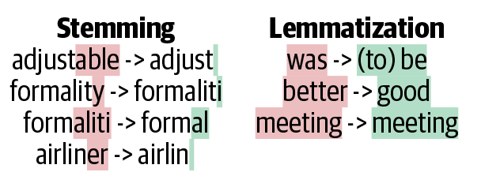
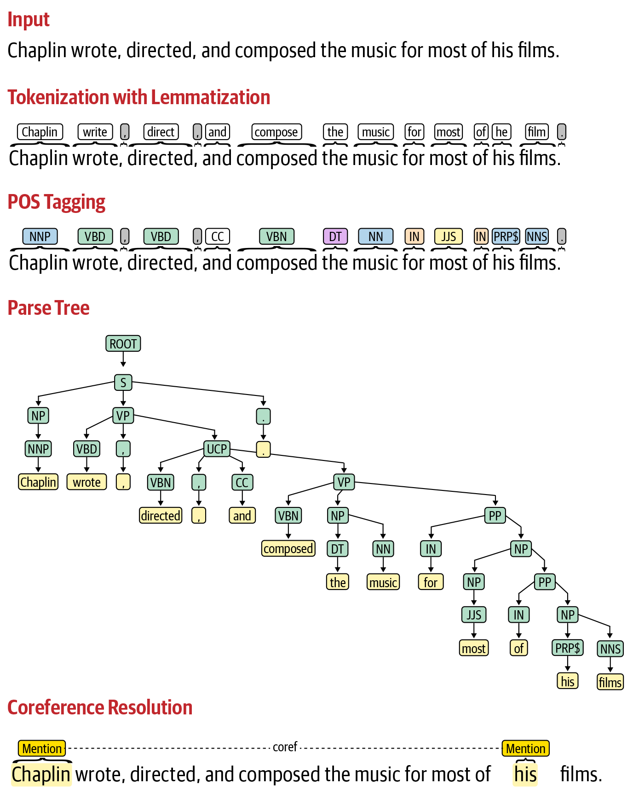

## Natural Language Processing

*** Intuitive Comparison of Four NLP Models - Neural Network, RNN, CNN, and LSTM ***
> https://alibabacloud.com/blog/599283

*** How LSTM networks solve the problem of vanishing gradients ***
> https://medium.datadriveninvestor.com/how-do-lstm-networks-solve-the-problem-of-vanishing-gradients-a6784971a577

*** Exploding and Vanishing Gradients ***
https://www.cs.toronto.edu/~rgrosse/courses/csc321_2017/readings/L15%20Exploding%20and%20Vanishing%20Gradients.pdf

https://towardsdatascience.com/the-exploding-and-vanishing-gradients-problem-in-time-series-6b87d558d22

*** Recommendation Systems ***
> https://towardsdatascience.com/recommendation-systems-in-the-real-world-51e3948772f3


`Neural Network`
Cons: The fixed window may be too small. we will ignore the context in the rest of the sentence.

`-> RNN`
Pros: It can handle any length of the input, which solves the problem of the fixed window size of the neural network.
Cons: Vanishing Gradient Problem: Vanishing gradient problem refers to the phenomenon that the earlier hidden state has less influence on the final hidden state, thus weakening the influence of the earlier word on the whole context.

`-> LSTM`
Pros: choose the information to forget from the previous state and what information to remember from the current state. All this information is stored in a new state called the cell state, which serves to carry past information since it should be remembered.
Cons: Like RNN, LSTM fails to solve the parallelization problem of RNN, as each hidden state and cell state must be calculated before the next hidden state and cell state are calculated. This also means LSTM takes longer to train and requires more memory.
Both RNN and LSTM have described one direction: from left to right. This means we lack the context of words we have not seen yet

`-> Add an Attention Layer to LSTM`
Pros: the use of transformers can outperform previous models. This is likely to be the case because of the standardized importance of each word.

`-> CNN`
Pros: although the simple CNN static model has little fine-tuning of its parameters, it can perform well even compared to more complex deep learning models (including some RNN models).
Parallel processing becomes possible. This is a more agile and efficient model than RNN.
Cons: Padding is required before the first word and after the last word or the model to accept all words.

`activation function`
In neural networks, an activation function is a non-linear function applied to the output of a neuron or a set of neurons. It allows the neural network to learn and model non-linear relationships between inputs and outputs.

Sigmoid Function: This function is often used in the output layer of a neural network for binary classification tasks because it maps any input to a value between 0 and 1. It can also be used in the hidden layers of a neural network, but its use is less common because it can suffer from the "vanishing gradient" problem, where the gradient becomes very small for large or small input values, leading to slow convergence during training.

ReLU (Rectified Linear Unit) Function: This function is commonly used in the hidden layers of a neural network because it is computationally efficient and can help avoid the vanishing gradient problem. However, it can suffer from the "dying ReLU" problem where neurons can become permanently inactive if the input is negative.

Tanh (Hyperbolic Tangent) Function: This function is similar to the sigmoid function but is centered at 0, which can make training more efficient. It can be used in the hidden layers of a neural network, but its use is less common than ReLU because it is computationally more expensive.

Softmax Function: This function is used in the output layer of a neural network for multiclass classification tasks. It maps the inputs to a probability distribution over the classes.

Leaky ReLU Function: This function is a modified version of the ReLU function that avoids the "dying ReLU" problem where neurons can become permanently inactive. It allows for a small negative output for negative inputs.

`Gradient vanishing and exploding`
Gradient vanishing and exploding are two common problems that can occur during the process of training deep neural networks.

Gradient vanishing occurs when the gradients of the loss function with respect to the parameters of the network become very small as they are propagated backwards through the network. This can happen when the network is very deep, and the gradients become smaller and smaller as they are multiplied by the weights of each layer. When the gradients become too small, it becomes difficult to update the weights, and the network can become stuck in a suboptimal solution.

Gradient exploding, on the other hand, occurs when the gradients become very large and unstable during backpropagation. This can happen when the weights of the network are initialized to very large values or when the learning rate is too high. When the gradients become too large, the network can overshoot the optimal solution and become unstable, making it difficult to train.

Both of these problems can make it difficult to train deep neural networks effectively, and researchers have developed various techniques to mitigate them. For example, gradient clipping can be used to limit the magnitude of the gradients during training, while initialization techniques such as Xavier initialization can help to prevent gradient exploding.

### NLP Pipeline ### 
This step-by-step processing of text is known as a pipeline. Note that, in the real world, the process may not always be linear as it’s shown in the pipeline in Figure 2-1; it often involves going back and forth between individual steps (e.g., between feature extraction and modeling, modeling and evaluation, and so on). Also, there are loops in between, most commonly going from evaluation to pre-processing, feature engineering, modeling, and back to evaluation. There is also an overall loop that goes from monitoring to data acquisition, but this loop happens at the project level.


***Data Acquisition***
- Use a public dataset
- Scrape data
    - Scrape the data from there and get it labeled by human annotators.
- Product intervention
- Data augmentation
- Synonym replacement
- Back translation
    - Say we have a sentence, S1, in English. We use a machine-translation library like Google Translate to translate it into some other language—say, German. Let the corresponding sentence in German be S2. Now, we’ll use the machine-translation library again to translate back to English. Let the output sentence be S3. We’ll find that S1 and S3 are very similar in meaning but are slight variations of each other. Now we can add S3 to our dataset. This trick works beautifully for text classification.
- Replacing entities
- Adding noise to data
    - In many NLP applications, the incoming data contains spelling mistakes. This is primarily due to characteristics of the platform where the data is being generated (for example, Twitter). In such cases, we can add a bit of noise to data to train robust models. 
- Advanced techniques
    - Snorkel
    - Active learning

***Text Extraction and Cleanup***
- HTML Parsing and Cleanup
- Unicode Normalization
- Spelling Correction
    - In the world of fast typing and fat-finger typing [6], incoming text data often has spelling errors. shorthand text messages in social microblogs often hinder language processing and context understanding.
- System-Specific Error Correction
    - The pipeline in this case starts with extraction of plain text from PDF documents. However, different PDF documents are encoded differently, and sometimes, we may not be able to extract the full text, or the structure of the text may get messed up. Text extraction from scanned documents is typically done through optical character recognition (OCR), using libraries such as Tesseract [25, 26].

***Pre-Processing***
However, all NLP software typically works at the sentence level and expects a separation of words at the minimum. So, we need some way to split a text into words and sentences before proceeding further in a processing pipeline. Sometimes, we need to remove special characters and digits, and sometimes, we don’t care whether a word is in upper or lowercase and want everything in lowercase. Many more decisions like this are made while processing text. Such decisions are addressed during the pre-processing step of the NLP pipeline. Here are some common pre-processing steps used in NLP software:


- Preliminaries
    - Sentence segmentation and word tokenization.
- Frequent steps
    - Stop word removal, stemming and lemmatization, removing digits/punctuation, lowercasing, etc.
    - Stemming refers to the process of removing suffixes and reducing a word to some base form such that all different variants of that word can be represented by the same form (e.g., “car” and “cars” are both reduced to “car”).
    - Lemmatization is the process of mapping all the different forms of a word to its base word, or lemma. While this seems close to the definition of stemming, they are, in fact, different. For example, the adjective “better,” when stemmed, remains the same. However, upon lemmatization, this should become “good,”



- Other steps
    - Normalization, language detection, code mixing, transliteration, etc.
- Advanced processing
    - POS tagging, parsing, coreference resolution, etc.



Remember that not all of these steps are always necessary, and not all of them are performed in the order in which they’re discussed here. For example, if we were to remove digits and punctuation, what is removed first may not matter much. However, we typically lowercase the text before stemming. We also don’t remove tokens or lowercase the text before doing lemmatization because we have to know the part of speech of the word to get its lemma, and that requires all tokens in the sentence to be intact. A good practice to follow is to prepare a sequential list of pre-processing tasks to be done after having a clear understanding of how to process our data.

For example, POS tagging cannot be preceded by stop word removal, lowercasing, etc., as such processing affects POS tagger output by changing the grammatical structure of the sentence. How a particular pre-processing step is helping a given NLP problem is another question that is specific to the application, and it can only be answered with a lot of experimentation. We’ll discuss more specific pre-processing required for different NLP applications in upcoming chapters.

***Feature engineering***
When we use ML methods to perform our modeling step later, we’ll still need a way to feed this pre-processed text into an ML algorithm. Feature engineering refers to the set of methods that will accomplish this task. It’s also referred to as feature extraction. The goal of feature engineering is to capture the characteristics of the text into a numeric vector that can be understood by the ML algorithms. 

It’s very hard to explain a DL model’s prediction, which is a disadvantage in a business-driven use case. For example, when identifying an email as ham or spam, it might be worth knowing which word or phrases played the significant role in making the email ham or spam. While this is easy to do with handcrafted features, it’s not easy in the case of DL models.

***Modeling***
We may have to do many iterations of the model-building process to “build THE model” that gives good performance and is also production-ready. We cover some of the approaches to address this issue here:
- Ensemble and stacking
    - There are two ways of doing this: we can feed one model’s output as input for another model, thus sequentially going from one model to another and obtaining a final output. This is called `model stacking`.i Alternatively, we can also pool predictions from multiple models and make a final prediction. This is called `model ensembling`.
- Better feature engineering
- Transfer learning
    - Transfer learning provides a better initialization, which helps in the downstream tasks, especially when the dataset for the downstream task is smaller. In these cases, transfer learning yields better results than just initializing a downstream model from scratch with random initialization. As an example, for email spam classification, we can use BERT to fine-tune the email dataset.
- Reapplying heuristics


***Evaluation***
Also, evaluations are of two types: `intrinsic` and `extrinsic`. Intrinsic focuses on intermediary objectives, while extrinsic focuses on evaluating performance on the final objective. For example, consider a spam-classification system. The ML metric will be precision and recall, while the business metric will be “the amount of time users spent on a spam email.” `Intrinsic evaluation` will focus on measuring the system performance using precision and recall. `Extrinsic evaluation` will focus on measuring the time a user wasted because a spam email went to their inbox or a genuine email went to their spam folder.

Ranking tasks like information search and retrieval mostly uses ranking-based metrics, such as MRR and MAP, but usual classification metrics can be used, too. In the case of retrieval, we care mainly about recall, so recall at various ranks is calculated. For example, for information retrieval, a common metric is “Recall at rank K”; it looks for the presence of ground truth in top K retrieved results. If present, it’s a success.

***Post-Modeling Phases***
`Deployment`

`Monitoring and model updating`

***Text Representation***
- One-Hot Encoding
    - However, it suffers from a few shortcomings:
    - The size of a one-hot vector is directly proportional to size of the vocabulary, and most real-world corpora have large vocabularies.
    - This representation does not give a fixed-length representation for text
    - It treats words as atomic units and has no notion of (dis)similarity between words.
    - This is known as the out of vocabulary (OOV) problem.
- Bag of Words
    - The key idea behind it is as follows: represent the text under consideration as a bag (collection) of words while ignoring the order and context. The basic intuition behind it is that it assumes that the text belonging to a given class in the dataset is characterized by a unique set of words. If two text pieces have nearly the same words, then they belong to the same bag (class). Thus, by analyzing the words present in a piece of text, one can identify the class (bag) it belongs to.
- Bag of N-Grams
    - It still provides no way to address the OOV problem.
- TF-IDF
    - term frequency–inverse document frequency
    - However, despite the fact that TF-IDF is better than the vectorization methods we saw earlier in terms of capturing similarities between words, it still suffers from the curse of high dimensionality.
    - They’re discrete representations—i.e., they treat language units (words, n-grams, etc.) as atomic units.
    - The feature vectors are sparse and high-dimensional representations.
    - They cannot handle OOV words.

`Distributed Representations`: the vectors in distributional representation are very high dimensional and sparse. This makes them computationally inefficient and hampers learning.
`Embedding`: embedding is a mapping between vector space coming from distributional representation to vector space coming from distributed representation.
- Word Embeddings
    - The Word2vec model is in many ways the dawn of modern-day NLP.
    - Word2vec ensures that the learned word representations are low dimensional (vectors of dimensions 50–500, instead of several thousands, as with previously studied representations in this chapter) and dense (that is, most values in these vectors are non-zero). 
    - To “derive” the meaning of the word, Word2vec uses distributional similarity and distributional hypothesis. That is, it derives the meaning of a word from its context: words that appear in its neighborhood in the text. So, if two different words (often) occur in similar context, then it’s highly likely that their meanings are also similar. Word2vec operationalizes this by projecting the meaning of the words in a vector space where words with similar meanings will tend to cluster together, and words with very different meanings are far from one another.
    - Conceptually, Word2vec takes a large corpus of text as input and “learns” to represent the words in a common vector space based on the contexts in which they appear in the corpus.
- PRE-TRAINED WORD EMBEDDINGS
    - Training your own word embeddings is a pretty expensive process (in terms of both time and computing). Thankfully, for many scenarios, it’s not necessary to train your own embeddings, and using pre-trained word embeddings often suffices.
    - Such embeddings can be thought of as a large collection of key-value pairs, where keys are the words in the vocabulary and values are their corresponding word vectors.
    - various dimensions like d = 25, 50, 100, 200, 300, 600.
    - The higher the score, the more similar the word is to the query word:
    - gensim, also supports training and loading GloVe pre-trained models.
- TRAINING OUR OWN EMBEDDINGS
    - we construct a shallow net (it’s shallow since it has a single hidden layer)
    - One of the most commonly used implementations is gensim [15].
- Going Beyond Words
    - A simple approach is to break the text into constituent words, take the embeddings for individual words, and combine them to form the representation for the text. There are various ways to combine them, the most popular being sum, average, etc.
    - A simple approach that often works is to exclude those words from the feature extraction process so we don’t have to worry about how to get their representations. 
    - Another way to deal with the OOV problem for word embeddings is to create vectors that are initialized randomly, where each component is between –0.25 to +0.25, and continue to use these vectors throughout the application we’re building
    - There are also other approaches that handle the OOV problem by modifying the training process by bringing in characters and other subword-level linguistic components.
    - fastText learns embeddings for words and character n-grams together and views a word’s embedding vector as an aggregation of its constituent character n-grams. This makes it possible to generate embeddings even for words that are not present in the vocabulary.
- Distributed Representations Beyond Words and Characters
    - Word2vec learned representations for words, and we aggregated them to form text representations. fastText learned representations for character n-grams, which were aggregated to form word representations and then text representations.
    - Doc2vec is based on the paragraph vectors framework [21] and is implemented in gensim. This is similar to Word2vec in terms of its general architecture, except that, in addition to the word vectors, it also learns a “paragraph vector” that learns a representation for the full text (i.e., with words in context).
    - Doc2vec was perhaps the first widely accessible implementation for getting an embedding representation for the full text instead of using a combination of individual word vectors.
- Universal Text Representations
    - Neural architectures such as recurrent neural networks (RNNs) and transformers were used to develop large-scale models of language (ELMo [24], BERT [25]), which can be used as pre-trained models to get text representations. The key idea is to leverage “transfer learning”—that is, to learn embeddings on a generic task (like language modeling) on a massive corpus and then fine-tune learnings on task-specific data.
    - However, based on our experience, here are a few important aspects to keep in mind while using them in your project:
    - All text representations are inherently biased based on what they saw in training data.
    - Unlike the basic vectorization approaches, pre-trained embeddings are generally large-sized files (several gigabytes), which may pose problems in certain deployment scenarios.
    - Modeling language for a real-world application is more than capturing the information via word and sentence embeddings. 
    - As we speak, neural text representation is an evolving area in NLP, with rapidly changing state of the art.
- Handcrafted Feature Representations
    - However, in many cases, we do have some domain-specific knowledge about the given NLP problem, which we would like to incorporate into the model we’re building. In such cases, we resort to handcrafted features.
    - These are all examples of commonly used tools where we often need custom features to incorporate domain knowledge.

 For some applications, such as text classification, it’s more common to see vectorization approaches and embeddings as the go-to feature representations for text. For some other applications, such as information extraction, or in the examples we saw in the previous section, it’s more common to look for handcrafted, domain-specific features. Quite often, a hybrid approach that combines both kinds of features are used in practice. 

### Text Classification ### 
Our aim is to provide an overview of some of the most commonly applied techniques along with practical advice on handling different scenarios and decisions that have to be made when building text classification systems in practice. Let’s briefly discuss some of the popular applications before diving into the different approaches to perform text classification. 


Steps 3 through 5 are iterated on to explore different variants of features and classification algorithms and their parameters and to tune the hyperparameters before proceeding to Step 6, deploying the optimal model in production. 

Apart from these, when classification systems are deployed in real-world applications, key performance indicators (KPIs) specific to a given business use case are also used to evaluate their impact and return on investment (ROI). 

 When we say “good” dataset, we mean a dataset that is a true representation of the data we’re likely to see in production. No single approach is known to work universally well on all kinds of data and all classification problems. In the real world, we experiment with multiple approaches, evaluate them, and choose one final approach to deploy in practice. While there are many different ways to do the pre-processing, let’s say we want to do the following: lowercasing and removal of punctuation, digits and any custom strings, and stop words. CountVectorizer in scikit-learn, which is the implementation of the BoW approach. This is not a far-fetched assumption—in industry, we often don’t have the luxury of collecting more data; we have to work with what we have. Two typical approaches are oversampling the instances belonging to minority classes or undersampling the majority class to create a balanced dataset. Reason 3 in our list was: “Perhaps we need a better learning algorithm.” This gives rise to the question: “What is a better learning algorithm?” A general rule of thumb when working with ML approaches is that there is no one algorithm that learns well on all datasets. A common approach is to experiment with various algorithms and compare them. 

***Using Neural Embeddings in Text Classification***
we discussed feature engineering techniques using neural networks, such as word embeddings, character embeddings, and document embeddings. The advantage of using embedding-based features is that they create a dense, low-dimensional feature representation instead of the sparse, high-dimensional structure of BoW/TF-IDF and other such features. 

1. Word Embeddings
    - Loading and pre-processing the text data remains a common step. However, instead of vectorizing the texts using BoW-based features, we’ll now rely on neural embedding models. Here, we’ll use the one from Google [15]. The following code snippet shows how to load this model into Python using gensim. This is a large model that can be seen as a dictionary where the keys are words in the vocabulary and the values are their learned embedding representations. A simple approach is just to average the embeddings for individual words in text. Note that it uses embeddings only for the words that are present in the dictionary. It ignores the words for which embeddings are absent. 
    - there are other pre-trained embedding approaches, such as GloVe, which can be experimented with for this approach. Gensim, which we used in this example, also supports training our own word embeddings if necessary. If we’re working on a custom domain whose vocabulary is remarkably different from that of the pre-trained news embeddings we used here, it would make sense to train our own embeddings to extract features.
    - In order to decide whether to train our own embeddings or use pre-trained embeddings, a good rule of thumb is to compute the vocabulary overlap. If the overlap between the vocabulary of our custom domain and that of pre-trained word embeddings is greater than 80%, pre-trained word embeddings tend to give good results in text classification.
    - An important factor to consider when deploying models with embedding-based feature extraction approaches is that the learned or pre-trained embedding models have to be stored and loaded into memory while using these approaches. If the model itself is bulky (e.g., the pre-trained model we used takes 3.6 GB), we need to factor this into our deployment needs.

2. Subword Embeddings and fastText
    - We discussed fastText embeddings [16] in Chapter 3. They’re based on the idea of enriching word embeddings with subword-level information. Thus, the embedding representation for each word is represented as a sum of the representations of individual character n-grams. While this may seem like a longer process compared to just estimating word-level embeddings, it has two advantages:
        - This approach can handle words that did not appear in training data (OOV).
        - The implementation facilitates extremely fast learning on even very large corpora.
    - However, there’s one concern to keep in mind when using fastText, as was the case with Word2vec embeddings: it uses pre-trained character n-gram embeddings. Thus, when we save the trained model, it carries the entire character n-gram embeddings dictionary with it. This results in a bulky model and can result in engineering issues. fastText is extremely fast to train and very useful for setting up strong baselines. The downside is the model size.
    - However, both of the embedding representations we’ve seen so far learn a representation of words and characters and collect them together to form a text representation.

3. Document Embeddings
    - In the Doc2vec embedding scheme, we learn a direct representation for the entire document (sentence/paragraph) rather than each word. Just as we used word and character embeddings as features for performing text classification, we can also use Doc2vec as a feature representation mechanism.
    - An important point to keep in mind when using Doc2vec is the same as for fastText: if we have to use Doc2vec for feature representation, we have to store the model that learned the representation. While it’s not typically as bulky as fastText, it’s also not as fast to train. Such trade-offs need to be considered and compared before we make a deployment decision.

***Deep Learing for Text Classification***
Over the past few years, it has shown remarkable improvements on standard machine learning tasks, such as image classification, speech recognition, and machine translation.    

Two of the most commonly used neural network architectures for text classification are convolutional neural networks (CNNs) and recurrent neural networks (RNNs). Long short-term memory (LSTM) networks are a popular form of RNNs. Recent approaches also involve starting with large, pre-trained language models and fine-tuning them for the task at hand.

The first step toward training any ML or DL model is to define a feature representation. This step has been relatively straightforward in the approaches we’ve seen so far, with BoW or embedding vectors. However, for neural networks, we need further processing of input vectors, as we saw in Chapter 3. Let’s quickly recap the steps involved in converting training and test data into a format suitable for the neural network input layers:
1. Tokenize the texts and convert them into word index vectors.
2. Pad the text sequences so that all text vectors are of the same length.
```Python
#Vectorize these text samples into a 2D integer tensor using Keras Tokenizer.
#Tokenizer is fit on training data only, and that is used to tokenize both train 
#and test data.
tokenizer = Tokenizer(num_words=MAX_NUM_WORDS)
tokenizer.fit_on_texts(train_texts)
train_sequences = tokenizer.texts_to_sequences(train_texts) 
test_sequences = tokenizer.texts_to_sequences(test_texts)
word_index = tokenizer.word_index
print('Found %s unique tokens.' % len(word_index))
#Converting this to sequences to be fed into neural network. Max seq. len is 
#1000 as set earlier. Initial padding of 0s, until vector is of 
#size MAX_SEQUENCE_LENGTH
trainvalid_data = pad_sequences(train_sequences, maxlen=MAX_SEQUENCE_LENGTH)
test_data = pad_sequences(test_sequences, maxlen=MAX_SEQUENCE_LENGTH)
trainvalid_labels = to_categorical(np.asarray(train_labels))
test_labels = to_categorical(np.asarray(test_labels))
```
3. Map every word index to an embedding vector. We do that by multiplying word index vectors with the embedding matrix. The embedding matrix can either be populated using pre-trained embeddings or it can be trained for embeddings on this corpus.
```Python
embeddings_index = {}
with open(os.path.join(GLOVE_DIR, 'glove.6B.100d.txt')) as f:
    for line in f:
          values = line.split()
          word = values[0]
          coefs = np.asarray(values[1:], dtype='float32')
          embeddings_index[word] = coefs

num_words = min(MAX_NUM_WORDS, len(word_index)) + 1
embedding_matrix = np.zeros((num_words, EMBEDDING_DIM))
for word, i in word_index.items():
    if i > MAX_NUM_WORDS:
          continue
    embedding_vector = embeddings_index.get(word)
    if embedding_vector is not None:
          embedding_matrix[i] = embedding_vector
```
4. Use the output from Step 3 as the input to a neural network architecture.
```Python
embedding_layer = Embedding(num_words, EMBEDDING_DIM,
                        embeddings_initializer=Constant(embedding_matrix),
                        input_length=MAX_SEQUENCE_LENGTH,
                        trainable=False)
print("Preparing of embedding matrix is done")
```

***CNNs for Text Classification***
 In the context of text classification, CNNs can be thought of as learning the most useful bag-of-words/n-grams features instead of taking the entire collection of words/n-grams as features, as we did earlier in this chapter. We’ll define a CNN with three convolution-pooling layers using the Sequential model class in Keras, which allows us to specify DL models as a sequential stack of layers—one after another. training the embedding layer on our own dataset seems to result in better classification on test data. However, if the training data were substantially small, sticking to the pre-trained embeddings, or using the domain adaptation techniques we’ll discuss later in this chapter, would be a better choice.

 ***LSTMs for Text Classification***
 LSTMs and other variants of RNNs in general have become the go-to way of doing neural language modeling in the past few years. This is primarily because language is sequential in nature and RNNs are specialized in working with sequential data. The current word in the sentence depends on its context—the words before and after. However, when we model text using CNNs, this crucial fact is not taken into account. RNNs work on the principle of using this context while learning the language representation or a model of language. Hence, they’re known to work well for NLP tasks. There are also CNN variants that can take such context into account, and CNNs versus RNNs is still an open area of debate. While LSTMs are more powerful in utilizing the sequential nature of text, they’re much more data hungry as compared to CNNs. Thus, the relative lower performance of the LSTM on a dataset need not necessarily be interpreted as a shortcoming of the model itself.

***Text Classification with Large, Pre-Trained Language Models***
These representations have been used successfully for text classification in the recent past by fine-tuning the pre-trained models to the given task and dataset. BERT, which was mentioned in Chapter 3, is a popular model used in this way for text classification.

However, in our experience as industry practitioners, several NLP tasks, especially text classification, still widely use several of the non-DL approaches we described earlier in the chapter. Two primary reasons for this are a lack of the large amounts of task-specific training data that neural networks demand and issues related to computing and deployment costs. in most industrial settings, it always makes sense to start with a simpler, easy-to-deploy approach as your MVP and go from there incrementally, taking customer needs and feasibility into account. Unlike  `heuristics-based approaches` where the predictions can be justified by tracing back the rules applied on the data sample, ML models are treated as a black box while making predictions. However, `in the recent past`, the topic of interpretable ML started to gain prominence, and programs that can “explain” an ML model’s predictions exist now. Let’s take a quick look at their application for text classification.

***Learning with No or Less Data and Adapting to New Domains***
1. No Training Data
    - The first step in such a scenario is creating an annotated dataset where customer complaints are mapped to the set of categories mentioned above. One way to approach this is to get customer service agents to manually label some of the complaints and use that as the training data for our ML model. Another approach is called `“bootstrapping” or “weak supervision.”` We can get started with compiling some such patterns and using their presence or absence in a customer request to label it, thereby creating a small (perhaps noisy) annotated dataset for this classification task. From here, we can build a classifier to annotate a larger collection of data.
    - `Snorkel` [30], a recent software tool developed by Stanford University, is useful for deploying weak supervision for various learning tasks, including classification. Snorkel was used to deploy weak supervision–based text classification models at industrial scale at Google [31]. They showed that weak supervision could create classifiers comparable in quality to those trained on tens of thousands of hand-labeled examples! [32] shows an example of how to use Snorkel to generate training data for text classification using a large amount of unlabeled data.

2. Less Training Data: Active Learning and Domain Adaptation
    - One approach to address such problems is active learning, which is primarily about identifying which data points are more crucial to be used as training data. It helps answer the following question: if we had 1,000 data points but could get only 100 of them labeled, which 100 would we choose? What this means is that, when it comes to training data, not all data points are equal. Some data points are more important as compared to others in determining the quality of the classifier trained. Active learning converts this into a continuous process.
    - Using `active learning` for training a classifier can be described as a step-by-step process:
        - Train the classifier with the available amount of data.
        - Start using the classifier to make predictions on new data.
        - For the data points where the classifier is very unsure of its predictions, send them to human annotators for their correct classification.
        - Include these data points in the existing training data and retrain the model.
    Repeat Steps 1 through 4 until a satisfactory model performance is reached.
    - Tools like `Prodigy` [33] have active learning solutions implemented for text classification and support the efficient usage of active learning to create annotated data and text classification models quickly. The basic idea behind active learning is that the data points where the model is less confident are the data points that contribute most significantly to improving the quality of the model, and therefore only those data points get labeled.
    - Domain adaptation is a method to address such scenarios; this is also called `transfer learning`. Here, we “transfer” what we learned from one domain (source) with large amounts of data to another domain (target) with less labeled data but large amounts of unlabeled data. This approach for `domain adaptation` in text classification can be summarized as follows:
        - Start with a large, pre-trained language model trained on a large dataset of the source domain (e.g., Wikipedia data).
        - Fine-tune this model using the target language’s unlabeled data.
        - Train a classifier on the labeled target domain data by extracting feature representations from the fine-tuned language model from Step 2.


A sample pipeline summarizing these ideas may look like what’s shown in Figure 4-11. We start with no labeled data and use either a public API or a model created with a public dataset or weak supervision as the first baseline model. Once we put this model to production, we’ll get explicit and implicit signals on where it’s working or failing. We use this information to refine our model and active learning to select the best set of instances that need to be labeled. Over time, as we collect more data, we can build more sophisticated and deeper models.

***Practical Advice***
`Establish strong baselines`: However, it’s always good to start with simpler approaches and try to establish strong baselines first. This is useful for three main reasons:
- It helps us get a better understanding of the problem statement and key challenges.
- Building a quick MVP helps us get initial feedback from end users and stakeholders.
- A state-of-the-art research model may give us only a minor improvement compared to the baseline, but it might come with a huge amount of technical debt.

`Balance training data`: Some of them are collecting more data, resampling (undersample from majority classes or oversample from minority classes), and weight balancing.

`Combine models and humans in the loop`: In practical scenarios, it makes sense to combine the outputs of multiple classification models with handcrafted rules from domain experts to achieve the best performance for the business. In other cases, it’s practical to defer the decision to a human evaluator if the machine is not sure of its classification decision.

`Make it work, make it better`:  It is always good to build a model quickly, use it to build a system, then start improvement iterations.

`Use the wisdom of many`: Every text classification algorithm has its own strengths and weaknesses. There is no single algorithm that always works well. One way to circumvent this is via ensembling: training multiple classifiers. The data is passed through every classifier, and the predictions generated are combined (e.g., majority voting) to arrive at a final class prediction.

### NER ###
***Building an NER System***
However, in real-world scenarios, using the trained model by itself won’t be sufficient, as the data keeps changing and new entities keep getting added, and there will also be some domain-specific entities or patterns that were not seen in generic training datasets. Hence, most NER systems deployed in real-world scenarios use a combination of ML models, gazetteers, and some `pattern matching–based heuristics` to improve their performance.

***NER Using an Existing Library***
NER has been well researched over the past few decades, and we have off-the-shelf libraries to start with. Stanford NER [28], spaCy, and AllenNLP [29] are some well-known NLP libraries that can be used to incorporate a pre-trained NER model into a software product.

Considering that spaCy’s NER is `based on a state-of-the-art neural model coupled with some pattern matching and heuristics`, it’s a good starting point. However, we may run into two issues:
1. As mentioned earlier, we may be using NER in a specific domain, and the pre-trained models may not capture the specific nature of our own domain.
2. Sometimes, we may want to add new categories to the NER system without having to collect a large dataset for all the common categories.

***NER Using Active Learning***
From our experience, the best approach to NER when we want customized solutions but don’t want to train everything from scratch is to `start with an off-the-shelf product and either augment it with customized heuristics for our problem domain` (using tools such as RegexNER or EntityRuler) and/or use active learning using tools like `Prodigy` (like we saw in Chapter 4 for text classification). This allows us to improve an `existing pre-trained NER model by manually tagging a few example sentences containing new NER categories or correct a few model predictions manually and use these to retrain the model`. [30] shows some examples of going through this process using Prodigy.

In general, in most cases, we don’t always have to think about developing an NER system from scratch. If we do have to develop an NER system from scratch, the first thing we would need, as we saw in this section, is a large collection of annotated data of sentences where each word/token is tagged with its category (entity type or other). Once such a dataset is available, the next step is to use it to obtain handcrafted and/or neural feature representations and feed them to a sequence labeling model.
`Start with a pre-trained NER model and enhance it with heuristics, active learning, or both.`

NER is very sensitive to the format of its input. It’s more accurate with well-formatted plain text than with, say, a PDF document from which plain text needs to be extracted first. illustrates some of the challenges with PDF-to-text extraction. In PDFs, partial sentences, headings, and formatting are common, and they can all mess up NER accuracy. There’s no single solution for this. One approach is to do custom post-processing of PDFs to extract blobs of text, then run NER on the blobs.

What's so hard about PDF text extraction? ​

> https://filingdb.com/b/pdf-text-extraction

NER is also very sensitive to the accuracy of the prior steps in its processing pipeline: sentence splitting, tokenization, and POS tagging (refer back to Figure 5-2). To understand how improper sentence splitting can result in poor NER results, try taking the content from the screenshot back in Figure 5-1 and looking at the output from spaCy (see the notebook Ch5/NERIssues.ipynb for a short illustration). So, some amount of pre-processing may be necessary before passing a piece of text into an NER model to extract entities.

### To Do ###
https://www.coursera.org/learn/sequence-models-in-nlp/programming/TzwWY/lab

https://www.coursera.org/learn/sequence-models-in-nlp/programming/jjKpq/lab

https://trax-ml.readthedocs.io/en/latest/notebooks/trax_intro.html

https://github.com/jiadaizhao/Advanced-Machine-Learning-Specialization/blob/master/Natural%20Language%20Processing/Week2/week2-NER.ipynb

https://github.com/jiadaizhao/Advanced-Machine-Learning-Specialization/blob/master/Natural%20Language%20Processing/Week3/week3-Embeddings.ipynb

https://github.com/practical-nlp/practical-nlp/blob/master/Ch5/03_NERIssues.ipynb

