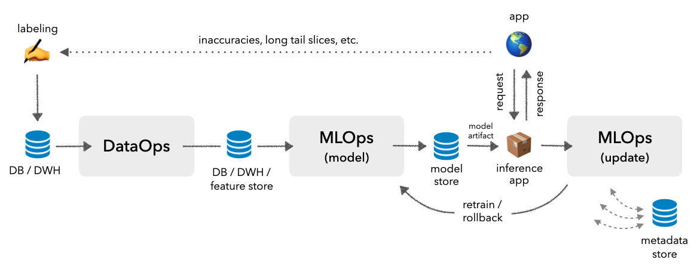
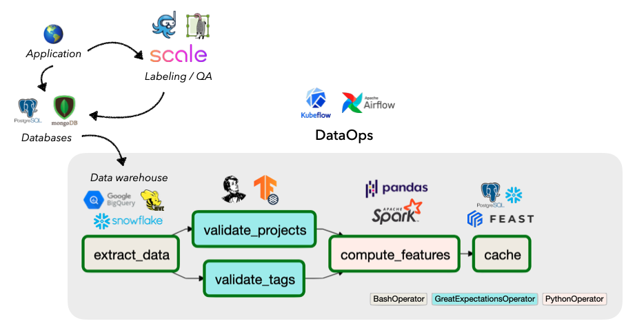
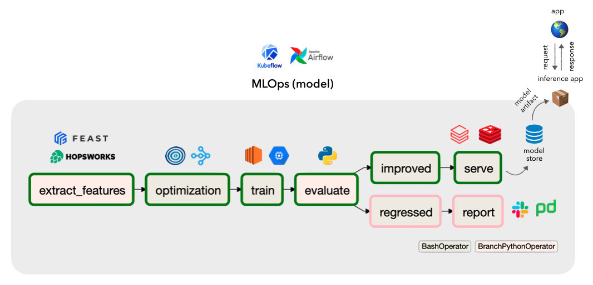
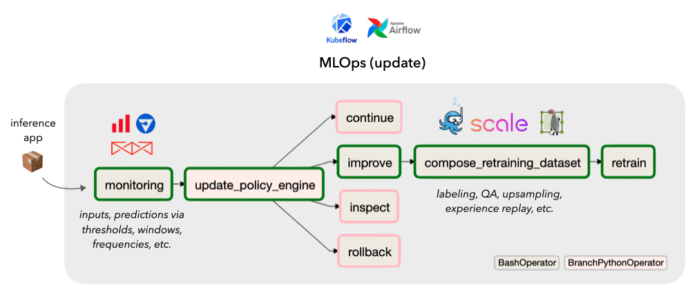

## MLE interview
`面试总结`
> https://zhuanlan.zhihu.com/p/58434325

> https://zhuanlan.zhihu.com/p/82105066

> https://www.zhihu.com/question/56676679

> https://msank00.github.io/blog/

`机器学习面试笔试求职必背！八股文`
> https://zhuanlan.zhihu.com/p/404809298

> https://zhuanlan.zhihu.com/p/405194507

> https://zhuanlan.zhihu.com/p/405197734

> https://blog.csdn.net/qq_18822147/article/details/120243772

> https://www.cnblogs.com/ljygoodgoodstudydaydayup/category/2074962.html

`机器学习八股文`
> https://www.1point3acres.com/bbs/thread-713903-1-1.html
> https://northern-dracopelta-98c.notion.site/5b22e124e16d4b2d937940367ca20eb0?v=19feabb85e9e4b54bc498579b3c7f1c5

> https://www.1point3acres.com/bbs/thread-714090-1-1.html

> https://www.1point3acres.com/bbs/thread-714558-1-1.html

> https://www.zhihu.com/people/is-aze/posts

> https://zhuanlan.zhihu.com/p/405194507

> https://zhuanlan.zhihu.com/p/405196671

> https://zhuanlan.zhihu.com/p/405197734

> https://zhuanlan.zhihu.com/p/405199136

> https://fullstackdeeplearning.com/spring2021/lecture-6/

imbalanced class 看主要优化的目标是啥，可以是 precision, recall, 如果二者兼具的话就是F1.

https://madewithml.com/

https://eugeneyan.com/writing/testing-ml/

https://completedesigninterviewcourse.com/system-design-interview/

到时候把Grokking the Coding Interview: Patterns for Coding Questions也学一下。感觉这两门课，对Machine learning engineer的面试可能就够了（当然，还有机器学习专业方面的你还需要去好好准备）

> https://www.1point3acres.com/bbs/thread-652770-1-1.html

* Grokking the Coding Interview: Patterns for Coding Questions
* Grokking-the-system-design-interview
* Designing Data-intensive Applications
* 【Grokking Dynamic Programming Patterns for Coding Interviews】
* 【Data Structures for Coding Interviews in Java】
* 【Grokking the Object Oriented Design Interview】

### System Design for Recommendations and Search
https://eugeneyan.com/writing/system-design-for-discovery/

1. `The offline environment` largely hosts batch processes such as model training (e.g., representation learning, ranking), creating embeddings for catalog items, and building an approximate nearest neighbors (ANN) index or knowledge graph to find similar items. It may also include loading item and user data into a feature store that is used to augment input data during ranking.
2. `The online environment` then uses the artifacts generated (e.g., ANN indices, knowledge graphs, models, feature stores) to serve individual requests. A typical approach is converting the input item or search query into an embedding, followed by candidate retrieval and ranking. There are also other preprocessing steps (e.g., standardizing queries, tokenization, spell check) and post-processing steps (e.g., filtering undesirable items, business logic) though we won’t discuss them in this writeup.
3. `Candidate retrieval` is a fast—but coarse—step to narrow down millions of items into hundreds of candidates. We trade off precision for efficiency to quickly narrow the search space (e.g., from millions to hundreds, a 99.99% reduction) for the downstream ranking task. Most contemporary retrieval methods convert the input (i.e., item, search query) into an embedding before using ANN to find similar items. Nonetheless, in the examples below, we’ll also see systems using graphs (DoorDash) and decision trees (LinkedIn).
4. `Ranking` is a slower—but more precise—step to score and rank top candidates. As we’re processing fewer items (i.e., hundreds instead of millions), we have room to add features that would have been infeasible in the retrieval step (due to compute and latency constraints). Such features include item and user data, and contextual information. We can also use more sophisticated models with more layers and parameters.

### Amazon
#### 1st Interview

1. Talk about linear regression, why it is called linear?
2. Talk about logistic regression, is it linear?
3. If we can use one non-linear neuron to train a model, why do we need a lot of layers in our model
4. How do we detect if model is overfitting?
5. Talk about one project that you did, what was the objective function, limitations, future scope
6. Decision trees → do they capture non-linearity?
7. Can you use decision tree to make a non-linear boundaries like a quadratic one
8. Explain k-nearest neighbour algo
9. Gates can be implemented in 1 or 2 hidden layers, don't need more layers
    - concept of making gates using neural network

#### 2nd Interview

1. Travelling Salesman Project
    1. Open MP how did you parallelise the algorithm exactly?
    2. why cant you parallelise stuff in python?
    3. Some synchronisation stuff
2. Community Detection Algorithms
    1. what is modularity expression?
    2. What is condition for convergence of modularity based algorithm?
3. Page Rank Project
    1. What is the condition for convergence of page rank?
    2. ergodicity of a matrix
    3. laplacian of a graph
4. Satellite Image
    1. Attention in Images in a CNN
    2. how is attention added in a CNN?
    3. 16 images of a town for the same class, how will you use so many images
        1. wanted to use attention
        2. other methods → random cropping, reshaping, different images in different epochs
    4. Image as word vector can be fed row wise with ordering information
    5. CNN vs Bert of 16 images → what is the difference?
    6. Sequence to Sequence model in Vision Scenario

ML相关问题：Recall/precision tradeoff， SVM VS LR， support vector如何产生的，Kmeans 是什么和什么的tradeoff（问题问的非常无语，答案是k和purity的tradeoff，面试官期望你说出purity这个单词），通过KNN考察bias/variance tradeoff， 以及工作中有没有遇到过模型选择的问题（比如有哪些system constraint，为什么选该模型）

ML depth：主要是presentation，需要做ppt，顺带问了GBDT和XGboost的异同（推荐看一下XGBoost的论文），以及lightGBM和XGboost的异同

Coding：手写一个KNN。找出最受欢迎的topk个商品 （两道题思路是一摸一样的，都是用heap）

第一题，modeling，design buy it again model
https://assets.amazon.science/40/e5/89556a6341eaa3d7dacc074ff24d/buy-it-again-modeling-repeat-purchase-recommendations.pdf?tag=1p3a-api-20

分享一个四月的AS 店面，Deep Learninig 组
自我介绍+why amazon+简历
ML
1) assumption of MSE (clarify 之后发现其实是想问assumption of linear regression， 我就说了linear regression那几个假设，什么linearity, normality 这种的
2) XGBoost 是啥，为啥这东西比其他ensemble model好，fine-tune时候考虑哪些params
DL
1) Transformer & Fully connected Neural net 的区别，优缺点
2) BERT 和 RNN 的区别，优缺点
3) CNN 和 Fully connected Neural net 的区别
4) how to fine-tune a deep learning model (想问fine-tune learning rate, optimizer 这些东西
而酒屋 没写出那个最优解不过也过了

### Microsoft

MS 电面，一个西雅图小哥，没有coding，纯ml探讨，要推写公式。
闲聊了聊自己的项目，推了一遍arcface 的loss，楼主英语表达一般，纯靠公式和画图给面试官讲明白了
聊了聊各个loss function，relu 0处求导怎么办等等
batch norm 作用，公式，batch size 不同时mean值不同怎么处理
l1和l2，公式，作用，特性，推导
最后了简单‍聊了下attention

train的时候把mean保存下来，inference的时候用保存的值. 0处出现的情况极小，可以忽略不计，一旦出现直接取0

比如说如何选择metrics， 对于不 balanced数据怎么办。为什么要用cnn 等等。

### Linkedin

接下来问probability，用什么样的distribution来model这些event最好：扔硬币，掷骰子，接线员下午4-5点接到了10个电话，5-6点会接到几个电话，股票走势等等，可能问了十来个。这里因为不知道要考probability，所以也没有复习到，可能有些没有答对。

再来就是挑一个算法，从头到尾讲。我讲了logistic regression，包括loss function，optimization，regularization。follow-up了两个问题，一是如果MLE换成MAP，求的是什么。二是，为什么logistic regression对于correlated features表现不好。我‍觉得我第二个follow up没答好，也请教各位会如何回答这个问题。

data coding: K means

后来问了一些recommendation system bias的问题。bias有多种，比如positional bias还有online/offline data distribution bias. 另外还问到一些fairness的问题，比如新的creator/post没有很多engagement应该怎么办。

半小时coding，地里出现过多次，如下：
"""
Input:
A method getRandom01Biased() that generates a random integer in [0, 1], where 0 is generated with probability p and 1 is generated
with probability (1-p)
Output:
A method getRandom06Uniform() that generates a random integer in [0, 6] with uniform probability
"""
半小时ML八股文：
比如Logistics Regression怎么estimate coefficents，loss function解释和推导。Decision Tree怎么prune之类的

ML: 一题ML model设计＆问logistic regression推导
coding: 刷题网参六邻

上周刚面完的凌鹰的AI Engineer 岗，现在还不知道结果，先回馈一下版上，同时为自己攒人品。
大概是4月被Recruiter 找到，本来想面staff，无奈recruiter说LinkedIn Senior对标G 和F的Senior, 最后就是面了现在的岗位。
面试大概等了3-4天才安排好，L家是到了最后面试前一天通知你面试官的信息，是个国人小哥，人很nice.
上来显示15-20分钟的工作经历聊天，简单介绍了一下自己的项目，找了找共同点。
然后是第二轮写码，是地理和蠡口超高频 三路领。大概确认了一下没有额外的变数，大概10分钟做完。
之后是第二部分机器学习八股。涉及到了各个方面，线性回归，逻辑回归，regularization L1和L2区别，表达式。随机森林和GBDT区别，scale和transform对它的影响。如何处理overfitting, 如何处理imbalanced dataset, 什么是unsupervised learning. 涉及的内容很细，但是并没有其他版友碰到的推公式的地步。如果是想复习机器学习基本概念，包括公式推导，楼主最近看了一个知乎叫 阿泽的 复旦计算机博主总结的 经典机器学习的各种知识点，从逻辑回归，到PCA， 树模型，甚至到XGBOOST和LIGHTGBM的公式都有。觉得受益匪浅。‍‌‌‍‌‍‌‍‍‌
保佑自己🙏🏻，同时也希望能帮助到大家。

### Twitter
coding部分：
1. 给出一些tweets，找出meaningful的组：很open的问题，要自己定义什么是meaningful，tweets的有用的features
问了如何encode tweets，用Bert有什么好处之类的
我先说了特别简单的one-hot / tf-idf / word2vec 提了一嘴可以train your own version of embedding用word2vec或者bert
2. Clustering有哪些算法，我说我只知道kmeans，然后就是kmeans的实现，可以用numpy，pandas之‍‌‌‍‌‍‌‍‍‌类的数据处理的包

### Others

5) ML Sys Design
Build and serve a DL model with given feature engineering logics
a) how to distributed training
b) online batch inferencingn
c) online real-time inferencing, includes data flow design
d) completeness of all pipelines and how to guarantee consistency of batching inferencing and real-time inferencing.

第一个面官问了linear regression的各种，还有各种Optimizer。哎，各种oprimizer的区别，我真的只有考试前背过一下，后来就再也没看过。由于签了NDA, 不详细展开了，大家可以参考往这方面复习。
第二轮跟面官一起解决一个ml的问题，期间他提到能不能用image features加入现有model. 因为楼主自己做过structured feature + free text + image的multi-modality model, 我说根据我的经验，加入Image embedding效果不会提升太多。（可能我是不是不应该跟面试官唱反调，而应该顺着他的意思来回答？但因为我正好做过类似Model，加了图像确实效果提升很小，所以就直接脱口而出了。）然后就开始聊的很不顺利。

KL divergence 和 maximum likelihood的关系，SVM实现，LSTM vs transformer

第一轮店面， Alien Dictionary
和三个ml问题，有一个是logistic regression, random forest, LSTM, NN 哪些是linear的
其他两个问题不太记得了， 很简单

第二轮店面，手写precision, recall， 和三个ml问题：
1. sigmoid, relu哪个能解决gradient的啥问题
2. AUC ?

ML基础，考了多标签和多任务，loss func的不同。最后问了解决过拟合的办法。

问的其实都是非常基础的ML问题：model evaluation, precision&recall, ROC, AUC, logistic regression, comments on different methods such as decision tree, logistic regression, SVM, neural network.

1. 他问我AUC该如何理解，我就说AUC越大越好，确实不知道有什么解释。他又问是不是说AUC=1就比AUC=0好？我觉得是肯定的
2. AUC=0.7意味着什么？如何跟别人解释这个prediction？我答不上来，只说model挺好，比0.5好。
3. 两个不同的models，binary classification的gap一个小一个大，哪个AUC大？我犹豫了一会说是gap大的那个，也没解释。
4. logistic regression跟linear regression的比较。没答上来，我就说两个差不多。logistic不就是linear加了个sigmoid activation吗？还有啥？
5. high level评价一下各种方法(就是我上面写的那几个)？该用哪个？我毫无准备，就简要说了一下各个方法存在的问题，并没有对他们比较。感觉答的很失败。

上上周我参加了Uber MLE L4的onsite。一共四轮，一轮系统设计（bar raiser），一轮BQ，一轮ML coding 以及一轮general coding。
1. 系统设计：设计一个uber eats的餐厅推荐系统。 都可以，基本上还是讲架构和模型。使用什么的模型架构，数据怎么使用，怎么分割数据，怎么制作负样本。对于底层不是特别的关心。感谢！有信心了！最怕架构 database, in memory cache, message queue, 这些都不会
2. ML coding：实现Kmeans，允许使用numpy。
3. General coding：L‍‌‌‍‌‍‌‍‍‌C399
4. BQ：经典BQ问题

ML CASE: 每一个用户在app ui上会看到一个视频矩阵， 每一行是一个channel, 每一行的内容是这个channel下推荐的视频。现在的推荐系统分别独立训练 推荐channel, 和推荐每一个channel下的内容 ， 这样做可以吗， 有什么劣势？
ML system design: feed ranking.
我当时答的就是对具体用户的用Recommendation system， global的用一些features做ranking.毕竟店面也没有时间展开太多

System Design 1:
一道在ML背景下的系统设计，要求设计一个user activity tracking system来追踪给user推荐了广告之后怎么样搜集user和它们的activities并用于后续的training.
没有考察具体的model的设计，但考察了每一步storage的选择，data flow，时效性，以及如何筛选出没有被interact过的推荐并同样把它们作为signals。
System Design 2
设计一个类似youtube的视频推荐系统，同样也是以考察系统为主，而没有专注于model的设计，同时也问了一些和设计第一轮里的提到的如何做数据收‍‌‌‍‌‍‌‍‍‌集和清洗最后用来继续做model training的一些东西。

### Google

### Facebook
`一轮ML Design, 一轮System design, 2轮coding`

细桶射击是个印度大姐，题目就是给一堆机子去爬一个网站，我把sql，nosql，redis，filesystem还有log-message queue这些都说了一大通，还有如何parition和sharding巴拉巴拉，基本都是我在说，我中途问了一下有什么问题对方说没事我知道你说的，然后中间提了一些问题关于data model，我大概说了下怎么做index，我看她也没什么反应。然后又问了一些具体大概爬虫算法是个什么逻辑，还画了个testcase的 bfs 例子。。。最后问还有什么补充的，然后又加了个监控，check point 调度系统，因为机子可能不稳定会挂之类的。。。然后又问bottleneck 答完后就没了。。。也不知道怎么样

ML system design面的是设计search engine相关的， system design面的设计fee

SD. 设计一个系统, 将用户的状态更新推送给该用户的好友.
ML SD. 向用户推荐某类东西, 很常规了.
考得完全不一样吧, 可以参考grokking的system design interview以及machine learning interview.

sys design:search/update status 和 search most popular status 

ml design：resolve member complain about bad content

设计yelp, 设计instagram

一轮system design， 一轮machine learning design, 并没有给别的选择。
至于system design有两个track一个product，一个backend，backend就是偏向于distrubuted system design，product就是纯api design, recruiter没说而我呢自己也是没问，按照那个guide里面准备的，而guide基本就是那种distributed system design，再结合别人的面经，只按distributed system准备的。

E5 MLE是两轮coding、一轮system design、一轮ML system design、两轮behavioral。Leetcode要求能秒medium，能做hard。

SD. 设计一个系统, 将用户的状态更新推送给该用户的好友.
ML SD. 向用户推荐某类东西, 很常规了.
考得完全不一样吧, 可以参考grokking的system design interview以及machine learning interview.

Educative.io Grokking Machine the Learning Interview + blogs on machine learning design from Medium.com

`
Wide & Deep Learning for Recommender Systems
`