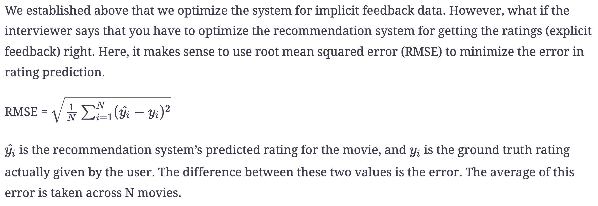
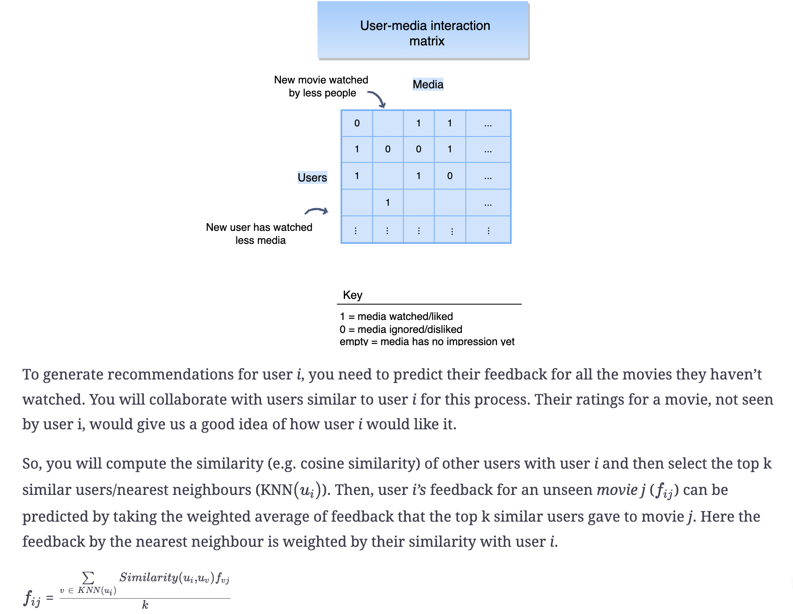
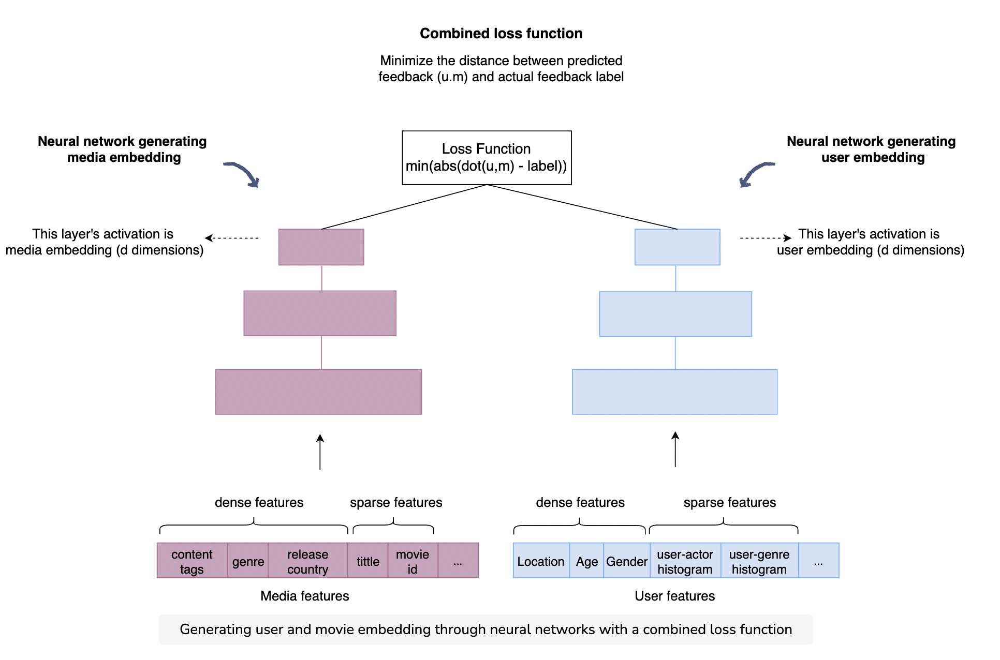

## ML System Design
Background:
I am a Software Engineer with ~5 years of Machine Learning Engineering (MLE) and Data Scientist (DS) experience working at Fintech Company. Seeing the recent requirements in big tech companies for MLE roles and our confusion around it, I decided to create a framework for solving any ML System Design problem during the interview. Depending on your expertise and interviewers guide, you might want to emphasize on one section vs. the other (e.g. Data Engineering vs Modeling).
I would love your feedback, specially around the scaling. Also if any interviewer from FANG is looking into this, please provide your feedback.

Machine learning system design discussion
This discussion focuses on the interviewee’s ability to solve an end-to-end machine learning problem and consists of open-ended questions. This is an integral part of the interview, and not much helping material is available for it. Hence, this course helps in developing the thought pattern required to approach ML system design questions.


### Template/Framework
machine learning design的问题一般都是问设计一个推荐系统，广告排序，还有一般的监督学习的系统。所以准备起来要了解各类的推荐系统的优缺点，以及最新的embeding的方法, 可以看一下这个博客
> https://medium.com/the-graph/applying-deep-learning-to-related-pins-a6fee3c92f5e。 
现在为止，面的两家pinterest和facebook都是围绕着推荐系统展开的，中间会问到各种小问题，比如feature提取，model不够好怎么办。
另外ML的问题，建议最好按照sd一样，按照逻辑点进行回答。
1. 厘清问题，该问题属于什么类型的machine learning问题，比如监督性学习，比如推荐系统。
2. 明确输出目标，明白该问题的目标是什么
3. 数据:
   数据收集，了解一下都有哪些数据可以给我们利用
   数据特征提取，把你想到的特征进行分类，都有哪些domain的特征可以进行提取。
4. 模型，有哪些模型可以使用，然后点出各个模型的优缺点是哪些
5. 评估，你怎么进行模型的评估好坏，评价指标是什么，还有怎么改进。
6. 画出框图，然后进行优化。
7. Scaling


***overview***
Key steps in ML system setup
1. `Setting up the problem`
2. `Understanding scale and latency requirements`
3. `Defining metrics`
4. `Architecture discussion`
5. `Offline model building and evaluation`
6. `Online model execution and evaluation`
7. `Model Debugging and Testing`

***Details***
1. `Setting up the problem`/`Clarify Requirements`
The interviewer’s question is generally very broad. So, the first thing you need to do is ask questions. Asking questions will close the gap between your understanding of the question and the interviewer’s expectations from your answer. You will be able to narrow down your problem space, chalk out the requirements of the system, and finally arrive at a precise machine learning problem statement.
  - What is the goal? Any secondary goal? Business Sense, Customer Experience
    - e.g. for CTR - maximizing the number of clicks is the primary goal. A secondary goal might be the quality of the ads/content
  - Define your ML problem statement, Prediction/Classification problem?
    - Supervised Learning/Unsupervised Learning, Recommendation System like Netflix, Twitter

2. `Understanding scale and latency requirements`/`Clarify Requirements`
Your conversation should also include questions about performance/speed and capacity considerations of the system. The answers to these questions will guide you when you come up with the architecture of the system. Knowing that you need to return results quickly will influence the depth and complexity of your models. Having huge amounts of data to process, you will design the system with scalability in mind. Find more on this in the architecture discussion section. Let’s clarify the problem statement by specifying three aspects: scope, scale, and personalization.
  - Ask questions about the scale of the system - how many users, how much content?
  - Scale of the data: How many requests per second do we anticipate to handle?
  - Latency requirements: Do we want to return the search result in 100 milliseconds or 500 milliseconds?
As we work on a machine learning-based system, our goal is generally to improve our metrics (engagement rate, etc.) while ensuring that we meet the capacity and performance requirements. Major performance and capacity discussions come in during the following two phases of building a machine learning system:
  - Training time: How much training data and capacity is needed to build our predictor?
  - Evaluation time: What are the Service level agreement(SLA) that we have to meet while serving the model and capacity needs?
`Relatively simiple algorithm/model`:
We need to consider the performance and capacity along with optimization for the ML task at hand, i.e., measure the complexity of the ML system at the training and evaluation time and use it in the decision process of building our ML system architecture as well as in the selection of the ML modeling technique.
  linear regression (single-layer neural network-based) algorithm 
  < Tree-based algorithms 
  < deep neural network
  Performance based SLA ensures that we return the results back within a given time frame (e.g. 500ms) for 99% of queries. Capacity refers to the load that our system can handle, e.g., the system can support 1000 QPS (queries per second).
`Add shards/More machines`:
If we evaluate every document using a relatively fast model such as tree-based or linear regression and it takes 1\mu
μs, our simple model would still take 100s to run for 100 million documents that matched the query “computer science”. This is where distributed systems come in handy; we will distribute the load of a single query among multiple shards, e.g., we can divide the load among 1000 machines and can still execute our fast model on 100 million documents in 100ms (100s/1000).
a tree-based or linear regression takes 1μs for an exmaple -> 100s for 100million exmaples -> add 1000 machines takes 100ms(100s/1000) 
deep learning model for search ranking takes 1ms to evaluate an example -> add 1000 shards will still take 100s for 100million (1ms * 100mill/1000) -> continue to add more shards and bring the number down -> using a funnel-based approach when designing ML systems for performance and limited capacity
`Layered/funnel based modeling approach`: 
To manage both the performance and capacity of a system, one reasonable approach that’s commonly used is to start with a relatively fast model when you have the most number of documents e.g. 100 million documents in case of the query “computer science” for search. In every later stage, we continue to increase the complexity (i.e. more optimized model in prediction) and execution time but now the model needs to run on a reduce number of documents e.g. our first stage could use a linear model and final stage can use a deep neural network. If we apply deep neural network for only top 500 documents, with 1ms evaluation time per document, we would need 500ms on a single machine. With 5 shards we can do it in around 100ms.

3. `Defining the metrics of the problem`
Now that you have figured out what machine learning problem you want to solve, the next step is to come up with metrics. Metrics will help you to see if your system is performing well. Knowing our success criteria helps in understanding the problem and in selecting key architectural components. This is why it’s important to discuss metrics early in our design discussions. The next step is to carefully choose your system’s performance metrics for both online and offline testing. The metrics you choose will depend on the problem your system is trying to solve.
  - Metrics for offline testing
    - test the models’ performance during the development phase. binary classification, AUC, log loss, precision, recall, and F1-score. In other cases, you might have to come up with specific metrics for a certain problem. For instance, for the search ranking problem, you would use NDCG as a metric.
  - Metrics for online testing
    - you will use online metrics to test them in the production environment. While coming up with online metrics, you may need both component-wise/component level metrics (NDCG to measure the performance of your model online) and end-to-end metrics (users’ engagement and retention rate).

4. `Architecture discussion`
The next step is to design your system’s architecture. You need to think about the components of the system and how the data will flow through those components. In this step, you need to be careful to design a model that can scale easily.
  - How the ML system fits into the overall product backend
    - Think/draw a very simple diagram with input/output line between system backend and ML system
  - Architecting for scale
    - As we mentioned previously, the requirements gathered during problem setup help you in chalking out the architecture. For instance, you are tasked with building an ML system that displays relevant ads to users. During its problem setup, you ask questions and realize that the number of users and ads in the system is huge and ever-increasing. Thus, you need a scalable system that quickly figures out the relevant ads for all users despite the increase in data. Hence, you can’t just build a complex ML model and run it for all ads in the system because it would take up a lot of time and resources. The solution is to use the funnel approach, where each stage will have fewer ads to process. This way, you can safely use complex models in later stages.

5. `Offline model building and evaluation`
  - `Data: Training data generation`
  The quality and quantity of training data are a big factor in determining how far you can go in our machine learning optimization task.
    - Human labeled data (offline)
      This is an expensive way to gather data. So we need to supplement it with in-house labelers or open-source datasets.
      - Crowdsourcing
      Crowdsourcing can be used to collect training data for relatively simpler tasks. For instance, if you are building an email spam detection system, you would need to label emails as spam or real. This is a simple task that crowd workers can easily do without requiring any special training.
      - Specialized labelers
      We can hire specialized/trained labelers who can label data for us according to the given ML task. The trained labelers will use software, such as Label box, to mark the boundaries of different objects in the driving images.
      - Open-source datasets
    - Data collection through a user’s interaction with the pre-existing system (online)
      - using an existing ML-based system or a rule-based system
    - Targeted data gathering
      Offline training data collection is expensive. So, you need to identify what kind of training data is more important and then target its collection more. To do this, you should see where the system is failing, i.e., areas where the system is unable to predict accurately. Your focus should be to collect training data for these areas.
    - Additional creative collection techniques
        - Build the product in a way that it collects data from user
        We can tweak the functionality of our product in a way that it starts generating training data for our model.
        This can be done by tweaking the system in the following way:
            - Ask users to name the board (collection) to which they save each pin. The name of the board will help to categorize the pins according to their content.
            - Ask new users to choose their interests in terms of the board names specified by existing users.
        The first step will help you to build content profiles. Whereas, the second step will help you build user profiles. The model can utilize these to show pins that would interest the user, personalizing the experience.
        - Creative manual expansion
        We can expand training data using creative ways. Assume that we are building a system that detects logos in images (object detection) and we have some images containing the logos we want to detect. We can expand/enhance the training data by manually placing those logos on a different set of images as well. This logo placement can be done in different positions and sizes. The enhanced training data will enable us to build a more robust logo detector model, which will be able to identify logos of all sizes at different positions and from various kinds of images.
        - Data expansion using GANs
        When working with systems that use visual data, such as object detectors or image segmenters, we can use GANs (generative adversarial networks) to enhance the training data. For instance, consider that we are building an object detector. There are a lot of training images of sunny weather conditions but less of rainy weather. A model trained on this training data may not work well for images with rainy conditions. Here, we can utilize GANs to convert images with sunny weather conditions to rainy weather conditions. This will increase our training data for rainy conditions, resulting in a more robust model.
  - `Train, test, & validation splits -> a`
    - The size of each split will depend on your particular scenario.
    - While splitting training data, you need to ensure that you are capturing all kinds of patterns in each split.
    - Most of the time, we are building models with the intent to forecast the future. Therefore, you need your splits to reflect this intent as well.
    - Quantity of training data
    - Training data filtering
      - Cleaning up data
      You might see that the training data consist of a lot of bot traffic apart from the real user interactions. Bot traffic would just contain impressions and no clicks. This would introduce a lot of wrong negative examples. So we need to exclude them from the training data so that our model doesn’t learn from wrong examples.
      - Removing bias
      The model hence trained, will continue considering the previous top recommendation to be the top recommendation this time too. Hence, the “rich getting richer” cycle will continue. In order to break this cycle, we need to employ an exploration technique that explores the whole content pool (all movies available on Netflix). Therefore, we show “randomized” recommendations instead of “popular first” for a small portion of traffic for gathering training data. The users’ engagement with the randomized recommendations provides us with unbiased training data. This data really helps in removing the current positional and engagement bias of the system.
      - Bootstrapping new items
      Sometimes we are dealing with systems in which new items are added frequently. The new items may not garner a lot of attention, so we need to boost them to increase their visibility. For example, in the movie recommendation system, new movies face the cold start problem. We can boost new movies by recommending them based on their similarity with the user’s already watched movies, instead of waiting for the new movies to catch the attention of a user by themselves. Similarly, we may be building a system to display ads, and the new ads face the cold start problem. We can boost them by increasing their relevance scores a little, thereby artificially increasing their chance of being viewed by a person.
  - `Feature: Feature engineering -> b`
  - `Model: Model training -> c`
  - `Evaluation: Offline evaluation`

6. `Online model execution and evaluation`
Now that you have selected the top-performing models, you will test them in an online environment. Online testing heavily influences the decision of deploying the model. This is where online metrics come into play. Depending on the type of problem, you may use both component level and end-to-end metrics. As mentioned before, for the search engine task, the `component-wise metric` will be NDCG in online testing. However, this alone is not enough. You also need an `end-to-end metric` as well, like session success rate, to see if the system’s (search engine’s) performance has increased by using your new search ranking ML model. If you see a substantial increase in system performance during the online test, you can deploy it on production.
  - `Iterative model improvement`
    - Your model may perform well during offline testing, but the same increase in performance may not be observed during an online test. Here, you need to think about debugging the model to find out what exactly is causing this behavior. Is a particular component not working correctly? Is the features’ distribution different during training and testing time? For instance, a feature called “user’s top five interest” may show a difference in distribution during training and testing, when plotted. This can help you to identify that the routines used to provide the top five user interests were significantly different during training and testing time. Moreover, after the first version of your model has been built and deployed, you still need to monitor its performance. If the model is not performing as expected, you need to go towards debugging. You may observe a general failure from a decrease in AUC. Or, you may note that the model is failing in particular scenarios. For instance, by analysing the video recording of the self-driving car, you may find out that the image segmentation fails in rushy areas. The problem areas identified during model debugging will guide you in building successive iterations of your model.
  - `Running an online experiment`
    - A/B testing
      As visitors are served with either the control or variation/test version of the app, and their engagement with each experience is measured and analyzed through statistical analysis testing. Note that unless the tests are statistically significant, we cannot back up the claims of one version winning over another.
    - Measuring long term effects
      If an A/B test is run with the outcome of a significance level of 95% (p-value ≤ 0.05), there is a 5% probability that the variation that we see is by chance. In some cases, we need to be more confident about the result of an A/B experiment when it is overly optimistic.
      - Back Testing
        Do we lose gains? Is the gain caused by an A/B experiment equal to the loss by B/A experiment? Assume that the A/B experiment gave a gain of 5% and B/A experiment gave a loss of 5%. This will ensure that the changes made in the system improved performance.
      - Long-running A/B tests
        For example, suppose that for the ad prediction system, the revenue went up by 5% when we started showing more ads to users but this had no effect on user retention. Will users start leaving the platform if we show them significantly more ads over a longer period of time? To answer this question, we might want to have a long-running A/B experiment to understand the impact. The long-running experiment, which measures long-term behaviors, can also be done via a backtest. We can launch the experiment based on initial positive results while continuing to run a long-running backtest to measure any potential long term effects. If we can notice any significant negative behavior, we can revert the changes from the launched experiment.

7. `Model Debugging and Testing`
Let’s go over different phases in the development of a machine learning system, potential issues that we can face, and how to debug and fix them.
There are two main phases in terms of the development of a model that we will go over:
  - Building the first version of the model and the ML system.
    The goal in this phase is to build the 1st version of the model. Few important steps in this stage are:
    - We begin by identifying a business problem in the first phase and mapping it to a machine learning problem.
    - We then go onto explore the training data and machine learning techniques that will work best on this problem.
    - Then we train the model given the available data and features, play around with hyper-parameters.
    - Once the model has been set up and we have early offline metrics like accuracy, precision/recall, AUC, etc., we continue to play around with the various features and training data strategies to improve our offline metrics.
    - If there is already a heuristics or rule-based system in place, our objective from the offline model would be to perform at least as good as the current system, e.g., for ads prediction problem, we would want our ML model AUC to be better than the current rule-based ads prediction based on only historical engagement rate.
    It’s important to get version 1 launched to the real system quickly rather than spending too much time trying to optimize it. For example, if our AUC is 0.7 and it’s better than the current system with AUC 0.68, it’s generally a better idea to take model online and then continue to iterate to improve the quality. The reason is primarily that model improvement is an iterative process and we want validation from real traffic and data along with offline validation. We will look at various ideas that can help in that iterative development in the following sections.
  - `Deploying and debugging v1 model`
    Some ML-based systems only operate in an offline setting, for example, detect objects from a large set of images. But, most systems have an online component as well, for example, building a search ranking ML model will have to run online to service incoming queries and ranking the documents that match the query. In our first attempt to take the model online, i.e., enable live traffic, might not work as expected and results don’t look as good as we anticipated offline. Let’s look at a few failure scenarios that can happen at this stage and how to debug them.
    - `Change in feature distribution`
      The change in the feature distribution of training and evaluation set can negatively affect the model performance. Let’s consider an example of an Entity linking system that is trained using a readily available Wikipedia dataset. As we start using the system for real traffic, the traffic that we are now getting for finding entities is a mix of Wikipedia articles as well as research papers. Given the model wasn’t trained on that data, its feature distribution would be a lot different than what it was trained on. Hence it is not performing as well on the research articles entity detection. 
      Another scenario could be a significant change in incoming traffic because of seasonality. Let’s consider an example of a search system trained using data for the last 2 weeks of December, i.e., mostly holiday traffic. If we deploy this system in January, the queries that it will see will be vastly different than what it was trained on and hence not performing as well as we observed in our offline validation.
    - `Feature logging issues`
      When the model is trained offline, there is an assumption that features of the model generated offline would exactly be the same when the model is taken online. However, this might not be true as the way we generated features for our online system might not exactly be the same. It’s a common practice to append features offline to our training data for offline training and then add them later to the online model serving part. So, if the model doesn’t perform as well as we anticipated online, it would be good to see if feature generation logic is the same for offline training as well as online serving part of model evaluation. 
      Suppose we build an ads click prediction model. The model is trained on historical ad engagement. We then deploy it to predict the ads engagement rate. Now the assumption is that the features generated for the model offline would exactly be the same for run-time evaluation. Let’s assume that we have one important feature/signal for our model that’s based on historical advertiser ad impressions. During training, we compute this feature by using the last 7 days’ impression. But, the logic to compute this feature at model evaluation time uses the last 30 days of data to compute advertiser impressions. Because of this feature computed differently at training time and evaluation time, it will result in the model not performing well during online serving. It would be worth comparing the features used for training and evaluation to see if there is any such discrepancy.
    - `Overfitting`
      Overfitting happens when a model learns the intrinsic details in the training data to the extent that it negatively impacts the performance of the model on new or unseen data.
      One good way of ensuring that we don’t get into this problem is to use a hidden test set which is not used for tuning hyperparameters and only use it for final model quality measurement.
      Another important part is to have a comprehensive and large test set to cover all possible scenarios in a fairly similar distribution to how we anticipate them in live traffic.
    - `Under-fitting`
      One indication from training the model could be that the model is unable to learn complex feature interactions especially if we are using a simplistic model. So, this might indicate to us that using slightly higher-order features, introduce more feature interactions, or use a more complex /expensive model such as a neural network.
  - Iterative improvements on top of the first version as well as debugging issues in large scale ML systems.  
    The best way to iterative improve model quality is to start looking at failure cases of our model prediction and using that come up with the ideas that will help in improving model performance in those cases.
    - Missing important feature
    Digging deeper into failures examples can identify missing features that can help us perform better in failures cases.
    - Insufficient training examples
    We may also find that we are lacking training examples in cases where the model isn’t performing well. We will cater to all possible scenarios where the model is not performing well and update the training data accordingly.
  - `Debugging large scale systems`
    In the case of debugging large scale systems with multiple components(or models), we need to see which part of the overall system is not working correctly. It could be done for one failure example or over a set of examples to see where the opportunity lies to improve the metrics.
    The following are a few key steps to think about iterative model improvement for large scale end to end ML systems:
    - Identify the component
    This accounts for finding the architectural component resulting in a high number of failures in our failure set.
    - Improve the quality of component


a, b, c
1. a `Data Related Activites`
    - Data Explore - whats the dataset looks like?
    - Understand different features and their relationship with the target
        - Is the data balanced? If not do you need oversampling/undersampling?
        - Is there a missing value (not an issue for tree-based models)
        - Is there an unexpected value for one/more data columns? How do you know if its a typo etc. and decide to ignore?
    - Feature Importance - partial dependency plot, SHAP values, dataschool video (reference)
    - (ML Pipeline: Data Ingestion) Think of Data ingestion services/storage
    - (ML Pipeline: Data Preparation) Feature Engineering - encoding categorical features, embedding generation etc.
    - (ML Pipeline - Data Segregation) Data split - train set, validation set, test set
3. b `Feature Related Activities`
    - Embeddings
          Embeddings enable the encoding of entities (e.g., words, docs, images, person, ad, etc.) in a low dimensional vector space such that it captures their semantic information. Capturing semantic information helps to identify related entities that occur close to each other in the vector space. Usually, they are generated using neural networks. A neural network architectures can be set up easily to learn a dense representation of entities. We will go over a few of such architectures later in this lesson.
        - Text embeddings: Word2vec
          Word2vec is self-supervised as it trains a model by predicting words from other words that appear in the sentence(context). Representing words with a dense vector is critical for the majority of Natural language processing (NLP) tasks. Word2vec uses a simple but powerful idea to use neighboring words to predict the current word and in the process, generates word embeddings. Any machine learning task that wants to utilize text terms can benefit from this dense embedding vector, which captures word semantic meanings.
          - CBOW
          Continuous bag of words (CBOW) tries to predict the current word from its surrounding words by optimizing for loss function.
          - Skipgram
          Skipgram: In this architecture, we try to predict surrounding words from the current word.
        - Context-based embeddings:
          contextualized information can result in different meanings of the same word, and context-based embeddings look at neighboring terms at embedding generation time. This means that we have to provide contextual information (neighboring terms) to fetch embeddings for a term. In a Word2vec case, we don’t need any context information at the embeddings fetch time as embedding for each term was fixed.
          - Embeddings from Language Models (ELMo)
          The idea behind ELMO is to use the bi-directional LSTM model to capture the words that appear before and after the current word.
          - Bidirectional Encoder Representations from Transformers (BERT)
          BERT uses an attention mechanism and is able to see all the words in the context, utilizing only the ones (i.e., pay more attention) which help with the prediction.
        - Visual embedding (image embedding)
          Once we have trained the model, we only use the encoder (first N network layers) to generate embeddings for images. Auto-encoders are also an example of self-supervised learning, like Word2vec, as we can use an image data set without any label to train the model and generate image embeddings. The input passes through a set of convolution, pooling, and fully connected layers to the last softmax layer for the final classification task. The penultimate layer before softmax captures all image information in a vector such that it can be used to classify the image correctly. So, we can use the penultimate layer value of a pre-trained model as our image embedding.
        - Network/Relationship-based embedding
          the retrieval and ranking of results for a particular user (or query) are mostly about predicting how close they are. Therefore, having an embedding model that projects these documents in the same embedding space can vastly help in the retrieval and ranking tasks of recommendation, search, feed-based, and many other ML systems.
          We can generate embeddings for both the above-discussed pairs of entities in the same space by creating a two-tower neural network model that tries to encode each item using their raw features. The model optimizes the inner product loss such that positive pairs from entity interactions have a higher score and random pairs have a lower score. Let’s say the selected pairs of entities (from a graph or based on interactions) belong to set A. We then select random pairs for negative examples.
          Two tower model to optimize inner product loss for user and item embeddings
    - Transfer learning
      Growth in the ML community and knowledge sharing, This allows people to utilize pre-trained models in a specific area bootstrap quickly.. Another key motivator is that many problems share common sub-problems, e.g., in all visual understanding and prediction areas, tasks such as finding edges, boundaries, and background are common sub-problems. One key advantage of doing transfer learning is that we have the ability to start learning from pre-trained models, and hence, we can utilize the knowledge from similar domains. Transfer learning also optimizes training resources, and it helps teams that don’t have massive computing resources available.
      - Training data is limited:
      In case of a limited amount of specialized training data, we can either go with the approach of freezing all the layers and using the pre-trained model for feature generation or fine-tuning only the final layers.  
      - Training data is plenty:
      If we have a significant amount of training data (e.g. one million+ examples), we have the choice to play around with multiple ideas. We can start with just freezing the model, fine-tuning only final layers, or we can retrain the whole model to adjust weights for our specialized task.
      - Similarity of prediction tasks:
        The similarity of learning tasks can also guide us on whether we can simply use the model as it is or need to fine-tune the model for our new prediction task. For example, if we built a classifier for cars and now we want to use it for trucks, there is a good chance that many of the features are going to be common and we don’t have to fine-tune much. Here, we can utilize the pre-trained model as it is and build our models on top of it (i.e., utilizing the output of pre-trained models as features).
3. c `Model Related Activities`
Now, you can finally decide on the ML models that you should use for the given tasks, keeping the performance and capacity considerations in mind. We can also try out different hyperparameter values to see what works best. If you are using the funnel approach, you may select simpler models for the top of the funnel where data size is huge and more complex neural networks or trees based models for successive parts of the funnel. We also have the option of utilizing pre-trained SOTA (state of the art) models to leverage the power of transfer learning (you don’t need to reinvent the wheel completely each time).
  - (ML Pipeline - Model Train and Evaluation) Build a simple model (XGBoost or NN)
      - How to select a model? Assuming its a Neural Network
          1. NLP/Sequence Model
              - start: LSTM with 2 hidden layers
              - see if 3 layers help,
              - improve: check if Attention based model can help
          2. Image Models - (Don't care right now)
          3. Other
              - start: Fully connected NN with 2 hidden layers
              - Improve: problem specific
  - (ML Pipeline - Model Train and Evaluation) What are the different hyperparameters (HPO) in the model that you chose and why?
  - (ML Pipeline - Model Train and Evaluation) Once the simple model is built, do a bias-variance tradeoff, it will give you an idea of overfitting vs underfitting and based on whether overfit or underfit, you need different approaches to make you model better.
  - Draw the ML pipeline (reference #3)
  - Model Debug (reference #1)
  - Model Deployment (reference#3)
  - (ML Pipeline: Performance Monitoring) Metrics
  - AUC, F1, MSE, Accuracy, NDCG for ranking problems etc.
  - When to use which metrics?


### ***1. Search Ranking***


This is just an example configuration, and it’s important to point out that the number of stages and documents ranked at each stage should be selected based on capacity requirements as well as experimentation to see the impact on relevance based on documents scored at each layer.

Query rewriting -> Spell checker -> Query expansion/Query relaxation -> Query understanding -> Document selection(100k) -> Ranker(500) -> Blender -> Training data generation

Ranker: 
Document Selection (100k out of 100m) ->
Ranker Stage 1 (500 out of 100k) recall of the top five to ten relevant documents (A relatively less complex linear algorithm, like logistic regression or small MART(Multiple additive regression trees) model) pointwise approach ->
Ranker Stage 2 (500 in correct order) precision of the top five to ten relevant documents (LambdaMART is a variation of MART where we change the objective to improve pairwise ranking, LambdaRank is a neural network-based approach utilizing pairwise loss to rank the documents.) pairwise learning algorithms

From RankNet to LambdaRank to LambdaMART: An Overview
> https://www.microsoft.com/en-us/research/wp-content/uploads/2016/02/MSR-TR-2010-82.pdf

We can calculate the NDCG score of the ranked results to compare the performance of different models.


The above example configuration assumes that you are first selecting one-hundred thousand documents for the searcher’s query from the index, then using two-stage ranking, with the first one reducing from one-hundred thousand to five-hundred documents and the second stage is then ranking these five-hundred documents. The blender can then blend results from different search verticals, and the filter will further screen irrelevant or offensive results to get good user engagement.

> Clarifying questions
`Problem scope`: 
`Scale`: How many websites exist that you want to enable through this search engine? How many requests per second do you anticipate to handle? the search engine is getting around 10K queries per second (QPS).
Personalization: have access to their profile as well as their historical search data

> Metrics
`Online metrics`
Click-through rate:
The click-through rate measures the ratio of clicks to impressions.
successful sessions can be defined as the ones that have a click with a ten-second or longer dwell time.
Zero-click searches
Time to success
`Offline metrics`
normalized discounted cumulative gain (NDCG) in detail as it’s a critical evaluation metric for any ranking problem
NDCG: In contrast to cumulative gain, discounted cumulative gain (DCG) allows us to penalize the search engine’s ranking if highly relevant documents (as per ground truth) appear lower in the result list.

`Document Selection`
Inverted Index, Relevance scoring scheme
One basic scoring scheme is to utilize a simple weighted linear combination of the factors involved. The weight of each factor depends on its importance in determining the relevance score. Some of these factors are:
  - Terms match
  - Document popularity
  - Query intent match
  - Personalization match

`Feature Engineering`
The knowledge of feature engineering is highly significant from an interview perspective.
  - Searcher-specific features
    - age, gender and interests
  - Query-specific features
    - Query historical engagement, Query intent (A few examples of query intent are news, local, commerce, etc.)
  - Document-specific features
    - Page rank, Document engagement radius
  - Context-specific features
    - Time of search, Recent events
  - Searcher-document features
    - Distance, Historical engagement
  - Query-document features
    - Text Match, Unigram or bigram, Query-document historical engagement, Embeddings(represent the query and documents in the form of vectors)

`Training data generation` for the search ranking problem
This component displays the cyclic manner of using machine learning to make a search engine ranking system. It takes online user engagement data from the SERP displayed in response to queries and generates positive and negative training examples. The training data generated is then fed to the machine learning models trained to rank search engine results.
  - Training data generation for pointwise approach
  - Training data generation for pairwise approach
    - Human raters (offline method)
    - User-engagement (online method)

`Blender`
Blender gives relevant results from various search verticals, like, images, videos, news, local results, and blog posts. The blender finally outputs a search engine result page (SERP) in response to the searcher’s query.

`Ranker`
The ranker will actively utilize machine learning to find the best order of documents (this is also called learning to rank). In stage one, you can use fast (nanoseconds) linear ML models to rank them. In stage two, you can utilise computationally expensive models (like deep learning models) to find the most optimized order of top 500 documents given by stage one. `When choosing an algorithm, remember to consider the model execution time. Cost vs benefit tradeoff is always an important consideration in large scale ML systems.`

`Ranking`
Learning to Rank (LTR): A class of techniques that applies supervised machine learning (ML) to solve ranking problems. The pointwise and pairwise techniques that we will apply fall under this class.
for a large scale search engine, it makes sense to adopt a multi-layer funnel approach. The top layer of the funnel looks at a large number of documents and uses simpler and faster algorithms for ranking. The bottom layer ranks a small number of documents with complex machine-learned models.
The configuration shown above assumes that the first stage will receive one-hundred thousand relevant documents from the document selection component. You then reduce this number to five-hundred after ranking in this layer, ensuring that the topmost relevant results are forwarded to the second stage (also referred to as `the recall of the documents`).
It will then be the responsibility of the second stage to rank the documents such that topmost relevant results are placed in the correct order (also referred to as `the precision of the documents`).
First stage model will focus on the `recall` of the top five to ten relevant documents in the first five-hundred results while the second stage will ensure `precision` of the top five to ten relevant documents.
This is achieved by changing the objective function from a `single pointwise objective` (click, session success) to a pairwise objective. `Pairwise optimization for learning to rank` means that the model is not trying to minimize the classification error but rather trying to get as many pairs of documents in the right order as possible.

From RankNet to LambdaRank to LambdaMART: An Overview
> https://www.microsoft.com/en-us/research/wp-content/uploads/2016/02/MSR-TR-2010-82.pdf

`Filtering Results`
Result set after ranking, These results are inappropriate despite having good user engagement
- are offensive
- cause misinformation
- are trying to spread hatred
- are not appropriate for children
- are inconsiderate towards a particular group
- features: There are maybe a few particular features that we might want to add specifically for our filtering model. For example, website historical report rate, sexually explicit terms used, domain name, website description, images used on the website, etc.
- Classifier: Once you have built the training data with the right features, you can utilize classification algorithms like logistic regression, MART(Boosted trees or Random Forest), or a Deep neural network to classify a result as inappropriate.


### ***2. Feed Ranking System***


1. `Setting up the problem`
Given a list of tweets, train an ML model that predicts the probability of engagement of tweets and orders them based on that score

In the past, a rather simplistic approach has been followed for this purpose. All the Tweets generated by their followees since user A’s last visit were displayed in reverse chronological order.
The feed can be improved by displaying activity based on its relevance for the logged-in user. Therefore, the feed order is now based on relevance ranking.

2. `Understanding scale and latency requirements`
3. `Defining metrics`
`User engagement metrics`
comments, likes, and retweets, time spent on Twitter

`Negative engagement or counter metric`
reporting a Tweet as inappropriate, block a user, hide a Tweet

`Weighted engagement`
When it comes to interpretation, a higher score equates to higher user engagement. The weights can be tweaked to find the desired balance of activity on the platform. the metric would become a weighted combination of these user actions. The weighted combination metric can be thought of as a value model. It will summarize multiple impacts (of different forms of user engagements) into a single score.

4. `Architecture discussion`
`Ranker`
Train separate models. Each model can focus on predicting the occurrence probability of a certain user action for the tweet. There will be a separate predictor for like, comment, time spent, share, hide, and report. The results of these models can be merged, each having a different weight/importance, to generate a rank score. The Tweets will then be ranked according to this score.
Separately predicting each user action allows us to have greater control over the importance we want to give to each action when calculating the rank of the Tweet. We can tweak the weights to display Tweets in such a manner that would align with our current business objectives, i.e., give certain user actions higher/lower weight according to the business needs.


`Tweet selection schemes`
  - A not-so-new Tweet
  Consider a Tweet that user A has viewed previously. However, by the time the user logs in again, this Tweet has received a much bigger engagement and/or A’s network has interacted with it.

  - New Tweets + unseen Tweets
  the Tweet selection component now fetches a mix of newly generated Tweets along with a portion of unseen Tweets from the cache.
  - Network Tweets + interest / popularity-based Tweets
  An engaging Tweet could be one that:
    - aligns with user A’s interests
    - is locally/globally trending
    - engages user A’s network
  1. Selecting these Tweets can prove to be very beneficial in two cases:
  The user has recently joined the platform and follows only a few others. As such, their small network is not able to generate a sufficient number of Tweets for the Tweet selection component (known as the Bootstrap problem).
  2. The user likes a Tweet from a person outside of his network and decides to add them to their network. This would increase the discoverability on the platform and help grow the user’s network.


Selecting these Tweets can prove to be very beneficial in two cases:
- The user has recently joined the platform and follows only a few others. As such, their small network is not able to generate a sufficient number of Tweets for the Tweet selection component (known as the Bootstrap problem).
- The user likes a Tweet from a person outside of his network and decides to add them to their network. This would increase the discoverability on the platform and help grow the user’s network.


5. `Offline model building and evaluation`

`Feature Engineering`
Dense features
  - User-author features
    - User-author historical interactions
      - author_liked_posts_3months
      - author_liked_posts_count_1year
    - User-author similarity
      - common_followees
      - topic_similarity
      - tweet_content_embedding_similarity
      - [x] social_embedding_similarity

  - Author features
    - Author’s degree of influence
      - is_verified
      - author_social_rank
      - author_num_followers
      - follower_to_following_ratio
    - Historical trend of interactions on the author’s Tweets
      - author_engagement_rate_3months
      - author_topic_engagement_rate_3months

  - User-Tweet features
    - topic_similarity
    - embedding_similarity

  - Tweet features
    - Features based on Tweet’s content
      - Tweet_length
      - Tweet_recency
      - is_image_video
      - is_URL
    - Features based on Tweet’s interaction
      - num_total_interactions
      (Time decay can be used in all features where there is a decline in the value of a quantity over time.)
      - use different time windows to capture the recency of interactions
        - interactions_in_last_1_hour
        - interactions_in_last_1_day
        - interactions_in_last_3_days
        - interactions_in_last_week
      - Separate features for different engagements
        - likes_in_last_3_days
        - comments_in_last_1_day
        - reshares_in_last_2_hours
        - likes_in_last_3_days_user’s_network_only
        - comments_in_last_1_day_user’s_network_only
        - reshares_in_last_2_hours_user’s_network_only
    - Context-based features
      - day_of_week
      - time_of_day
      - current_user_location
      - season
      - lastest_k_tag_interactions
      - approaching_holiday

Sparse features
  - unigrams/bigrams of a Tweet
  - user_id
  - tweets_id

`Training Data Generation`
  - Training data generation through online user engagement
  The users’ online engagement with Tweets can give us positive and negative training examples. For instance, if you are training a single model to predict user engagement, then all the Tweets that received user engagement would be labeled as positive training examples. Similarly, the Tweets that only have impressions would be labeled as negative training examples.

  Impression: If a Tweet is displayed on a user’s Twitter feed, it counts as an impression. It is not necessary that the user reads it or engages with it, scrolling past it also counts as an impression.
  
  Given that the model’s scores are only going to be used to rank Tweets among themselves, poor model calibration doesn’t matter much in this scenario. We will discuss this in the ads system chapter, where calibrated scores are important, and we need to be mindful of such a sampling technique.

  - Balancing positive and negative training examples
  - Train test split

`Ranking`
  - `Logistic regression`
  `Pros`:
  A key advantage of using logistic regression is that it is reasonably fast to train. This enables you to test new features fairly quickly to see if they make an impact on the AUC or validation error. Also, it’s extremely easy to understand the model. You can see from the feature weights which features have turned out to be more important than others.
  Cons:
  A major limitation of the linear model is that it assumes linearity exists between the input features and prediction. Therefore, you have to manually model feature interactions. For example, if you believe that the day of the week before a major holiday will have a major impact on your engagement prediction, you will have to create this feature in your training data manually. Other models like tree-based and neural networks are able to learn these feature interactions and utilize them effectively for predictions.

  - `MART`: multiple additive regression trees (Boosted Decision Trees and Random Forest)
  `Pros`:
  Trees are inherently able to utilize non-linear relations between features that aren’t readily available to logistic regression. 
  Tree-based models also don’t require a large amount of data as they are able to generalize well quickly. So, a few million examples should be good enough to give us an optimized model.
  Cons:
  To Do

  Consider a scenario, where a person reshares a Tweet but does not click the like button. Even though the user didn’t actually click on the like button, retweeting generally implies that the user likes the Tweet. The positive training example for the retweet model may prove useful for the like model as well. Hence, you can reuse all positive training examples across every model.
  One way to utilize the overall engagement data among each individual predictor of P(like), P(comment) and P(retweet) is to build one common predictor, i.e., P(engagement) and share its output as input into all of your predictors.


  - `Multi-task neural networks`
  having a simpler model for stage one ranking and use complex stage two model to obtain the most relevant Tweets ranked at the top of the user’s Twitter feed.

  However, for a very large scale data set, training separate deep neural networks (NNs) can be slow and take a very long time (ten’s of hours to days). The following approach of setting up the models for multi-task learning caters to this problem.

  total_loss = like_loss + comment_loss + retweet_loss

  `Pros`:
  Given the training time is slow for neural networks, training one model (shared layers) would make the overall training time much faster. Moreover, this will also allow us to share all the engagement data across each learning task.
  This approach should be able to perform at least as effective as training separate networks for each task. It should be able to outperform in most cases as we use the shared data and use it across each predictor. Also, one key advantage of using shared layers is that models would be much faster to train than training completely separate deep neural networks for each task.


  - `Stacking models and online learning`
  One way to outperform the “single model technique approach” is to use multiple models to utilize the power of different techniques by stacking models on top of each other. Let’s go over one such stacking setup that should work out very well for the feed problem.
  The setup includes training tree-based models and neural networks to generate features that you will utilize in a linear model (logistic regression). The main advantage of doing this is that you can utilize `online learning`, meaning we can continue to update the model with every user action on the live site. You can also use sparse features in our linear model while getting the power of all non-linear relations and functions through features generated by tree-based models and neural networks.
  For trees, you can generate features by using the triggering of leaf nodes, e.g., given two trees with four leaf nodes, each will result in eight features that can be used in logistic regression, as shown below.
  each leaf node in the random forest will result in a boolean feature that will be active based on whether the leaf node is triggered or not.
  Similarly, for neutral networks, rather than predicting the probability of events, you can just plug-in the output of the last hidden layer as features into the logistic regression models.

  `Pros`:
  1. Logistic regression can be easily used for changing the model online, based on real-time user interactions that happen with the tweets. This helps the model to re-learn the weight of all tree leaves as well.
  2. To summarize, this stacking model setup will still give us all the learning power of deep neural networks and tree-based models along with the flexibility of training logistic regressions model, while keeping it almost real-time refreshed with online learning.
  3. Another advantage of using `real-time online learning` with logistic regression is that you can also utilize sparse features to learn the interaction, e.g., features like user_id and tweet_id can be used to memorize the interaction with each individual user and Tweet.
  4. Given that features like tweet_id and user_id are extremely sparse, training and evaluation of the model must be done in a `distributed environment` because the data won’t fit on one machine.

`Diversity`
  - Diversity in Tweets’ authors
  - Diversity in tweets’ content
  - Introducing the repetition penalty

6. `Online model execution and evaluation`

`Online Experimentation`
  - Step 1: Training different models
  - Step 2: Validating models offline
  - Step 3: Online experimentation
  Now that you have selected the best model offline, you will use A/B testing to compare the performance of this model with the currently deployed model, which displays the feed in reverse chronological order.
  - Step 4: To deploy or not to deploy
  You should go for complex solutions (based on new features, or data, etc.) only if you anticipate it to bring larger gains in the future.
  To wrap up, if, after an A/B experiment, you see an engagement gain by the model that is statistically significant and worth the complexity it adds to the system, it makes sense to replace the current live system with the new model.

7. `Model Debugging and Testing`

### ***3. Netflix Recommendation System***
***Netflix Recommender System competition***
基本这个问题可以抽象为你有很多user，很多item，一定的历史数据(user买item后的rating)，现在你要决定推荐哪些新的东西给每个user
具体到你被问的问题，可能会有一定的变种，举几个例子
1. Yelp饭馆的推荐，涉及到了geolocation information
2. Facebook Newsfeed推荐，涉及到了不同user之前的networking
3. Ins Story推荐，每条Story是独一无二的并且是有时间性的
4. Spotify音乐推荐，怎么把音乐做个embedding

1. `Setting up the problem`
The prime factor that led to Netflix’s success was its recommendation system. The algorithm does a great job of bringing the right kind of content to the right users. Unlike Netflix’s recommendation system, a simple recommendation system would have simply recommended the trending movies/shows with little regard for the particular user’s preferences. At most, it would look at the viewer’s past watches and recommend movies/shows of the same genre.

Another key aspect of Netflix’s approach is that they have found ways to recommend content that seemed different from the user’s regular choices. However, Netflix’s recommendations are not based on wild guesses, but they are based on other users’ watch histories, these users share some common patterns with the concerned user. This way, customers got to discover new content that they wouldn’t have found otherwise.

The task at hand is to create such a recommendation system that keeps the viewers hooked and introduces them to varied content that expands their horizons.

2. `Understanding scale and latency requirements`
Now that you know the problem at hand, let’s define the scope of the problem:
The total number of subscribers on the platform as of 2019 is 163.5 million.
There are 53 million international daily active users.
Hence, you have to build a system for a large number of users who require good recommendations on a daily basis.

One common way to set up the recommendation system in the machine learning world is to pose it as a classification problem with the aim to predict the probability of user engagement with the content. So, the problem statement would be:
“Given a user and context (time, location, and season), predict the probability of engagement for each movie and order movies using that score.”

3. `Defining metrics`
Online metrics
  - Engagement rate = sessions with clicks/total number of sessions
  However, the user might click on a recommended movie but does not find it interesting enough to complete watching it. Therefore, only measuring the engagement rate with the recommendations provides an incomplete picture.
  - Videos watched
  To take into account the unsuccessful clicks on the movie/show recommendations, we can also consider the average number of videos that the user has watched. We should only count videos that the user has spent at least a significant time watching (e.g., more than two minutes).
  However, this metric can be problematic when it comes to the user starting to watch movie/series recommendations but not finding them interesting enough to finish them.
  Series generally have several seasons and episodes, so watching one episode and then not continuing is also an indication of the user not finding the content interesting. So, just measuring the average number of videos watched might miss out on overall user satisfaction with the recommended content.
  - Session watch time
  Session watch time measures the overall time a user spends watching content based on recommendations in a session. The key measurement aspect here is that the user is able to find a meaningful recommendation in a session such that they spend significant time watching it.
  Therefore, measuring session watch time, which is indicative of the session success, is a good metric to track online for the movie recommendation system.

Offline metrics
  Can we build an ideal set of documents that will allow us to measure recommendation set quality? One way of doing this could be to look at the movies/series that the user has completely watched and see if your recommendation system gets it right using historical data.
  Once we have the set of movies/series that we can confidently say should be on the user’s recommendation list, we can use the following offline metrics to measure the quality of your recommendation system.


  - mAP @ N : Mean Average Precision
  N = length of the recommendation list
  Precision measures the ratio between the relevant recommendations and total recommendations in the movie recommendation list. It will be calculated as follows:
  P = number of relevant recommendations/total number of recommendations

  The movie recommendation list and precisions at each cutoff “k” (1 to 5) can be represented as follows.
  Note that a true positive (1), down the recommendation list, leads to low a mAP compared to the one that is high up in the list. This is important because we want the best recommendations to be at the start of the recommendation set.
  Lastly, the “mean” in mAP means that we will calculate the AP with respect to each user’s ratings and take their mean. So, mAP computes the metric for a large set of users to see how the system performs overall on a large set.


  - mAR @ N : Mean Average Recall
  Recall for your recommendation list is the ratio between the number of relevant recommendations in the list and the number of all possible relevant items(shows/movies). It is calculated as:
  r = number of relevant recommendations/number of all possible relevant items

  Lastly, the “mean” in mAR means that we will calculate AR with respect to each user’s ratings and then take their mean.
  So, mAR at a high-level, measures how many of the top recommendations (based on historical data) we are able to get in the recommendation set.

  - F1 score
  mAP @ N focuses on how relevant the top recommendations are, whereas mAR @ N shows how well the recommender recalls all the items with positive feedback, especially in its top recommendations. You want to consider both of these metrics for the recommender.
  If you want to give equal importance to precision and recall, you need to look for a score that conveys the balance between precision and recall.
  F1 score = 2 * mAR∗mAP/(mAP+mAR)

  So, the F1 score based on mAP and mAR will be a fairly good offline way to measure the quality of your models. Remember that we selected our recommendation set size to be five, but it can be differ based on the recommendation viewport or the number of recommendations that users on the platform generally engage with.



  - Offline metric for optimizing ratings
  root mean squared error (RMSE)


`Feature Engineering`


User-based features
  - age
  - gender
  - language
  - country
  - average_session_time
  - last_genre_watched
  - user_actor_histogram
  - user_genre_histogram
  - user_language_histogram

Context-based features
  - season_of_the_year
  - upcoming_holiday
  - days_to_upcoming_holiday
  - time_of_day
  - day_of_week
  - device

Media-based features
  - public-platform-rating
  - revenue
  - time_passed_since_release_date
  - time_on_platform
  - media_watch_history
  - genre
  - movie_duration
  - content_set_time_period
  - content_tags
  - show_season_number
  - country_of_origin
  - release_country
  - release_year
  - release_type
  - maturity_rating

Media-user cross features
  - User-genre historical interaction features
    - user_genre_historical_interaction_3months
    - user_genre_historical_interaction_1year
    - user_and_movie_embedding_similarity
    - user_actor
    - user_director
    - user_language_match
    - user_age_match
  - sparse features
    - movie_id
    - title_of_media
    - synopsis
    - original_title
    - distributor
    - creator
    - original_language
    - director
    - first_release_year
    - music_composer
    - actors


4. `Architecture discussion`
We have a huge number of movies to choose from. Also, we require complex models to make great, personalized recommendations. However, if we try to run a complex model on the whole corpus, it would be inefficient in terms of execution time and computing resources usage.
Therefore, we split the recommendation task into two stages.
Stage 1: Candidate generation
Stage 2: Ranking of generated candidates

`Candidate Generation`
This component focuses on `higher recall`, meaning it focuses on gathering movies that might interest the user from all perspectives, e.g., media that is relevant based on historical user interests, trending locally, etc.
1. Collaborative filtering
In this technique, you find users similar to the active user based on the intersection of their historical watches. You, then, collaborate with similar users to generate candidate media for the active user, as shown below.
  - Nearest neighborhood
  To generate recommendations for user i, you need to predict their feedback for all the movies they haven’t watched. You will collaborate with users similar to user i for this process. Their ratings for a movie, not seen by user i, would give us a good idea of how user i would like it.
  It is evident that this process will be computationally expensive with the increase in numbers of users and movies. The sparsity of this matrix also poses a problem when a movie has not been rated by any user or a new user has not watched many movies.
  - [x] Matrix factorization
2. Content-based filtering
Content-based filtering allows us to make recommendations to users based on the characteristics or attributes of the media they have already interacted with.
  - Similarity with historical interactions
  - Similarity between media and user profiles
3. Embedding-based similarity

weaknesses of the approaches for candidate generation discussed above
  - Collaborative filtering can suggest candidates based solely on the historical interaction of the users. Unlike content-based filtering, it does not require domain knowledge to create user and media profiles. It may also be able to capture data aspects that are often elusive and difficult to profile using content-based filtering. However, collaborative filtering suffers from the cold start problem. It is difficult to find users similar to a new user in the system because they have less historical interaction. Also, new media can’t be recommended immediately as no users have given feedback on it.
  - The neural network technique also suffers from the cold start problem. The embedding vectors of media and users are updated in the training process of the neural networks. However, if a movie is new or if a user is new, both would have fewer instances of feedback received and feedback given, respectively. By extension, this means there is a lack of sufficient training examples to update their embedding vectors accordingly. Hence, the cold start problem.
  - Content-based filtering is superior in such scenarios. It does require some initial input from the user regarding their preferences to start generating candidates, though. This input is obtained as a part of the onboarding process, where a new user is asked to share their preferences. Once we have the initial input, it can create and then match the user’s profile with media profiles. Moreover, new medias’ profiles can be built immediately as their description is provided manually.








`Ranking`
This component focuses on `higher precision`, i.e., it will focus on the ranking of the top k recommendations.
Re-ranking is done for various reasons, such as bringing diversity to the recommendations. Consider a scenario where all the top ten recommended movies are comedy. You might decide to keep only two of each genre in the top ten recommendations. This way, you would have five different genres for the user in the top recommendations.

If you are also considering past watches for the media recommendations, then re-ranking can help you. It prevents the recommendation list from being overwhelmed by previous watches by moving some previously watched media down the list of recommendations.
  - Approach 1: Logistic regression or random forest
  There are multiple reasons that training a simplistic model might be the way to go. They are as follows:
    - Training data is limited
    - You have limited training and model evaluation capacity
    - You want model explainability to really understand how the ML model is making its decision and show that to the end-user
    - You require an initial baseline to see how far you can go in reducing our test set loss before you try more complex approaches
  - Approach 2: Deep NN with sparse and dense features
  Another way to model this problem is to set up a deep NN. Some of the factors that were discussed in Approach 1 are now key requirements for training this deep NN model. They are as follows:
    - Hundreds of millions of training examples should be available
    - Having the capacity to evaluate these models in terms of capacity and model interpretability is not that critical.
  Since the idea is that you want to predict whether the user will watch the media or not, you train a deep NN with sparse and dense features for this learning task. Two extremely powerful sparse features fed into such a network can be videos that the user has previously watched and the user’s search terms. For these sparse features, you can set up the network to also learn media and search term embeddings as part of the learning task. These specialized embeddings for historical watches and search terms can be very powerful in predicting the next watch idea for a user. They will allow the model to personalize the recommendation ranking based on the user’s recent interaction with media content on the platform.

  An important aspect here is that both search terms and historical watched content are list-wise features. You need to think about how to feed them in the network given that the size of the layers is fixed. You can use an approach similar to pooling layers in CNN (convolution neural networks) and simply average the historical watch id and search text term embeddings before feeding it into the network.


`Re-ranking`
The top ten recommendations on the user’s page are of great importance. After your system has given the watch probabilities and you have ranked the results accordingly, you may re-rank the results.
Re-ranking is done for various reasons, such as bringing diversity to the recommendations. Consider a scenario where all the top ten recommended movies are comedy. You might decide to keep only two of each genre in the top ten recommendations. This way, you would have five different genres for the user in the top recommendations.
If you are also considering past watches for the media recommendations, then re-ranking can help you. It prevents the recommendation list from being overwhelmed by previous watches by moving some previously watched media down the list of recommendations.


5. `Offline model building and evaluation`
  - Generating training examples
  One way of interpreting user actions as positive and negative training examples is based on the duration for which the user watched a particular show/movie. You take positive examples as ones where the user ended up watching most of a recommended movie/show, i.e., watched 80% or more. You take negative examples, again where we are confident that the user ignored a movie/show, i.e., watched 10% or less.
  If the percentage of a movie/show watched by the user falls between 10% and 80%, you will put it in the uncertainty bucket. This percentage is not clearly indicative of a user’s like or dislike, so you ignore such examples. For instance, let’s say a user watched 55% of a movie. This could be considered a positive example considering that they liked it enough to watch it midway. However, it could be that a lot of people had recommended it to them, so they wanted to see what all the hype was about by at least watching it halfway through. However, they, ultimately, decided that it was not according to their liking.
  Hence, to avoid these kinds of misinterpretations, you label examples as positive and negative only when you are certain about it to a higher degree.
  - Balancing positive and negative training examples
  randomly downsample the negative examples
  - Weighting training examples
  - How many layers should you setup? How many activation units should be used in each layer? The best answer to these questions is that you should start with 2-3 hidden layers with a RELU based activation unit and then play around with the numbers to see how this helps us reduce the test error. Generally, adding more layers and units helps initially, but its usefulness tapers off quickly. The computation and time cost would be higher relative to the drop in error rate.


6. `Online model execution and evaluation`
7. `Model Debugging and Testing`

### ***4. Ad Prediction System***
1. `Setting up the problem`
`Problem Statement`
Predict the probability of engagement of an ad for a given user and context(query, device, etc.)
Note that the context can be different depending on the type of application in which we are displaying the advertisement.
There are two categories of applications:
- Search engine: Here, the query will be part of the context along with the searcher. The system will display ads based on the search query issued by the searcher.
- Social media platforms: Here, we do not have a query, but the user information (such as location, demographics, and interests hierarchy) will be part of the context and used to select ads. The system will automatically detect user interest based on the user’s historical interactions (using machine learning algorithms) and display ads accordingly.

Most components will be the same for the above two discussed platforms with the main difference being the context that is used to select and predict ad engagement.

2. `Understanding scale and latency requirements`

3. `Defining metrics`
The metrics used in our ad prediction system will help select the best machine-learned models to show relevant ads to the user. They should also ensure that these models help the overall improvement of the platform, increase revenue, and provide value for the advertisers.

`Why are both online and offline metrics important?`
Offline metrics are mainly used to compare the models offline quickly and see which one gives the best result.
Online metrics are used to validate the model for an end-to-end system to see how the revenue and engagement rate improve before making the final decision to launch the model.

They should also ensure that these models help the overall improvement of the platform, increase revenue, and provide value for the advertisers.
- Offline metrics
  - area under the receiver operator curve (AUC)
  However, given that the system needs well-calibrated prediction scores, AUC, has the following shortcomings in this ad prediction scenario.
    1. AUC does not penalize for “how far off” predicted score is from the actual label. For example, let’s take two positive examples (i.e., with actual label 1) that have the predicted scores of 0.51 and 0.7 at threshold 0.5. These scores will contribute equally to our loss even though one is much closer to our predicted value.
    2. AUC is insensitive to well-calibrated probabilities.
  - `Log Loss` (or more precisely cross-entropy loss) is the measure of our predictive error.
    1. This metric captures to what degree expected probabilities diverge from class labels. As such, it is an absolute measure of quality, which accounts for generating well-calibrated, probabilistic output.
    2. Let’s consider a scenario that differentiates why log loss gives a better output compared to AUC. If we multiply all the predicted scores by a factor of 2 and our average prediction rate is double than the empirical rate, AUC won’t change but log loss will go down.

- Online metrics
  - `Overall revenue`
  It’s important to call out that just measuring revenue is a very short term approach, as we may not provide enough value to advertisers and they will move away from the system. However, revenue is definitely one critical metric to track.
  - `Overall ads engagement rate`
    - Click rate
    This will measure the ratio of user clicks to ads.
    - Downstream action rate
    This will measure the action rate of a particular action targeted by the advertiser e.g. add to cart rate, purchase rate, message rate etc.
  - `Counter metrics`
  It’s important to track counter metrics to see if the ads are negatively impacting the platform. There is a risk that users can leave the platform if ads degrade the experience significantly. Along with top metrics, it’s important to track direct negative feedback by the user on the ad such as providing following feedback on the ad:
    - Hide ad
    - Never see this ad
    - Report ad as inappropriate


4. `Architecture discussion`
`Architectural Components`

`Advertiser flow`
Advertisers create ads containing their content as well as targeting, i.e., scenarios in which they want to trigger their ads.
  - Query-based targeting
  This method shows ads to the user based on the query terms.
  - User-based targeting
  The ads will be subjective to the user based on a specific region, demographic, gender, age, etc.
  - Interest-based targeting
  This method shows interest-based ads.
  - Set-based targeting
  This type shows ads to a set of users selected by the advertisers.

`User flow`
As the platform user queries the system, it will look for all the potential ads that can be shown to this user based on different targeting criteria used by the advertiser.
  - Advertisers create ads providing targeting information, and the ads are stored in the ads index
  - When a user queries the platform, ads can be selected from the index based on their information (e.g., demographics, interests, etc.) and run through our ads prediction system.

- `Ad selection`
The ad selection component will fetch the top k ads based on relevance (subject to the user context) and bid from the ads index.
The main goal of the ads selection component is to narrow down the set of ads that are relevant for a given query. In a search-based system, the ads selection component is responsible for retrieving the top relevant ads from the ads database (built using all the active ads in the system) according to the user and query context. In a feed-based system, the ads selection component will select the top k relevant ads based more on user interests than search terms.
- `Ad prediction`
The ad prediction component will predict user engagement with the ad (the probability that an action will be taken on the ad if it is shown), given the ad, advertiser, user, and context. Then, it will rank ads based on relevance score and bid.
- `Auction`
The auction mechanism then determines whether these top K relevant ads are shown to the user, the order in which they are shown, and the price the advertisers pay if an action is taken on the ad. For every ad request, an auction takes place to determine which ads to show. The top relevant ads selected by the ad prediction system are given as input to Auction. Auction then looks at total value based on an ad’s bid as well as its relevance score. An ad with the highest total value is the winner of the auction. The total value depends on the following factors:
  - Bid
  The bid an advertiser places for that ad. In other words, the amount the advertiser is willing to pay for a given action such as click or purchase.
  - User engagement rate
  An estimate of user engagement with the ad.
  - Ad quality score
  An assessment of the quality of the ad by taking into account feedback from people viewing or hiding the ad.
  - Budget
  The advertiser’s budget for an ad
The estimated user engagement and ad quality rates combined results in the ad relevance score. They can be combined based on different weights as selected by the platform, e.g., if it’s important to keep positive feedback high, the ad quality rate will get a higher weight.

`Pacing`
Pacing an ad means evenly spending the ad budget over the selected time period rather than trying to spend all of it at the start of the campaign.


`Funnel model approach`
As we go down the funnel (as shown in the diagram), the complexity of the models becomes higher and the set of ads that they run on becomes smaller. It’s also important to note that the initial layers are mostly responsible for ads selection. On the other hand, ads prediction is responsible for predicting a well-calibrated engagement and quality score for ads. This predicted score is going to be utilized in the auction as well.

Let’s go over an example to see how these components will interact for the search scenario.
- A thirty-year old male user issues a query “machine learning”.
- The `ads selection` component `selects all the ads` that match the targeting criteria ( user demographics and query) and uses a simple model to predict the ad’s relevance score.
- The `ads selection` component `ranks the ads` according to r, where r = bid * relevance and sends the top ads to our ads prediction system.
- The `ads prediction` component will go over the selected ads and uses a highly optimized ML model to `predict a precise calibrated score`.
- The `ads auction` component then runs the auction algorithm based on the bid and predicted ads score to select the `top most relevant ads` that are shown to the user.


`Feature Engineering`
1. Ad specific features
  - ad_id
  - ad_content_raw_terms
  - historical_engagement_rate
    - ad_engagement_history_last_24_hrs
    - ad_engagement_history_last_7_days
  - ad_impression
  - ad_negative_engagement_rate
  - ad_embedding
  - ad_age
  - ad_bid
2. Advertiser specific features
  - advertiser_domain
  - historical_engagement_rate
  - region_wise_engagement
3. User specific features
  - user_previous_search_terms
  - user_search_terms
  - age
  - gender
  - language
  - embedding_last_k_ads
  - engagement_content_type
  - engagement_days
  - platform_time_spent
  - region
4. Context specific features
  - current_region
  - time
  - device
    - screen_size
5. User-ad cross features
  - embedding_similarity
  - region_wise_engagement
  - user_ad_category_histogram
  - user_ad_subcategory_histogram
  - user_gender_ad_histogram
  - user_age_ad_histogram
6. User-advertiser cross features
  - embedding_similarity
  - user_gender_advertiser_histogram
  - user_age_advertiser_histogram

`Ad Selection`
  - `Phase 1`: Quick selection of ads for the given query and user context according to selection criteria
  The first key requirement to be able to achieve the quick selection objective is to have the ads stored in a system that is fast and enables complex selection criteria. This is where building an in-memory index to store the ads will be massively helpful.
  So, the above selection criteria in phase 1 will reduce our space set from all active ads to ads that are targeted for the current user.
  - `Phase 2`: Rank these selected ads based on a simple and fast algorithm to trim ads.
  The number of ads selected in phase 1 can be quite large depending on the query and the user, e.g., we can have millions of ads targeted for a sports fan. So, running a complex ML model to predict engagement on all these selected ads will be slow and expensive. At this point, it makes sense to narrow down the space using a simplistic approach before we start running complex models.
  - `Phase 3`: Apply the machine learning model on the trimmed ads to select the top ones.
  As the ranking in phase 2 is super simplistic, we should still select a sizable ads(e.g., ten thousand) by running a better model as we work towards reducing the ad set. We can run a simplistic and efficient model on ads selected in phase 2 to further narrow it down. The top ads from this phase will be passed to our ad prediction stage to run more complex and accurate models for better user engagement prediction.
  We can use either logistic regression or additive trees based models (such as random forest or boosted decision trees) as they are quite efficient. Neural network-based models need more capacity and time so they might not be the best choice at this stage.


`Ad Prediction`
The following figure shows some key components that are critical for enabling online learning. We need a mechanism that generates the latest training examples via an online joiner. Our training data generator will take these examples and generate the right feature set for them. The model trainer will then receive these new examples to refresh the model using stochastic gradient descent. This forms a tightly closed loop where changes in the feature distribution or model output can be detected, learned on, and improved in short successions. Note that the refresh of the model doesn’t have to be instantaneous, and we can do it in same batches at a certain frequency, e.g., every 30 mins, 60 mins etc.

5. `Offline model building and evaluation`
`Model recalibration`
Negative downsampling can accelerate training while enabling us to learn from both positive and negative examples. However, our predicted model output will now be in the downsampling space. For instance, consider that if our engagement rate is 5% and we select only 10% negative samples, our average predicted engagement rate will be near 50%. Auction uses this predicted rate to determine order and pricing; therefore it’s critical that we recalibrate our score before sending them to auction. The recalibration can be done using:
q = p/(p+(1-p)/w)
Here,
q is the re-calibrated prediction score,
p is the prediction in downsampling space, and
w is the negative downsampling rate.

6. `Online model execution and evaluation`
7. `Model Debugging and Testing`

Model for online learning:
One model that easily supports online learning and has the ability to update it using stochastic gradient descent using mini-batches is logistic regression.

Auto non-linear feature generation:
One potential drawback is that simple logistic regression (generalized linear model) relies on manual effort to create complex feature crosses and generating non-linear features. Manually creating such features is cumbersome and will mostly be restricted to modeling the relationship between two or three features. On the other hand, tree and neural network-based models are really good at generating complex relationships among features when optimizing the model.
To overcome this, we can use additive trees and neural networks to find such complex feature crosses and non-linear feature relationships in data, and then these features are input to our logistic regression model.
- Additive trees
- Neural Network
neural network-based models are also really good at capturing non-linear, complex relationships between features.


So, let’s combine the above two ideas together:
- We train additive trees and neural network to predict non-linear complex relationships among our features. We then use these models to generate features.
- We use raw features and features generated in the previous step to train a logic regression model.

### ***5. Self-Driving Car: Image Segmentation***
1. `Setting up the problem`
2. `Understanding scale and latency requirements`
3. `Defining metrics`
4. `Architecture discussion`
5. `Offline model building and evaluation`
6. `Online model execution and evaluation`
7. `Model Debugging and Testing`

### ***6. Entity Linking System***
1. `Setting up the problem`
2. `Understanding scale and latency requirements`
3. `Defining metrics`
4. `Architecture discussion`
5. `Offline model building and evaluation`
6. `Online model execution and evaluation`
7. `Model Debugging and Testing`


## MLE Interview Questions
### FB
We take the two coding interviews first. And then two team match interviews.

Interview Questions
Q: Give me an example of a project where you used data and machine learning.
Q: Given a binary tree, write a function to find if this tree is a search binary tree or not.
Q: Given an array, write a function that returns a samples from the array.  

Given two sets
words ["cat", "bat", "mat" )
ordering = [c,b,a,t]
Return TRUE when the words in words[] are sorted in lexographic order as in ordering[]  

Python example:
```python
word = "cat"
ordering = ['c', 'b', 'a', 't']

def check_ordering(word, ordering):
    """Recursive approach O(len(ordering))"""
    # Base cases
    if not word:
        return True
    # Recursion
    else:
        letter = word.pop(0)
        print(letter)
        for char in ordering:
            if letter == char:
                index = ordering.index(char)
                print(ordering[index:])
                return check_ordering(word, ordering[index:])
        return False
print(check_ordering(list(word), ordering))
```
How would you build, train, and deploy a system to detect if multimedia and/or ads contents being posted violate terms or contains offensive materials?
How you test your ML models for production scale?

Variation of the number of islands LC question. You have a House, Well & Tree arranged in a large grid with empty spaces in between to show 
where you can go. How will you go from house to nearest well without hitting a tree? Assume you can only go up.down/left/right and not diagonally and cannot hit a tree else you backtrack.  
Given an infinite chessboard, find shortest distance for a knight to move from position A to position B  
given a binary image, count the number of 4-directional connected components.  
Serialize and de-serialize a binary tree  
Given two sparse matrices, how would you compute the dot product? 
Given a DAG, write a function to return the length of the longest path. 
Given a tree, write a function to return the sum of the max-sum path which goes through the root node. 
implement functions of constructing binary tree
One problem is implement a trie tree.

***Interview Questions:***
2. System Design #1
是设计一个location based search。这一轮画风就比较非主流了。我因为看过一些uber/lyft的talk，也准备过geohash的知识，想说开心这都准备到了哈，上来讨论了一下需求，就说先画个架构图吧，本来计划每个component都大概讲一下，再落实到具体的schema design什么的，结果画完以后面试官说其他都不重要，咱直接说geohash怎么用，为什么用geohash，我就解释它为什么可以在密集地区持续split啊，找相邻block是O(1) time啊什么的，然后面试官一直追问geohash的细节，比如为什么每一层是划4x8个格子而不是比如8x8，直接给我问蒙了，这我确实不知道啊！在这个上面纠结到了只剩五分钟，最后只能草草讲一下返回结果怎么排序，就结束了。

个人反思是不是一开始不说geohash比较好？先讲讲even grid为什么不行，再讲讲quad tree这样？另一个失误的点是时间控制的不好，生平第一次面大厂design，有点被牵着鼻子走，其实不知道的细节可以申请先放一放，把大框架讲完了以后再回头抠细节？

3. ML Design
这一轮是一个非常常规的recommendation问题，被推荐的东西（item）不经常变，用户的interest变化比较快。用collaborative filtering或者binary classification都能做，分析了一下两个方案，觉得用classification比较合适，有一些比较明显的优点，面试官也同意，就开始讨论metrics，feature engineering，不同算法的优缺点，然后就是些model serving上面的工程问题，比如怎么monitor，online表现明显有问题的时候怎么debug，因为工作中都遇到过，感觉答得也不错，面试官全程I like it, fantastic。唯一没有想到的是可以用好友graph来扩展feature解决冷启动问题，这个是面试官提醒了以后才想到的。

这一轮就和上一轮画风相反。全程感觉很顺，但是还是给了个borderline，求大佬们指点一下，这是挂在哪了？

4. System Design #2
这一轮没有计入面试结果，但也挺有意思的。和第一轮Design一样，不按套路出牌，我把框架画完之后面试官说，这个设计很好，但是如果不用Cassandra或者任何storage layer你要怎么设计，Redis也不用的话要怎么办，message queue也不用的话要怎么做，而且不是明着说的，就是说 “我们想尽量减少server间的networking”，反复沟通了很久，最后才明白他的意图原来就是不用任何轮子设计一个啥都有的monolith。明白了这个以后进展就很快，最终结果他也非常满意，后半程明显语气快乐得多（其实我想说这种设计挺糟糕的，拣了芝麻丢了西瓜）。。。

 ML design。abusive comments
第四轮：design music playlist to display top music
第五轮：design friends recommendation system

### Google
Given two strings, A and B, of the same length n, find whether it is possible to cut both strings at a common point such that the first part of A and the second part of B form a palindrome.
have two pointers, first on A and second on end of B. move the pointer l and r (l++, r--) until both values are same( A[l] == B[r]) or l == r. if at any point both are not same just switch the pointer r from B to A and continue. If then it breaks then it is not a palindrome.

You have 52 playing cards (26 red, 26 black). You draw cards one by one. A red card pays you a dollar. A black one fines you a dollar. You can stop any time you want. Cards are not returned to the deck after being drawn. What is the expected payoff following this optimal rule? for this, u need to find what is the optimal stopping rule in terms of maximizing expected payoff.

## References
### ML System Design
> https://www.educative.io/blog/cracking-machine-learning-interview-system-design

> https://github.com/kuhung/machine-learning-systems-design

> https://github.com/chiphuyen/machine-learning-systems-design

> https://leetcode.com/discuss/interview-question/system-design/566057/machine-learning-system-design-a-framework-for-the-interview-day

> https://www.linkedin.com/pulse/tips-machine-learning-interviews-karthik-mohan/

> https://www.springboard.com/blog/machine-learning-interview-questions/

> https://www.1point3acres.com/bbs/thread-490321-1-1.html

> https://blog.nowcoder.net/n/11b85636258b49b09eb116084d0d67f1

> https://www.1point3acres.com/bbs/forum.php?mod=viewthread&tid=462348&extra=page%3D1

> https://kuhungio.me/2019/machine_learning_system_design/

> https://www.jiqizhixin.com/articles/2021-01-26-3

> https://www.jiqizhixin.com/articles/2019-11-26-5

> https://pxiaoer.blog/2021/01/26/cs329s/

Model Debug
> http://josh-tobin.com/assets/pdf/troubleshooting-deep-neural-networks-01-19.pdf

Data School Video on Feature Selection
> https://www.youtube.com/watch?v=YaKMeAlHgqQ

ML Pipeline
> https://towardsdatascience.com/architecting-a-machine-learning-pipeline-a847f094d1c7

### Recommender System
> https://towardsdatascience.com/deep-dive-into-netflixs-recommender-system-341806ae3b48

> https://dl.acm.org/doi/epdf/10.1145/2843948

> https://uxplanet.org/netflix-binging-on-the-algorithm-a3a74a6c1f59

> https://github.com/gauravtheP/Netflix-Movie-Recommendation-System/blob/master/NetflixMoviesRecommendation.ipynb

> https://madasamy.medium.com/introduction-to-recommendation-systems-and-how-to-design-recommendation-system-that-resembling-the-9ac167e30e95

> https://pub.towardsai.net/build-your-own-recommendation-engine-netflix-demystified-demo-code-550401d4885e

> https://medium.com/refraction-tech-everything/how-netflix-works-the-hugely-simplified-complex-stuff-that-happens-every-time-you-hit-play-3a40c9be254b

> https://www.codecademy.com/articles/how-netflix-recommendation-works-data-science

> https://xamat.github.io/pubs/BigAndPersonal.pdf

> https://rpubs.com/geeman/599770

> https://www.newamerica.org/oti/reports/why-am-i-seeing-this/case-study-netflix/

#### IDEA ####
视频推荐：评论里面包括对视频内容的点评，应该提升权重

> https://www.1point3acres.com/bbs/thread-169343-1-1.html

> https://www.1point3acres.com/bbs/thread-559285-1-1.html

> https://www.1point3acres.com/bbs/thread-683982-1-1.html

> https://eng.uber.com/observability-at-scale/

> https://medium.com%2F@medium.com/@cfpinela/recommender-systems-user-based-and-item-based-collaborative-filtering-5d5f375a127f

> https://www.1point3acres.com/bbs/forum.php?mod=viewthread&tid=698113&extra=page%3D1%26filter%3Dsortid%26sortid%3D311%26sortid%3D311

> https://github.com/donnemartin/system-design-primer/blob/master/README-zh-Hans.md

> https://1o24bbs.com/t/topic/4487