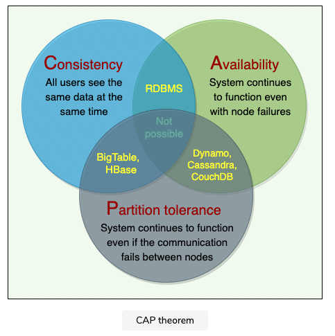

## System Design
> https://github.com/alex-xu-system/bytebytego

### System Design Problems ###
Be in charge and tradeoffs, tradeoffs, tradeoffs...

***4 DESIGN A RATE LIMITER***

***5 DESIGN CONSISTENT HASHING***

***6 DESIGN A KEY-VALUE STORE***

***7 DESIGN A UNIQUE ID GENERATOR IN DISTRIBUTED SYSTEMS***

***8 DESIGN A URL SHORTENER***

***9 DESIGN A WEB CRAWLER***

***10 DESIGN A NOTIFICATION SYSTEM***

***11 DESIGN A NEWS FEED SYSTEM***

***12 DESIGN A CHAT SYSTEM***

***13 DESIGN A SEARCH AUTOCOMPLETE SYSTEM***

***14 DESIGN YOUTUBE***

***15 DESIGN GOOGLE DRIVE***

***1 Proximity Service***

***2 Nearby Friends***

***3 Google Maps***

***4 Distributed Message Queue***

***5 Metrics Monitoring***

***6 Ad Click Event Aggregation***

***7 Hotel Reservation***

***8 Distributed Email Service***

***9 S3-like Object Storage***

***10 Real-time Gaming Leaderboard***

***11 Payment System***

***12 Digital Wallet***

***13 Stock Exchange***


### Concept
`Distributed systems design round`

• Design a key-value store.
• Design a search for an internet search engine.
• Architect a world-wide video distribution system.
• Build Facebook Chat.

• Familiarity with complex systems.
• Concurrency (threads, deadlock, starvation, consistency, coherence).
• Abstraction (understanding how OS, filesystem, and database works).
• Real-world performance (relative performance RAM, disk, your network, SSD).
• Availability and reliability (durability, understanding how things can fail).
• Data storage (RAM vs. durable storage, compression, byte sizes).
• Byte math.

• Arrive at an answer in the face of constraints.
• Visualize the entire problem and solution space.
• Make tradeoffs like consistency, availability, partitioning, and performance.
• Give ballpark numbers on QPS supported, number of machines needed using a modern computer.
• Consider Facebook and some of the unique challenges we face.
• Propose a design for a system that breaks down the problem into components that can be built independently, with the ability to talk in detail about any piece of the design.
• Identify the bottlenecks as the system scales and understand the limitations in your design.
• Understand how to adapt the solution when requirements change.
• Draw diagrams that clearly describe the relationship between the different components in the system.
• Calculate (back-of-the-envelope) the physical resources necessary to make this system work.

• Start with requirements. Your interviewer might ask: “How would you architect the backend for a messaging system?” Obviously, this question is extremely vague. Where do you even start? You could start with some requirements:
    • How many users are we talking about?
    • How many messages sent?
    • How many messages read?
    • What are the latency requirements for sender-to-receiver message delivery?
    • How will messages be stored?
    • What operations does this data store need to support?
    • What operations is it optimized for?
    • How do you push new messages to clients? Do you push at all, or rely on a pull-based model?

In the following chapters, we will try to define some of the core building blocks of scalable systems. Familiarizing these concepts would greatly benefit in understanding distributed system concepts. In the next section, we will go through Consistent Hashing, CAP Theorem, Load Balancing, Caching, Data Partitioning, Indexes, Proxies, Queues, Replication, and choosing between SQL vs. NoSQL.

- Scalability
Scalability is the capability of a system, process, or a network to grow and manage increased demand. Any distributed system that can continuously evolve in order to support the growing amount of work is considered to be scalable.
`Horizontal` vs. `Vertical Scaling`: Horizontal scaling means that you scale by adding more servers into your pool of resources whereas Vertical scaling means that you scale by adding more power (CPU, RAM, Storage, etc.) to an existing server.
- Reliability
By definition, reliability is the probability a system will fail in a given period. In simple terms, a distributed system is considered reliable if it keeps delivering its services even when one or several of its software or hardware components fail. Reliability represents one of the main characteristics of any distributed system, since in such systems any failing machine can always be replaced by another healthy one, ensuring the completion of the requested task.
- Availability
By definition, availability is the time a system remains operational to perform its required function in a specific period. It is a simple measure of the percentage of time that a system, service, or a machine remains operational under normal conditions. An aircraft that can be flown for many hours a month without much downtime can be said to have a high availability. Availability takes into account maintainability, repair time, spares availability, and other logistics considerations. If an aircraft is down for maintenance, it is considered not available during that time.
- Efficiency
Two standard measures of its efficiency are the response time (or latency) that denotes the delay to obtain the first item and the throughput (or bandwidth) which denotes the number of items delivered in a given time unit (e.g., a second). The two measures correspond to the following unit costs:
Number of messages globally sent by the nodes of the system regardless of the message size.
Size of messages representing the volume of data exchanges.
- Serviceability or Manageability

`Load Balancing`
Load Balancer (LB) is another critical component of any distributed system. It helps to spread the traffic across a cluster of servers to improve responsiveness and availability of applications, websites or databases. LB also keeps track of the status of all the resources while distributing requests. If a server is not available to take new requests or is not responding or has elevated error rate, LB will stop sending traffic to such a server.

`Caching`
Caches take advantage of the locality of reference principle: recently requested data is likely to be requested again. A cache is like short-term memory: it has a limited amount of space, but is typically faster than the original data source and contains the most recently accessed items. Caches can exist at all levels in architecture, but are often found at the level nearest to the front end, where they are implemented to return data quickly without taxing downstream levels.
What happens when you expand this to many nodes? If the request layer is expanded to multiple nodes, it’s still quite possible to have each node host its own cache. However, if your load balancer randomly distributes requests across the nodes, the same request will go to different nodes, thus increasing cache misses. Two choices for overcoming this hurdle are global caches and distributed caches.

`Data Partitioning`
Data partitioning is a technique to break a big database (DB) into many smaller parts. It is the process of splitting up a DB/table across multiple machines to improve the manageability, performance, availability, and load balancing of an application.

`Indexes`
The goal of creating an index on a particular table in a database is to make it faster to search through the table and find the row or rows that we want. Indexes can be created using one or more columns of a database table, providing the basis for both rapid random lookups and efficient access of ordered records.

`Proxies`
A proxy is a piece of software or hardware that sits between a client and a server to facilitate traffic. A forward proxy hides the identity of the client, whereas a reverse proxy conceals the identity of the server. So, when you want to protect your clients on your internal network, you should put them behind a forward proxy; on the other hand, when you want to protect your servers, you should put them behind a reverse proxy.

`Redundancy and Replication`
Redundancy plays a key role in removing the single points of failure in the system and provides backups if needed in a crisis. For example, if we have two instances of a service running in production and one fails, the system can failover to the other one.
Replication means sharing information to ensure consistency between redundant resources, such as software or hardware components, to improve reliability, fault-tolerance, or accessibility.

`SQL VS. NoSQL`
Here are a few reasons to choose a SQL database: We need to ensure ACID compliance. Your data is structured and unchanging.
Here are a few reasons to choose a NoSQL database: Storing large volumes of data that often have little to no structure. Making the most of cloud computing and storage. Rapid development.



`CAP Theorem`
CAP theorem states that it is impossible for a distributed system to simultaneously provide all three of the following desirable properties: 
- Consistency (C): All nodes see the same data at the same time.
- Availability (A): In simple terms, availability refers to a system’s ability to remain accessible even if one or more nodes in the system go down.
- Partition tolerance (P): A partition is a communication break (or a network failure) between any two nodes in the system, i.e., both nodes are up but cannot communicate with each other.

Therefore, the theorem can really be stated as: In the presence of a network partition, a distributed system must choose either Consistency or Availability. We cannot build a general data store that is continually available, sequentially consistent, and tolerant to any partition failures. We can only build a system that has any two of these three properties.

`PACELC Theorem`
The PACELC theorem states that in a system that replicates data:
- if there is a partition (‘P’), a distributed system can tradeoff between availability and consistency (i.e., ‘A’ and ‘C’);
- else (‘E’), when the system is running normally in the absence of partitions, the system can tradeoff between latency (‘L’) and consistency (‘C’).

`Consistent Hashing`
While designing a scalable system, the most important aspect is defining how the data will be partitioned and replicated across servers. Distributed systems can use Consistent Hashing to distribute data across nodes. Consistent Hashing maps data to physical nodes and ensures that only a small set of keys move when servers are added or removed.
- Data partitioning: It is the process of distributing data across a set of servers. It improves the scalability and performance of the system.
- Data replication: It is the process of making multiple copies of data and storing them on different servers. It improves the availability and durability of the data across the system.
- Data partition and replication strategies lie at the core of any distributed system. A carefully designed scheme for partitioning and replicating the data enhances the performance, availability, and reliability of the system and also defines how efficiently the system will be scaled and managed.

Consistent Hashing helps with efficiently partitioning and replicating data; therefore, any distributed system that needs to scale up or down or wants to achieve high availability through data replication can utilize Consistent Hashing.
- Any system working with a set of storage (or database) servers and needs to scale up or down based on the usage, e.g., the system could need more storage during Christmas because of high traffic.
- Any distributed system that needs dynamic adjustment of its cache usage by adding or removing cache servers based on the traffic load.
- Any system that wants to replicate its data shards to achieve high availability.

The Consistent Hashing scheme described above works great when a node is added or removed from the ring, as in these cases, since only the next node is affected. For example, when a node is removed, the next node becomes responsible for all of the keys stored on the outgoing node. However, this scheme can result in non-uniform data and load distribution. This problem can be solved with the help of Virtual nodes.
To handle these issues, Consistent Hashing introduces a new scheme of distributing the tokens to physical nodes. Instead of assigning a single token to a node, the hash range is divided into multiple smaller ranges, and each physical node is assigned several of these smaller ranges. Each of these subranges is considered a Vnode. With Vnodes, instead of a node being responsible for just one token, it is responsible for many tokens (or subranges).

Advantages of Vnodes
- As Vnodes help spread the load more evenly across the physical nodes on the cluster by dividing the hash ranges into smaller subranges, this speeds up the rebalancing process after adding or removing nodes. When a new node is added, it receives many Vnodes from the existing nodes to maintain a balanced cluster. Similarly, when a node needs to be rebuilt, instead of getting data from a fixed number of replicas, many nodes participate in the rebuild process.
- Vnodes make it easier to maintain a cluster containing heterogeneous machines. This means, with Vnodes, we can assign a high number of sub-ranges to a powerful server and a lower number of sub-ranges to a less powerful server.
- In contrast to one big range, since Vnodes help assign smaller ranges to each physical node, this decreases the probability of hotspots.

`Long-Polling vs WebSockets vs Server-Sent Events`
Long-Polling, WebSockets, and Server-Sent Events are popular communication protocols between a client like a web browser and a web server. First, let’s start with understanding what a standard HTTP web request looks like. Following are a sequence of events for regular HTTP request:
1. The client opens a connection and requests data from the server.
2. The server calculates the response.
3. The server sends the response back to the client on the opened request.

`Bloom Filters`
Use Bloom filters to quickly find if an element might be present in a set.

The Bloom filter data structure tells whether an element may be in a set, or definitely is not. The only possible errors are false positives, i.e., a search for a nonexistent element might give an incorrect answer. With more elements in the filter, the error rate increases. An empty Bloom filter is a bit-array of m bits, all set to 0. There are also k different hash functions, each of which maps a set element to one of the m bit positions.
- To add an element, feed it to the hash functions to get k bit positions, and set the bits at these positions to 1.
- To test if an element is in the set, feed it to the hash functions to get k bit positions.
  - If any of the bits at these positions is 0, the element is definitely not in the set.
  - If all are 1, then the element may be in the set.

`Quorum`
In a distributed environment, a quorum is the minimum number of servers on which a distributed operation needs to be performed successfully before declaring the operation’s overall success.
What value should we choose for a quorum? More than half of the number of nodes in the cluster:
(N/2+1) where N is the total number of nodes in the cluster. Because of this logic, it is recommended to always have an odd number of total nodes in the cluster.
The following two things should be kept in mind before deciding read/write quorum:
- R=1 and W=N ⇒ full replication (write-all, read-one): undesirable when servers can be unavailable because writes are not guaranteed to complete.
- Best performance (throughput/availability) when 1 < r < w < n, because reads are more frequent than writes in most applications

`Leader and Follower`
Allow only a single server (called leader) to be responsible for data replication and to coordinate work.
At any time, one server is elected as the leader. This leader becomes responsible for data replication and can act as the central point for all coordination. The followers only accept writes from the leader and serve as a backup. In case the leader fails, one of the followers can become the leader. In some cases, the follower can serve read requests for load balancing.

`Heartbeat`
Each server periodically sends a heartbeat message to a central monitoring server or other servers in the system to show that it is still alive and functioning.
Heartbeating is one of the mechanisms for detecting failures in a distributed system. If there is a central server, all servers periodically send a heartbeat message to it. If there is no central server, all servers randomly choose a set of servers and send them a heartbeat message every few seconds. This way, if no heartbeat message is received from a server for a while, the system can suspect that the server might have crashed. If there is no heartbeat within a configured timeout period, the system can conclude that the server is not alive anymore and stop sending requests to it and start working on its replacement.

`Checksum`
How can a distributed system ensure data integrity, so that the client receives an error instead of corrupt data?
Calculate a checksum and store it with data.
To calculate a checksum, a cryptographic hash function like MD5, SHA-1, SHA-256, or SHA-512 is used. The hash function takes the input data and produces a string (containing letters and numbers) of fixed length; this string is called the checksum.
When a system is storing some data, it computes a checksum of the data and stores the checksum with the data. When a client retrieves data, it verifies that the data it received from the server matches the checksum stored. If not, then the client can opt to retrieve that data from another replica.


### References

1. Build a recommendation system that shows relevant products to users
2. Build a visual understanding system for a self-driving car
3. Build a search-ranking system

System Design面试的例子

我在自己面试的过程中 曾经被问到过许多System Design的题目，在这里我挑出几个典型的供大家参考:

公司A: Design URL Shorten Service
公司B: Design SQS(i.e. AWS's queue service)
公司C: Design Uber(frontend app views + backend service)
下面我来详细解释一下每一题的考点:

Design URL Shortening Service

这一题是非常经典的System Design题目，可以考的很浅，也可以考的很深。由于特别适合初学者入门，建议每个想学习System Design的同学都要把这道题的可能的条件和解法过一遍。比如说:

If your website is the top URL shortening service in the world(i.e. handling 70% of world URL shortening traffic) How do you handle it?
How do you handle URL customization?
What if you have very hot URLs? How do you handle it?
How do you track the top N popular URLs?
Design SQS

这一题是非常geeky的一道题，完全深度考察distributed system的各种知识。难度比URL Shortening Service高，原因在于后者已经成为常规考题，变种变来变去就那么几个，所以你死记硬背也能过关。而前者是非常见题 考查点对于没有系统学习过System Design的同学来讲难以琢磨。

同时这道题也是道好题，因为如果你有realtime backend system经验，多半可能会用到queue service。那考察的就是你有没有抽出自己的spare time去理解queue service的具体原理呢?

Design Uber

这是一道极其抽象的题，难易全凭面试官把握。

我被问到的具体情形是，根据手机app上的view transition design出整个后台service群以及互相交互的情况。我当时在白板上一口气写了10+个service的交互图，最后临走前还专门拍照留念，现在想来还是很自豪...

100个人会design出100个Uber，没有谁对谁错，只要能自圆其说就可以。

System Design积木的例子

System design的另一大块是我前面所谈到的“积木”，也就是别人已经搭好的framework或product。

业界的Framework非常之多，你并不需要每个都掌握。只要可以做到知道某方面的几个option，并在需要用到的时候快速ramp up就可以了。下面做一个小分类供大家参考:

In-memory Cache: Guava cache
Standalone Cache: Memcached, Redis
Database: DynamoDB, Cassandra
Queue: ActiveMQ, RabbitMQ, SQS, Kafka
Data Processing: Hadoop, Spark, EMR
Stream Processing: Samza, Storm

***Questions in Interview***
```
1. What size of data are you dealing with?

2. Do you need to be able to serve predictions in real time? 

3. How often do you expect to update your models?

4. How large and experienced is your team — including data scientists, engineers and DevOps?

```
> https://medium.com/acing-ai/machine-learning-system-design-c3a35c7df07d

> https://medium.com/acing-ai/machine-learning-system-design-models-as-a-service-32666eba0e6

> https://www.1point3acres.com/bbs/thread-490321-1-1.html

