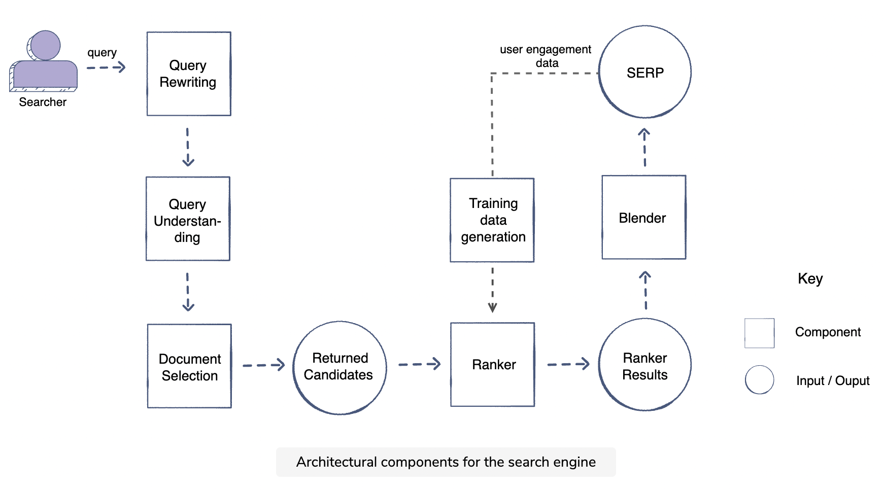
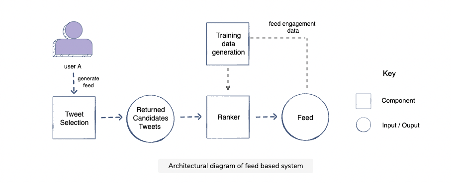
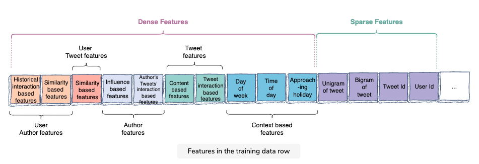
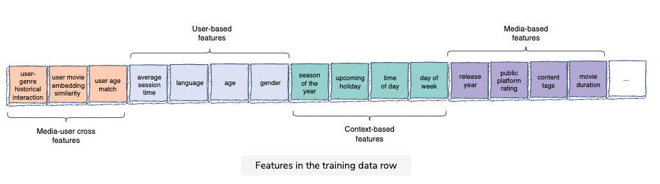

## System Design
> https://github.com/alex-xu-system/bytebytego

### System Design Problems ###
Be in charge and tradeoffs, tradeoffs, tradeoffs...

***4 DESIGN A RATE LIMITER***

***5 DESIGN CONSISTENT HASHING***

***6 DESIGN A KEY-VALUE STORE***

***7 DESIGN A UNIQUE ID GENERATOR IN DISTRIBUTED SYSTEMS***

***8 DESIGN A URL SHORTENER***

***9 DESIGN A WEB CRAWLER***

***10 DESIGN A NOTIFICATION SYSTEM***

***11 DESIGN A NEWS FEED SYSTEM***

***12 DESIGN A CHAT SYSTEM***

***13 DESIGN A SEARCH AUTOCOMPLETE SYSTEM***

***14 DESIGN YOUTUBE***

***15 DESIGN GOOGLE DRIVE***

***1 Proximity Service***

***2 Nearby Friends***

***3 Google Maps***

***4 Distributed Message Queue***

***5 Metrics Monitoring***

***6 Ad Click Event Aggregation***

***7 Hotel Reservation***

***8 Distributed Email Service***

***9 S3-like Object Storage***

***10 Real-time Gaming Leaderboard***

***11 Payment System***

***12 Digital Wallet***

***13 Stock Exchange***

### Other Cases
***Search Ranking***


Query rewriting -> Spell checker -> Query expansion/query relaxation -> Query understanding -> Document selection -> Ranker -> Blender -> Training data generation


The above example configuration assumes that you are first selecting one-hundred thousand documents for the searcher’s query from the index, then using two-stage ranking, with the first one reducing from one-hundred thousand to five-hundred documents and the second stage is then ranking these five-hundred documents. The blender can then blend results from different search verticals, and the filter will further screen irrelevant or offensive results to get good user engagement.

> Clarifying questions
`Problem scope`: 
`Scale`: How many websites exist that you want to enable through this search engine? How many requests per second do you anticipate to handle? the search engine is getting around 10K queries per second (QPS).
Personalization: have access to their profile as well as their historical search data

> Metrics
`Online metrics`
Click-through rate:
The click-through rate measures the ratio of clicks to impressions.
successful sessions can be defined as the ones that have a click with a ten-second or longer dwell time.
Zero-click searches
Time to success
`Offline metrics`
normalized discounted cumulative gain (NDCG) in detail as it’s a critical evaluation metric for any ranking problem
NDCG:
In contrast to cumulative gain, discounted cumulative gain (DCG) allows us to penalize the search engine’s ranking if highly relevant documents (as per ground truth) appear lower in the result list.

`Ranker`
The ranker will actively utilize machine learning to find the best order of documents (this is also called learning to rank).
In stage one, you can use fast (nanoseconds) linear ML models to rank them. In stage two, you can utilise computationally expensive models (like deep learning models) to find the most optimized order of top 500 documents given by stage one. `When choosing an algorithm, remember to consider the model execution time. Cost vs benefit tradeoff is always an important consideration in large scale ML systems.`

`Blender`
Blender gives relevant results from various search verticals, like, images, videos, news, local results, and blog posts. The blender finally outputs a search engine result page (SERP) in response to the searcher’s query.

`Training data generation`
This component displays the cyclic manner of using machine learning to make a search engine ranking system. It takes online user engagement data from the SERP displayed in response to queries and generates positive and negative training examples. The training data generated is then fed to the machine learning models trained to rank search engine results.

Training data generation for pointwise approach

Training data generation for pairwise approach

Human raters (offline method)

User-engagement (online method)

`Document Selection`
Inverted Index, Relevance scoring scheme

`Feature Engineering`
Searcher-specific features
Query-specific features
Document-specific features
Context-specific features
Searcher-document features
Query-document features

`Ranking`
Learning to Rank (LTR): A class of techniques that applies supervised machine learning (ML) to solve ranking problems. The pointwise and pairwise techniques that we will apply fall under this class.

for a large scale search engine, it makes sense to adopt a multi-layer funnel approach. The top layer of the funnel looks at a large number of documents and uses simpler and faster algorithms for ranking. The bottom layer ranks a small number of documents with complex machine-learned models.

The configuration shown above assumes that the first stage will receive one-hundred thousand relevant documents from the document selection component. You then reduce this number to five-hundred after ranking in this layer, ensuring that the topmost relevant results are forwarded to the second stage (also referred to as `the recall of the documents`).

It will then be the responsibility of the second stage to rank the documents such that topmost relevant results are placed in the correct order (also referred to as `the precision of the documents`).

First stage model will focus on the `recall` of the top five to ten relevant documents in the first five-hundred results while the second stage will ensure `precision` of the top five to ten relevant documents.

This is achieved by changing the objective function from a `single pointwise objective` (click, session success) to a pairwise objective. `Pairwise optimization for learning to rank` means that the model is not trying to minimize the classification error but rather trying to get as many pairs of documents in the right order as possible.

From RankNet to LambdaRank to LambdaMART: An Overview
> https://www.microsoft.com/en-us/research/wp-content/uploads/2016/02/MSR-TR-2010-82.pdf

`Filtering Results`
Result set after ranking, These results are inappropriate despite having good user engagement
- are offensive
- cause misinformation
- are trying to spread hatred
- are not appropriate for children
- are inconsiderate towards a particular group


***Feed Ranking System***


In the past, a rather simplistic approach has been followed for this purpose. All the Tweets generated by their followees since user A’s last visit were displayed in reverse chronological order.
The feed can be improved by displaying activity based on its relevance for the logged-in user. Therefore, the feed order is now based on relevance ranking.

`User engagement metrics`
comments, likes, and retweets, time spent on Twitter

`Negative engagement or counter metric`
reporting a Tweet as inappropriate, block a user, hide a Tweet

`Weighted engagement`
When it comes to interpretation, a higher score equates to higher user engagement.
The weights can be tweaked to find the desired balance of activity on the platform.

`Ranker`
Train separate models. Each model can focus on predicting the occurrence probability of a certain user action for the tweet. There will be a separate predictor for like, comment, time spent, share, hide, and report. The results of these models can be merged, each having a different weight/importance, to generate a rank score. The Tweets will then be ranked according to this score.
Separately predicting each user action allows us to have greater control over the importance we want to give to each action when calculating the rank of the Tweet. We can tweak the weights to display Tweets in such a manner that would align with our current business objectives, i.e., give certain user actions higher/lower weight according to the business needs.

`Tweet selection schemes`
A not-so-new Tweet
Consider a Tweet that user A has viewed previously. However, by the time the user logs in again, this Tweet has received a much bigger engagement and/or A’s network has interacted with it.

`New Tweets + unseen Tweets`
the Tweet selection component now fetches a mix of newly generated Tweets along with a portion of unseen Tweets from the cache.


An engaging Tweet could be one that:
- aligns with user A’s interests
- is locally/globally trending
- engages user A’s network


Selecting these Tweets can prove to be very beneficial in two cases:
- The user has recently joined the platform and follows only a few others. As such, their small network is not able to generate a sufficient number of Tweets for the Tweet selection component (known as the Bootstrap problem).
- The user likes a Tweet from a person outside of his network and decides to add them to their network. This would increase the discoverability on the platform and help grow the user’s network.



`Feature Engineering`
Dense features
- User-author features
  - User-author historical interactions
    - author_liked_posts_3months
    - author_liked_posts_count_1year
  - User-author similarity
    - common_followees
    - topic_similarity
    - tweet_content_embedding_similarity
    - [x] social_embedding_similarity
- Author features
  - Author’s degree of influence
    - is_verified
    - author_social_rank
    - author_num_followers
    - follower_to_following_ratio
  - Historical trend of interactions on the author’s Tweets
    - author_engagement_rate_3months
    - author_topic_engagement_rate_3months
- User-Tweet features
  - topic_similarity
  - embedding_similarity
- Tweet features
  - Features based on Tweet’s content
    - Tweet_length
    - Tweet_recency
    - is_image_video
    - is_URL
  - Features based on Tweet’s interaction
    - num_total_interactions (Time decay can be used in all features where there is a decline in the value of a quantity over time.)
    - use different time windows to capture the recency of interactions
    - interactions_in_last_1_hour
    - interactions_in_last_1_day
  - Separate features for different engagements
    - likes_in_last_3_days
    - comments_in_last_1_day
    - reshares_in_last_2_hours
    - likes_in_last_3_days_user’s_network_only
    - comments_in_last_1_day_user’s_network_only
    - reshares_in_last_2_hours_user’s_network_only
  - Context-based features
    - day_of_week
    - time_of_day
    - current_user_location
    - season
    - lastest_k_tag_interactions
    - approaching_holiday

Sparse features
- unigrams/bigrams of a Tweet
- user_id
- tweets_id

`Training Data Generation`
- Training data generation through online user engagement
The users’ online engagement with Tweets can give us positive and negative training examples. For instance, if you are training a single model to predict user engagement, then all the Tweets that received user engagement would be labeled as positive training examples. Similarly, the Tweets that only have impressions would be labeled as negative training examples.

Impression: If a Tweet is displayed on a user’s Twitter feed, it counts as an impression. It is not necessary that the user reads it or engages with it, scrolling past it also counts as an impression.

- Balancing positive and negative training examples
- Train test split

`Ranking`
- Logistic regression
A major limitation of the linear model is that it assumes linearity exists between the input features and prediction. Therefore, you have to manually model feature interactions. For example, if you believe that the day of the week before a major holiday will have a major impact on your engagement prediction, you will have to create this feature in your training data manually. Other models like tree-based and neural networks are able to learn these feature interactions and utilize them effectively for predictions.

- MART: multiple additive regression trees
Trees are inherently able to utilize non-linear relations between features that aren’t readily available to logistic regression.

Tree-based models also don’t require a large amount of data as they are able to generalize well quickly. So, a few million examples should be good enough to give us an optimized model.

Consider a scenario, where a person reshares a Tweet but does not click the like button. Even though the user didn’t actually click on the like button, retweeting generally implies that the user likes the Tweet. The positive training example for the retweet model may prove useful for the like model as well. Hence, you can reuse all positive training examples across every model.

One way to utilize the overall engagement data among each individual predictor of P(like), P(comment) and P(retweet) is to build one common predictor, i.e., P(engagement) and share its output as input into all of your predictors.

- Multi-task neural networks

total_loss = like_loss + comment_loss + retweet_loss

Given the training time is slow for neural networks, training one model (shared layers) would make the overall training time much faster. Moreover, this will also allow us to share all the engagement data across each learning task.


- Stacking models and online learning
To summarize, this stacking model setup will still give us all the learning power of deep neural networks and tree-based models along with the flexibility of training logistic regressions model, while keeping it almost real-time refreshed with online learning.

Another advantage of using real-time online learning with logistic regression is that you can also utilize sparse features to learn the interaction, e.g., features like user_id and tweet_id can be used to memorize the interaction with each individual user and Tweet.

Given that features like tweet_id and user_id are extremely sparse, training and evaluation of the model must be done in a distributed environment because the data won’t fit on one machine.

`Diversity`
- Diversity in Tweets’ authors
- Diversity in tweets’ content
- Introducing the repetition penalty

`Online Experimentation`
- Step 1: Training different models
- Step 2: Validating models offline
- Step 3: Online experimentation
Now that you have selected the best model offline, you will use A/B testing to compare the performance of this model with the currently deployed model, which displays the feed in reverse chronological order.
- Step 4: To deploy or not to deploy
You should go for complex solutions (based on new features, or data, etc.) only if you anticipate it to bring larger gains in the future.

***Netflix Recommendation System***

`Feature Engineering`



User-based features
- age
- gender
- language
- country
- average_session_time
- last_genre_watched
- user_actor_histogram
- user_genre_histogram
- user_language_histogram

Context-based features
- season_of_the_year
- upcoming_holiday
- days_to_upcoming_holiday
- time_of_day
- day_of_week
- device

Media-based features
- public-platform-rating
- revenue
- time_passed_since_release_date
- time_on_platform
- media_watch_history
- genre
- movie_duration
- content_set_time_period
- content_tags
- show_season_number
- country_of_origin
- release_country
- release_year
- release_type
- maturity_rating

Media-user cross features
- User-genre historical interaction features
  - user_genre_historical_interaction_3months
  - user_genre_historical_interaction_1year
  - user_and_movie_embedding_similarity
  - user_actor
  - user_director
  - user_language_match
  - user_age_match
- sparse features
  - movie_id
  - title_of_media
  - synopsis
  - original_title
  - distributor
  - creator
  - original_language
  - director
  - first_release_year
  - music_composer
  - actors

`Candidate Generation`
1. Collaborative filtering
- Nearest neighborhood
- [x] Matrix factorization
2. Content-based filtering
- Similarity with historical interactions
- Similarity between media and user profiles
3. Embedding-based similarity

weaknesses of the approaches for candidate generation discussed above
- Collaborative filtering can suggest candidates based solely on the historical interaction of the users. Unlike content-based filtering, it does not require domain knowledge to create user and media profiles. It may also be able to capture data aspects that are often elusive and difficult to profile using content-based filtering. However, collaborative filtering suffers from the cold start problem. It is difficult to find users similar to a new user in the system because they have less historical interaction. Also, new media can’t be recommended immediately as no users have given feedback on it.
- The neural network technique also suffers from the cold start problem. The embedding vectors of media and users are updated in the training process of the neural networks. However, if a movie is new or if a user is new, both would have fewer instances of feedback received and feedback given, respectively. By extension, this means there is a lack of sufficient training examples to update their embedding vectors accordingly. Hence, the cold start problem.
- Content-based filtering is superior in such scenarios. It does require some initial input from the user regarding their preferences to start generating candidates, though. This input is obtained as a part of the onboarding process, where a new user is asked to share their preferences. Once we have the initial input, it can create and then match the user’s profile with media profiles. Moreover, new medias’ profiles can be built immediately as their description is provided manually.

`Ranking`
Re-ranking is done for various reasons, such as bringing diversity to the recommendations. Consider a scenario where all the top ten recommended movies are comedy. You might decide to keep only two of each genre in the top ten recommendations. This way, you would have five different genres for the user in the top recommendations.

If you are also considering past watches for the media recommendations, then re-ranking can help you. It prevents the recommendation list from being overwhelmed by previous watches by moving some previously watched media down the list of recommendations.


***Ad Prediction System***
`Problem Statement`
Predict the probability of engagement of an ad for a given user and context(query, device, etc.)

`metrics`
Offline metrics are mainly used to compare the models offline quickly and see which one gives the best result. Online metrics are used to validate the model for an end-to-end system to see how the revenue and engagement rate improve before making the final decision to launch the model.
They should also ensure that these models help the overall improvement of the platform, increase revenue, and provide value for the advertisers.
- Offline metrics
  - area under the receiver operator curve (AUC)
    1. However, given that the system needs well-calibrated prediction scores, AUC, has the following shortcomings in this ad prediction scenario.
    2. AUC does not penalize for “how far off” predicted score is from the actual label. For example, let’s take two positive examples (i.e., with actual label 1) that have the predicted scores of 0.51 and 0.7 at threshold 0.5. These scores will contribute equally to our loss even though one is much closer to our predicted value.
    3. AUC is insensitive to well-calibrated probabilities.
  - Log Loss (or more precisely cross-entropy loss) is the measure of our predictive error.
    1. This metric captures to what degree expected probabilities diverge from class labels. As such, it is an absolute measure of quality, which accounts for generating well-calibrated, probabilistic output.
    2. Let’s consider a scenario that differentiates why log loss gives a better output compared to AUC. If we multiply all the predicted scores by a factor of 2 and our average prediction rate is double than the empirical rate, AUC won’t change but log loss will go down.

- Online metrics
  - Overall revenue
  - Overall ads engagement rate
    - Click rate
    - Downstream action rate
  - Counter metrics
  It’s important to track counter metrics to see if the ads are negatively impacting the platform.
  There is a risk that users can leave the platform if ads degrade the experience significantly.


`Architectural Components`

`Advertiser flow`
- Query-based targeting
- User-based targeting
- Interest-based targeting
- Set-based targeting

`User flow`
- Advertisers create ads providing targeting information, and the ads are stored in the ads index
- When a user queries the platform, ads can be selected from the index based on their information (e.g., demographics, interests, etc.) and run through our ads prediction system.

- `Ad selection`
The ad selection component will fetch the top k ads based on relevance (subject to the user context) and bid from the ads index.
- `Ad prediction`
The ad prediction component will predict user engagement with the ad (the probability that an action will be taken on the ad if it is shown), given the ad, advertiser, user, and context. Then, it will rank ads based on relevance score and bid.
- `Auction`
The auction mechanism then determines whether these top K relevant ads are shown to the user, the order in which they are shown, and the price the advertisers pay if an action is taken on the ad. For every ad request, an auction takes place to determine which ads to show. The top relevant ads selected by the ad prediction system are given as input to Auction. Auction then looks at total value based on an ad’s bid as well as its relevance score. An ad with the highest total value is the winner of the auction. The total value depends on the following factors:
- Bid
- User engagement rate
- Ad quality score
- Budget


`Feature Engineering`
1. Ad specific features
- ad_id
- ad_content_raw_terms
- historical_engagement_rate
  - ad_engagement_history_last_24_hrs
  - ad_engagement_history_last_7_days
- ad_impression
- ad_negative_engagement_rate
- ad_embedding
- ad_age
- ad_bid
2. Advertiser specific features
- advertiser_domain
- historical_engagement_rate
- region_wise_engagement
3. User specific features
- user_previous_search_terms
- user_search_terms
- age
- gender
- language
- embedding_last_k_ads
- engagement_content_type
- engagement_days
- platform_time_spent
- region
4. Context specific features
- current_region
- time
- device
  - screen_size
5. User-ad cross features
- embedding_similarity
- region_wise_engagement
- user_ad_category_histogram
- user_ad_subcategory_histogram
- user_gender_ad_histogram
- user_age_ad_histogram
6. User-advertiser cross features
- embedding_similarity
- user_gender_advertiser_histogram
- user_age_advertiser_histogram

`Funnel model approach`


### Concept
`Distributed systems design round`

• Design a key-value store.
• Design a search for an internet search engine.
• Architect a world-wide video distribution system.
• Build Facebook Chat.

• Familiarity with complex systems.
• Concurrency (threads, deadlock, starvation, consistency, coherence).
• Abstraction (understanding how OS, filesystem, and database works).
• Real-world performance (relative performance RAM, disk, your network, SSD).
• Availability and reliability (durability, understanding how things can fail).
• Data storage (RAM vs. durable storage, compression, byte sizes).
• Byte math.

• Arrive at an answer in the face of constraints.
• Visualize the entire problem and solution space.
• Make tradeoffs like consistency, availability, partitioning, and performance.
• Give ballpark numbers on QPS supported, number of machines needed using a modern computer.
• Consider Facebook and some of the unique challenges we face.
• Propose a design for a system that breaks down the problem into components that can be built independently, with the ability to talk in detail about any piece of the design.
• Identify the bottlenecks as the system scales and understand the limitations in your design.
• Understand how to adapt the solution when requirements change.
• Draw diagrams that clearly describe the relationship between the different components in the system.
• Calculate (back-of-the-envelope) the physical resources necessary to make this system work.

• Start with requirements. Your interviewer might ask: “How would you architect the backend for a messaging system?” Obviously, this question is extremely vague. Where do you even start? You could start with some requirements:
    • How many users are we talking about?
    • How many messages sent?
    • How many messages read?
    • What are the latency requirements for sender-to-receiver message delivery?
    • How will messages be stored?
    • What operations does this data store need to support?
    • What operations is it optimized for?
    • How do you push new messages to clients? Do you push at all, or rely on a pull-based model?

In the following chapters, we will try to define some of the core building blocks of scalable systems. Familiarizing these concepts would greatly benefit in understanding distributed system concepts. In the next section, we will go through Consistent Hashing, CAP Theorem, Load Balancing, Caching, Data Partitioning, Indexes, Proxies, Queues, Replication, and choosing between SQL vs. NoSQL.

- Scalability
Scalability is the capability of a system, process, or a network to grow and manage increased demand. Any distributed system that can continuously evolve in order to support the growing amount of work is considered to be scalable.
`Horizontal` vs. `Vertical Scaling`: Horizontal scaling means that you scale by adding more servers into your pool of resources whereas Vertical scaling means that you scale by adding more power (CPU, RAM, Storage, etc.) to an existing server.
- Reliability
By definition, reliability is the probability a system will fail in a given period. In simple terms, a distributed system is considered reliable if it keeps delivering its services even when one or several of its software or hardware components fail. Reliability represents one of the main characteristics of any distributed system, since in such systems any failing machine can always be replaced by another healthy one, ensuring the completion of the requested task.
- Availability
By definition, availability is the time a system remains operational to perform its required function in a specific period. It is a simple measure of the percentage of time that a system, service, or a machine remains operational under normal conditions. An aircraft that can be flown for many hours a month without much downtime can be said to have a high availability. Availability takes into account maintainability, repair time, spares availability, and other logistics considerations. If an aircraft is down for maintenance, it is considered not available during that time.
- Efficiency
Two standard measures of its efficiency are the response time (or latency) that denotes the delay to obtain the first item and the throughput (or bandwidth) which denotes the number of items delivered in a given time unit (e.g., a second). The two measures correspond to the following unit costs:
Number of messages globally sent by the nodes of the system regardless of the message size.
Size of messages representing the volume of data exchanges.
- Serviceability or Manageability

`Load Balancing`
Load Balancer (LB) is another critical component of any distributed system. It helps to spread the traffic across a cluster of servers to improve responsiveness and availability of applications, websites or databases. LB also keeps track of the status of all the resources while distributing requests. If a server is not available to take new requests or is not responding or has elevated error rate, LB will stop sending traffic to such a server.

`Caching`
Caches take advantage of the locality of reference principle: recently requested data is likely to be requested again. A cache is like short-term memory: it has a limited amount of space, but is typically faster than the original data source and contains the most recently accessed items. Caches can exist at all levels in architecture, but are often found at the level nearest to the front end, where they are implemented to return data quickly without taxing downstream levels.
What happens when you expand this to many nodes? If the request layer is expanded to multiple nodes, it’s still quite possible to have each node host its own cache. However, if your load balancer randomly distributes requests across the nodes, the same request will go to different nodes, thus increasing cache misses. Two choices for overcoming this hurdle are global caches and distributed caches.

`Data Partitioning`
Data partitioning is a technique to break a big database (DB) into many smaller parts. It is the process of splitting up a DB/table across multiple machines to improve the manageability, performance, availability, and load balancing of an application.

`Indexes`
The goal of creating an index on a particular table in a database is to make it faster to search through the table and find the row or rows that we want. Indexes can be created using one or more columns of a database table, providing the basis for both rapid random lookups and efficient access of ordered records.

`Proxies`
A proxy is a piece of software or hardware that sits between a client and a server to facilitate traffic. A forward proxy hides the identity of the client, whereas a reverse proxy conceals the identity of the server. So, when you want to protect your clients on your internal network, you should put them behind a forward proxy; on the other hand, when you want to protect your servers, you should put them behind a reverse proxy.

`Redundancy and Replication`
Redundancy plays a key role in removing the single points of failure in the system and provides backups if needed in a crisis. For example, if we have two instances of a service running in production and one fails, the system can failover to the other one.
Replication means sharing information to ensure consistency between redundant resources, such as software or hardware components, to improve reliability, fault-tolerance, or accessibility.

`SQL VS. NoSQL`
Here are a few reasons to choose a SQL database: We need to ensure ACID compliance. Your data is structured and unchanging.
Here are a few reasons to choose a NoSQL database: Storing large volumes of data that often have little to no structure. Making the most of cloud computing and storage. Rapid development.

`CAP Theorem`


`PACELC Theorem`


`Consistent Hashing`


`Long-Polling vs WebSockets vs Server-Sent Events`


`Bloom Filters`


`Quorum`


`Leader and Follower`


`Heartbeat`


`Checksum`


#### IDEA ####
视频推荐：评论里面包括对视频内容的点评，应该提升权重

> https://www.1point3acres.com/bbs/thread-169343-1-1.html

> https://www.1point3acres.com/bbs/thread-559285-1-1.html

> https://www.1point3acres.com/bbs/thread-683982-1-1.html

> https://eng.uber.com/observability-at-scale/

> https://medium.com%2F@medium.com/@cfpinela/recommender-systems-user-based-and-item-based-collaborative-filtering-5d5f375a127f

>  https://www.1point3acres.com/bbs/forum.php?mod=viewthread&tid=698113&extra=page%3D1%26filter%3Dsortid%26sortid%3D311%26sortid%3D311

> https://github.com/donnemartin/system-design-primer/blob/master/README-zh-Hans.md

> https://1o24bbs.com/t/topic/4487


### ML System Design
> https://www.educative.io/blog/cracking-machine-learning-interview-system-design

> https://github.com/kuhung/machine-learning-systems-design

> https://github.com/chiphuyen/machine-learning-systems-design

> https://leetcode.com/discuss/interview-question/system-design/566057/machine-learning-system-design-a-framework-for-the-interview-day

> https://www.linkedin.com/pulse/tips-machine-learning-interviews-karthik-mohan/

> https://www.springboard.com/blog/machine-learning-interview-questions/

> https://www.1point3acres.com/bbs/thread-490321-1-1.html

> https://blog.nowcoder.net/n/11b85636258b49b09eb116084d0d67f1

> https://www.1point3acres.com/bbs/forum.php?mod=viewthread&tid=462348&extra=page%3D1

> https://kuhungio.me/2019/machine_learning_system_design/

> https://www.jiqizhixin.com/articles/2021-01-26-3

> https://www.jiqizhixin.com/articles/2019-11-26-5

> https://pxiaoer.blog/2021/01/26/cs329s/

1. Build a recommendation system that shows relevant products to users
2. Build a visual understanding system for a self-driving car
3. Build a search-ranking system

Performance and Capacity Considerations
- Training time: How much training data and capacity is needed to build our predictor?
- Evaluation time: What are the SLA that we have to meet while serving the model and capacity needs?

Online experimentation
- A/B testing
In an A/B experiment, a webpage or screen is modified to create a second version of it. The original version is known as the control, and the modified version is the variation. From here, we can formulate two hypothesis:
- The null hypothesis
- The alternative hypothesis

1. `Setting up the problem`
- This will help you narrow down the scope of the problem and ensure your system’s requirements closely match the interviewer’s.
- Your conversation should also include questions about performance/speed and capacity considerations of the system.
2. `Defining the metrics of the problem`
- The next step is to carefully choose your system’s performance metrics for both online and offline testing. The metrics you choose will depend on the problem your system is trying to solve.
3. `Architecture discussion`
- The next step is to design your system’s architecture. You need to think about the components of the system and how the data will flow through those components. In this step, you need to be careful to design a model that can scale easily.

Background:
I am a Software Engineer with ~4 years of Machine Learning Engineering (MLE) and Data Scientist (DS) experience working at Fintech Company. Seeing the recent requirements in big tech companies for MLE roles and our confusion around it, I decided to create a framework for solving any ML System Design problem during the interview. Depending on your expertise and interviewers guide, you might want to emphasize on one section vs. the other (e.g. Data Engineering vs Modeling).

I would love your feedback, specially around the scaling. Also if any interviewer from FANG is looking into this, please provide your feedback.

***Overview***
- Clarify Requirements
- How the ML system fits into the overal product backend
- Data Related Activites
- Model Related Activities
- Scaling

***Details***
1. Clarify Requirements
    - What is the goal? Any secondary goal?
        - e.g. for CTR - maximizing the number of clicks is the primary goal. A secondary goal might be the quality of the ads/content
    - Ask questions about the scale of the system - how many users, how much content?
2. How the ML system fits into the overall product backend
    - Think/draw a very simple diagram with input/output line between system backend and ML system
3. Data Related Activites
    - Data Explore - whats the dataset looks like?
    - Understand different features and their relationship with the target
        - Is the data balanced? If not do you need oversampling/undersampling?
        - Is there a missing value (not an issue for tree-based models)
        - Is there an unexpected value for one/more data columns? How do you know if its a typo etc. and decide to ignore?
    - Feature Importance - partial dependency plot, SHAP values, dataschool video (reference)
    - (ML Pipeline: Data Ingestion) Think of Data ingestion services/storage
    - (ML Pipeline: Data Preparation) Feature Engineering - encoding categorical features, embedding generation etc.
    - (ML Pipeline - Data Segregation) Data split - train set, validation set, test set
4. Model Related Activities
    - (ML Pipeline - Model Train and Evaluation) Build a simple model (XGBoost or NN)
        - How to select a model? Assuming its a Neural Network
            1. NLP/Sequence Model
                - start: LSTM with 2 hidden layers
                - see if 3 layers help,
                - improve: check if Attention based model can help
            2. Image Models - (Don't care right now)
            3. Other
                - start: Fully connected NN with 2 hidden layers
                - Improve: problem specific
    - (ML Pipeline - Model Train and Evaluation) What are the different hyperparameters (HPO) in the model that you chose and why?
    - (ML Pipeline - Model Train and Evaluation) Once the simple model is built, do a bias-variance tradeoff, it will give you an idea of overfitting vs underfitting and based on whether overfit or underfit, you need different approaches to make you model better.
    - Draw the ML pipeline (reference #3)
    - Model Debug (reference #1)
    - Model Deployment (reference#3)
    - (ML Pipeline: Performance Monitoring) Metrics
    - AUC, F1, MSE, Accuracy, NDCG for ranking problems etc.
    - When to use which metrics?
5. Scaling

System Design面试的例子

我在自己面试的过程中 曾经被问到过许多System Design的题目，在这里我挑出几个典型的供大家参考:

公司A: Design URL Shorten Service
公司B: Design SQS(i.e. AWS's queue service)
公司C: Design Uber(frontend app views + backend service)
下面我来详细解释一下每一题的考点:

Design URL Shortening Service

这一题是非常经典的System Design题目，可以考的很浅，也可以考的很深。由于特别适合初学者入门，建议每个想学习System Design的同学都要把这道题的可能的条件和解法过一遍。比如说:

If your website is the top URL shortening service in the world(i.e. handling 70% of world URL shortening traffic) How do you handle it?
How do you handle URL customization?
What if you have very hot URLs? How do you handle it?
How do you track the top N popular URLs?
Design SQS

这一题是非常geeky的一道题，完全深度考察distributed system的各种知识。难度比URL Shortening Service高，原因在于后者已经成为常规考题，变种变来变去就那么几个，所以你死记硬背也能过关。而前者是非常见题 考查点对于没有系统学习过System Design的同学来讲难以琢磨。

同时这道题也是道好题，因为如果你有realtime backend system经验，多半可能会用到queue service。那考察的就是你有没有抽出自己的spare time去理解queue service的具体原理呢?

Design Uber

这是一道极其抽象的题，难易全凭面试官把握。

我被问到的具体情形是，根据手机app上的view transition design出整个后台service群以及互相交互的情况。我当时在白板上一口气写了10+个service的交互图，最后临走前还专门拍照留念，现在想来还是很自豪...

100个人会design出100个Uber，没有谁对谁错，只要能自圆其说就可以。

System Design积木的例子

System design的另一大块是我前面所谈到的“积木”，也就是别人已经搭好的framework或product。

业界的Framework非常之多，你并不需要每个都掌握。只要可以做到知道某方面的几个option，并在需要用到的时候快速ramp up就可以了。下面做一个小分类供大家参考:

In-memory Cache: Guava cache
Standalone Cache: Memcached, Redis
Database: DynamoDB, Cassandra
Queue: ActiveMQ, RabbitMQ, SQS, Kafka
Data Processing: Hadoop, Spark, EMR
Stream Processing: Samza, Storm

***Netflix Recommender System competition***
基本这个问题可以抽象为你有很多user，很多item，一定的历史数据(user买item后的rating)，现在你要决定推荐哪些新的东西给每个user
具体到你被问的问题，可能会有一定的变种，举几个例子
1. Yelp饭馆的推荐，涉及到了geolocation information
2. Facebook Newsfeed推荐，涉及到了不同user之前的networking
3. Ins Story推荐，每条Story是独一无二的并且是有时间性的
4. Spotify音乐推荐，怎么把音乐做个embedding

***Reference:***
Model Debug http://josh-tobin.com/assets/pdf/troubleshooting-deep-neural-networks-01-19.pdf

Data School Video on Feature Selection https://www.youtube.com/watch?v=YaKMeAlHgqQ

ML Pipeline https://towardsdatascience.com/architecting-a-machine-learning-pipeline-a847f094d1c7

***Questions in Interview***
```
1. What size of data are you dealing with?

2. Do you need to be able to serve predictions in real time? 

3. How often do you expect to update your models?

4. How large and experienced is your team — including data scientists, engineers and DevOps?

```
> https://medium.com/acing-ai/machine-learning-system-design-c3a35c7df07d

> https://medium.com/acing-ai/machine-learning-system-design-models-as-a-service-32666eba0e6

> https://www.1point3acres.com/bbs/thread-490321-1-1.html

### FB
We take the two coding interviews first. And then two team match interviews.

Interview Questions

Q: Give me an example of a project where you used data and machine learning.
Q: Given a binary tree, write a function to find if this tree is a search binary tree or not.
Q: Given an array, write a function that returns a samples from the array.  

Given two sets
words ["cat", "bat", "mat" )
ordering = [c,b,a,t]
Return TRUE when the words in words[] are sorted in lexographic order as in ordering[]  

Python example:

```python
word = "cat"
ordering = ['c', 'b', 'a', 't']

def check_ordering(word, ordering):
    """Recursive approach O(len(ordering))"""
    # Base cases
    if not word:
        return True
    # Recursion
    else:
        letter = word.pop(0)
        print(letter)
        for char in ordering:
            if letter == char:
                index = ordering.index(char)
                print(ordering[index:])
                return check_ordering(word, ordering[index:])
        return False

print(check_ordering(list(word), ordering))
```

Given an infinite chessboard, find shortest distance for a knight to move from position A to position B  
given a binary image, count the number of 4-directional connected components.  
Serialize and de-serialize a binary tree  
Given two sparse matrices, how would you compute the dot product? 
Given a DAG, write a function to return the length of the longest path. 
Given a tree, write a function to return the sum of the max-sum path which goes through the root node. 
implement functions of constructing binary tree
One problem is implement a trie tree.
How would you build, train, and deploy a system to detect if multimedia and/or ads contents being posted violate terms or contains offensive materials?
How you test your ML models for production scale?
Variation of the number of islands LC question. You have a House, Well & Tree arranged in a large grid with empty spaces in between to show where you can go. How will you go from house to nearest well without hitting a tree? Assume you can only go up.down/left/right and not diagonally and cannot hit a tree else you backtrack.  

***Interview Questions:***
2. System Design #1
是设计一个location based search。这一轮画风就比较非主流了。我因为看过一些uber/lyft的talk，也准备过geohash的知识，想说开心这都准备到了哈，上来讨论了一下需求，就说先画个架构图吧，本来计划每个component都大概讲一下，再落实到具体的schema design什么的，结果画完以后面试官说其他都不重要，咱直接说geohash怎么用，为什么用geohash，我就解释它为什么可以在密集地区持续split啊，找相邻block是O(1) time啊什么的，然后面试官一直追问geohash的细节，比如为什么每一层是划4x8个格子而不是比如8x8，直接给我问蒙了，这我确实不知道啊！在这个上面纠结到了只剩五分钟，最后只能草草讲一下返回结果怎么排序，就结束了。

个人反思是不是一开始不说geohash比较好？先讲讲even grid为什么不行，再讲讲quad tree这样？另一个失误的点是时间控制的不好，生平第一次面大厂design，有点被牵着鼻子走，其实不知道的细节可以申请先放一放，把大框架讲完了以后再回头抠细节？

3. ML Design
这一轮是一个非常常规的recommendation问题，被推荐的东西（item）不经常变，用户的interest变化比较快。用collaborative filtering或者binary classification都能做，分析了一下两个方案，觉得用classification比较合适，有一些比较明显的优点，面试官也同意，就开始讨论metrics，feature engineering，不同算法的优缺点，然后就是些model serving上面的工程问题，比如怎么monitor，online表现明显有问题的时候怎么debug，因为工作中都遇到过，感觉答得也不错，面试官全程I like it, fantastic。唯一没有想到的是可以用好友graph来扩展feature解决冷启动问题，这个是面试官提醒了以后才想到的。

这一轮就和上一轮画风相反。全程感觉很顺，但是还是给了个borderline，求大佬们指点一下，这是挂在哪了？

4. System Design #2
这一轮没有计入面试结果，但也挺有意思的。和第一轮Design一样，不按套路出牌，我把框架画完之后面试官说，这个设计很好，但是如果不用Cassandra或者任何storage layer你要怎么设计，Redis也不用的话要怎么办，message queue也不用的话要怎么做，而且不是明着说的，就是说 “我们想尽量减少server间的networking”，反复沟通了很久，最后才明白他的意图原来就是不用任何轮子设计一个啥都有的monolith。明白了这个以后进展就很快，最终结果他也非常满意，后半程明显语气快乐得多（其实我想说这种设计挺糟糕的，拣了芝麻丢了西瓜）。。。

 ML design。abusive comments
第四轮：design music playlist to display top music
第五轮：design friends recommendation system

这段时间面试了脸书的码工职位，整理了一下最近地里和朋友那里打听出来的系统设计题目
- Push notification
- Search status，或者叫twitter search，一般要求real time，仅限text post。可以参考 https://blog.twitter.com/engineering/en_us/a/2011/the-engineering-behind-twitter-s-new-search-experience.html
- Aggregation system，一般会考虑到fast和slow两种cases: Fast就是要realtime的给出结果来，slow就是不需要及时给结果，可能需要一天一report。另外，fast的方法可以很准确，也可以不精准，但是cost比较高。slow的cost会小一些。这些tradeoff需要和面试官沟通清楚。
- Design Yelp，经典题目，quadtree或者grid，geohash我自己没多看，觉着重点不在这里
- Translation syste，两种思路，一个是google translate这种，你可以assume已经有一个现成可用的translation service，然后你要设计一个系统满足三高。另外一个思路可以借鉴一下airbnb的翻译系统 https://medium.com/airbnb-engineering/building-airbnbs-internationalization-platform-45cf0104b63c
- News feed
- Design Netflix
- i18n，参见上面说的airbnb的翻译系统
- Collaborative doc editing，就是设计个google doc
- Subscription system，比如说youtube的subscription
    - 这道题我自己也没有啥经验，按照举一反三的学习方法来的话我能想到的是：
    1. 类似于设计一个notification系统，你需要知道从哪里去拿到谁订阅了什么内容的信息，这里能展开的就是一个存储和快速查询的问题。
    2. 类似于messenger系统设计里的fanout，需要知道如何高效快速的把更新的消息发给订阅了的客户
    3. 经典的话题，某些topic的订阅量一定远远高于另一些，那怎么做balance
    4. 需不需要调用第三方的notification service，或者等用户自己来pull？如果pull的话我们就要为每一个用户存储这些消息，那么需要每个客户存一份还是大家share一份？
- Hashtag trend，类似于topK，YouTube上有个视频讲的挺好 https://www.youtube.com/watch?v=kx-XDoPjoHw&t=53s,
另外我也很推荐这个哥们儿的channel
- Live commenting system，个人感觉这个地方偏重考database
- KV store，经典题，主要靠怎么满足三高: 高并发,高可用,高一致性，不是一定要满足，重点是讨论tradeoffs
- Design Facebook Messenge，要求能做到group chat
- Design Instagram
- Proximity server backend，参考design Yelp
- Design load balancer，要求包含balance servers的workload的功能
- Ad click counter，参考前面的hashtag trend，只是有相似之处并不完全相同，考虑slow和fast两种实现可能都需要
- Web crawler，看到大家提到的都是需要跑在botnet上，我自己能想到的就是中控server负责存储、判重，还有负责给bot们发命令，命令里面包括url。Bots们接收命令，下载网页，解析文字和urls，然后把网页文字内容和URLs发回给中控server。另外中控server要能做到三高。
- Design typeahead suggestions，也就是autocomplete，经典题
- Design privacy settings at Facebook，几个privacy类型，比如说public可见，只能朋友看，只能朋友和朋友的朋友看，只能自己看

我个人的经验是45~60分钟不可能回答到完美，只能尽量做到战前做好准备工作，正所谓凡事预则立不预则废，尽人事听天命而已。实战中需要注意的一点是把握好时间和节奏，如果一个面试官不断的打断你打乱你的节奏，只能尽力往回带了不然会漏掉该讲出来的东西，总之不要给这种面试官机会质疑你不会这个不知道那个。
简而言之，自己盯着点时间，别说的自己都搂不住了用光了时间：
- clarification: 5 min
- high level: 15 min，给出一个大体结构，然后做data volume的估计，然后从最需要改进的地方开始deep dive
- deep dive：剩下的时间就全是这一块儿了，包括你自己的深入解释和回答interviewer的问题。
最后这一部分interviewer问的问题一定要说清楚，觉着有不懂的不要瞎说，毕竟是模拟一个工作环境。他不问的情况下你要知道下一步该往哪里走，多多交流总是没错的，随时问问牛逼你觉着我这样做一下怎么样啊？我如果下一步专注这部分你开心不？到现在为止有啥问题或者concern没有啊？这些问题也随时问出来显得我们真的很想让interviewer加入讨论，总之interviewer爽了你才会爽。

看到新题再补充吧，另外我买了Alex Xu出的system design Interview，相当入门非常好读。

这里还有一篇帖子加两个youtube视频很好的总结了几个热门系统设计题： https://medium.com/the-interview-sage/top-facebook-system-design-interview-questions-ec976c6cdaa9

machine learning design的问题一般都是问设计一个推荐系统，广告排序，还有一般的监督学习的系统。所以准备起来要了解各类的推荐系统的优缺点，以及最新的embeding的方法, 可以看一下这个博客，https://medium.com/the-graph/applying-deep-learning-to-related-pins-a6fee3c92f5e。 
现在为止，面的两家pinterest和facebook都是围绕着推荐系统展开的，中间会问到各种小问题，比如feature提取，model不够好怎么办。
另外ML的问题，建议最好按照sd一样，按照逻辑点进行回答。
1. 厘清问题，该问题属于什么类型的machine learning问题，比如监督性学习，比如推荐系统。
2. 明确输出目标，明白该问题的目标是什么
3. 数据收集，了解一下都有哪些数据可以给我们利用
4. 数据特征提取，把你想到的特征进行分类，都有哪些domain的特征可以进行提取。
5. 模型，有哪些模型可以使用，然后点出各个模型的优缺点是哪些
6. 评估，你怎么进行模型的评估好坏，评价指标是什么，还有怎么改进。
7. 画出框图，然后进行优化。

### Google
Given two strings, A and B, of the same length n, find whether it is possible to cut both strings at a common point such that the first part of A and the second part of B form a palindrome.
have two pointers, first on A and second on end of B. move the pointer l and r (l++, r--) until both values are same( A[l] == B[r]) or l == r. if at any point both are not same just switch the pointer r from B to A and continue. If then it breaks then it is not a palindrome.

You have 52 playing cards (26 red, 26 black). You draw cards one by one. A red card pays you a dollar. A black one fines you a dollar. You can stop any time you want. Cards are not returned to the deck after being drawn. What is the expected payoff following this optimal rule? for this, u need to find what is the optimal stopping rule in terms of maximizing expected payoff.

### Recommender System
https://towardsdatascience.com/deep-dive-into-netflixs-recommender-system-341806ae3b48

https://dl.acm.org/doi/epdf/10.1145/2843948

https://uxplanet.org/netflix-binging-on-the-algorithm-a3a74a6c1f59

https://github.com/gauravtheP/Netflix-Movie-Recommendation-System/blob/master/NetflixMoviesRecommendation.ipynb

https://madasamy.medium.com/introduction-to-recommendation-systems-and-how-to-design-recommendation-system-that-resembling-the-9ac167e30e95

https://pub.towardsai.net/build-your-own-recommendation-engine-netflix-demystified-demo-code-550401d4885e

https://medium.com/refraction-tech-everything/how-netflix-works-the-hugely-simplified-complex-stuff-that-happens-every-time-you-hit-play-3a40c9be254b

https://www.codecademy.com/articles/how-netflix-recommendation-works-data-science

https://xamat.github.io/pubs/BigAndPersonal.pdf

https://rpubs.com/geeman/599770

https://www.newamerica.org/oti/reports/why-am-i-seeing-this/case-study-netflix/