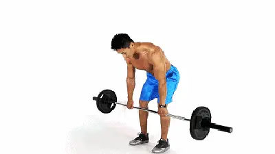
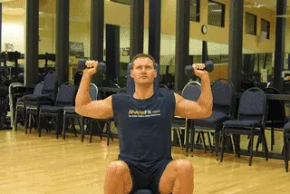

## Body Build
减脂:就是减去的大多数都是脂肪，因为脂肪才是你肥胖的原因，同时提高肌肉量，代谢也随之提高，并且你的皮肤会更紧致，身材更有美感，而不是减下来松松垮垮。由于脂肪和肌肉不会互相转化。胖人想练肌肉清晰，不用先特意减肥到普通体重。瘦人想练成硬朗壮硕，也不必先吃成胖子。
- 减脂, 大肌群的中等重量复合动作训练。比如空杆的深蹲，蹲跳等,多关节的抗阻力训练燃脂效果最优秀. 最后，无氧后采用强度和时间都相对长的HIIT.
- 更健康的线条，紧致身体，这种情况可以采用多组数（20组以上），多次数（每组20次以上），中等重量（最大负重的50%）的循环力量训练。因为有研究证明循环力量训练对于减少体脂，提升肌肉质量有很明显的效果①。搭配强度较大，时间中等的HIIT
- 要雕琢部位的。如果是想让这个部位大，比如丰胸、调整胸型、翘臀。这个需要提升自己的肌肉维度。就相当于脂肪底下又垫一层肌肉，当然就大了.如果是想让这个部位小，比如瘦肚腩，减蝴蝶袖，减腿上肥肉。那么告诉你。目前的研究没有证明训练有很明显的局部减脂效果。所以一方面你要多做HIIT训练，从全身减脂。

力量训练，提高肌肉量和代谢
去过健身房的应该都听说过力量+有氧的模式，而且是先力量再有氧
✅请确保在每次训练前的热身，推荐慢跑五分钟，再活动活动关节，先做小重量适应递增再做正式组。
新手健身以三大项(卧推，硬拉，深蹲）复合类动作为主，抛弃一些绣花的，繁琐的动作，有没有听说过这么一句话：硬拉可以满足你对健身的一切需求

``先10分钟热身。然后做专项力量训练，然后腹肌和核心力量训练，然后HIIT 训练。HIIT时间10-30分钟（看你希望的类型，减脂需求多就多做）.最后专项拉伸10分钟训练部位。晚饭前训练, 运动后的2小时内，至少也要补充1.2g/kg的高血糖指数食物（比如你体重70公斤，你要吃84克碳水化合物④）以及6g氨基酸/蛋白质（一天内摄入量至少1.2⑤-1.7⑥g/kg/d）。``

> StrongLifts 5×5 只包含 5 个杠铃动作，分别是`深蹲`，`卧推`，`硬拉`，`站姿杠铃推举`和`俯身划船`。这几个都是力量训练（增肌训练）的基础动作。

要求训练者每周锻炼三次。 每次锻炼包含三个杠铃动作，每个动作做五组，每组重复五次.
以上述的训练方式进行训练，我们全身的肌肉在每周里，都会被训练到至少 2 次。其次因为都是复合型动作，因此全身绝大部分肌肉都会被很好的锻炼到。 StrongLifts 5×5 的目标是增加推举的重量，因为举起更大的重量意味着会带来更大的肌肉。 开始时重量选择较轻，训练者以适当的形式举起，每次锻炼根据上次的训练结果再加重 2.5公斤/ 5磅。从而达到给肌肉渐进超负荷的目的。

### 热身
<!-- 

 -->

### 无氧部分
- ``胸``:俯卧撑，哑铃卧推，哑铃飞鸟（塑形，防止胸下垂，消除副乳，）
  - ``周一``：胸肌和三头肌
  - * 跪式俯卧撑
  训练部位：胸大肌，三角肌，三头
  
  - * 交臂卷腹
    
  - * 杠铃平板卧推： 4组 每组8-10次
  
  - * 绳索下压： 4组 每组10-12次
  
  - * 哑铃飞鸟 四组十至十二下
  
  <!-- - * 凳上反屈伸/双杠臂屈伸： 4组 每组10-12次
  - * 平板哑铃推胸 四组十至十二下
  - * 拉力器夹胸 四组十至十二下
  - 飞鸟下夹胸 四组十至十二下
  - 上斜哑铃卧推： 4组 每组10-12次 -->
  推的动作其实对胸的刺激更大，对围度的增长最有帮助。夹的动作：蝴蝶机夹胸、钢线夹胸夹的动作是单关节动作，相对更孤立更容易找到胸部发力感。但单关节动作的能找到胸部发力感和练出饱满的胸肌关系并没有很大。基本上我每次都是任选一个上斜的推胸动作，一个平板的推胸动作、一个夹胸动作就搞定，动作最多的时候也不超过四个动作。动作顺序随意，没有非常固定的计划练几个周期，想到什么练什么。

- ``背``:哑铃划船（消除背部赘肉，中下斜方训练纠正驼背，你知道纠正驼背就行了）
  - ``周二``：背部和二头肌
  - * 哑铃直腿硬拉   训练部位：腘绳肌群，下背阔，竖脊肌，臀大肌
  
  - * 坐姿下拉
  
  - * 杠铃俯身划船： 4组 每组8-10次
  
  - * 站姿哑铃交替弯举
  
  - 坐姿哑铃集中弯举
  
  <!-- - * 杠铃弯举： 4组 每组10-12次
  - 高位下拉： 4组 每组10-12次
  - 反手引体向上： 4组 每组最大次数 -->

- ``肩``:推举，侧平举，反向飞鸟（塑形，后束训练改善圆肩）
  - ``周三``：肩部三角肌和腹部
  - * 坐姿哑铃推举： 4组 每组8-10次
  
  - * 哑铃侧平举： 4组 每组10-12次
  
  - * 哑铃前平举： 4组 每组10-12次
  
  - * 杠铃颈前推举
  
  - 哑铃俯身飞鸟
  
  <!-- - 绳索面拉： 4组 每组10-12次 -->

- ``腿``:深蹲，弓步蹲，相扑深蹲，臀桥（消除腿部赘肉，臀部塑形）
  - ``周五``：腿部和臀部
  - * 史密斯深蹲：4组 每组10-12次
  
  
  - * 器械腿屈伸： 4组 每组10-12次
  
  - * 腿举机： 4组 每组12-15次
  
  - 杠铃箭步蹲
  
  - * 负重臀桥： 4组 每组10-12次
  
  
  - * 提踵
  

- ``手臂``:哑铃弯举，哑铃臂屈伸（消除拜拜肉）
  - ``周六``
  - 哑铃二头弯举 四组十至十二下
  
  - 俯身臂屈伸
  
  - 锤式弯举
  
  <!-- - 器械二头弯举 四组十至十二下
  - cable二头弯举 四组十至十二下
  - 绳索三头下拉 四组十至十二下
  - 绳索三头颈后伸臂 四组十至十二下
  - V bar三头下拉 四组十至十二下 -->

- ``核心``:平板支撑，卷腹，最近网上流行的手肘交替，都可以（不是练腹就可以瘦肚子）
腹部和核心力量训练一周安排3次以上，15分钟左右，放在专项部位之后，HIIT 之前。
  - ``一周三到四次腹肌``（腹肌训练：如仰卧起坐、腹部卷轴等：4组 x 15-20次）通常来讲，一周五练，每个动作4组，每组12次
  - * 卷腹
  
  - 反向卷腹
  
  - 转体卷腹
  
  <!-- - 下腹抬腿 四组十至十二下
  - 侧桥 四组三十秒
  - 站姿侧腹提哑铃 四组十至十二下 -->

### 有氧部分 减脂
- 然后有氧，跑步机上的爬坡走是我比较推荐的
普通人完全可以做30分钟力量+30分钟有氧，也就是一个小时时间确实有限的怎么也得练个20-30分钟吧力量已经说了，有氧的话，上面说了几种，记住一句话，中低强度，持续时间20分钟左右

### HIIT
运动20s，休息20s，两动作交替，共完成16min
- 深蹲开合

- 高抬腿原地跑

- 深蹲跳

- 开合跳

- 波比跳

### 营养部分
`增肌的饮食`: 虽说增肌的原理是制造热量盈余，也就是摄入＞消耗，但并不是意味着只吃高热量食物就行。那样只会变胖，而不是变壮，想必这也不是所有增肌人的目的。增肌就是通过力量训练使肌纤维撕裂，之后通过补充营养、充分的休息使撕裂的肌纤维修复生长，让肌肉长得变快，变得更大。所以除了上面的力量训练之外，饮食上要制造热量盈余：不让自己感到饿。摄入足够的热量：在原有饮食基础上每天增加300-500大卡热量。摄入足够蛋白质：每天每公斤体重摄入2g左右，蛋白质可选择牛肉、鸡胸肉、鱼类、蛋白、奶酪、蛋白粉等。少食多餐：为了达到热量盈余的目的，建议每餐少吃点，每天多吃几餐。除此之外，肌肉的恢复需要充分的休息，保证良好的作息也很重要。
